.. meta::
   :keywords: mesh, field, manipulation, user guide
   :author: Guillaume Boulant

.. include:: medcalc-definitions.rst

%%%%%%%%%%%%%%%%%%%%%%%%%%%%%%%%%%%%%%%%%%%%%%
MED module: User guide for graphical interface
%%%%%%%%%%%%%%%%%%%%%%%%%%%%%%%%%%%%%%%%%%%%%%

This document is a quick guide for Graphical User Interface of MED module. It
shows how to use this module on the basis of a few reference examples, built
from use cases identified during requirement analysis stage.

.. warning:: This document is self-contained, but it is strongly advised to
             read :doc:`the specification document<medcalc-specifications>` (in
             french), at least to clarify concepts and terminology.

.. contents:: Contents
   :local:
   :backlinks: none

.. warning:: Screenshots are not up-to-date. They were extracted from SALOME
             6 with data visualization achieved using VISU module. In SALOME
             7, VISU module has been replaced by PARAVIS module. The
             look-and-feel may thus be slightly different.

General presentation of MED module
==================================

The overall ergonomics of MED module for field manipulation is inspired by
softwares such as octave or scilab. It combines a graphical interface (GUI) to
select and prepare data, with a textual interface (the python console, TUI)
for actual work on data.

This module provides two user environments that are marked by the red and
green rectangles on the screenshot below:

* **The data space** (*dataspace*), in which user defines the MED data sources
  (*datasource*), that is to say the med files from which meshes and fields
  are read. This data space allows for the exploration of meshes and fields
  provided by the different data sources.
* **The workspace** (*workspace*), in which user may drop fields selected in
  the source space, and then use them for example to produce new fields using
  the operations on fields provided by the TUI.

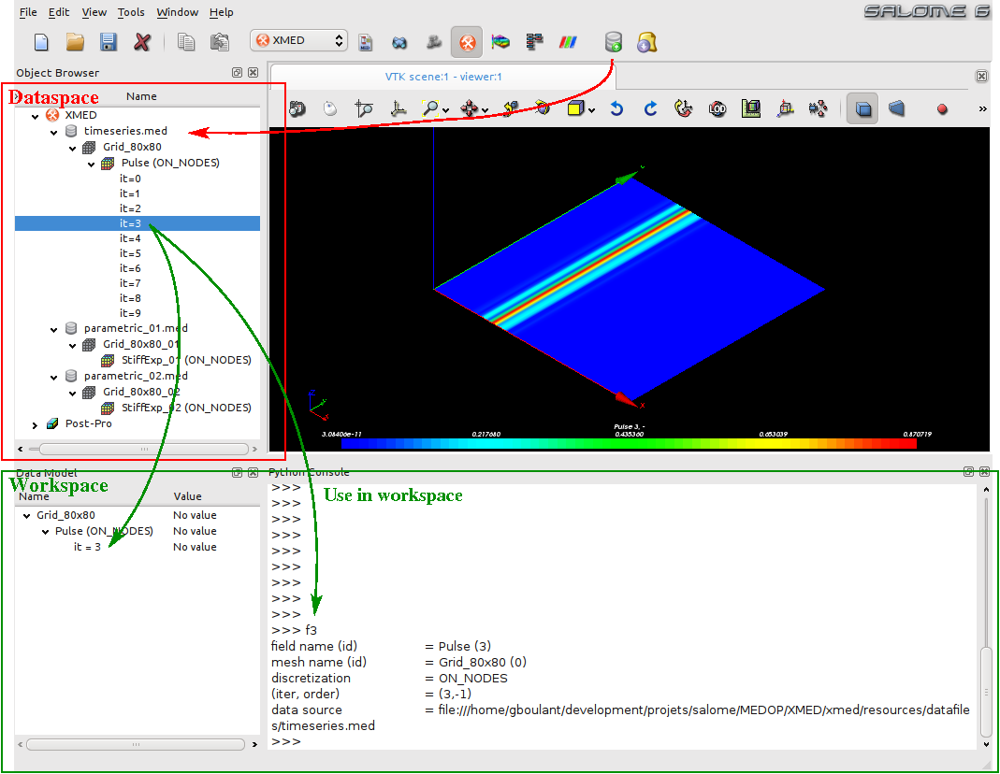

A typical use of field manipulation functions is:

1. Load a med file in the data space and explore its contents: meshes and
   fields defined on these meshes, defined for one or several time steps.
2. Select (using GUI) fields to be manipulated in workspace ; it is possible
   to introduce restrictions on time steps, components or groups of cells.
3. Create new fields executing algebraic operations (+,-,*,/) on fields,
   applying simple mathematical functions (pow, sqrt, abs), or initializing
   them "from scratch" on a support mesh.
4. Visually control produced fields, using PARAVIS module in SALOME,
   automatically controlled from user interface.
5. Save (parts of) produced fields to a med file.

Quick tour on functions available in MED module
===============================================

This section presents some use examples of MED module like a "storyboard",
illustrating the functions proposed by the module.

.. warning:: This section is under construction. Please consider that its
             contents and organization are still incomplete and may change
             until this warning is removed.

Example 1: Explore data sources
-------------------------------

.. note:: This example illustrates the following functions:

   * add a data source
   * "Extends field series" and "Visualize" functions

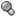

At startup the field manipulation module, identified by icon |ICO_XMED|, shows
an empty interface:

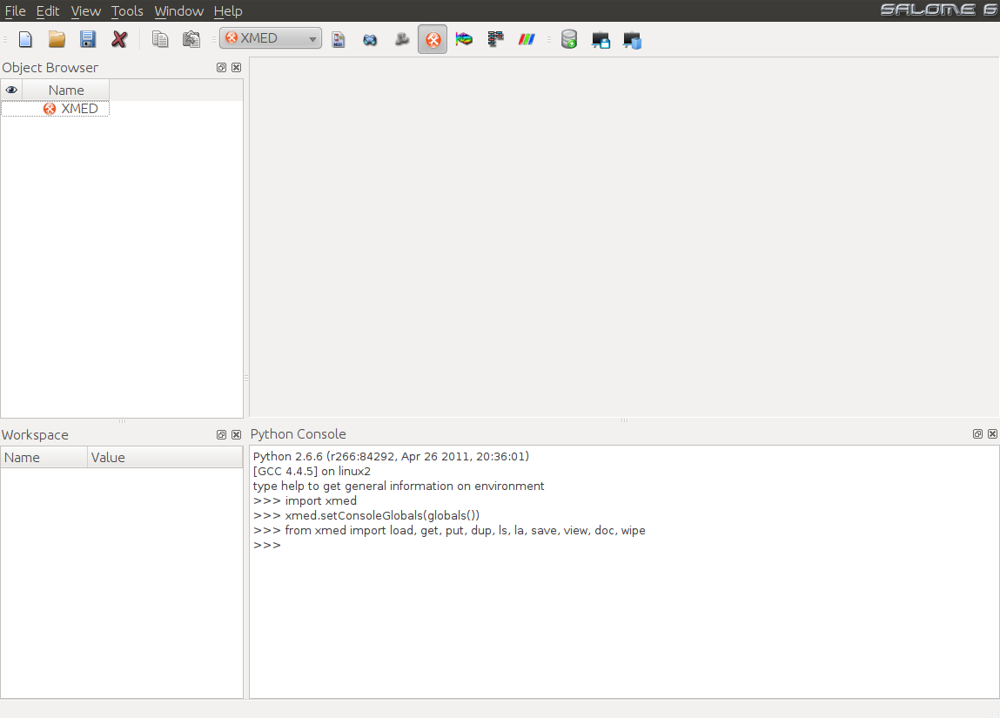

The first step consists in adding one or several med data sources in
"dataspace". For this, user clicks on icon "Add datasource"
|ICO_DATASOURCE_ADD| to select a med file:

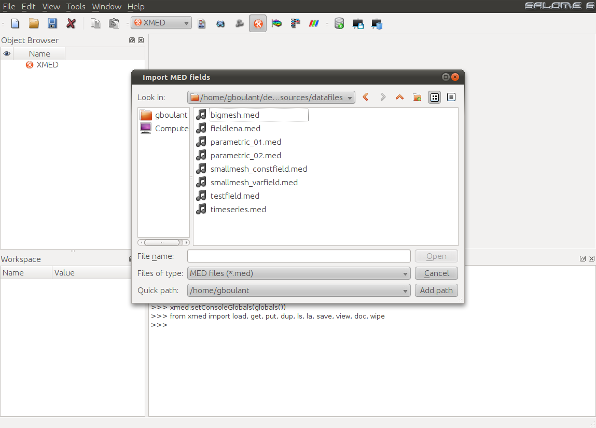

This operation adds a new entry (datasource) in data space. The contents can
be explored using the data tree. The figure below (left image) shows the
result of loading the file ``timeseries.med`` containing a mesh named
``Grid_80x80`` on which a field on nodes named ``Pulse`` is defined. By
default, the field composition (in terms of time steps and components) is not
displayed to avoid visual congestion of data tree. User must explicitly ask
for visualization using the command "Expand field timeseries"
|ICO_DATASOURCE_EXPAND| available in the field contextual menu. The result is
displayed on center image. The list of field ``Pulse`` iterations can be advised.

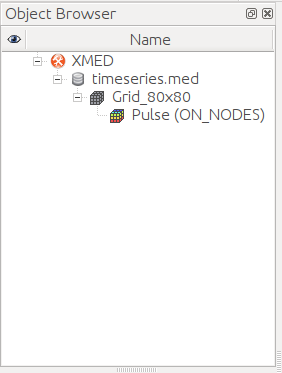
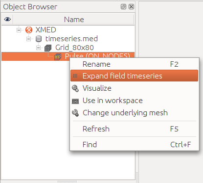
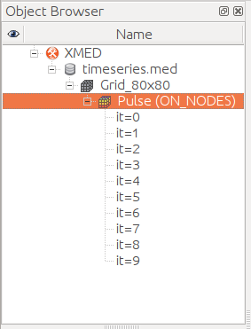

+--------------------------+--------------------------+--------------------------+
| |IMG_DATASOURCE_EXPLORE| | |IMG_DATASOURCE_MENUCON| | |IMG_DATASOURCE_EXPANDF| |
+--------------------------+--------------------------+--------------------------+

.. note:: Strictly speaking,  the *field* concept in MED model corresponds to
          a given iteration. A set of iterations is identified by the term
          *field time series*. If there is no ambiguity, the field name will
          refer to both the field itself or the time series it belongs to.

Finally, it is possible from dataspace to visualize the field general shape
using a scalar map displayed in SALOME viewer. For this, user selects the time step to
display then uses the command "Visualize" |ICO_DATASOURCE_VIEW| available in
the associated contextual menu:

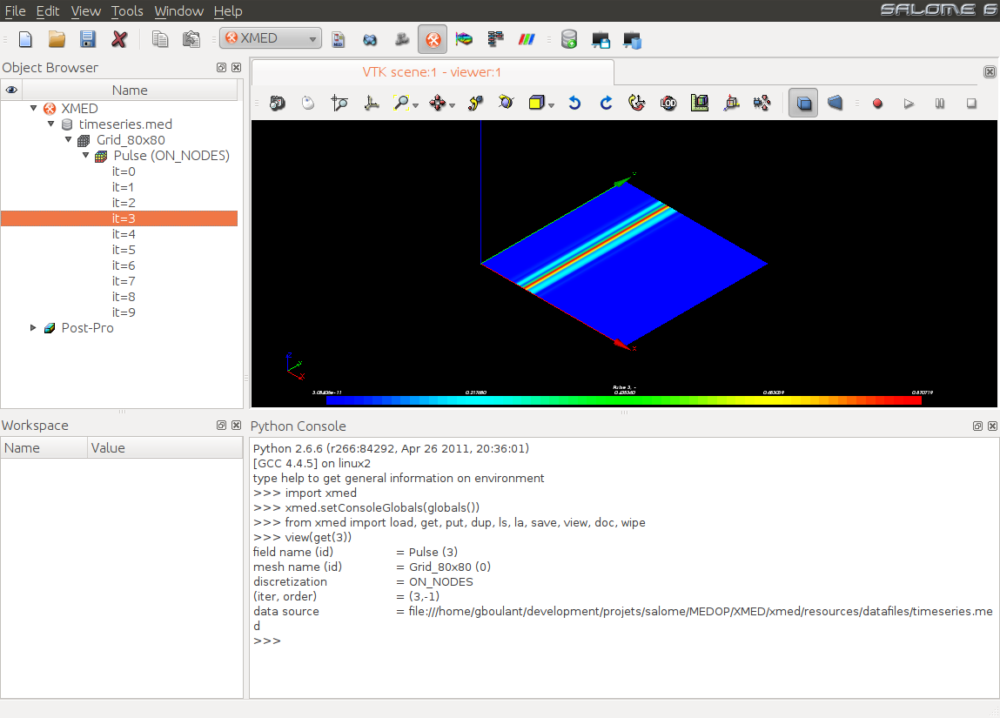

.. note:: This graphical representation aims at providing a quick visual
          control. Scalar maps are displayed using the PARAVIS module.

Example 2: Combine fields from different sources
------------------------------------------------

.. note:: This example illustrates the following functions:

   * function "Use in workspace"
   * function "Save"

The objective is to access data contained in several med files, then to
combine them in the same output file.

User starts by adding med data sources in dataspace. In the example below,
dataspace contains two sources names ``parametric_01.med`` and
``smallmesh_varfiled.med``. The first one contains the mesh ``Grid_80x80_01``
on which the field ``StiffExp_01`` is defined. The second source contains the
mesh ``My2DMesh`` on which the two fields ``testfield1`` are ``testfield2``
are defined:

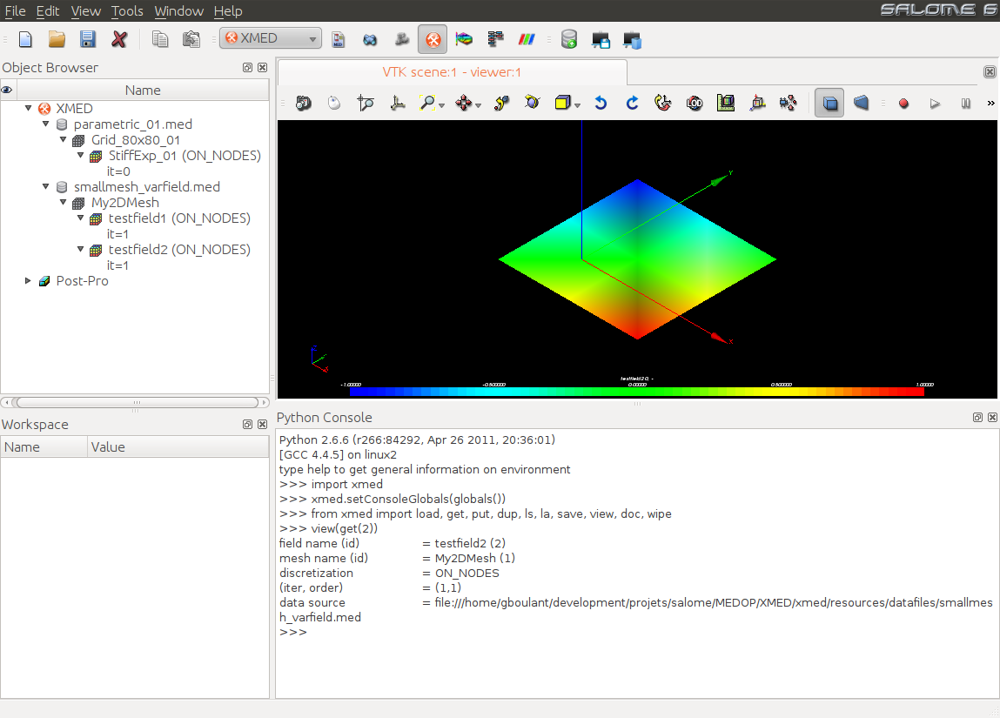

In this example, ``StiffExp_01`` and ``testfield2`` are combined then saved to
``result.med`` file. The procedure consists in importing the two fields in
workspace, then to save the workspace. For this user selects the fields and
uses the command "Use in workspace" |ICO_DATASOURCE_USE| available in the
contextual menu. Both selected fields appear in the workspace tree:

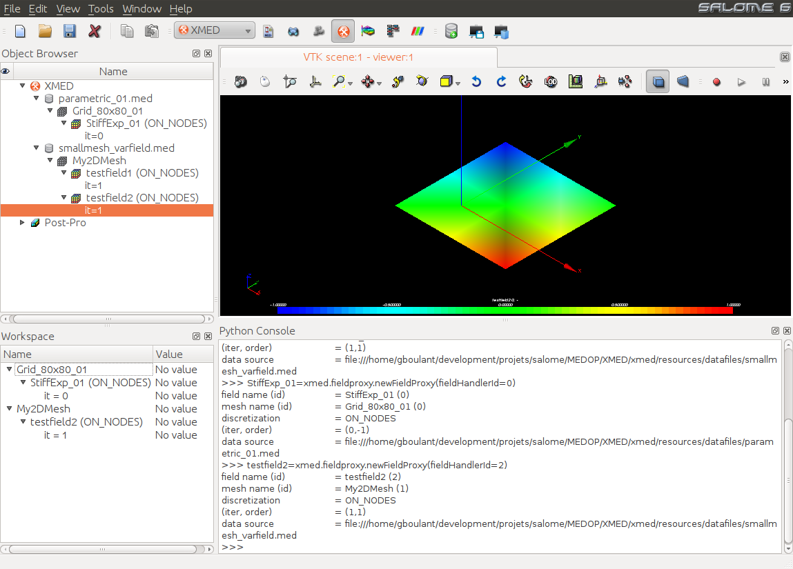

Workspace is saved using the command "Save workspace" |ICO_WORKSPACE_SAVE|
available in the module toolbar. A dialog window lets user set the save
file name:

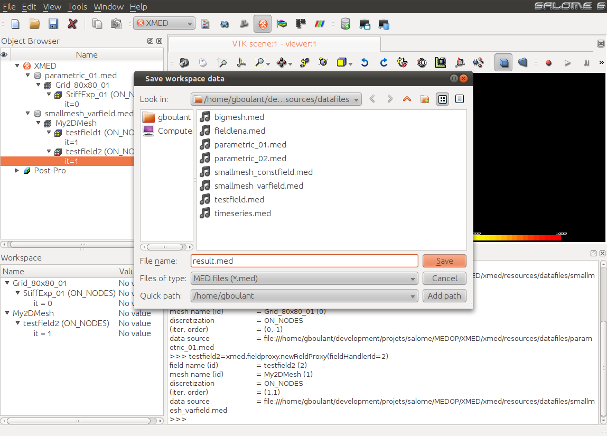

The file ``result.med`` can then be reloaded in MED module (or PARAVIS module)
to check the presence of saved fields.

.. BUG: plantage à l'utilsation dans XMED d'un fichier rechargé
.. (invalid mesh on field)

.. _xmed.userguide.exemple3:

Example 3: Apply a formula on fields
------------------------------------

.. note:: This example illustrates the following functions:

   * execute mathematical operations in TUI console
   * function "put" to refer to a work field in the list of persisting fields.
   * function "Visualize" from TUI.

The most common usage of field manipulation module is to execute mathematical
operations on fields or on their components.

Assume data sources are already defined in dataspace (in the following example
a temporal series named ``Pulse`` contains 10 time steps defined on a mesh
named ``Grid_80x80``, all read from ``timeseries.med`` data source).

As previously seen, a field can be manipulated in workspace after selecting
the field and applying the command "Use in
workspace" |ICO_DATASOURCE_USE| from contextual menu. Here only one file is
selected (two in the previous example) and the command then opens a dialog
window to select data to work on and the way they will be manipulated:

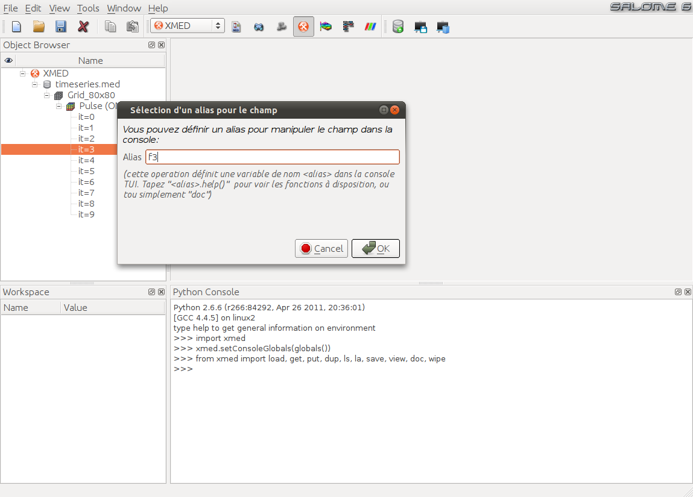

.. note:: In the current state of development, the interface only propose to
          define the name of a variable representing the field in TUI. In
          a next version, user will have the possibility to specify the field
          component(s) to be used and a group of cells to introduce
          a geometrical restriction. Conversely it will be possible to select
          a complete time series to apply global operations on all time steps.

After validation, the field if put in workspace tree and a variable
``<alias>`` is automatically created in the TUI to designate the field. In
this example, ``<alias>`` is ``f3``, as set by user to recall that variable
corresponds to the third time step:

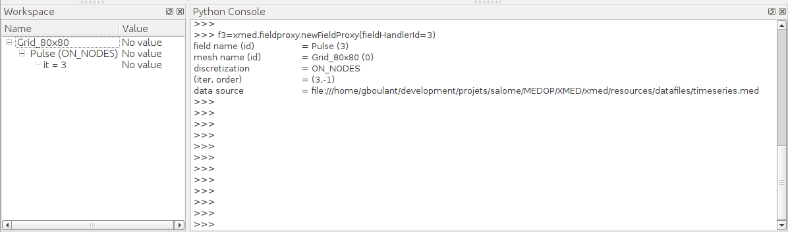

Field manipulation can start. In the example below, use creates the field``r``
as the result of an affine transformation of field ``f3`` (multiplication of
field by a scale factor 2.7 then addition of offset 5.2)::

 >>> r=2.7*f3+5.2

Other operations can be applied, as detailed in module specifications
(cf. :ref:`Spécification des opérations<xmed-specifications>`):

 >>> r=f3/1000     # the values of r are the ones of f3 reduced by a factor 1000
 >>> r=1/f3        # the values of r are the inverted values of f3
 >>> r=f3*f3       # the values of r are the squared values of f3
 >>> r=pow(f3,2)   # same result
 >>> r=abs(f3)     # absolute value of field f3
 >>> ...

The two operands can be fields. If ``f4`` is the fourth time step of field
``Pulse``, then algebraic combinations of fields can be computed::

 >>> r=f3+f4
 >>> r=f3-f4
 >>> r=f3/f4
 >>> r=f3*f4

Scalar variables can be used if needed::

 >>> r=4*f3-f4/1000
 >>> ...

In theses examples, the variable ``r`` corresponds to a work field containing
the operation result. By default the field is nor referenced in workspace
tree. If user wants to add it, for example to make it considered when saving,
then the following command is used::

 >>> put(r)

The function ``put`` aims at tagging the field as persisting, the to store it
in the workspace tree to make it visible and selectable. Among all fields that
could be created in console during the work session, all do not need to be
saved. Some may only be temporary variables used in the construction of final
fields. That is why only fields in workspace tree are saved when saving the
workspace.

Variables defined in console have other uses. First they allow for printing
information relative to the manipulated field. For this one enters the
variable name then validates::

 >>> f3
 field name (id)         = Pulse (3)
 mesh name (id)          = Grid_80x80 (0)
 discretization          = ON_NODES
 (iter, order)           = (3,-1)
 data source             = file:///home/gboulant/development/projets/salome/MEDOP/XMED/xmed/resources/datafiles/timeseries.med

Second, variables can be used as command arguments (the list of commands
available in TUI is described in section :ref:`Documentation of textual
interface<xmed.userguide.tui>`). For example the function ``view`` displays
the field scalar map in the viewer::

 >>> view(f3)

Results in:

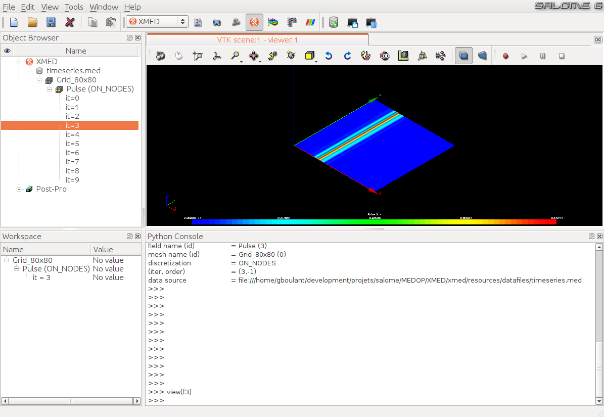

.. note:: It is easy to compare two time steps of a field, computing the
          difference ``f3-f4``, then producing a scalar map preview using the
          function ``view``::

    >>> view(f3-f4)

Finally the field data can be displayed using the command``print``::

 >>> print f3
 Data content :
 Tuple #0 : -0.6
 Tuple #1 : -0.1
 Tuple #2 : 0.4
 Tuple #3 : -0.1
 Tuple #4 : 0.4
 ...
 Tuple #6556 : 3.5
 Tuple #6557 : 3.3
 Tuple #6558 : 1.5
 Tuple #6559 : 0.3
 Tuple #6560 : 0.2

It is important to note that operations between fields can only be applied if
fields are defined on the same mesh. It corresponds to a specification of MED
model that forbids operations between fields defined on meshes geometrically
different. Technically it means that the conceptual objects *fields* must share
the same conceptual object *mesh*.

If user do want to use fields defined on different meshes, for example to
manipulate the field values at the interface of two meshes sharing a 2D
geometrical area, it is necessary first to make all fields be defined on the
same surface mesh using a projection operation.

.. note:: Such projection operations are available in the MEDCoupling library.

Another classical need is using fields defined on meshes geometrically
identical, but technically different for example when they are loaded from
different med files. For such a case, the MEDCoupling library proposes
a function "Change support mesh" ; its use in field manipulation module is
illustrated in :ref:`example 4<xmed.userguide.exemple4>` described hereafter.

.. _xmed.userguide.exemple4:

Example 4: Compare fields derived from different sources
--------------------------------------------------------

.. note:: This example illustrates the following function:

   * Change the underlying (support) mesh

Assume here that fields have been defined on same mesh, geometrically
speaking, but saved in different med files. This occurs for example for
a parametric study in which several computations are achieved with variants on
some parameters of the simulated model, each computation producing a med file.

Let ``parametric_01.med`` and ``parametric_02.med`` be two med files
containing the fields to compare, for example computing the difference of
their values and visualizing the result.

After loading data sources user sees two meshes, this time from the technical
point of view, that is to say fields are associated to different conceptual
mesh objects, while geometrically identical.

However field manipulation functions do not allow operations on fields lying
on different support meshes (see remark at the end of  :ref:`example
3<xmed.userguide.exemple3>`).

To circumvent this issue, the module offers the function "Change underlying
mesh" to replace a field mesh support by another, provided that the two meshes
are geometrically identical, that is to say nodes have the same spatial
coordinates.

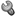

In the proposed example, user selects the first time step of field
``StiffExp_01`` in data source ``parametric_01.med``, and imports it in
workspace using the command "Use in workspace" |ICO_DATASOURCE_USE|. User then
selects the first time step of field ``StiffExp_02`` in data source
``parametric_02.med``, but imports it in workspace using the command "Change
underlying mesh" |ICO_DATASOURCE_CHG|. The following dialog window appears to
let user select the new support mesh in dataspace tree:

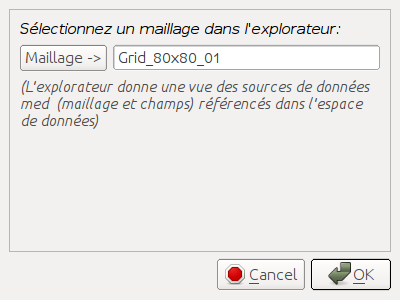

In this example, the support mesh ``Grid_80x80_01`` of field ``StiffExp_01``
to compare with is selected. After validation the workspace tree contains the
field ``StiffExp_02`` defined on mesh ``Grid_80x80_01``:

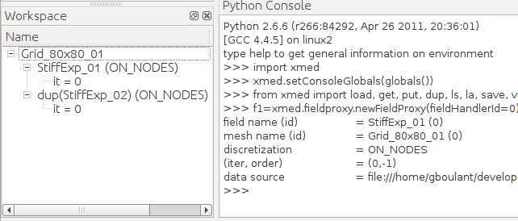

.. note:: The function "Change underlying mesh" does not modify the field
          selected in dataspace (basic running principle of dataspace), but
          creates a field copy in workspace to then change support mesh. This
          explains the default name for field ``dup(<name of selected
          field>)`` (dup stands for "duplicate").

All we have to do now is to associate a variable to this field, in order to
manipulate it in TUI. This can be done using the command "Use in console"
available in workspace contextual menu.

Finally, if ``f1`` is a field from datasource ``parametric_01.med`` and ``f2``
is a field from datasource
``parametric_02.med`` according to the above procedure, then comparison values
can be achieved as explained in :ref:`example 3<xmed.userguide.exemple3>`::

 >>> r=f1-f2
 >>> view(r)

.. note:: As a general remark concerning this example, one may note:

   * the geometrical equality of two meshes is constrained to a numerical
     error that can be technically set, but not through the module interface.
     This tolerance is empirically set to a standard value regarding to
     success of most of the use cases. The usefulness of setting this value in
     the interface could be later investigated.

   * User must explicitly ask for changing a field support mesh, in order to
     compare fields coming from different data sources. This choice has been
     made to keep trace of modifications made on data (no modification is made
     without user knowing, even to improve ergonomics).

Example 5: Create a field on a spatial domain
---------------------------------------------

.. note:: This example illustrates the following functions:

   * initialize with function of spatial position
   * initialize on a group of cells

The geometrical domain on which the field to create is defined is here given
by cell group data. This use case is provided for producing initial load
conditions of a structure, for example defining a field on a geometry surface
identified by a group of cells.

.. warning:: DEVELOPMENT IN PROGRESS

Example 6: Extract a field part
-------------------------------

.. note:: This example illustrates the following functions:

   * extract a component (or a subset of components)
   * extract a geometrical domain (values on a group of cells)
   * extract one or several time steps

.. warning:: DEVELOPMENT IN PROGRESS

   Here the restriction functions that allow to get some components only, have
   to be illustrated. The principle is creating a new field that is
   a restriction of input field to a list of given components (use the
   function __call__ of fieldproxy).

For time step extraction, we can reduce to the case of example 2 with a single
data source.

Example 7: Create a field from a to[mp]ographic image
-----------------------------------------------------

.. note:: This example illustrates the following function:

   * Create a field without data source (neither mesh nor field), from an
     image file

In tomography or topography studies, measurement devices produce images that
represent a physical quantity using gray levels on a given cutting plane. The
following image represents for example a internal view of human body obtained
by MRI:

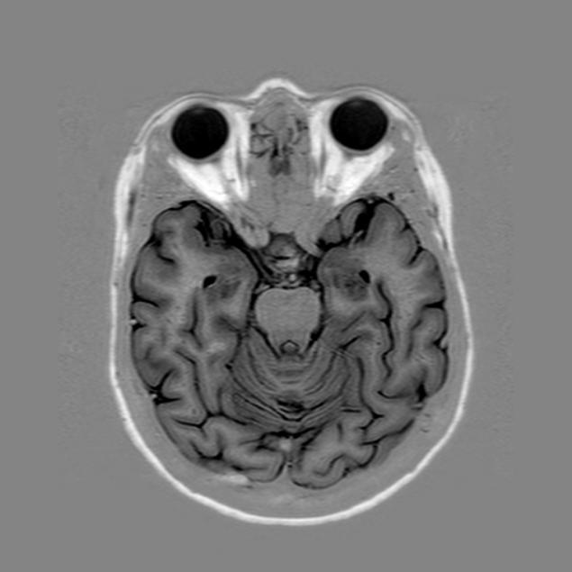

This image is a subset of pixels organized on a Cartesian grid. It can thus be
represented as a scalar field whose values are defined on cells of a mesh
having the same dimension as the image (number of pixels):

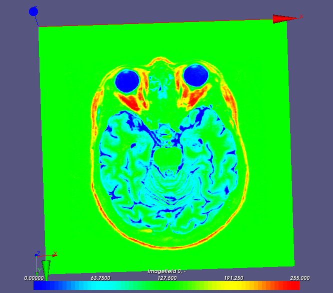

The field manipulation module provides a tool named ``image2med.py`` to
convert a file image to a med file containing the image representation as
a scalar field (only the gray level is kept)::

  $ <xmed_root_dir>/bin/salome/xmed/image2med.py -i myimage.png -m myfield.med

This conversion operation can be automatically achieved using the command "Add
Image Source" |ICO_IMAGESOURCE| available in GUI toolbar. This command opens
the following window to let user select a file image:

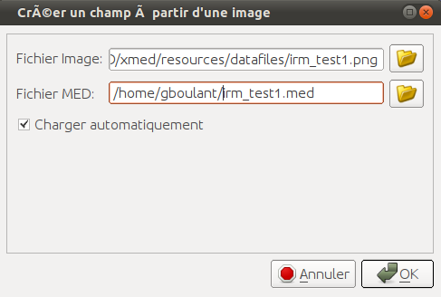

The name of result med file is set by default (changing file extension to
``*.med``) but can be modified. Finally user can ask for automatic load of
this med file in data space. Fields can then be manipulated like presented in
the standard use cases.

For example, the image below depicts the result of the difference between two
images, added to the reference image: if i1 and i2 are the fields created from
these two images, then ``r = i1 + 5*(i2-i1)`` with 5 an arbitrary factor to
amplify the region of interest (above the left eye):

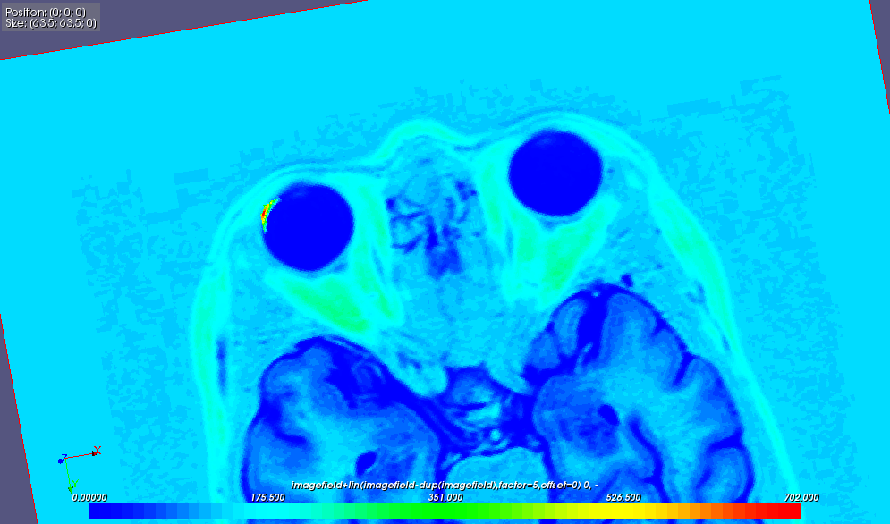

The example below is the result of loading a tomographic image courtesy of MAP
project (Charles Toulemonde, EDF/R&D/MMC). The tomographic image:

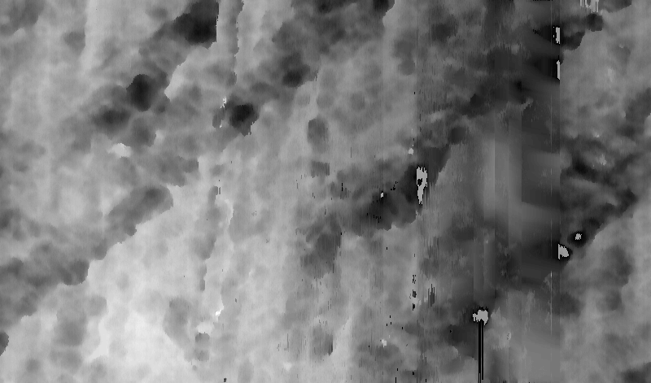

The result of loading:

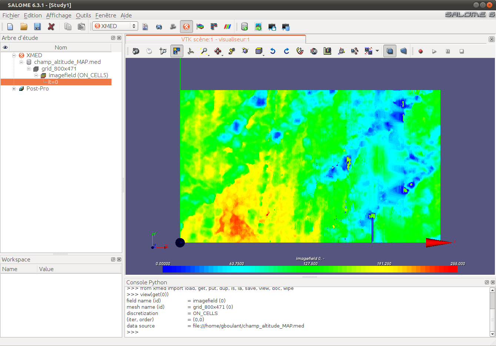

Example 8: Continue analysis in PARAVIS
---------------------------------------

.. note:: This example illustrates the following functio:

   * Export fields to PARAVIS module

The solutions for field representation in MED module aims at proposing a quick
visual control.

For a detailed analysis of fields, user shall switch to PARAVIS. The field
manipulation module has a function to facilitate this transition, with
automatic load in PARAVIS and proposing a default visualization (scalar map).

For this user selects in workspace the fields to export, then call the export
function from contextual menu:

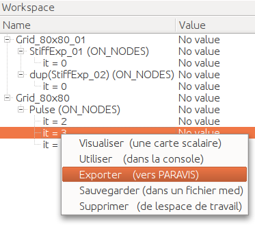

Selected fields are grouped in a single MED entry in PARAVIS, and the first
field is depicted as a scalar map:

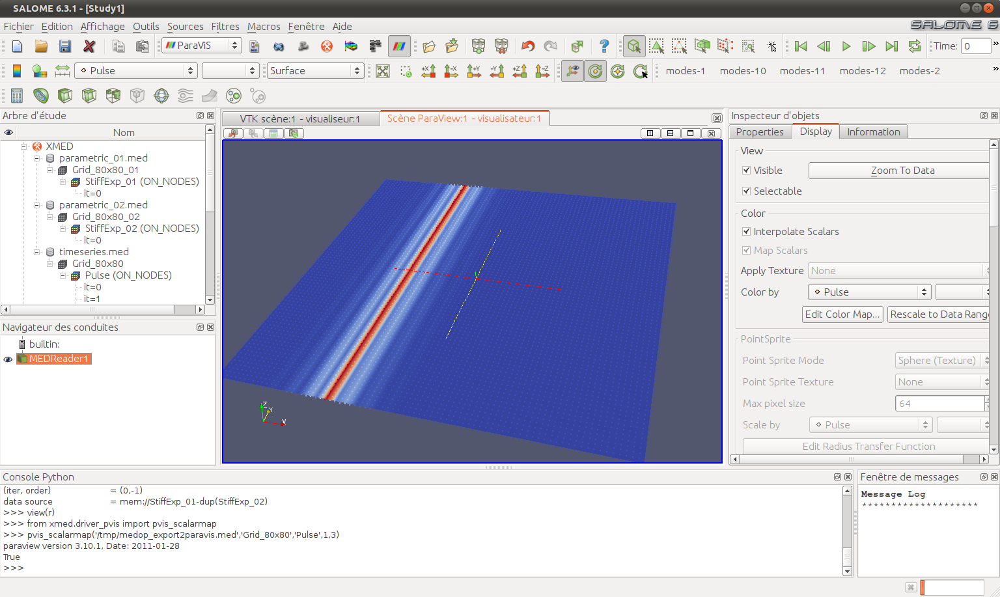

.. note:: The export function is a convenience function. The same operation
          can be manually achieved, first saving fields to a med file then
          loading the created file in PARAVIS module for visualization.

.. _xmed.userguide.tui:

Using the textual interface (TUI)
=================================

All operations driven through GUI can be done (more or less easily) using TUI.
The field manipulation module can even be used exclusively in textual mode.
..
 For this run the command::

 $ <path/to/appli>/medop.sh
..
 This command opens a command console ``medop>``. A med file can be loaded and
 manipulated, for example to create fields from file data.

Whatever textual or graphical mode is used, a typical workflow in console
looks like the following instructions::

 >>> medcalc.LoadDataSource("/path/to/mydata.med")
 >>> la
 id=0    name    = testfield1
 id=1    name    = testfield2
 >>> f1=accessField(0)
 >>> f2=accessField(1)
 >>>    ls
 f1      (id=0, name=testfield1)
 f2      (id=1, name=testfield2)
 >>> r=f1+f2
 >>> ls
 f1      (id=0, name=testfield1)
 f2      (id=1, name=testfield2)
 r       (id=2, name=testfield1+testfield2)
 >>> r.update(name="toto")
 >>> ls
 f1      (id=0, name=testfield1)
 f2      (id=1, name=testfield2)
 r       (id=2, name=toto)
 >>> putInWorkspace(r)
 >>> saveWorkspace("result.med")

The main commands are:

* ``LoadDataSource``: load a med file in data base (useful in pure textual mode)::

  >>> LoadDataSource("/path/to/datafile.med")

* ``LoadImageAsDataSource``: load an image as a med file

* ``la``: show the list of all fields loaded in data base ("list all")
* ``accessField``: set a field in workspace from its identifier (useful in pure
  textual mode ; this operation can be done in GUI selecting a field from data
  space).::

  >>> f=accessField(fieldId)

* ``ls``: show the list of fields available in workspace ("list")
* ``putInWorkspace``: put a reference to a field in *management space*::

  >>> putInWorkspace(f)

* ``saveWorkspace``: save to a med a file all fields referenced in management space::

  >>> saveWorkspace("/path/to/resultfile.med")

.. note::

   * the ``LoadDataSource`` command only loads metadata describing meshes and fields
     (names, discretization types, list of time steps). Meshes and physical
     quantities on fields are loaded later (and automatically) as soon as an
     operation needs them. In all cases med data (mete-information and values)
     are physically stored in *data base* environment.
   * the ``accessField`` command defines a *field handler* in workspace, i.e.
     a variable that links to the physical field hosted in data base. Physical
     data never transit between environments but remain centralized in data
     base.

The following TUI commands need to work in graphical environment:

* ``medcalc.MakeDeflectionShape``
* ``medcalc.MakeIsoSurface``
* ``medcalc.MakePointSprite``
* ``medcalc.MakeScalarMap``
* ``medcalc.MakeSlices``
* ``medcalc.MakeVectorField``

..  LocalWords:  softwares
