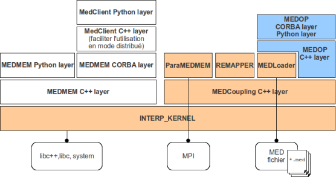
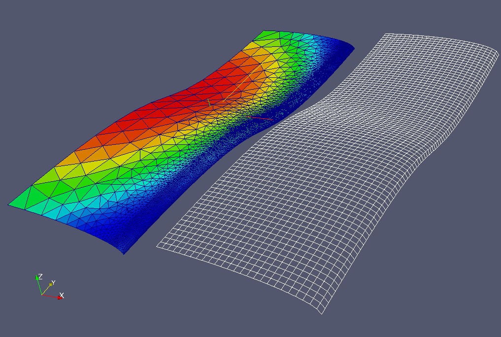
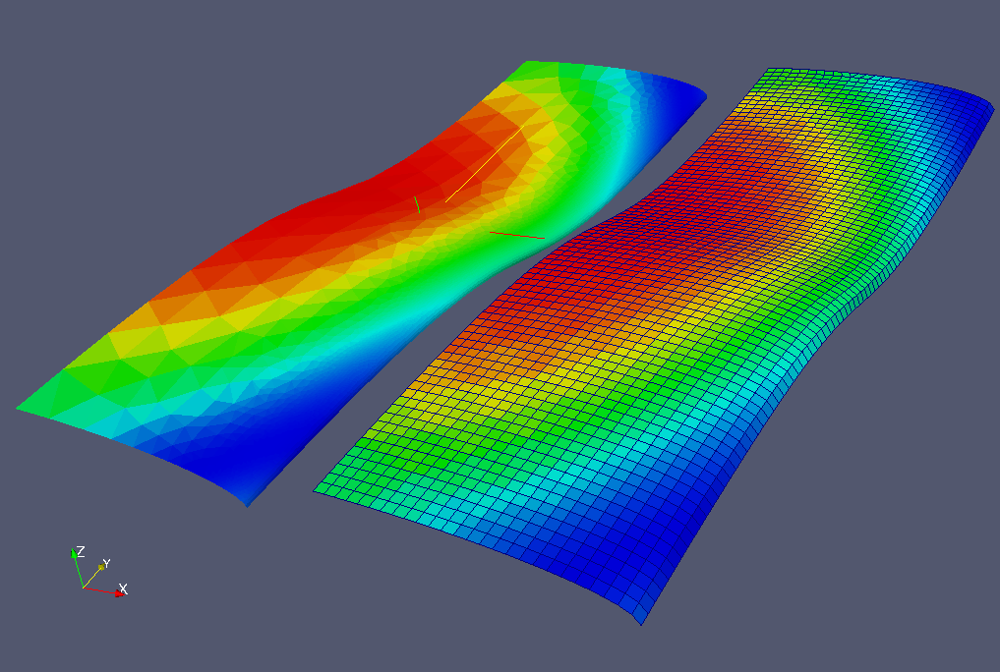
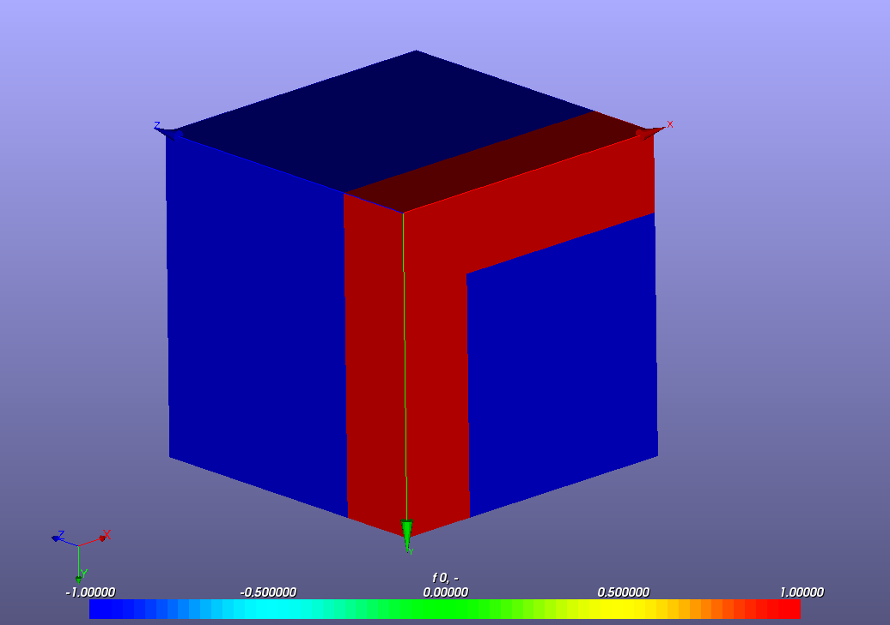
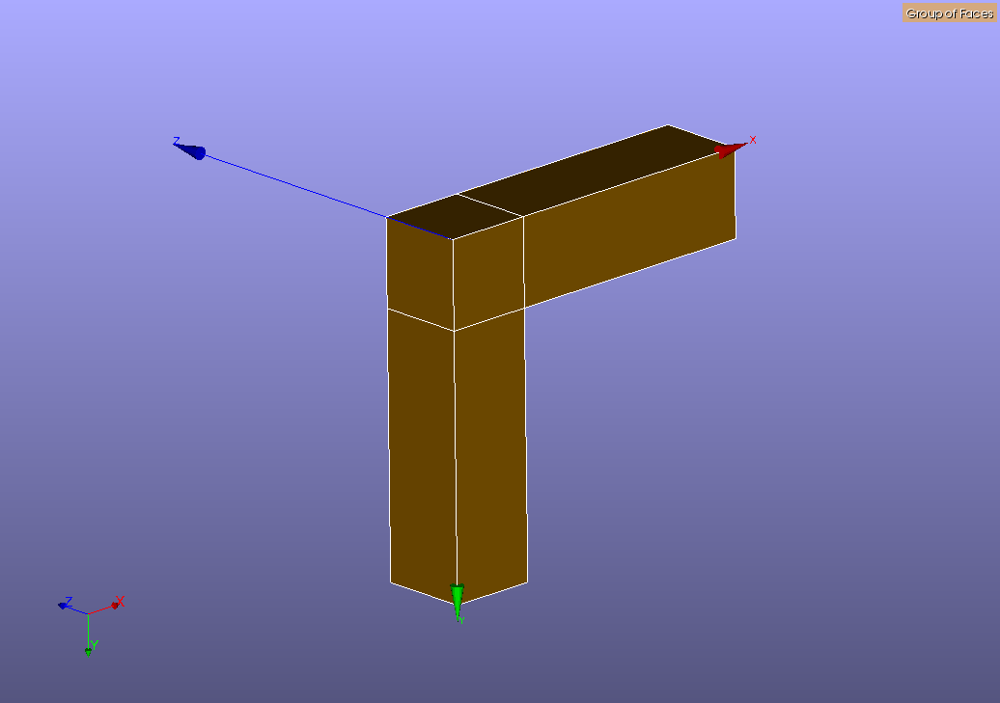

.. meta::
   :description: introduction guide for users of the MEDMEM library 
   :keywords: mesh, field, med, MEDCoupling, MEDLoader
   :author: Guillaume Boulant

.. include:: medop-definitions.rst

%%%%%%%%%%%%%%%%%%%%%%%%%%%%%%%%%%%%%%%
MEDMEM library: Starter guide for users
%%%%%%%%%%%%%%%%%%%%%%%%%%%%%%%%%%%%%%%

This document illustrates how to start with the programming interface
of the MEDMEM library. The users is someone who intends to create a
data processing script involving meshes and fields.

.. contents:: Sommaire
   :local:
   :backlinks: none
   :depth: 2

General overview
================

Definition of the MEDMEM library
--------------------------------

The MEDMEM library is designed to manipulate meshes and fields that
conform to the MED data model. This library can be used in C++
programs as in python scripts for data processing on meshes and
fields. The library contains the data structure to describe meshes and
fields as C++ objects (MEDCoupling package). It provides a set of
functions to manage the persistency toward the med file format
(MEDLoader package), and to process the data througt interpolation and
localization algorithms (INTERP_KERNEL and REMAPPER packages), for
example to perform field projections from a mesh to another.

Installation of the MEDMEM library
----------------------------------

The MEDMEM library is part of the SALOME MED module and then is
installed together with this module by the installation process of
SALOME. Nevertheless, it is possible for low-weight deployment to
install only the MEDMEM library from the source files embedded in the
SALOME MED module. Keep in mind that the MEDMEM library is designed to
be a self-consistent library with very few third party softwares (only
med-file, glibc and mpi typically). In particular, it is strictly
independant from the SALOME framework even if it distributed with
SALOME for convenience reasons.

Components of the MEDMEM library
--------------------------------

The MEDMEM library consists in a small set of atomic libraries files,
in particular:

* :tt:`medcoupling`: this library provides the data structures (C++
  classes) to describe meshes and fields.
* :tt:`medloader`: this library provides I/O functions to the MED file
  format
* :tt:`interpkernel`: this library provides the mathematical
  structures and algorithms required med data processing, in
  particular interpolation and localization.
* :tt:`medcouplingremapper`: this library provides the functions for
  fields projections and interpolation.

The figure below represents the layer structure of the packages of the
library:

What we call MEDMEM library in this document is represented by the
orange packages on this diagram. The white packages reprensent the old
deprecated MEDMEM library. The blue packages represent the aditionnal
components for field manipulation througth the user interface (TUI and
GUI). 

The MEDMEM library comes also with this set of atomic libraries for
advanced users/programmers:
 
* :tt:`medcouplingcorba`: this library is designed for cross process
  exchange of medcoupling objects.
* :tt:`medpartitioner`: this library provides functions to split a MED
  domain in several part in the perspective of parallel computing

All these atomic C++ libraries are wrapped into a set of python
modules (using the swig binding technology) so that all the data
processing can be realized by scripting.

.. warning:: It could happen that some parts of the C++ libraries are
	     not wrapped into python modules. This coverture will be
	     extend on demand and if the integrity of the concepts is
	     preserved.

Main concepts of the MEDMEM library
===================================

.. warning:: TODO avec Antony. Présenter les structure de données de
	     MEDCoupling principalement. Describe the MEDMEM data
	     model, the typical content of a med file, the types of
	     cell that compose the meshes, the types of spatial
	     discretization of fields, ...

Basic usages of the MEDMEM library
==================================

This section illustrates the usage of main features of the MEDMEM
library using python examples. The usage of python is just to have a
light syntax that makes more easy the first understanding.

.. note:: All code examples here after are parts of the tutorial use
	  cases located in the folder :tt:`src/MEDOP/tut` in the MED
	  source directory. These use cases are all working executable
	  programs and they can be used to initiate your own script.

Preparing the shell environment
-------------------------------

We make the hypothesis here that the MEDMEM library is installed using
the SALOME procedure and then is located in the MED module
installation directory. In addition to the MED library, the third
party softwares required for executing the examples are: python, hdf5
and med-fichier. Then, you should prepare your shell environment
with a set of instructions that looks like::

 #------ python ------
 export PYTHONHOME=</path/to/python>
 export PYTHONSTARTUP=${PYTHONHOME}/pythonrc.py
 export PYTHON_INCLUDE=${PYTHONHOME}/include/python2.6
 export PATH=${PYTHONHOME}/bin:${PATH}
 export LD_LIBRARY_PATH=${PYTHONHOME}/lib:${LD_LIBRARY_PATH}
 
 #------ hdf5 ------
 HDF5HOME=</path/to/hdf5>
 export PATH=${HDF5HOME}/bin:$PATH
 export LD_LIBRARY_PATH=${HDF5HOME}/lib:${LD_LIBRARY_PATH}
 export HDF5_DISABLE_VERSION_CHECK=1
 
 #------ med ------
 MED2HOME=</path/to/med>
 export PATH=${MED2HOME}/bin:${PATH}
 export LD_LIBRARY_PATH=${MED2HOME}/lib:${LD_LIBRARY_PATH}
 
 #------ medmem ---
 MED_ROOT_DIR=<path/to/salome_med_module>
 export LD_LIBRARY_PATH=${MED_ROOT_DIR}/lib/salome:${LD_LIBRARY_PATH}
 PYTHONPATH=${MED_ROOT_DIR}/lib/python2.6/site-packages/salome:${PYTHONPATH}
 PYTHONPATH=${MED_ROOT_DIR}/bin/salome:${PYTHONPATH}
 PYTHONPATH=${MED_ROOT_DIR}/lib/salome:${PYTHONPATH}
 export PYTHONPATH

Example 01: Explore a med file to get information concerning meshes and fields
------------------------------------------------------------------------------

:objectives: This example illustrates how to get information
	     concerning meshes and fields from a med file, using the
	     MEDLoader library.

The loading of meshes and fields from a med file to a MEDCoupling data
structure requires first the knowledge of metadata associated to these
meshes and fields. You have to know the names of the meshes, so that
you can specify the one you want to load, and then the names of the
fields associated to one given mesh, the space discretizations used
for each field, and the iterations available.

The MEDLoader library can read these metadata without loading the
physical data that compose the meshes and fields. This feature ensures
the performance of the exploration process, in particular in the case
of big meshes.

This first instruction looks for meshes embedded in the med file
(located by :tt:`filepath`) and returns the list of mesh names:

.. include:: ../../tut/medloader/tutorial.py
   :literal:
   :start-after: # _T1A
   :end-before: # _T1B

.. WARNING: Note that the file path for the include directive must be
   relative to this rst source file (i.e. as organized in the MED
   source directory, and nevertheless the build procedure is realized
   elsewhere.

Then, you may select one of these names (or iterate on all names of
the list) and read the list of fields defined on this mesh:

.. include:: ../../tut/medloader/tutorial.py
   :literal:
   :start-after: # _T2A
   :end-before: # _T2B

A field name could identify several MEDCoupling fields, that differ by
their spatial discretization on the mesh (values on cells, values on
nodes, ...). This spatial discretization is specified by the
TypeOfField that is an integer value in this list:

* :tt:`0 = ON_CELLS` (physical values defined by cell)
* :tt:`1 = ON_NODES` (physical values defined on nodes)
* :tt:`2 = ON_GAUSS_PT` (physical values defined on Gauss points)
* :tt:`3 = ON_GAUSS_NE`

.. note:: This constant variables are defined by the MEDLoader module
	  (:tt:`from MEDLoader import ON_NODES`).

As a consequence, before loading the physical values of a field, we
have to determine the types of spatial discretization that come with
this field name and to choose one of this types. The instruction below
read all the spatial discretization types available for the field of
name :tt:`fieldName` defined on the mesh of name :tt:`meshName`:

.. include:: ../../tut/medloader/tutorial.py
   :literal:
   :start-after: # _T3A
   :end-before: # _T3B

Once you have selected the spatial discretization of interest (called
:tt:`typeOfDiscretization` in the code below, that corresponds to an
item of the list :tt:`listOfTypes`), you can extract the list of time
iterations available for the identified field:

.. include:: ../../tut/medloader/tutorial.py
   :literal:
   :start-after: # _T4A
   :end-before: # _T4B

The iterations can be weither a list of time steps for which the field
is defined (a timeseries) or a list of frequency steps (spectral
analysis). In any case, an iteration item consists in a couple of
integers, the first defining the main iteration step and the second an
iteration order in this step, that can be consider as a sub-iteration
of the step. In most of cases, the iteration order is set to :tt:`-1`
(no sub-iterations).

The field values can now be read for one particular time step (or
spectrum tic), defined by the pair (iteration number, iteration
order). This is illustrated by the example here after.

Example 02: Load a mesh and a field from a med file
---------------------------------------------------

:objectives: This illustrates how to load the physical data of a
	     specified mesh and a specified field. 

The metadata read from a med file are required to identify the list of
meshes and fields in the med file. We assume in this example that the
mesh and field to load are identified, i.e. we know the name of the
mesh to load (:tt:`meshName`) and the characteristic properties of the
field to load (:tt:`fieldName`, :tt:`typeOfDiscretization` and
:tt:`iteration`). For example, the instruction below load the mesh of
name :tt:`meshName`:

.. include:: ../../tut/medloader/tutorial.py
   :literal:
   :start-after: # _T5A
   :end-before: # _T5B

and the instruction below load the field with name :tt:`fieldName`
defined on this mesh at a particular iteration step characterized by
the couple :tt:`(iterationNumber,iterationOrder)`:

.. include:: ../../tut/medloader/tutorial.py
   :literal:
   :start-after: # _T6A
   :end-before: # _T6B

The variables :tt:`mesh` and :tt:`field` in this code example are instances of
the MEDCoupling classes describing the meshes and fields.

Note that the read functions required the parameter
:tt:`dimrestriction`. This parameter discreminates the mesh dimensions you
are interested to relatively to the maximal dimension of cells
contained in the mesh (then its value could be 0, -1, -2 or -3
depending on the max dimension of the mesh). A value of
:tt:`dimrestriction=0` means "no restriction".

Example 03: Manage the MEDCoupling data load from a med file
------------------------------------------------------------

:objectives: Some suggestions for the MEDCoupling objects management,
	     in a programming context.

In a real programming case, it could be relevant to explore first the
med file to load all metadata concerning the whole set of meshes and
associated fields, and then to load the physical data only once when
required by the program.

Such a programming scenario required that you keep all metadata in
data structures created in memory, so that you can manage the
collection of meshes and fields. Nevertheless, the MEDMEM library
does not provide such data structures.

We suggest to work with a simple list concept to store the metadata
for each mesh entry and each field entry. Note that a mesh entry is
characterized by the mesh name only, while a field entry is
charaterized by the following attributes:

* :tt:`fieldName`: the name of the field
* :tt:`meshName`: the name of the mesh that supports the field
* :tt:`typeOfDiscretization`: the type of spatial discretization
* :tt:`iteration`: a couple of integers :tt:`(iter,order)` that
  characterizes the step in a serie (timeseries or spectrum).

By default, we suggest to work with a simple map concept (dictionnary in a
python context, map in a C++ context) to register the meshes and
fields loaded from the med file for each metadata entry.

Then, depending on the processing algorithm you intend to implement,
you may dispatch the data in a tree structure that fit your specific
case, for performance reasons. For example, the following code
illustrates how to dispatch the metadata in a tree data structure
where leaves are the physical data (field objects). We first have to
define a tree structure (basic definition in htis simple case, but it
works fine):

.. include:: ../../tut/medloader/manage.py
   :literal:
   :start-after: # _T1A
   :end-before: # _T1B

Then, we can scan the med structure and dispatch the metadata in the
tree structure:

.. include:: ../../tut/medloader/manage.py
   :literal:
   :start-after: # _T2A
   :end-before: # _T2B

Finally (and afterwards), we can display on standard output the
metadata registered in the tree structure:

.. include:: ../../tut/medloader/manage.py
   :literal:
   :start-after: # _T3A
   :end-before: # _T3B

Example 04: Simple arithmetic operations with fields
----------------------------------------------------

:objectives: This example illustrates how to load field iterations
	     from a med file containing a field timeseries and shows
	     how to use these iterations in simple arithmetic
	     operations.

We consider a med file :tt:`timeseries.med`, containing one single
mesh named :tt:`Grid_80x80` that supports a field with values defined
on nodes (:tt:`typeOfDiscretization=ON_NODES`) given for ten
iterations.

This first code block identifies the mesh and the field to consider in
this example:

.. include:: ../../tut/addfields/operations.py
   :literal:
   :start-after: # _T1A
   :end-before: # _T1B

The following instructions load the field, make a scaling on the
physical values (multiply by 3) and then save the result in an output
med file named :tt:`scaling.med`:

.. include:: ../../tut/addfields/operations.py
   :literal:
   :start-after: # _T2A
   :end-before: # _T2B

Note the usage of the method :tt:`applyFunc` that takes in argument a
string expression that defined the mathematical function to apply on
the values of the fields. In this expression, the field is symbolized
by the letter :tt:`f`.

The following set of instructions makes the addition of iteration
number 3 with iteration number 4 of the field. Note that this
operation required first to load the mesh:

.. include:: ../../tut/addfields/operations.py
   :literal:
   :start-after: # _T3A
   :end-before: # _T3B

Exemple 05: Compare fields load from different files
----------------------------------------------------

:objectives: Illustrates the usage of the function
             changeUnderlyingMesh

Exemple 06: Create a field from scratch on a spatial domain
-----------------------------------------------------------

:objectives: Illustrates the applyFunc method of fields

Exemple 07: Manipulate structured mesh
--------------------------------------

:objectives: Illustrates the basic usage of the advanced interface of
	     MEDLoader.

The MEDLoader frontal interface let you load unstructured meshes:

.. include:: ../../tut/medloader/tutorial.py
   :literal:
   :start-after: # _T5A
   :end-before: # _T5B

That is to say that even if the mesh is a structured mesh (a grid mesh
for example), then you will get a MEDCoupling unstructured mesh
object.

To manipulate structured mesh objects, you have to use the MEDLoader
backend interface named :tt:`MEDFileMesh`, or its derivative
:tt:`MEDFileUMesh` for unstructured meshes, and :tt:`MEDFileCMesh` for
structured meshes (CMesh for Cartesian Mesh). The code below
illustrates how to load a mesh using the :tt:`MEDFileMesh` interface,
and to know if it is a structured mesh:

.. include:: ../../tut/medloader/cmesh.py
   :literal:
   :start-after: # _T1A
   :end-before: # _T1B

This second example can be used in the case where you know in advance
that it is a structured mesh:

.. include:: ../../tut/medloader/cmesh.py
   :literal:
   :start-after: # _T2A
   :end-before: # _T2B

In any cases, you can also save the mesh in another file with the
methode :tt:`write` of the :tt:`MEDFileMesh` object:

.. include:: ../../tut/medloader/cmesh.py
   :literal:
   :start-after: # _T3A
   :end-before: # _T3B

Exemple 08: Make a projection of a field
----------------------------------------

:objectives: Make the projection of a field from a source mesh to a
	     target meshe. The source mesh and the target mesh are
	     two different mesh of the same geometry.

The input data of this use case are:

* a source mesh, and a field defined on this source mesh (left side of
  the figure below)
* a target mesh, on which we want to project the field (right side of
  the figure below)

.. note:: The two meshes are displayed side by side on the figure for
	  convenience reason, but in the real use case they stand at
	  the same location in 3D space (they describe the same
	  geometry).

The expected result is a field defined on the target mesh and which
corresponds to a physical data equivalent to the source field,
i.e. with conservation of some physical properties. This operation
requires the usage of interpolation algorithms provided by the
:tt:`medcouplingremapper` library:

.. include:: ../../tut/projection/demomed/demo_loadsource.py
   :literal:
   :start-after: # _T1A
   :end-before: # _T1B

Some comments on this code:

* The physical property to be preserved by this interpolation is
  specified using the keyword :tt:`ConservativeVolumic`
* The parameter :tt:`P0P0` given at the preparation step of the
  remapper specifies that the interpolation is done from CELLS (P0) to
  CELLS (P0).
* The interpolation, strictly speaking, is performed by the
  instruction :tt:`ftarget =
  remap.transferField(fsource,defaultValue)`
* In this instruction, the :tt:`defaultValue` is used to set the target value
  in the case where there is no cell in the source mesh that overlap
  the target mesh (for example when the source mesh correspond to a
  geometrical sub-part of the target mesh).

When executing the :tt:`remapper`, the result is a new field defined on
the target mesh, as illustrated on the figure below:

Exemple 09: Make a partition of a mesh using a field
----------------------------------------------------

:objective: This illustrates how to make a mesh partition using the
            value of a field defined on this mesh.

The input data is a MEDCoupling scalar field (:tt:`field`) defined on
a 3D mesh, and we want to use this field as a criterium to make a
partition of the mesh, for example by creating the mesh surface that
delimits the volumes where the field value is greater that a limit L
(and conversely the volumes where the field value is lower).

The code below shows the simplest way to extract the cells where
:tt:`field>L` and to create the skin mesh:

.. include:: ../../tut/medcoupling/partition.py
   :literal:
   :start-after: # _T1A
   :end-before: # _T1B

At the end, the variable :tt:`skin` is a 2D mesh that can be saved in
a med file using the MEDLoader:

Advanced usages of the MEDMEM library
=====================================

This section could explain how to process the physical data
(dataArray) and to manipulate the advanced concepts of the MEDMEM
library.

.. Exemple 01: Create a field from an image
.. ----------------------------------------

