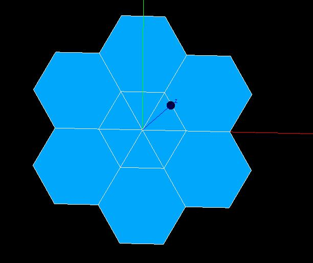

Meshing a 2D geometry with polygons
-----------------------------------

Objective
~~~~~~~~~

In this example we propose to build a mesh on a 2D geometry. We first create triangles in the center of the geometry and then hexagons around them. The result will be saved in a med file, and then visualized with the SMESH module of Salome.

Beginning of implementation
~~~~~~~~~~~~~~~~~~~~~~~~~~~

To implement this exercice we use the python language script and import the MEDCoupling and MEDLoader parts of the MED module::

	from MEDCoupling import *
	from MEDLoader import *

	from math import *

Then we must instanciate a meshing object::

	mesh=MEDCouplingUMesh.New()
	mesh.setMeshDimension(2)
	mesh.allocateCells(numberOfCells)
	mesh.setName("MaFleur")

You must define 2 variables for space dimension and total number of nodes::

	numberOfNodes = 25
	numberOfCells = 12
	spaceDimension = 2

You must define the coordinates of the nodes of the central hexagon::

	X = [1.,0.5,-0.5,-1.,-0.5,0.5]
	Y = [0.,sqrt(3.)/2.,sqrt(3.)/2.,0.,-sqrt(3.)/2.,-sqrt(3.)/2.]

Definition of nodes coordinates
~~~~~~~~~~~~~~~~~~~~~~~~~~~~~~~

Define the coordinates of the origin and the nodes of the 2D central polygon::

	coordinates = []
	# origin
	coordinates.append(0.)
	coordinates.append(0.)

	# central polygon
	for i in range(6):
	  coordinates.append(X[i])
	  coordinates.append(Y[i])

Define the coordinates of the extra nodes of the hexagons around the central hexagon::

	# second couron
	xc = 1.5
	yc = - sqrt(3.)/2.

	for i in range(6):
	  ...

	myCoords=DataArrayDouble.New()
	myCoords.setValues(coordinates,numberOfNodes,2)
	mesh.setCoords(myCoords)

Definition of triangles connectivity
~~~~~~~~~~~~~~~~~~~~~~~~~~~~~~~~~~~~~

For each triangle of the mesh, you have to give its connectivity: the list of the nodes which belong to the triangles::

	connectivity = []
	for i in range(6):
		connectivity.append(0)
		connectivity.append(...)
		connectivity.append(...)
	for i in range(6):
		mesh.insertNextCell(NORM_TRI3,3,connectivity[3*i:3*(i+1)])
		pass

Definition of hexagons connectivity
~~~~~~~~~~~~~~~~~~~~~~~~~~~~~~~~~~~~~

For each hexagon of the mesh, you have to give its connectivity: the list of the nodes which belong to the hexagons::

	connectivity = []
	for i in range(6):
		start = i%6+1
		connectivity.append(...)
	for i in range(6):
		mesh.insertNextCell(NORM_POLYGON,6,connectivity[6*i:6*(i+1)])
		pass
	mesh.checkConsistencyLight()

Saving the mesh in a med file
~~~~~~~~~~~~~~~~~~~~~~~~~~~~~

You have to create a med file with the MED driver::

	medFileName = "MEDCoupling_Fleur.med"
	MEDLoader.WriteUMesh(medFileName,mesh,True)

Visualize the mesh with SMESH module of Salome
~~~~~~~~~~~~~~~~~~~~~~~~~~~~~~~~~~~~~~~~~~~~~~

Launch Salome platform, then select SMESH module and import your MED file. First You can see the number of elements of your mesh. For that, select your mesh in the object browser, set select Mesh menu and "Advanced Mesh Info" option. Verify the number of triangles and the number of hexagons. To visualize your mesh: click right bottom on your mesh and select "Show" option.

Solution
~~~~~~~~

:ref:`python_testMEDCoupling2D_solution`
