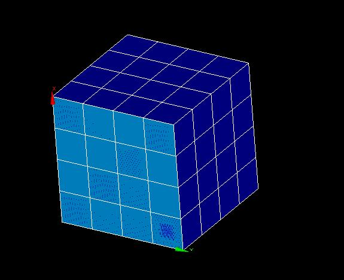
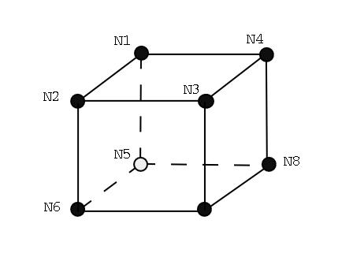
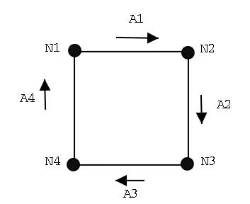
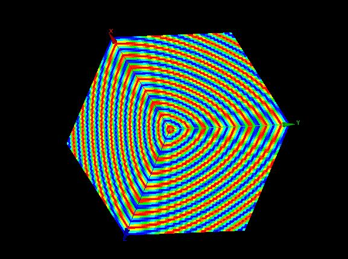

Meshing a 3D cube
-----------------

Objective
~~~~~~~~~

The meshing class of the SALOME MED module allows user to create a mesh from scratch. 
In this example we propose to build a mesh on a 3D cube by three methods (classical method, method by extrusion and grid method). Each cell of the mesh must be a hexaedron.
We see also how creating a group.
Then we create a field on all the 3D cube.
Each result will be saved in a med file, and then visualized with the SMESH module of Salome.

In spite of a mesh in MEDCoupling has only one dimension, it's possible to save some meshes with different dimension in one med file. We will see this method.




Beginning of implementation
~~~~~~~~~~~~~~~~~~~~~~~~~~~

To implement this exercice we use the python language script and import the MEDCoupling and MEDLoader parts of the MED module. We need also mathematical functions, so we import the python math module::

	from MEDCoupling import *
	from MEDLoader import *
	from math import *

You must define 3 variables for space dimension, number of nodes on each dimension and total number of nodes::

	MeshDim3D = 3
	MeshDim2D = 2
	N = ...
	NbCell2D = (N-1)*(N-1)
	NbCell3D = NbCell2D*(N-1)
	NbNode2D = N*N
	NbNode3D = NbNode2D*N


Classical method
~~~~~~~~~~~~~~~~~~~~~~~~~~~~~~~

First instanciate a meshing object. Therefore, we need to define :

 * its name
 * its dimension
 * its number of cells

.. note:: All this initialisation are necessary. If one lacks, you will have a segmentation fault!.

::

	mesh=MEDCouplingUMesh.New()
	mesh.setMeshDimension(3)
	mesh.allocateCells(...)
	mesh.setName("3Dcube")

Definition of nodes coordinates
```````````````````````````````

Define the coordinates of the nodes of the 3D cube mesh, and then use the setCoords function to set it::

	# Initialisation of coordinates
	coordinates = []
	for k in range(N):
		for j in range(N):
			for i in range(N):
				coordinates.append(...)
				
	myCoords = DataArrayDouble.New()
	myCoords.setValues(coordinates,nbOfNodes,3)
	mesh.setCoords(myCoords)
	

Definition of hexahedrons connectivity
``````````````````````````````````````
For each hexahedron of the mesh, you have to give its connectivity: the list of the nodes which belong to the hexahedron. The order of the nodes in the connectivity array must respect the MEDCoupling format (see the following figure).



.. warning:: Connectivity elements begin to 0 from (n-1) elements

::

	connectivity = []
	for k in range(N-1):
		for j in range(N-1):
			for i in range(N-1):
				inode = ...
				connectivity.append(inode)
				connectivity.append(...)

	# Adding cells in meshing
	for i in range(nbOfCells):
		mesh.insertNextCell(NORM_HEXA8,8,connectivity[8*i:8*(i+1)])
		pass
		
	# Check mesh consistency:
	mesh.checkConsistencyLight()
	
Method by extrusion
~~~~~~~~~~~~~~~~~~~~~~~~~~~~~~~

In order to create a extruded mesh, we need one 2D mesh and one 1D mesh which define the vector of extrusion and the number of steps.

Definition of 2D mesh
``````````````````````````````````````
::

	coordinates = []
	for j in range(N):
		for i in range(N):
			coordinates.append(...)
			...
	Connectivities = [...]
	myCoords = DataArrayDouble.New()
	myCoords.setValues(coordinates,NbNode2D,MeshDim2D)

	m1 = MEDCouplingUMesh.New()
	m1.setMeshDimension(MeshDim2D)
	m1.allocateCells(NbCell2D)
	m1.setCoords(myCoords)
	m1.setName("2D_Support")

	for i in range(NbCell2D):
		m1.insertNextCell(NORM_QUAD4,4,Connectivities[4*i:4*(i+1)])
	m1.changeSpaceDimension(3)

Definition of 1D mesh
``````````````````````````````````````
::

	coords = [ ... ]
	conn   = [ ... ]
	m2 = MEDCouplingUMesh.New()
	m2.setMeshDimension(1)
	m2.allocateCells(3)
	m2.insertNextCell(NORM_SEG2,2,conn[0:2])
	m2.insertNextCell(NORM_SEG2,2,conn[2:4])
	m2.insertNextCell(NORM_SEG2,2,conn[4:6])
	myCoords1D=DataArrayDouble.New()
	myCoords1D.setValues(coords,4,1)
	m2.setCoords(myCoords1D)
	m2.changeSpaceDimension(3)

Definition of extruded mesh
``````````````````````````````````````

Since 1D meshing isn't well oriented (along 0x vector), we need to imply a transformation on it.
Then, we can extrude 2D meshing.

::

	center = [...]
	vector = [...]
	m2.rotate(...)
	m3 = m1.buildExtrudedMesh(m2,0)
	m3.setName("Extrusion")

Grid method
~~~~~~~~~~~~~~~~~~~~~~~~~~~~~~~

it's the easiest way to create a grid since you have no connectivity to set. They will be automatically setting. Incrementation of ids will be made first along Ox axis, then along Oy axis and finally along Oz axis.

::

	mesh=MEDCouplingCMesh.New()
	coordsX=DataArrayDouble.New()
	arrX=[ ... ]
	coordsX.setValues(arrX,4,1)
	coordsY=DataArrayDouble.New()
	arrY=[ ... ]
	coordsY.setValues(arrY,4,1)
	coordsZ=DataArrayDouble.New()
	arrZ=[ ... ]
	coordsZ.setValues(arrZ,4,1)
	mesh.setCoords(coordsX,coordsY,coordsZ)

Really in order to save this mesh, you need to transform this structured mesh to an unstructerd mesh.
::

	meshU=mesh.buildUnstructured()
	meshU.setName("Grid")

Creation of groups
~~~~~~~~~~~~~~~~~~~~~~~~~~~~~~~

A group is a set of cells defining by their id. This set must the input for creating a group.
Generally ids cells using in group are known. So you just need put these ids in a DataArray.
::

	tabIdCells = DataArrayInt.New()
	IdCells = [ ... ]
	tabIdCells.setValues(IdCells,...)


.. note:: It's also possible to retrieve ids cells from a submesh of the principal mesh.

::

	ret,tabIdCells = mesh.areCellsIncludedIn(subMesh,0)


Once the DataArray is created, some initializations have to be done.
::

	# Definition of the name group
	tabIdCells.setName("meshGroup")


In order to add a group on a mesh, you need to transform your unstructured mesh in a file unstructured mesh.
Moreover, we need to define:

 * its name
 * its description
 * its coordinates
 * its dimension
 * its number of cells


::

	# Passing MEDCoupling to MEDFile
	fmeshU = MEDFileUMesh.New()
	fmeshU.setName("Grid")
	fmeshU.setDescription("IHopeToConvinceLastMEDMEMUsers")
	myCoords = meshU.getCoords()
	fmeshU.setCoords(myCoords)
	fmeshU.setMeshAtLevel(0,meshU)

Then, you can 
Therefore, you need to define the level (ie. the dimension) of the group.
This information is given by a number : 0,-1 or -2.

 * 0 means the same level at mesh

::

	fmeshU.setGroupsAtLevel(0,[tabIdCells],False)

Create field on 3D cube
~~~~~~~~~~~~~~~~~~~~~~~

First you need to create a CouplingField and initialize some data:

 * its name
 * its support (ie mesh)
 * its nature
 * its values

 
The field will be a sin function dependant of distance of the barycenter of each cell from origin. So we need to create a barycenter field on the 3D mesh::

	# Creation of field : with following definition
	# => Definition of the mesh support
	# => Definition of field name
	# => Definition of field nature
	field = MEDCouplingFieldDouble.New(ON_CELLS)
	field.setMesh(mesh)
	field.setName("field")
	field.setNature(ExtensiveMaximum)

	# Computing and setting field values
	myCoords=DataArrayDouble.New()
	sampleTab=[]
	bar = mesh.computeCellCenterOfMass()
	print bar.getNbOfElems()
	for i in range(nbOfCells):
		x = bar.getIJ(...)
		y = bar.getIJ(...)
		z = bar.getIJ(...)
		d = sqrt(x*x+y*y+z*z)
		sinus = sin(d)
	.	sampleTab.append(sinus)

	myCoords.setValues(sampleTab,nbOfCells,1)
	field.setArray(myCoords)


Saving the mesh in a med file
~~~~~~~~~~~~~~~~~~~~~~~~~~~~~
General Case
````````````
::

	medFileName = "MEDCoupling_Extrudedcube3D.med"
	MEDLoader.WriteUMesh(medFileName,meshU,True)

.. note:: True / False in Write* functions : True for overwriting existing file and False for adding in existing file 

Multi mesh Case
````````````````

In spite of a MEDCoupling mesh has only one dimension, it's possible to genrate a file with multi dimension.
Therefore, you need to create as meshes as necessary dimensions.

You have to give the connectivity of the faces on the bottom face of the 3D cube: the list of the nodes which belong to the face.
The connectivity must respect following figure:



::

	# Extraction of surfacic meshing
	pt=[0.,0.,0.]
	vec=[0.,0.,1.]
	nodes = mesh.findNodesOnPlane(pt,vec,1e-12)
	mesh2D = mesh.buildFacePartOfMySelfNode(nodes,True)
	#print mesh2D
	mesh2D.setName("3Dcube")
	mesh2D.checkConsistencyLight()
	
	medFileName = "MEDCoupling_cube3D.med"
	meshes=[mesh2D,mesh]
	MEDLoader.WriteUMeshes(medFileName,meshes,True)
	
Group Case
````````````
::

	medFileName = "MEDCoupling_Gridcube3D.med"
	fmeshU.write(medFileName,2)

Saving the fields in the med file
~~~~~~~~~~~~~~~~~~~~~~~~~~~~~~~~~

::

	MEDLoader.WriteField(medFileName,field,False)

Visualize the mesh with the SMESH module of Salome
~~~~~~~~~~~~~~~~~~~~~~~~~~~~~~~~~~~~~~~~~~~~~~~~~~

Launch Salome platform, then select SMESH module and import your MED file. First You can see the number of elements of your mesh. For that, select your mesh in the object browser, set select Mesh menu and "Advanced Mesh Info" option. Verify the number of faces and the number of hexahedrons. To visualize your mesh: click right bottom on your mesh and select "Show" option. You can also visualize your groups. Select one group, click right bottom on your group and select "Show only" option.

Visualize the fields with the VISU module of Salome
~~~~~~~~~~~~~~~~~~~~~~~~~~~~~~~~~~~~~~~~~~~~~~~~~~~

Launch Salome platform, then select VISU module and import your MED file. You can see in the object browser the 2 fields you have created. Then you have to create a scalar map on each field to visualize them.



Solution
~~~~~~~~

:ref:`python_testMEDCouplingcube_solution`
