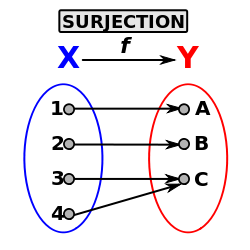

Manipulate DataArray objects
----------------------------

DataArrays (DataArrayInt and DataArrayDouble) are used in MEDCoupling to store contiguous arrays in memory. Each array entry is a tuple of data.
They form the base of many data processing performed by MEDCoupling. It is thus useful to be able to manipulate them with ease.

DataArrayDouble are often used to manipulate fields in an optimized fashion, as will be shown later on.

Objective
~~~~~~~~~

In this exercise the aim is to create a set of 2D Cartesian coordinates. The first component will be called X (with unit "m") and the second Y (same unit). The coordinates represent 7 regular hexagons (all inscribed in a 3cm radius circle).
The 7 hexagons are built from a centered reference hexagon (3.4; 4.4).

Around this reference, 6 translated copies are created and each copy shares exactly one edge with the reference.
The common nodes (tuples) are then merged. This shows how to use indirections, concept widely used in unstructured meshes.

.. image:: images/DataArrayDouble_1.jpg

Concepts at hand:

* Create an instance of DataArrayDouble
* Display a DataArrayDouble instance and invoke the getValue() method to convert it to a list
* Use convenient notations da[...]
* Learn about renumbering (old2new convention)
* Invoke services from findCommonTuples 

Starting the implementation
~~~~~~~~~~~~~~~~~~~~~~~~~~~

To start with, import the whole python module MEDCoupling and the standard math module. ::

	from MEDCoupling import *
	import math

This makes the following available:

* all MEDCoupling classes
* all enum (ON_CELLS, ON_NODES, ONE_TIME...)
* all static methods

Create a DataArrayDouble instance containing 6 tuples
~~~~~~~~~~~~~~~~~~~~~~~~~~~~~~~~~~~~~~~~~~~~~~~~~~~~~

The target here is to create one DataArrayDouble containing the complete set of coordinates for one regular hexagon. ::

	d=DataArrayDouble(6,2)

Which is equivalent to ::

	d=DataArrayDouble()
	d.alloc(6,2)

or to ::

	d=DataArrayDouble(12)
	d.rearrange(2)

.. note:: d contains 12 values grouped in 6 tuples containing each 2 components.
	  The values in d are still un-initialized.

Initialize an instance of DataArrayDouble
~~~~~~~~~~~~~~~~~~~~~~~~~~~~~~~~~~~~~~~~~

Assign the value 3.0 (radius) to the first component of all tuples. ::

	d[:,0]=3.

Initialize the 2nd component of each tuple i with the index value i. ::

	d[:,1]=range(6)

Multiply the 2nd component by pi/3. ::

	d[:,1]*=math.pi/3.

.. note:: d now contains the polar coordinates of our regular hexagon centered at 0,0.

Convert from polar to Cartesian by invoking fromPolarToCart(), and assign the result to d. ::

	d=d.fromPolarToCart()

.. note:: fromPolarToCart() generates a new instance and d now points to it.

Assign the correct component information of d.::

	d.setInfoOnComponents(["X [m]","Y [m]"])

Display the values only in form of a Python list. ::

	print d.getValues()

Display d. ::

	print d

Verify that for each tuple of d its norm (returned by the magnitude() method) is indeed 3 (with an error less than 1.e-12):
::

	print d.magnitude().isUniform(3.,1e-12)

Duplication and aggregation of DataArrayDouble 
~~~~~~~~~~~~~~~~~~~~~~~~~~~~~~~~~~~~~~~~~~~~~~

translationToPerform contains a list of vectors of size 2. This list has length 7 (7 hexagons) Cette liste de taille 7 (7 hexagones) and describes the appropriate translation for each copy of d.

Execute directly the following lines ::

	radius=3.
	translationToPerform=[[0.,0.],[3./2.*radius,-radius*math.sqrt(3.)/2],[3./2.*radius,radius*math.sqrt(3.)/2],[0.,radius*math.sqrt(3.)],[-3./2.*radius,radius*math.sqrt(3.)/2],[-3./2.*radius,-radius*math.sqrt(3.)/2],[0.,-radius*math.sqrt(3.)]]

Create the len(translationToPerform) copies of d and apply the corresponding translation.  ::

	ds=len(translationToPerform)*[None]
	for pos,t in enumerate(translationToPerform):
          ds[pos]=d[:]
          ds[pos]+=t
          pass

An alternative (and more compact) way to do it : ::

        ds=[d.deepCopy() for i in xrange(len(translationToPerform))]
        for (elt,t) in zip(ds,translationToPerform) : elt+=t

Aggregating DataArrayDouble
~~~~~~~~~~~~~~~~~~~~~~~~~~~
From the list of DataArrayDouble instances 'ds', construct the aggregation 'd2' (a new instance of DataArrayDouble).
::

	d2=DataArrayDouble.Aggregate(ds)

.. note:: d2 now contains the full tuple set (6*7=42 tuples of 2 components each) which was in ds with the same order. This might sound obvious but the aggregation of meshes and fields is based on the exact same principle thus facilitating data access and indexing. This is a key difference to the MED file model, as will be seen later on.

Find identical tuples in d2
~~~~~~~~~~~~~~~~~~~~~~~~~~~

d2 contains 42 tuples but some of them are duplicated. To identify those (with a 1e-12 precision) invoke DataArrayDouble.findCommonTuples().
Use help(DataArrayDouble.findCommonTuples) to show the prototype of the method and store the result in c and cI::

	oldNbOfTuples=d2.getNumberOfTuples()
	c,cI=d2.findCommonTuples(1e-12)

c is an array containing all the common nodes grouped sequentially. cI contains the pointers to c allowing to identify all the nodes in a group 'i' (with 'i' in [0, 12) ). Thus the tuple ids of group 'i' start at index cI[i] in the list c, and finish at index cI[i+1].

.. note:: DataArrayDouble.findCommonTuples() thus returns 2 values: an array containing a list of common tuples, and an index array which is used to navigate in the first list. This is a very classical return signature in MEDCoupling and often appears when manipulating unstructured meshes.

Manipulate DataArrayInt couple representing a pair (Data,IndexData)
~~~~~~~~~~~~~~~~~~~~~~~~~~~~~~~~~~~~~~~~~~~~~~~~~~~~~~~~~~~~~~~~~~~

The number of common tuples is len(cI)-1, i.e. 12 in our case. 
Get the list of tuple ids forming the first group of common nodes and store the result in tmp. ::

	tmp=c[cI[0]:cI[0+1]]
	print tmp

Check the result: all the tuples stored in tmp point to identical coordinates in d2.::

	print d2[tmp]

.. note:: we see the tuple (3.,0.) repeated 3 times (with an error margin below 1e-12).

Now we will deduce from the 3 variables oldNbOfTuples, c and cI the number of truly different tuples in d2.
To this end we compute the number of repetitions in d2 and we subtract this from oldNbOfTuples.

To get the repetition count invoke the method DataArrayInt.deltaShiftIndex(). It returns the size of each group.
Store the result in a. ::

	a=cI.deltaShiftIndex()

The number of repetitions in d2 for each group can now be stored in b. ::

	b=a-1

Finally the new count of tuples can be computed as follows. ::

	myNewNbOfTuples=oldNbOfTuples-sum(b.getValues())

Build old to new array from c and cI
~~~~~~~~~~~~~~~~~~~~~~~~~~~~~~~~~~~~

c and cI define a surjective function from a starting set X containing 42 tuples (oldNbOfTuples) to a set Y containing 24 tuples (myNewNbOfTuples).

This surjective function may also be represented thanks to an "old-2-new" array.
This storage method takes the form of a DataArrayInt 'o2n' made of Card(X) tuples (in our case 42) with one component each. For each tuple (element) indexed by i in o2n, o2n[i] contains the new tuple id in Y.

The format 'old-2-new' is systematically used for all renumbering operations (one-to-one correspondence).

The static method DataArrayInt.ConvertIndexArrayToO2N() performs the conversion from one storage mode to the other (c, cI to o2n).
We get for free the number of elements in Y, i.e. the variable newNbOfTuples. ::

	o2n,newNbOfTuples=DataArrayInt.ConvertIndexArrayToO2N(oldNbOfTuples,c,cI)
	print "Have I got the right result? %s"%(str(myNewNbOfTuples==newNbOfTuples))

Using o2n and newNbOfTuples invoke DataArrayDouble.renumberAndReduce() on d2. ::

	d3=d2.renumberAndReduce(o2n,newNbOfTuples)

This method has one drawback: we don't know for each group of common tuples in d2 what id was finally retained.
For example: in the group 0 we know that tuples 0, 8 and 16 are identical (tmp.getValues()), but we don't know which of the three has been retained in d3.

To make this choice explicit we use the new-2-old format. This storage mode is represented by a DataArrayInt n2o containing Card(Y) tuples (in our case 24) with one component each.
For each tuple (element) with id 'i' in n2o, n2o[i] contains the tuple id which was chosen in X.

The method DataArrayInt.invertArrayO2N2N2O() allows to switch between the two representations.
Try it on the variable o2n. ::

	n2o=o2n.invertArrayO2N2N2O(newNbOfTuples)

Using n2o we can deduce d3_bis from d2. ::

	d3_bis=d2[n2o]
	print "Have I got the right result (2)? %s"%(str(d3.isEqual(d3_bis,1e-12)))

Translate all tuples at once
~~~~~~~~~~~~~~~~~~~~~~~~~~~~

All tuples (or nodes) are to be translated by the vector [3.3,4.4]. ::

	d3+=[3.3,4.4]

Build an unstructured mesh using d3 (coordinates) and o2n
~~~~~~~~~~~~~~~~~~~~~~~~~~~~~~~~~~~~~~~~~~~~~~~~~~~~~~~~~

Create an unstructured mesh m with coordinates d3. m has a mesh dimension of 2 ::

	m=MEDCouplingUMesh("My7hexagons",2)
	m.setCoords(d3)

Now allocate the number of cells with an upper bound of the actual number of cells. ::

	m.allocateCells(7)

Finally thanks to o2n we know the connectivity of all 7 hexagons using the coordinates stored in d3.

	for i in xrange(7):
	  m.insertNextCell(NORM_POLYGON,o2n[6*i:6*(i+1)].getValues())
	  pass

Check that m is coherent. ::

	 m.checkConsistencyLight()

To visually check m, write it in a VTU file ("My7hexagons.vtu") and display it in ParaVis. ::

	m.writeVTK("My7hexagons.vtu")

.. note:: We write the data in VTU file, not in a MED file, because MEDCoupling doesn't use the MED file pre-requisite. Also note that although we output VTK data, MEDCoupling in itself doesn't depend on the VTK libraries.

Solution
~~~~~~~~

:ref:`python_testMEDCouplingdataarray1_solution`
