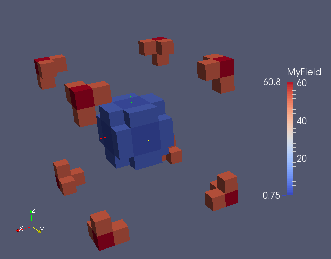
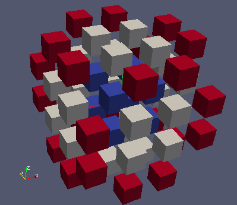

Playing with fields
-------------------

In MEDCoupling fields are directly supported by a mesh. That is a major difference
with the field notion in MED file.

Fields instances are well suited:
  * for high level services where an interaction with the mesh is requested as in getValueOn(), getValueOnMulti(), integral(), normL1(), normL2(), fillFromAnalytic(), changeUnderlyingMesh(), ...
  * to precisely transmit information between components when coupling codes.

For information, the MEDCouplingFieldDouble implementation is tiny since 
it delegates most of its work to MEDCouplingMesh, DataArrayDouble, MEDCouplingSpatialDiscretization classes.
MEDCouplingFieldDouble insure the coherency in this model.
It is often possible and even advised to manipulate the array and mesh of a MEDCouplingFieldDouble directly.

Objective
~~~~~~~~~

This exercise focuses on the relationship between a mesh and the values of a field.

* Create a field
* Aggregate fields
* Build parts of a field
* Renumbering a field
* Compare two fields coming from 2 sources
* Evaluation of a field on a point set
* Explode a field 

Implementation start
~~~~~~~~~~~~~~~~~~~~

Import the MEDCoupling Python module. ::

	from MEDCoupling import *

We are going to create a MEDCouplingUMesh from a 3D cartesian mesh. Each direction will contain 10 cells and 11 nodes. The generated MEDCouplingUMesh
will contain 1000 cells. ::

	xarr=DataArrayDouble.New(11,1)
	xarr.iota(0.)
	cmesh=MEDCouplingCMesh.New()
	cmesh.setCoords(xarr,xarr,xarr)
	mesh=cmesh.buildUnstructured()
	
In order to put the focus on mixed types, cells with an even id will be converted to polyhedrons ::

	mesh.convertToPolyTypes(DataArrayInt.Range(0,mesh.getNumberOfCells(),2))
	
Creation of a field
~~~~~~~~~~~~~~~~~~~

Create a field called "MyField" by application of an analytic function "(x-5.)*(x-5.)+(y-5.)*(y-5.)+(z-5.)*(z-5.)".
Two possibilities :

* Directly by calling fillFromAnalytic on a mesh ::

	f=mesh.fillFromAnalytic(ON_CELLS,1,"(x-5.)*(x-5.)+(y-5.)*(y-5.)+(z-5.)*(z-5.)")
	f.setName("MyField")
	
* Or by building a new instance ::

	f2=MEDCouplingFieldDouble.New(ON_CELLS,ONE_TIME)
	f2.setMesh(mesh)
	f2.setName("MyField2")
	f2.fillFromAnalytic(1,"(x-5.)*(x-5.)+(y-5.)*(y-5.)+(z-5.)*(z-5.)")

Compare the two fields:
Compare f and f2 with a precision of 1e-12 on coordinates and 1e-12 on values. ::

	print "f and f2 are equal: %s"%(f.isEqualWithoutConsideringStr(f2,1e-12,1e-12))

Builing of a subpart of a field
~~~~~~~~~~~~~~~~~~~~~~~~~~~~~~~
	
Store in ids1 the list of tuple ids whose value is within [0.0,5.0] (DataArrayDouble.findIdsInRange)	. From ids1 build the sub-part fPart1 of the field "f". ::

	ids1=f.getArray().findIdsInRange(0.,5.)
	fPart1=f.buildSubPart(ids1)
	
.. image:: images/FieldDouble1_1.png

Select the part "fPart2" of the field "f" whose values are in [50.,infinity). ::

	ids2=f.getArray().findIdsInRange(50.,1.e300)
	fPart2=f.buildSubPart(ids2)

Renumbering cells
~~~~~~~~~~~~~~~~~

The generated file "fPart1" is valid for MEDCoupling, but its cells are not sorted by geometric type: it is not valid from a MED file point of view. By using MEDCouplingUMesh.sortCellsInMEDFileFrmt and DataArrayDouble.renumberInPlace
renumber manually fPart1 starting from a deep copy of fPart1. ::

	fPart1Cpy=fPart1.deepCopy()
	o2n=fPart1Cpy.getMesh().sortCellsInMEDFileFrmt()
	fPart1Cpy.getArray().renumberInPlace(o2n)
	
"fPart1Cpy" is now normalized to be stored in a MED file (we will tackle this later).	
Check that fPart1Cpy and fPart1 are the same (discarding any permutation): ::

	fPart1Cpy.substractInPlaceDM(fPart1,12,1e-12)
	fPart1Cpy.getArray().abs()
	print "Fields are the same? %s"%(fPart1Cpy.getArray().accumulate()[0]<1e-12)

.. note:: This is in fact a very special case of interpolation. Except that here 
	we assume that the supports of "fPart1" and "fPart1Cpy" are equal, discarding any 
	cell and/or node permutation.

Aggregate Fields
~~~~~~~~~~~~~~~~

Aggregate fields "fPart1" and "fPart2". The result is stored in "fPart12". ::

	fPart12=MEDCouplingFieldDouble.MergeFields([fPart1,fPart2])

.. note:: Apologies for the name MEDCouplingFieldDouble.MergeFields instead of 
		AggregateFields.

Evaluation of a MEDCouplingFieldDouble on given space points
~~~~~~~~~~~~~~~~~~~~~~~~~~~~~~~~~~~~~~~~~~~~~~~~~~~~~~~~~~~~

Evaluate the values of the computed field "fPart12" on the barycenters of its mesh.
Evaluate the field "f" on the same barycenters. The method used is MEDCouplingFieldDouble.getValueOnMulti(). ::

	bary=fPart12.getMesh().computeCellCenterOfMass()
	arr1=fPart12.getValueOnMulti(bary)
	arr2=f.getValueOnMulti(bary)
	delta=arr1-arr2
	delta.abs()
	print "Check OK: %s"%(delta.accumulate()[0]<1e-12)

.. note:: In this context and for example for a field on cells, "evaluate" at a point means returning the value of the cell containing the point.
.. note:: This technique can be used to quickly assess the quality of an interpolation.

Operations on a field
~~~~~~~~~~~~~~~~~~~~~

Compute the integral of the field "fPart12" and compute it a second time by using
DataArrayDouble.accumulate on the underlying DataArrayDouble of this "fPart12" (remember that the cell volumes are all 1.0). 
To show the link with the underlying mesh, scale the underlying mesh (fPart12.getMesh()) by 1.2 and centered at [0.,0.,0.].
Recompute the integral.
::

	fPart12.integral(0,True)
	fPart12.getArray().accumulate()
	fPart12.getMesh().scale([0.,0.,0.],1.2)
	abs(fPart12.integral(0,True)-fPart12.getArray().accumulate()[0]*1.2*1.2*1.2)<1e-8

Exploding a field
~~~~~~~~~~~~~~~~~

Starting from "mesh", create a vector field on cells "fVec" with 3 components representing the displacement between each cell's barycenter and the point [5.,5.,5.]. Use MEDCouplingMesh.fillFromAnalytic(). ::

	fVec=mesh.fillFromAnalytic(ON_CELLS,3,"(x-5.)*IVec+(y-5.)*JVec+(z-5.)*KVec")

Create the reduction of "fVec" ("fVecPart1") on cell IDs "ids1" (previously obtained). ::

	fVecPart1=fVec.buildSubPart(ids1)
	fVecPart1.setName("fVecPart1")

Build the scalar field fPart1Exploded having the same values as "fPart1" but supported by an exploded mesh (in comparison to fPart1.getMesh()).
To explode the underlying mesh fPart1.getMesh(), use the vectorial displacement field "fVecPart1" in order to apply to each cell the proper translation. ::

	cells=fPart1.getMesh().getNumberOfCells()*[None]
	for icell,vec in enumerate(fVecPart1.getArray()):
	  m=fPart1.getMesh()[[icell]]
	  m.zipCoords() # pas absolument nécessaire mais permet d'être économe en mémoire
	  m.translate(vec)
	  cells[icell]=m
	  pass
	meshFVecPart1Exploded=MEDCouplingUMesh.MergeUMeshes(cells)
	fPart1.setMesh(meshFVecPart1Exploded)

	
Solution
~~~~~~~~

:ref:`python_testMEDCouplingfielddouble1_solution`
