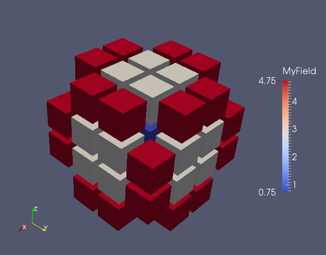
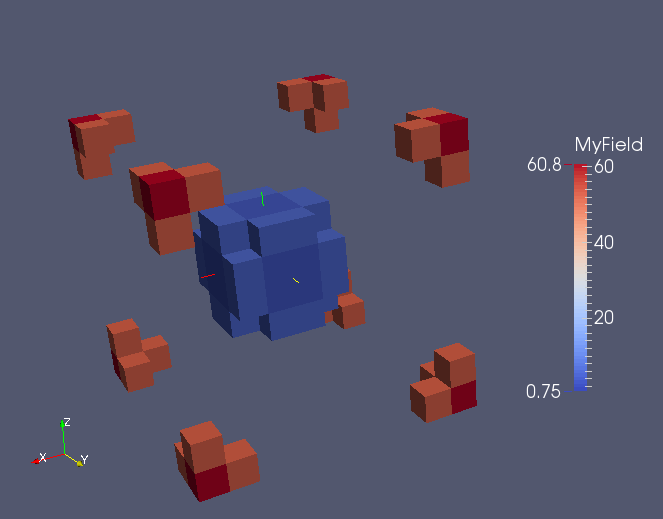
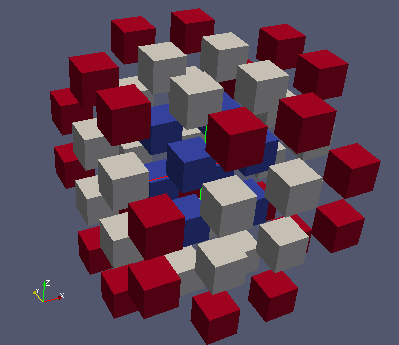

Manipuler des champs de double
------------------------------

Les champs dans MEDCoupling ont comme support un unique maillage, de dimension fixée, et bien défini. 
Cela semble trivial mais c'est en fait une différence majeure avec la notion de champ dans MED fichier, qui elle est beaucoup
plus permissive.

Les champs sont utiles pour :

* stocker des valeurs d'une grandeur physique relative au problème traité, mais aussi
* des services de haut niveau où l'interaction avec les maillages
  est requise comme par exemple ``getValueOn()``, ``getValueOnMulti()``, ``integral()``, ``getMeasureField`` 
  ``normL1()``, ``normL2()``, ``fillFromAnalytic()``, ... qui calculent toutes des valeurs en lien avec le maillage
  (par exemple le *volume* des cellules)
* expliciter précisément les informations échangées entre les différents codes
  lors de couplage.

Pour information, l'implémentation de ``MEDCouplingFieldDouble`` est relativement petite car cette classe 
délègue la très large majorité de ses traitements à des instances de classes aggrégées 
comme ``MEDCouplingMesh``, ``DataArrayDouble``, et ``MEDCouplingSpatialDiscretization``.
La classe ``MEDCouplingFieldDouble`` permet d'assurer la cohérence entre tous ces éléments.

Il est souvent  possible et même parfois recommandé de manipuler les tableaux (un ``DataArrayDouble``) 
et/ou le maillage d'une instance de ``MEDCouplingFieldDouble`` directement.

Objectifs
~~~~~~~~~

Cet exercice met l'accent sur la relation entre le maillage et les valeurs d'un champ.

* Créer un champ
* Agréger des champs
* Construire une sous-partie d'un champ
* Renuméroter les entités d'un champ
* Comparer 2 champs venant de 2 sources différentes
* Evaluation d'un champ sur un ensemble de points
* Exploser un champ

Début de l'implementation
~~~~~~~~~~~~~~~~~~~~~~~~~

Importer le module Python ``MEDCoupling``. ::

	import MEDCoupling as mc

Créer un ``MEDCouplingUMesh`` à partir d'un maillage 3D cartésien. Chaque direction contiendra 10 cells 
et 11 nodes. Le ``MEDCouplingUMesh`` résultant contiendra ainsi 1000 cells. ::

	xarr = mc.DataArrayDouble.New(11,1)
	xarr.iota(0.)                       # Generate s, s+1, s+2, ... with a given start value s
	cmesh = mc.MEDCouplingCMesh.New()
	cmesh.setCoords(xarr,xarr,xarr)
	mesh = cmesh.buildUnstructured()

.. note:: La méthode ``MEDCouplingMesh.buildUnstructured()`` est très utile pour construire rapidement un maillage
	non structuré afin de tester quelque chose.

Afin de mettre en évidence le problème des types géométriques multiples, convertir en polyhèdres 
les cellules d'identifiant pair ::

	mesh.convertToPolyTypes(mc.DataArrayInt.Range(0,mesh.getNumberOfCells(),2))

Création d'un champ
~~~~~~~~~~~~~~~~~~~

Créer un champ scalaire (une seule composante) aux cellules (P0) appelé "MyField" en appliquant la fonction analytique
suivante ``(x-5.)*(x-5.)+(y-5.)*(y-5.)+(z-5.)*(z-5.)``, où ``(x, y, z)`` représente implicitement les coordonnées du barycentre
d'une cellule.
Pour cela, deux possiblités :

* Directement en appelant ``fillFromAnalytic()`` sur un maillage ::

	f = mesh.fillFromAnalytic(mc.ON_CELLS,1,"(x-5.)*(x-5.)+(y-5.)*(y-5.)+(z-5.)*(z-5.)")  # 1 means that the field should have one component
	f.setName("MyField")

* Ou en créant au préalable un champ non initialisé, et en appliquant ``fillFromAnalytic()`` sur cette 
  instance de ``MEDCouplingFieldDouble`` ::

	f2 = mc.MEDCouplingFieldDouble(mc.ON_CELLS, mc.ONE_TIME)
	f2.setMesh(mesh)
	f2.setName("MyField2")
	f2.fillFromAnalytic(1,"(x-5.)*(x-5.)+(y-5.)*(y-5.)+(z-5.)*(z-5.)")    # 1 means that the field should have one component

Comparer les deux champs : comparer ``f`` et ``f2`` avec une précision de 1e-12 sur les coordonnées et
de 1e-13 sur les valeurs. ::

	print "Are f and f2 equal?", f.isEqualWithoutConsideringStr(f2,1e-12,1e-13)

.. note:: Le ``WithoutConsideringStr`` dans le nom de la méthode précédente indique que les noms des champs ne seront 
	pas comparés. On retrouve ce suffixe dans d'autres méthodes MEDCoupling.
 

Construire une sous-partie d'un champ
~~~~~~~~~~~~~~~~~~~~~~~~~~~~~~~~~~~~~

Récupérer dans une variable ``ids1`` la liste des identifiants de cellules pour lesquelles la valeur du champ est dans le
range [0.0,5.0]. Utiliser pour cela la méthode ``DataArrayDouble.findIdsInRange()``. Avec ce résultat, construire la
sous-partie ``fPart1`` du champ ``f``. ::

	da1 = f.getArray()              # a DataArrayDouble, which is a direct reference (not a copy) of the field's values 
	ids1 = da1.findIdsInRange(0., 5.)
	fPart1 = f.buildSubPart(ids1)
	fPart1.writeVTK("ExoField_fPart1.vtu")

Sélectionner la partie ``fPart2`` du champ ``f`` dont toutes les valeurs de tuples
sont dans ``[50.,+infinity)``. ::

	ids2 = f.getArray().findIdsInRange(50., 1.e300)
	fPart2 = f.buildSubPart(ids2)

Ce genre de technique permet d'extraire facilement les parties d'un champ relatives à un groupe de mailles par exemple.

Renuméroter les entités d'un champ
~~~~~~~~~~~~~~~~~~~~~~~~~~~~~~~~~~

La partie ``fPart1`` générée est valide d'un point de vue de MEDCoupling. Mais elle 
n'est pas valide d'un point de vue de MED *fichier*. 
Une renumérotation s'impose dans l'hypothèse de stocker ce champs dans un fichier MED afin d'ordonner les cellules
par type géométrique.

L'idée est d'utiliser les deux méthodes ``MEDCouplingUMesh.sortCellsInMEDFileFrmt()`` et
``DataArrayDouble.renumberInPlace()`` pour renuméroter manuellement une *copie* de ``fPart1``: ::

	fPart1Cpy = fPart1.deepCopy()
	o2n = fPart1Cpy.getMesh().sortCellsInMEDFileFrmt()
	fPart1Cpy.getArray().renumberInPlace(o2n)

``fPart1Cpy`` est désormais normalisé pour être stocké dans un fichier MED (ce que nous verrons plus loin)

Vérifier que ``fPart1Cpy`` et ``fPart1`` sont les mêmes à une permutation près (``MEDCouplingFieldDouble.substractInPlaceDM()``) ::

	fPart1Cpy.substractInPlaceDM(fPart1,12,1e-12)
	fPart1Cpy.getArray().abs()
	print "Equal field ? %s" % (fPart1Cpy.getArray().accumulate()[0]<1e-12)

.. note:: La renumérotation effectuée ici représente en fait d'un cas très particulier
	d'interpolation. Effectivement l'hypothèse est faite que les supports
	de ``fPart1`` et ``fPart1Cpy`` sont égaux à une permutation de cellule
	et/ou noeuds.  

Agréger des champs
~~~~~~~~~~~~~~~~~~

Agréger ``fPart1`` et ``fPart2`` (utiliser ``MEDCouplingFieldDouble.MergeFields()``). Et mettre le résultat de l'agrégation
dans ``fPart12``. ::

	fPart12 = mc.MEDCouplingFieldDouble.MergeFields([fPart1,fPart2])
	fPart12.writeVTK("ExoField_fPart12.vtu")

.. note:: La méthode ``MEDCouplingFieldDouble.MergeFields()`` devrait vraiment se 
	nommer ``MEDCouplingFieldDouble.AggregateFields()`` ...

Evaluation d'un champ en des points donnés de l'espace
~~~~~~~~~~~~~~~~~~~~~~~~~~~~~~~~~~~~~~~~~~~~~~~~~~~~~~

Evaluer la valeur du champ ``fPart12`` calculé précédemment sur les barycentres des cellules de son
maillage (variable ``bary``) et mettre le résultat dans ``arr1``.
Utiliser pour cela les méthodes ``MEDCouplingFieldDouble.getValueOnMulti()`` et ``MEDCouplingMesh.computeCellCenterOfMass()``.  

De manière similaire, évaluer ensuite directement le champ ``f`` en utilisant la même liste de points
que précédemment (``bary``) et mettre le résultat dans ``arr2``.

Vérifier ensuite que ``arr1`` et ``arr2`` sont bien égaux: ::

	bary = fPart12.getMesh().computeCellCenterOfMass()
	arr1 = fPart12.getValueOnMulti(bary)
	arr2 = f.getValueOnMulti(bary)
	delta = arr1-arr2
	delta.abs()
	print "Is field evaluation matching?", (delta.accumulate()[0]<1e-12)

.. note:: Dans ce contexte, et pour un champ aux cellules (P0) par exemple, "évaluer" en un point signifie retourner la valeur 
	de la cellule contenant le point donné.
	Pour les champs aux noeuds (P1), les cellules doivent être de types simples (triangles, tétraèdres) et une interpolation
	linéaire est alors utilisée.

.. note:: Cette technique peut être utilisée pour juger rapidement de la qualité d'une interpolation.

Opérations sur les champs
~~~~~~~~~~~~~~~~~~~~~~~~~

Calculer l'intégrale du champ ``fPart12`` sur le maillage, et la retrouver d'une autre manière en utilisant
la méthode ``DataArrayDouble.accumulate()`` sur le tableau de valeurs de ce champ. 
On rappelle que, vu le maillage simplifié en jeu, les cellules ont toutes un volume unité. :: 

	integ1 = fPart12.integral(0,True)
	integ1_bis = fPart12.getArray().accumulate()[0]
	print "First integral matching ?", ( abs(integ1 - integ1_bis) < 1e-8 )

Ensuite appliquer une homotétie de facteur 1.2 centrée en [0.,0.,0.] sur le support de ``fPart12`` (c'est-à-dire son maillage).
Quelle est alors la nouvelle valeur de l'intégrale ? ::

	fPart12.getMesh().scale([0.,0.,0.], 1.2)
	integ2 = fPart12.integral(0,True)
	print "Second integral matching ?", ( abs(integ2-integ1_bis*1.2*1.2*1.2) < 1e-8 )

Exploser un champ - Vecteurs de déplacement
~~~~~~~~~~~~~~~~~~~~~~~~~~~~~~~~~~~~~~~~~~~

Nous allons maintenant créer un nouveau maillage représentant l'*éclaté* du maillage initial.

Partant du maillage ``mesh`` créer un champ vectoriel aux cellules ``fVec`` ayant 3 composantes représentant 
le vecteur déplacement entre le point [5.,5.,5.] et le barycentre de chaque cellule du maillage.
Utiliser la méthode ``MEDCouplingMesh.fillFromAnalytic()`` : ::

	fVec = mesh.fillFromAnalytic(mc.ON_CELLS,3,"(x-5.)*IVec+(y-5.)*JVec+(z-5.)*KVec")

.. note:: Les identifiants spéciaux ``IVec``, ``JVec`` et ``KVec`` représentent les vecteurs unitaires du repère. 

Créer ensuite une réduction de ``fVec`` (nommée ``fVecPart1``) sur les cellules ``ids1`` précédemment obtenues : ::

	fVecPart1 = fVec.buildSubPart(ids1)
	fVecPart1.setName("fVecPart1")

Construire le champ scalaire ``fPart1Exploded`` ayant les mêmes valeurs que ``fPart1`` mais reposant sur un maillage *eclaté*
par rapport à celui de ``fPart1.getMesh()``. Pour exploser ``fPart1.getMesh()`` utiliser le champ de déplacement vectoriel
``fVecPart1`` afin d'appliquer à chaque cellule la translation associée. ::

	cells = fPart1.getMesh().getNumberOfCells() * [None]
	for icell,vec in enumerate(fVecPart1.getArray()):
	  m = fPart1.getMesh()[[icell]]
	  m.zipCoords()      # Not mandatory but saves memory
	  m.translate(vec)
	  cells[icell] = m
	  pass
	meshFVecPart1Exploded = mc.MEDCouplingUMesh.MergeUMeshes(cells)
	fPart1.setMesh(meshFVecPart1Exploded)
	fPart1.writeVTK("ExoField_fPart1_explo.vtu")

Et voilà ce que vous devriez obtenir:

	
Solution
~~~~~~~~

:ref:`python_testMEDCouplingfielddouble1_solution`
