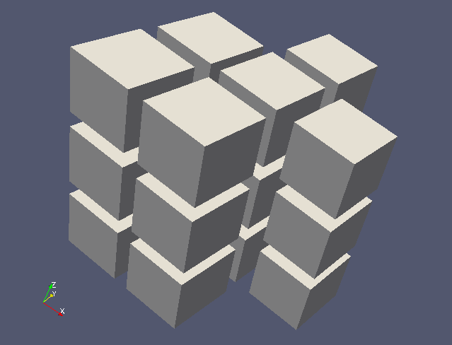
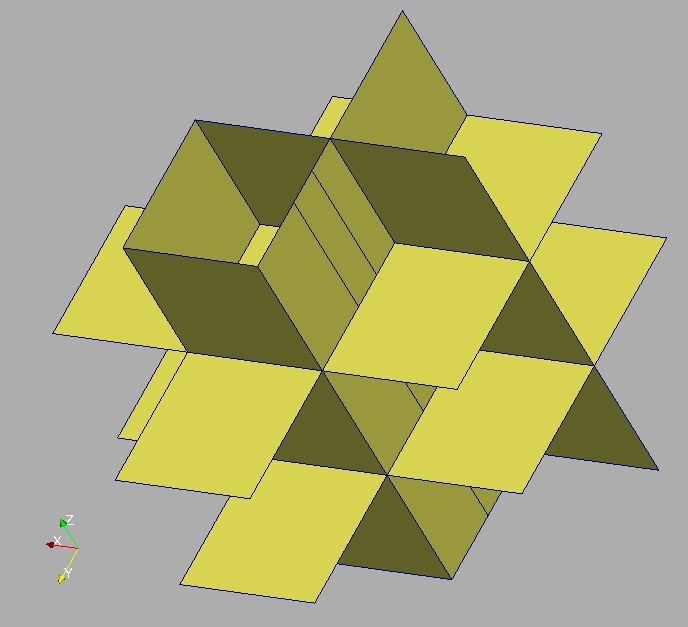

Playing with unstructured mesh
------------------------------

Unstructured meshes are the most used mesh type. MEDCouplingUMesh is the name of the class representing unstuctured meshes in MEDCoupling. MEDCouplingUMesh inherits from the MEDCouplingPointSet class that deals with all methods handling coordinates only.
MEDCouplingUMesh adds two more attributes :
* nodal connectivity
* nodal connectivity index

Objective
~~~~~~~~~

The aim here is to manipulate unstructured mesh instances to extract part of an unstructured mesh.
Several points will be covered in this exercise :

* coordinates modification of an unstructured mesh
* extraction of a slice
* build a part of a mesh given cell ids
* playing with data, index arrays

Implementation start
~~~~~~~~~~~~~~~~~~~~

Import the MEDCoupling Python module. ::

        from MEDCoupling import *

We now build a mesh containing artificially two types of cell (NORM_HEXA8 and NORM_POLYHED) to highlight the possibility to work with non-homogeneous cell types.
mesh3D is an extruded mesh containing 18 cells composed into 3 levels along Z of 6 cells.
Copy paste the following lines. ::

        coords=[0.,0.,0., 1.,1.,0., 1.,1.25,0., 1.,0.,0., 1.,1.5,0., 2.,0.,0., 2.,1.,0., 1.,2.,0., 0.,2.,0., 3.,1.,0.,
                3.,2.,0., 0.,1.,0., 1.,3.,0., 2.,2.,0., 2.,3.,0.,
                0.,0.,1., 1.,1.,1., 1.,1.25,1., 1.,0.,1., 1.,1.5,1., 2.,0.,1., 2.,1.,1., 1.,2.,1., 0.,2.,1., 3.,1.,1.,
                3.,2.,1., 0.,1.,1., 1.,3.,1., 2.,2.,1., 2.,3.,1.,
                0.,0.,2., 1.,1.,2., 1.,1.25,2., 1.,0.,2., 1.,1.5,2., 2.,0.,2., 2.,1.,2., 1.,2.,2., 0.,2.,2., 3.,1.,2.,
                3.,2.,2., 0.,1.,2., 1.,3.,2., 2.,2.,2., 2.,3.,2.,
                0.,0.,3., 1.,1.,3., 1.,1.25,3., 1.,0.,3., 1.,1.5,3., 2.,0.,3., 2.,1.,3., 1.,2.,3., 0.,2.,3., 3.,1.,3.,
                3.,2.,3., 0.,1.,3., 1.,3.,3., 2.,2.,3., 2.,3.,3.]
        conn=[0,11,1,3,15,26,16,18,   1,2,4,7,13,6,-1,1,16,21,6,-1,6,21,28,13,-1,13,7,22,28,-1,7,4,19,22,-1,4,2,17,19,-1,2,1,16,17,-1,16,21,28,22,19,17,
              1,6,5,3,16,21,20,18,   13,10,9,6,28,25,24,21, 11,8,7,4,2,1,-1,11,26,16,1,-1,1,16,17,2,-1,2,17,19,4,-1,4,19,22,7,-1,7,8,23,22,-1,8,11,26,23,-1,26,16,17,19,22,23,
              7,12,14,13,22,27,29,28,  15,26,16,18,30,41,31,33, 16,17,19,22,28,21,-1,16,31,36,21,-1,21,36,43,28,-1,28,22,37,43,-1,22,19,34,37,-1,19,17,32,34,-1,17,16,31,32,-1,31,36,43,37,34,32,
              16,21,20,18,31,36,35,33,   28,25,24,21,43,40,39,36, 26,23,22,19,17,16,-1,26,41,31,16,-1,16,31,32,17,-1,17,32,34,19,-1,19,34,37,22,-1,22,23,38,37,-1,23,26,41,38,-1,41,31,32,34,37,38,
              22,27,29,28,37,42,44,43, 30,41,31,33,45,56,46,48,  31,32,34,37,43,36,-1,31,46,51,36,-1,36,51,58,43,-1,43,37,52,58,-1,37,34,49,52,-1,34,32,47,49,-1,32,31,46,47,-1,46,51,58,52,49,47,
              31,36,35,33,46,51,50,48,  43,40,39,36,58,55,54,51, 41,38,37,34,32,31,-1,41,56,46,31,-1,31,46,47,32,-1,32,47,49,34,-1,34,49,52,37,-1,37,38,53,52,-1,38,41,56,53,-1,56,46,47,49,52,53,
              37,42,44,43,52,57,59,58]
        mesh3D=MEDCouplingUMesh.New("mesh3D",3)
        mesh3D.allocateCells(18)
        mesh3D.insertNextCell(NORM_HEXA8,conn[0:8]); mesh3D.insertNextCell(NORM_POLYHED,conn[8:51]); mesh3D.insertNextCell(NORM_HEXA8,conn[51:59]); mesh3D.insertNextCell(NORM_HEXA8,conn[59:67]); mesh3D.insertNextCell(NORM_POLYHED,conn[67:110]); mesh3D.insertNextCell(NORM_HEXA8,conn[110:118]);
        mesh3D.insertNextCell(NORM_HEXA8,conn[118:126]); mesh3D.insertNextCell(NORM_POLYHED,conn[126:169]); mesh3D.insertNextCell(NORM_HEXA8,conn[169:177]); mesh3D.insertNextCell(NORM_HEXA8,conn[177:185]); mesh3D.insertNextCell(NORM_POLYHED,conn[185:228]); mesh3D.insertNextCell(NORM_HEXA8,conn[228:236]);
        mesh3D.insertNextCell(NORM_HEXA8,conn[236:244]); mesh3D.insertNextCell(NORM_POLYHED,conn[244:287]); mesh3D.insertNextCell(NORM_HEXA8,conn[287:295]); mesh3D.insertNextCell(NORM_HEXA8,conn[295:303]); mesh3D.insertNextCell(NORM_POLYHED,conn[303:346]); mesh3D.insertNextCell(NORM_HEXA8,conn[346:354]);
        myCoords=DataArrayDouble.New(coords,60,3)
        myCoords.setInfoOnComponents(["X [m]","Y [m]","Z [m]"])
        mesh3D.setCoords(myCoords)
        mesh3D.orientCorrectlyPolyhedrons()
        mesh3D.sortCellsInMEDFileFrmt()
        mesh3D.checkConsistencyLight()
        renum=DataArrayInt.New(60) ; renum[:15]=range(15,30) ; renum[15:30]=range(15) ; renum[30:45]=range(45,60) ; renum[45:]=range(30,45)
        mesh3D.renumberNodes(renum,60)

Convert coordinate unit from meters to centimeters
~~~~~~~~~~~~~~~~~~~~~~~~~~~~~~~~~~~~~~~~~~~~~~~~~~

It might seem stupid, but this comes up regularly when coupling... ::

        mesh3D.getCoords()[:]*=100.
        mesh3D.getCoords().setInfoOnComponents(["X [cm]","Y [cm]","Z [cm]"])

.. note:: It is important to keep the DataArrayDouble instance up-to-date about the physical units to avoid ambiguity. The INTERP_KERNEL library includes a physical unit processor.

Find the different Z levels in mesh3D and sort in increasing order
~~~~~~~~~~~~~~~~~~~~~~~~~~~~~~~~~~~~~~~~~~~~~~~~~~~~~~~~~~~~~~~~~~

DataArrayDouble.getDifferentValues and DataArrayDouble.sort can help you! ::

        zLev=mesh3D.getCoords()[:,2]
        zLev=zLev.getDifferentValues(1e-12)
        zLev.sort()

Extract the 6 cells of the second row along Oz
~~~~~~~~~~~~~~~~~~~~~~~~~~~~~~~~~~~~~~~~~~~~~~

There are 3 possibilities to do that. We will see them from the simplest to the most complicated.

* Using buildSlice3D:

Simple method but a little costly. To do that simply define a plane having direction vector equal to [0.,0.,1.] and
going through point [0.,0.,(zLev[1]+zLev[2])/2]. This method retrieves 2 things : the slicemesh containing the result slicing mesh3D
and foreach 2D cell in slicemesh, the corresponding cell id into mesh3D. ::

        tmp,cellIdsSol1=mesh3D.buildSlice3D([0.,0.,(zLev[1]+zLev[2])/2],[0.,0.,1.],1e-12)

* Using Barycenter of cells of mesh3D :

Firstly, compute the barycenters of the 3D cells. Then select the 2nd component of the barycenter of the cells.
Finally select the tuple ids (corresponding to cell ids) falling in the range [zLev[1],zLev[2]]. ::

        bary=mesh3D.computeCellCenterOfMass()
        baryZ=bary[:,2]
        cellIdsSol2=baryZ.findIdsInRange(zLev[1],zLev[2])

* Using MEDCouplingMappedExtrudedMesh :

This is the safest method since it only uses the nodal connectivity to compute the extrusion. The coordinates are ignored.
Two things are needed to build a MEDCouplingMappedExtrudedMesh. The 3D mesh you expect to be an extruded mesh, and a 2D mesh
lying on the same coordinates, from which the extrusion will be computed.
Let's begin with the build of the 2D mesh. We build it from all the nodes on a plane going through point [0.,0.,zLev[0]] and with normal vector [0.,0.,1.] (MEDCouplingUMesh.findNodesOnPlane()).
Then invoke MEDCouplingUMesh.buildFacePartOfMySelfNode to build mesh2D (read the documentation of buildFacePartOfMySelfNode()). ::

        nodeIds=mesh3D.findNodesOnPlane([0.,0.,zLev[0]],[0.,0.,1.],1e-10)
        mesh2D=mesh3D.buildFacePartOfMySelfNode(nodeIds,True)

Then it is possible to compute an extrusion from mesh3D and mesh2D. ::

        extMesh=MEDCouplingMappedExtrudedMesh.New(mesh3D,mesh2D,0)

Then simply request the 2nd row. ::

        cellIdsSol3=extMesh.getMesh3DIds()[mesh2D.getNumberOfCells():2*mesh2D.getNumberOfCells()]

It is now possible to check that the 3 solutions are the same : ::

        for i in xrange(3):
          exec("print cellIdsSol%s.getValues()"%(i+1))

Extract a sub-part of mesh3D
~~~~~~~~~~~~~~~~~~~~~~~~~~~~
Use the previously retrieved cell ids in cellIdsSol2 to compute a sub-part of mesh3D. ::

        mesh3DPart=mesh3D[cellIdsSol2] # equivalent to mesh3DPart=mesh3D.buildPartOfMySelf(cellIdsSol2,True)

.. note:: The geometrical type doesn't play any role here. "mesh3DPart" now contains len(cellIdsSol2) cells. The cell #0 in "mesh3DPart" corresponds to the cell #cellIdsSol2[0] in "mesh3D" and so on ... "cellIdsSol2" can thus be seen as an array "new-to-old".

At this point, "mesh3DPart" lies on the same coordinates, so mesh3DPart has 60 nodes whereas only 30 are necessary. To zip the orphan nodes in "mesh3DPart", simply invoke zipCoords(): ::

        mesh3DPart.zipCoords()

At this point mesh3DPart only contains 30 nodes and 6 cells. To prepare to MED file I/O we have to check if mesh3DPart is ready to be written safely into a MED file (i.e. if the cells are indeed ordered by type). ::

        print mesh3DPart.checkConsecutiveCellTypesAndOrder([NORM_HEXA8,NORM_POLYHED])

Or: ::

        print mesh3DPart.checkConsecutiveCellTypes()

You can also print the content of the mesh "mesh3Dpart": ::

        print mesh3DPart.advancedRepr()

We see that mesh3DPart contains 6 cells, 4 HEXA8 then 2 POLYHED. Everything's OK: the cells are grouped by geometrical type.

Extract the 3 cells in mesh3D whose barycenters are along the line (pt=[250.,150.,0.],v=[0.,0.,1.])
~~~~~~~~~~~~~~~~~~~~~~~~~~~~~~~~~~~~~~~~~~~~~~~~~~~~~~~~~~~~~~~~~~~~~~~~~~~~~~~~~~~~~~~~~~~~~~~~~~~

There are 2 solutions to do that.

* using the barycenters of mesh3D again: same principle than above. ::

        baryXY=bary[:,[0,1]]
        baryXY-=[250.,150.]
        magn=baryXY.magnitude()
        cellIds2Sol1=magn.findIdsInRange(0.,1e-12)

* using extrusion extMesh: starting from the unique cell in mesh2D whose center is at [250.,150.,0.] MEDCouplingMappedExtrudedMesh.getMesh3DIds retrieves the cell IDs sorted by slice. ::

        bary2=mesh2D.computeCellCenterOfMass()[:,[0,1]]
        bary2-=[250.,150.]
        magn=bary2.magnitude()
        ids=magn.findIdsInRange(0.,1e-12)
        idStart=int(ids) # ids is assumed to contain only one value, if not an exception is thrown
        cellIds2Sol2=extMesh.getMesh3DIds()[range(idStart,mesh3D.getNumberOfCells(),mesh2D.getNumberOfCells())]

Now, build the sub-part of mesh3D using cell IDs in cellIds2Sol1. ::

        mesh3DSlice2=mesh3D[cellIds2Sol1]
        mesh3DSlice2.zipCoords()

Duplicate "mesh3DSlice2" and translate it
~~~~~~~~~~~~~~~~~~~~~~~~~~~~~~~~~~~~~~~~~

This part of the exercise shows how to perform copy and aggregation. This can be useful to build complex meshes, or to get in a single object several mesh parts coming from several processors.

Perform a deep copy of mesh3DSlice2. On this copy perform a translation v=[0.,1000.,0.].
Then aggregate mesh3DSlice2 with its translated copy, using MEDCouplingUMesh.MergeUMeshes. ::

        mesh3DSlice2bis=mesh3DSlice2.deepCopy()
        mesh3DSlice2bis.translate([0.,1000.,0.])
        mesh3DSlice2All=MEDCouplingUMesh.MergeUMeshes([mesh3DSlice2,mesh3DSlice2bis])

.. note:: My apologies for the name of the method MEDCouplingUMesh.MergeUMeshes. In future version it will be called AggregateUMeshes. For information, to merge two (or more) unstructured meshes, one has to invoke MergeUMeshes(), then mergeNodes() on the result, and finally zipConnectivity().

Descending connectivity
~~~~~~~~~~~~~~~~~~~~~~~

The aim here is to retrieve the internal faces of mesh3D.
To this purpose, we build the "descending" mesh from "mesh3D" ("mesh3Dsurf"), i.e. the mesh with mesh dimension (mesh3D.getMeshDimension()-1) made of the faces of each cell in "mesh3D".
The method MEDCoupling.buildDescendingConnectivity builds this mesh and also returns the correspondences "mesh3D" <-> "mesh3DSurf".

A face from "mesh3DSurf" is said to be internal if and only if it is shared by more than one 3D cell in "mesh3D" (see reverse descending connectivity (out parameter 3 et 4)). ::

        mesh3DSurf,desc,descIndx,revDesc,revDescIndx=mesh3D.buildDescendingConnectivity()
        numberOf3DCellSharing=revDescIndx.deltaShiftIndex()
        cellIds=numberOf3DCellSharing.findIdsNotEqual(1)
        mesh3DSurfInside=mesh3DSurf[cellIds]
        mesh3DSurfInside.writeVTK("mesh3DSurfInside.vtu")

Solution
~~~~~~~~

:ref:`python_testMEDCouplingumesh1_solution`
