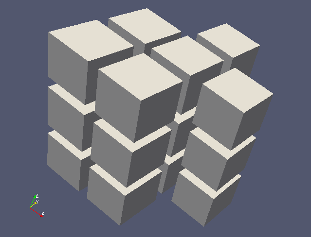
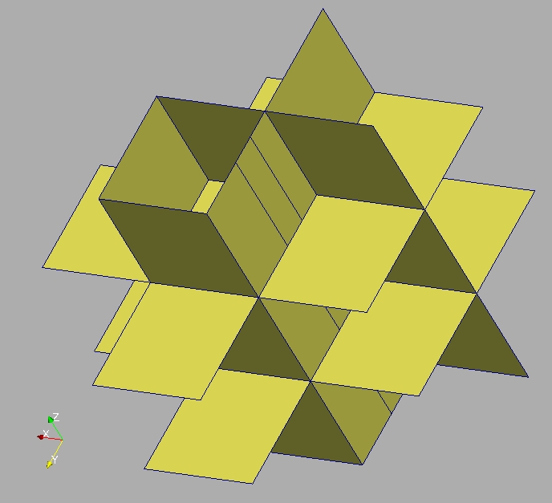

Manipuler les maillages non structurés
--------------------------------------

Les meshes non-structurées sont le type de maillage le plus utilisé. ``MEDCouplingUMesh`` est le nom de la classe en charge
de représenter ces maillages dans MEDCoupling. ``MEDCouplingUMesh`` hérite de la classe ``MEDCouplingPointSet``.
``MEDCouplingPointSet`` gère toutes les méthodes relatives au coordonnées. ``MEDCouplingUMesh`` a deux attributs en plus de 
ceux de ``MEDCouplingPointSet`` permettant de décrire la liste des noeuds contribuants à une cellule (i.e. la *connectivité*).

Objectifs
~~~~~~~~~

Le but ici est de manipuler des maillages non structurés (en extraire une partie, etc...).
Plusieurs points seront traités dans cet exercice :

* modification des coordonnées d'un maillage
* extraction d'une coupe d'un maillage
* extraire une partie de maillage à partir d'identifiants de cellules
* manipuler les indices, etc ...
* manipulation de la connectivité descendante

Début de l'implémentation
~~~~~~~~~~~~~~~~~~~~~~~~~

Importer le module Python ``MEDCoupling``. ::

	import MEDCoupling as mc

Construire un maillage. Ce maillage ``mesh3D`` contient artificiellement 2 types de cellules (``mc.NORM_HEXA8`` et ``mc.NORM_POLYHED``)
pour appréhender le mélange de types geometriques.
``mesh3D`` est un *maillage extrudé* contenant 18 cellules composées de 3 niveaux selon Z, chaque niveau ayant 6 cellules.
Faire un bon gros copier-coller des lignes suivantes pour construire la mesh (l'intérêt de l'exercise vient après) : ::

	coords=[0.,0.,0., 1.,1.,0., 1.,1.25,0., 1.,0.,0., 1.,1.5,0., 2.,0.,0., 2.,1.,0., 1.,2.,0., 0.,2.,0., 3.,1.,0.,
                3.,2.,0., 0.,1.,0., 1.,3.,0., 2.,2.,0., 2.,3.,0.,
                0.,0.,1., 1.,1.,1., 1.,1.25,1., 1.,0.,1., 1.,1.5,1., 2.,0.,1., 2.,1.,1., 1.,2.,1., 0.,2.,1., 3.,1.,1.,
                3.,2.,1., 0.,1.,1., 1.,3.,1., 2.,2.,1., 2.,3.,1.,
                0.,0.,2., 1.,1.,2., 1.,1.25,2., 1.,0.,2., 1.,1.5,2., 2.,0.,2., 2.,1.,2., 1.,2.,2., 0.,2.,2., 3.,1.,2.,
                3.,2.,2., 0.,1.,2., 1.,3.,2., 2.,2.,2., 2.,3.,2.,
                0.,0.,3., 1.,1.,3., 1.,1.25,3., 1.,0.,3., 1.,1.5,3., 2.,0.,3., 2.,1.,3., 1.,2.,3., 0.,2.,3., 3.,1.,3.,
                3.,2.,3., 0.,1.,3., 1.,3.,3., 2.,2.,3., 2.,3.,3.]
	conn=[0,11,1,3,15,26,16,18,   1,2,4,7,13,6,-1,1,16,21,6,-1,6,21,28,13,-1,13,7,22,28,-1,7,4,19,22,-1,4,2,17,19,-1,2,1,16,17,-1,16,21,28,22,19,17,
              1,6,5,3,16,21,20,18,   13,10,9,6,28,25,24,21, 11,8,7,4,2,1,-1,11,26,16,1,-1,1,16,17,2,-1,2,17,19,4,-1,4,19,22,7,-1,7,8,23,22,-1,8,11,26,23,-1,26,16,17,19,22,23,
              7,12,14,13,22,27,29,28,  15,26,16,18,30,41,31,33, 16,17,19,22,28,21,-1,16,31,36,21,-1,21,36,43,28,-1,28,22,37,43,-1,22,19,34,37,-1,19,17,32,34,-1,17,16,31,32,-1,31,36,43,37,34,32,
              16,21,20,18,31,36,35,33,   28,25,24,21,43,40,39,36, 26,23,22,19,17,16,-1,26,41,31,16,-1,16,31,32,17,-1,17,32,34,19,-1,19,34,37,22,-1,22,23,38,37,-1,23,26,41,38,-1,41,31,32,34,37,38,
              22,27,29,28,37,42,44,43, 30,41,31,33,45,56,46,48,  31,32,34,37,43,36,-1,31,46,51,36,-1,36,51,58,43,-1,43,37,52,58,-1,37,34,49,52,-1,34,32,47,49,-1,32,31,46,47,-1,46,51,58,52,49,47,
              31,36,35,33,46,51,50,48,  43,40,39,36,58,55,54,51, 41,38,37,34,32,31,-1,41,56,46,31,-1,31,46,47,32,-1,32,47,49,34,-1,34,49,52,37,-1,37,38,53,52,-1,38,41,56,53,-1,56,46,47,49,52,53,
              37,42,44,43,52,57,59,58]
	mesh3D = mc.MEDCouplingUMesh("mesh3D",3)
	mesh3D.allocateCells(18)
	mesh3D.insertNextCell(mc.NORM_HEXA8,conn[0:8]); mesh3D.insertNextCell(mc.NORM_POLYHED,conn[8:51]); mesh3D.insertNextCell(mc.NORM_HEXA8,conn[51:59]); mesh3D.insertNextCell(mc.NORM_HEXA8,conn[59:67]); mesh3D.insertNextCell(mc.NORM_POLYHED,conn[67:110]); mesh3D.insertNextCell(mc.NORM_HEXA8,conn[110:118]);
	mesh3D.insertNextCell(mc.NORM_HEXA8,conn[118:126]); mesh3D.insertNextCell(mc.NORM_POLYHED,conn[126:169]); mesh3D.insertNextCell(mc.NORM_HEXA8,conn[169:177]); mesh3D.insertNextCell(mc.NORM_HEXA8,conn[177:185]); mesh3D.insertNextCell(mc.NORM_POLYHED,conn[185:228]); mesh3D.insertNextCell(mc.NORM_HEXA8,conn[228:236]);
	mesh3D.insertNextCell(mc.NORM_HEXA8,conn[236:244]); mesh3D.insertNextCell(mc.NORM_POLYHED,conn[244:287]); mesh3D.insertNextCell(mc.NORM_HEXA8,conn[287:295]); mesh3D.insertNextCell(mc.NORM_HEXA8,conn[295:303]); mesh3D.insertNextCell(mc.NORM_POLYHED,conn[303:346]); mesh3D.insertNextCell(mc.NORM_HEXA8,conn[346:354]);
	myCoords = mc.DataArrayDouble(coords,60,3)
	myCoords.setInfoOnComponents(["X [m]","Y [m]","Z [m]"])
	mesh3D.setCoords(myCoords)
	mesh3D.orientCorrectlyPolyhedrons()
	mesh3D.sortCellsInMEDFileFrmt()
	mesh3D.checkConsistencyLight()
	renum = mc.DataArrayInt(60); renum[:15]=range(15,30) ; renum[15:30]=range(15) ; renum[30:45]=range(45,60) ; renum[45:]=range(30,45)
	mesh3D.renumberNodes(renum,60)
	
Convertir les unités
~~~~~~~~~~~~~~~~~~~~

On convertit ici les coordonnées de mètres en centimètres.
Cela paraît idiot mais c'est un très grand classique du couplage ... ::

	mesh3D.getCoords()[:] *= 100.
	mesh3D.getCoords().setInfoOnComponents(["X [cm]","Y [cm]","Z [cm]"])

.. note:: Il est important de mettre à jour les informations sur les composantes des coordonnées (les unités) pour éviter toute ambiguïté. 
	INTERP_KERNEL library inclut un évaluateur d'unité.
	
.. note:: Noter l'astuce sur la première ligne ``[:]`` afin de récupérer la version inscriptible des coordonnées 
	(et non une copie temporaire) 

Trouver les différents niveaux
~~~~~~~~~~~~~~~~~~~~~~~~~~~~~~

Le maillage est extrudé, il est donc très régulier, et aligné sur les axes Ox, Oy et Oz (cf figure). 
On veut connaître quelles 
sont les côtes Z des différentes couches de cubes.
Extraire les différents niveaux en Z dans ``mesh3D``, rangés de manière croissante.
Utiliser la méthode ``DataArrayDouble.getDifferentValues()`` and ``DataArrayDouble.sort()``. ::

	zLev = mesh3D.getCoords()[:,2]
	zLev = zLev.getDifferentValues(1e-12)
	zLev.sort()     # In-place sort

Extraire des identifiants de cellules
~~~~~~~~~~~~~~~~~~~~~~~~~~~~~~~~~~~~~

Extraire les 6 identifiants des cellules de la seconde rangée suivant Oz. 
Il y a 3 possibilités pour faire cela. Nous allons les voir du plus simple au plus complexe.

* En utilisant ``buildSlice3D()`` :
	Méthode très simple mais gourmande en CPU. Pour trouver la solution il suffit de définir un plan dont le vecteur normal est ``[0.,0.,1.]``
	et passant par le point ``[0., 0., (zLev[1]+zLev[2])/2]``. 
	La méthode retourne deux choses : le maillage de coupe ``tmp`` (un maillage de mesh-dimension 2, mais de dimension spatiale
	3) et pour chaque cellule 3D surfacique de ``tmp``, l'identifiant de la cellule 3D (=un volume) coupée dans le
	maillage de départ  ::
	
		tmp, cellIdsSol1 = mesh3D.buildSlice3D([0.,0.,(zLev[1]+zLev[2])/2], [0.,0.,1.], 1e-12)

* En utilisant les barycentres des cellules de ``mesh3D`` : 
	L'utilisation des barycentres est une technique classique pour identifier un ensemble de cellules répondant à certains
	critères géométriques.
	Il s'agit d'abord de calculer les barycentres des cellules 3D de ``mesh3D`` (méthode 
	``MEDCouplingUMesh.computeCellCenterOfMass()``).
	(*Note*: le nom -- un peu trop long -- de cette méthode hérite du passé. Le "AndOwner" indique le fait qu'en C++
	l'appelant est responsable de la désallocation de l'objet retourné : il prend l'*ownership* du résultat). 
	
	Ensuite sélectionner la composante #2 des barycentres des cellules et mettre le résultat dans ``baryZ``.
	Ensuite il suffit de selectionner dans ``baryZ`` les tuples qui sont dans l'intervalle ``[zLev[1], zLev[2]]``. 
	Les identifiants de ces tuples (i.e. leur index dans ``baryZ``) est directement un identifiant de cellule
	car ``computeCellCenterOfMass()`` retourne un tableau indéxé par les numéros de cellule.::
	
		bary = mesh3D.computeCellCenterOfMass()
		baryZ = bary[:,2]
		cellIdsSol2 = baryZ.findIdsInRange(zLev[1], zLev[2])

* En utilisant ``MEDCouplingMappedExtrudedMesh`` :
	C'est la méthode exclusivement basée sur la connectivité nodale pour déduire l'extrusion. Les coordonnées sont ici ignorées.
	Pour construire un ``MEDCouplingMappedExtrudedMesh`` deux objets sont requis. Le maillage non-structuré 3D  
	représentant en fait un maillage *extrudé*, et un maillage non structuré 3D surfacique (mesh-dim 2) 
	reposant sur les mêmes coordonnéees, à partir duquel l'extrusion sera calculée.
	Commencer par construire le maillage 3D surfacique. Pour ce faire il suffit de repérer les noeuds appartenant 
	à 1e-10 près de plan de vecteur normal ``[0.,0.,1.]`` et passant
	par ``[0.,0.,zLev[0]]`` (``MEDCouplingUMesh.findNodesOnPlane()``). Ensuite appeler ``MEDCouplingUMesh.buildFacePartOfMySelfNode()`` 
	pour construire ``mesh2D`` (lire la doc de la fonction). ::
	
		nodeIds = mesh3D.findNodesOnPlane([0., 0., zLev[0]], [0.,0.,1.], 1e-10)
		mesh2D = mesh3D.buildFacePartOfMySelfNode(nodeIds, True)
		

	Il est alors possible de construire un maillage extrudé ``extMesh`` à partir de ``mesh3D`` et de ``mesh2D``. 
	Un maillage extrudé se construit en *reconnaissant* un maillage non structuré comme étant l'extrusion d'un maillage
	de dimension ``n-1`` (avec ``n`` la dimension initiale de ``mesh3D``, ici 3). Si cela n'est pas le cas, la construction
	plante. Le maillage 2D est forcément en haut ou en bas du 3D volumique, et le dernier entier spécifie la cellule à partir
	de laquelle le fil de fer 1D guidant l'extrusion sera construit : ::
	
		extMesh = mc.MEDCouplingMappedExtrudedMesh(mesh3D, mesh2D, 0)
	
	On a alors la garantie que, dans ``extMesh``,  les cellules sont ordonnées par niveau Z croissant. 
	Il suffit de récupérer le 2ème niveau (``MEDCouplingMappedExtrudedMesh.getMesh3DIds()``). ::
	
		n_cells = mesh2D.getNumberOfCells()
		cellIdsSol3 = extMesh.getMesh3DIds()[n_cells:2*n_cells]

On vérifie alors que les 3 solutions sont les mêmes : ::

	print cellIdsSol1.getValues()
	print cellIdsSol2.getValues()
	print cellIdsSol3.getValues()

Extraire une sous partie d'un maillage 3D
~~~~~~~~~~~~~~~~~~~~~~~~~~~~~~~~~~~~~~~~~

Utiliser les identifiants de cellules ``cellIdsSol2`` obtenus précédemment pour extraire une sous-partie de ``mesh3D``,
c'est-à-dire un maillage avec un sous-ensemble des cellules de ``mesh3D``. ::

	mesh3DPart = mesh3D[cellIdsSol2] 
	
.. note:: En C++ la méthode sous-jacente invoquée (et par ailleurs aussi disponible en Python) s'appelle    
	``mesh3DPart = mesh3D.buildPartOfMySelf(cellIdsSol2,True)``

.. note:: Le type géométrique ne rentre pas du tout en compte ici. L'instruction précédente prend les cellules
	dans l'ordre où elles sont disponibles dans le maillage initial. 

L'objet ``mesh3DPart`` contient ``len(cellIdsSol2)`` cellules désormais. La cellule #0 de ``mesh3DPart`` correspond à la cellule avec l'identifiant ``cellIdsSol2[0]`` de ``mesh3D``, et ainsi de suite. Ainsi ``cellIdsSol2`` peut être vu comme un 
tableau new-2-old.

A ce point, ``mesh3DPart`` repose sur une copie du tableau de coordonnées de ``mesh3D``, c'est-à-dire  60 nodes. 
Seuls 30 sont effectivement utilisés.
Pour retirer les noeuds orphelins de ``mesh3DPart`` invoquer simplement ``MEDCouplingUMesh.zipCoords()``. ::

	mesh3DPart.zipCoords()

Maintenant, ``mesh3DPart`` repose sur 30 nodes et possède 6 cellules. Pour être prêt aux I/O MED-fichier, il est 
alors important de voir si ``mesh3DPart`` est bien ordonné, c'est-à-dire si ses cellules sont bien rangées par type géométrique.
On commence par inspecter l'état actuel : ::

	print mesh3DPart.advancedRepr()
	
La fonction suivante fait le même travail : ::

	print mesh3DPart.checkConsecutiveCellTypesAndOrder([mc.NORM_HEXA8, mc.NORM_POLYHED])

Ou bien : ::

	print mesh3DPart.checkConsecutiveCellTypes()

On voit que ``mesh3DPart`` contient 6 cellules, quatre HEXA8 puis deux POLYHED. Les cellules sont bien 
groupées par type géométrique. Si ce n'était pas le cas, on aurait pu invoquer ``MEDCouplingUMesh.sortCellsInMEDFileFrmt()``.

Extraire des cellules alignées sur une ligne 3D
~~~~~~~~~~~~~~~~~~~~~~~~~~~~~~~~~~~~~~~~~~~~~~~

On souhaite extraire de ``mesh3D`` les 3 cellules dont les barycentres sont le long de la ligne portée par
``v = [0.,0.,1.]`` et passant par ``pt = [250.,150.,0.]``.
Il y a deux solutions.

* les barycentres de ``mesh3D``  : même principe qu'au-dessus. ::

	baryXY = bary[:,[0,1]]
	baryXY -= [250.,150.]
	magn = baryXY.magnitude()
	cellIds2Sol1 = magn.findIdsInRange(0.,1e-12)
	
* utiliser le maillage extrudé ``extMesh`` : partant de l'unique cellule dans ``mesh2D`` dont le centre est 
  en ``[250.,150.,0.]``, la méthdode ``MEDCouplingMappedExtrudedMesh.getMesh3DIds()`` retourne les identifiants de 
  cellules rangée par rangée. ::

	bary2 = mesh2D.computeCellCenterOfMass()[:,[0,1]]
	bary2 -= [250.,150.]
	magn = bary2.magnitude()
	ids = magn.findIdsInRange(0.,1e-12)
	idStart = int(ids) # ids is assumed to contain only one value, if not an exception is thrown
	ze_range = range(idStart,mesh3D.getNumberOfCells(),mesh2D.getNumberOfCells())
	cellIds2Sol2 = extMesh.getMesh3DIds()[ze_range]

Maintenant on construit cette sous partie de ``mesh3D`` en utilisant ``cellIds2Sol1`` ou ``cellIds2Sol2``: ::

	mesh3DSlice2 = mesh3D[cellIds2Sol1]
	mesh3DSlice2.zipCoords()

Duplication, translation et aggrégation de maillages
~~~~~~~~~~~~~~~~~~~~~~~~~~~~~~~~~~~~~~~~~~~~~~~~~~~~

Cette partie de l'exercice est intéressante pour construire des maillages complexes, ou pour aggréger des parties 
de maillages venant de différents processeurs.

On cherche ici à dupliquer ``mesh3DSlice2``, le translater et l'aggréger avec l'original.

Effectuer une copie complète de ``mesh3DSlice2`` (aussi appelée *deep copy*) sous le nom ``mesh3DSlice2bis``. 
Sur cette copie effectuer une translation de ``v=[0.,1000.,0.]``.
Puis aggréger ``mesh3DSlice2`` avec sa copie translatée ``mesh3DSlice2bis``, en utilisant ``MEDCouplingUMesh.MergeUMeshes()``. ::

	mesh3DSlice2bis = mesh3DSlice2.deepCopy()
	mesh3DSlice2bis.translate([0.,1000.,0.])
	mesh3DSlice2All = mc.MEDCouplingUMesh.MergeUMeshes([mesh3DSlice2,mesh3DSlice2bis])
	mesh3DSlice2All.writeVTK("mesh3DSlice2All.vtu")

.. note:: Pour information pour merger deux (ou plus) maillages non structurés, il faut invoquer ``MEDCouplingUMesh.MergeUMeshes()``
	puis ``MEDCouplingUMesh.mergeNodes()`` sur le résultat, et enfin ``MEDCouplingUMesh.zipConnectivity()``.

.. _exo-umesh-desc-connec:

Connectivité descendante
~~~~~~~~~~~~~~~~~~~~~~~~

Le but ici est de présenter la notion de *connectivité descendante* (*descending connectivity*).

La connectivité descendante représente les éléments de dimension ``n-1`` 
constituant chacune des cellules de dimension ``n`` (avec donc ``n`` la dimension du maillage, *mesh-dim*). Par exemple, pour un
maillage de dimension 3 (les cellules sont des *volumes* 3D), cela donne l'ensemble des faces (des *surfaces* 2D) bordant
ces volumes.  

A titre d'exemple, on se propose dans notre cas de récupérer les faces *internes* du maillage ``mesh3D``.
Pour cela il est nécessaire de construire le maillage 
descendant de ``mesh3D`` (stocké dans ``mesh3DSurf``) c'est-à-dire 
le maillage de mesh-dimension 2 (soit ``mesh3D.getMeshDimension()-1``) constitué
des *faces* bordant chacune des cellules (ici des *volumes* 3D) de ``mesh3D``.
La méthode ``MEDCoupling.buildDescendingConnectivity()`` calcule ce maillage, et retourne en même temps des tableaux 
de correspondance. Ces tableaux font le lien entre les identifiants des cellules de ``mesh3D`` 
vers les identifiants de cellules de ``mesh3DSurf``, et vice-et-versa.

Une face de ``mesh3DSurf`` est dite interne, si et seulement si, elle est partagée par plus d'une cellule 3D de ``mesh3D``. 
Les 3ème et 4ème paramètres de sortie de la fonction donnent le lien 
entre une face et ses cellules *parentes* (i.e. le ou les volumes qu'elle délimite). 
Ce lien est exprimé au format *indirect index* vu dans le premier exercice :ref:`indirect-index-exo`. ::

	mesh3DSurf, desc, descIndx, revDesc, revDescIndx = mesh3D.buildDescendingConnectivity()
	numberOf3DCellSharing = revDescIndx.deltaShiftIndex()
	cellIds = numberOf3DCellSharing.findIdsNotEqual(1)
	mesh3DSurfInside = mesh3DSurf[cellIds]
	mesh3DSurfInside.writeVTK("mesh3DSurfInside.vtu")
	
Ce genre de manipulation est très utile pour accéder au voisinage d'une ou plusieurs cellules d'un maillage non-structuré. 
 

Solution
~~~~~~~~

:ref:`python_testMEDCouplingumesh1_solution`
