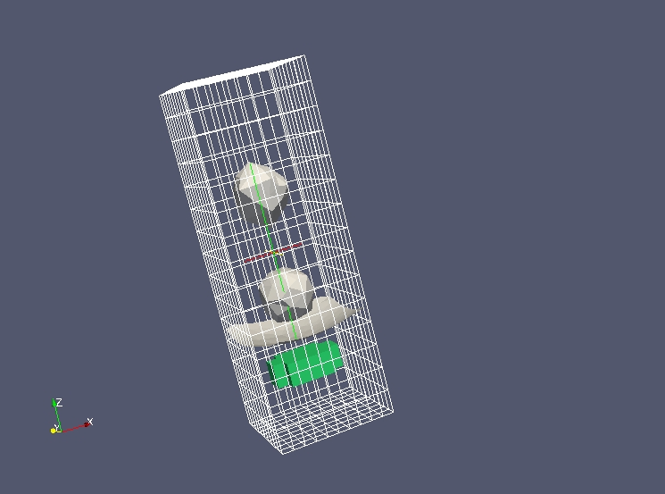

Full example 1 - Agitator
-------------------------

The MED file :download:`agitateur.med <data/agitateur.med>` is used and has the following content:ant :

This is the result of a simple 2-phase computation.
The agitator in green (represented by a cell field) turn on itself from one time-step 
to the other.
The purpose of the exercise is to compute the torque applied on this piece.agitateur.

Objective
~~~~~~~~~

The aim of this exercise is to give a full example of non-trivial post-treatment
from a MED file.

Implementation start
~~~~~~~~~~~~~~~~~~~~

Import the whole Python module MEDLoader (which includes MEDCoupling).
Also import NumPy and acos() from the math module. ::

	from MEDLoader import *
	from numpy import *
	from math import acos

Mesh and field extraction using advanced API
~~~~~~~~~~~~~~~~~~~~~~~~~~~~~~~~~~~~~~~~~~~~

Using the advanced API read the whole file "agitateur.med" and display all time-steps of
the first field. ::

	data=MEDFileData("agitateur.med")
	ts=data.getFields()[0].getTimeSteps()
	print ts

Get the agitator's mesh (in green) at the time-step (2,-1) (see ts).
To this end use the cell field "DISTANCE_INTERFACE_ELEM_BODY_ELEM_DOM" and select
only the field part having a value within [0.0, 1.0] (variable "ids"). ::

	fMts=data.getFields()["DISTANCE_INTERFACE_ELEM_BODY_ELEM_DOM"]
	f1ts=fMts[(2,-1)]
	fMc=f1ts.getFieldAtLevel(ON_CELLS,0)
	arr=fMc.getArray()
	arr.getMinMaxPerComponent() # just to see the variation range of the field per component
	ids=arr.findIdsInRange(0.,1.)
	f2Mc=fMc[ids]

Using the field "PRESSION_ELEM_DOM" find the 3D pression field applied on the agitator. 
Store the result in pressOnAgitateur. ::

	pressMts=data.getFields()["PRESSION_ELEM_DOM"]
	press1ts=pressMts[(2,-1)]
	pressMc=press1ts.getFieldAtLevel(ON_CELLS,0)
	pressOnAgitateurMc=pressMc[ids]

Delete unused nodes in pressOnAgitateurMc.getMesh(). ::

	pressOnAgitateurMc.getMesh().zipCoords()

Create a 3D surface field from the 3D cell field
~~~~~~~~~~~~~~~~~~~~~~~~~~~~~~~~~~~~~~~~~~~~~~~~

Deduce the 3D field on the skin of the agitator.
To achieve this use the constituting mesh MEDCouplingUMesh.buildDescendingConnectivity().
:::::::::::::::::::::::::::::::::::::::::::::::::::::::::::::::::::::::::::::::::::::::::

	agitateurMesh3DMc=pressOnAgitateurMc.getMesh()
	m3DSurf,desc,descI,revDesc,revDescI=agitateurMesh3DMc.buildDescendingConnectivity()
	nbOf3DCellSharing=revDescI.deltaShiftIndex()
	ids2=nbOf3DCellSharing.findIdsEqual(1)
	agitateurSkinMc=m3DSurf[ids2]
	OffsetsOfTupleIdsInField=revDescI[ids2]
	tupleIdsInField=revDesc[OffsetsOfTupleIdsInField]
	pressOnSkinAgitateurMc=pressOnAgitateurMc[tupleIdsInField]
	pressOnSkinAgitateurMc.setMesh(agitateurSkinMc)

Manipulate fields
~~~~~~~~~~~~~~~~~

Compute the force vector field on the agitator's skin by multiplying at each cell
the pressure by the surface, and then the normal vector.
Pression is expressed in bar, convert it first to Pa. ::

	pressSkin=pressOnSkinAgitateurMc.getArray()
	pressSkin*=1e5
	areaSkin=agitateurSkinMc.getMeasureField(True).getArray()
	forceSkin=pressSkin*areaSkin
	normalSkin=agitateurSkinMc.buildOrthogonalField().getArray()
	forceVectSkin=forceSkin*normalSkin

First computation of the torque at the center of mass of the agitator:

Let's compute first the position of the center of mass.
Compute the polyhedron representing the 3D mesh hull of the agitator "agitateurMesh3DMc"
(use MEDCouplingUMesh.buildSpreadZonesWithPoly()). ::

	singlePolyhedron=agitateurMesh3DMc.buildSpreadZonesWithPoly()
	singlePolyhedron.orientCorrectlyPolyhedrons()
	centerOfMass=singlePolyhedron.computeCellCenterOfMass()

.. note:: The call to MEDCouplingUMesh.orientCorrectlyPolyhedrons() is not mandatory
	but is recommended: if the polyhedron happens to be mis-oriented, its center of mass will
	be incorrect!

Compute for each skin cell  the torque with respect to the center of mass "centerOfMass".
To this end compute "posSkin", a DataArrayDouble giving for each skin cell the vector
centerOfMass -> G, where G represents the center of mass of the current cell. ::

	barySkin=agitateurSkinMc.computeCellCenterOfMass()
	posSkin=barySkin-centerOfMass

Compute the cross product for each cell of "posSkin" using "forceVectSkin"
(method DataArrayDouble.CrossProduct()). ::

	torquePerCellOnSkin=DataArrayDouble.CrossProduct(posSkin,forceVectSkin)

Sum "torqueOnSkin" using DataArrayDouble.accumulate(). ::

       zeTorque=torquePerCellOnSkin.accumulate()
       print "couple = %r N.m"%(zeTorque[2])

Check the previously computed torque by dividing the power by the angular speed.
Compute the power per skin cell and sum it. ::

       speedMts=data.getFields()["VITESSE_ELEM_DOM"]
       speed1ts=speedMts[(2,-1)]
       speedMc=speed1ts.getFieldAtLevel(ON_CELLS,0)
       speedOnSkin=speedMc.getArray()[tupleIdsInField]
       powerSkin=DataArrayDouble.Dot(forceVectSkin,speedOnSkin)
       power=powerSkin.accumulate()[0]
       print "power = %r W"%(power)

Compute the angular speed: compute the sum of x^2, y^2 and xz of "posSkin" and build
with NumPy the 2x2 matrix 
inertiaSkin=[[x2,xy], [xy,z2]]
Retrieve the eigen vector associated to the maximal eigen value with linalg.eig(inertiaSkin). ::

       x2=posSkin[:,0]*posSkin[:,0] ; x2=x2.accumulate()[0]
       y2=posSkin[:,1]*posSkin[:,1] ; y2=y2.accumulate()[0]
       xy=posSkin[:,0]*posSkin[:,1] ; xy=xy.accumulate()[0]
       inertiaSkin=matrix([[x2,xy],[xy,y2]])
       inertiaSkinValues,inertiaSkinVects=linalg.eig(inertiaSkin)
       pos=max(enumerate(inertiaSkinValues),key=lambda x: x[1])[0]
       vect0=inertiaSkinVects[pos].tolist()[0]
       print vect0

Thanks to the previous computation we can see that the agitator had a rotation of 
1.1183827931 radian (see solution).
Compute and compare the torque on the agitator. ::

       omega=1.1183827931/(ts[-1][2]-ts[0][2])
       print "At time-step (%d,%d) at %r s the torque is: %r N.m, power/omega=%r N.m"%(ts[2][0],ts[2][1],ts[2][2],zeTorque[2],power/omega)

Solution
~~~~~~~~

:ref:`python_testmedcouplingloaderex1_solution`
