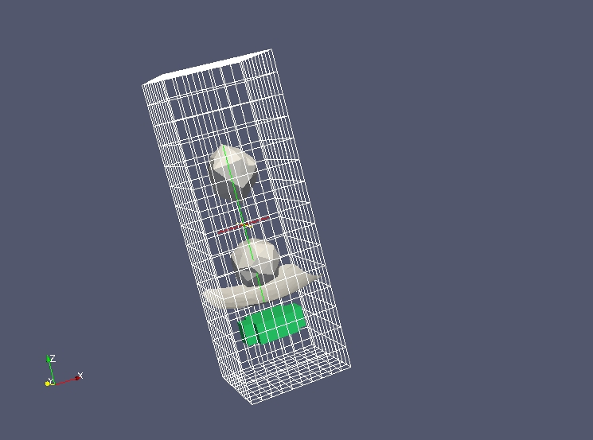

MEDCoupling / MEDLoader - Exemple complet 1 - Agitateur
-------------------------------------------------------

Nous partons ici d'un fichier :download:`agitateur.med <data/agitateur.med>` ayant le contenu suivant :

Il s'agit du résultat d'un petit calcul diphasique : l'agitateur magnétique en vert (repéré seulement par un champ 
aux cellules, et n'ayant *pas* de maillage propre) tourne d'un pas de temps à l'autre au 
sein d'une phase liquide. Deux gouttes de liquide chutent pendant ce temps vers l'interface air/eau (en gris).  

Le but de l'exercice est de calculer le couple appliqué sur cet agitateur, qui est la pièce mécanique entraînant la
partie basse du fluide.

Objectif
~~~~~~~~

L'objectif est de donner un exemple complet de post-traitement non trivial à partir d'un fichier MED.

Début de l'implémentation
~~~~~~~~~~~~~~~~~~~~~~~~~

Pour commencer l'exercice importer tout le module python ``MEDLoader`` (qui inclut ``MEDCoupling``). 
Importer aussi ``numpy``. ::

	import MEDLoader as ml
	import numpy as np

Extraction des maillages et champs avec l'API avancée
~~~~~~~~~~~~~~~~~~~~~~~~~~~~~~~~~~~~~~~~~~~~~~~~~~~~~

Avec l'API avancée lire tout le fichier "agitateur.med" et afficher tous les pas de temps du 1er champ. ::

	data = ml.MEDFileData("agitateur.med")
	ts = data.getFields()[0].getTimeSteps()
	print ts

Récupérer le maillage de l'agitateur (en vert) au pas de temps (2,-1) (cf. ts).
La position de l'agitateur est définie par un champ sur le maillage global du système et n'a pas de maillage propre.
Il faut donc utiliser le champ aux cellules "DISTANCE_INTERFACE_ELEM_BODY_ELEM_DOM"
et ne sélectionner que la partie du champ ayant une valeur entre dans ``[0.,1.]``. Mettre les identifiants
de cellules correspondant dans ``ids`` : ::

	fMts = data.getFields()["DISTANCE_INTERFACE_ELEM_BODY_ELEM_DOM"]
	f1ts = fMts[(2,-1)]
	fMc = f1ts.getFieldAtLevel(ml.ON_CELLS,0)
	arr = fMc.getArray()
	arr.getMinMaxPerComponent()      # just to see the field variation range per component
	ids = arr.findIdsInRange(0.,1.)
	f2Mc = fMc[ids]

A l'aide du champ "PRESSION_ELEM_DOM" trouver le champ de pression 3D qu'applique l'agitateur. Mettre le résultat dans
``pressOnAgitateur``. ::

	pressMts = data.getFields()["PRESSION_ELEM_DOM"]
	press1ts = pressMts[(2,-1)]
	pressMc = press1ts.getFieldAtLevel(ml.ON_CELLS,0)
	pressOnAgitateurMc = pressMc[ids]

Supprimer les noeuds inutiles de ``pressOnAgitateurMc.getMesh()`` : ::

	pressOnAgitateurMc.getMesh().zipCoords()

Passer d'un champ aux cellules 3D à un champ surfacique 3D
~~~~~~~~~~~~~~~~~~~~~~~~~~~~~~~~~~~~~~~~~~~~~~~~~~~~~~~~~~

Deduire le champ 3D de pression sur la *peau* de l'agitateur.
Pour ce faire passer par le maillage descendant ``MEDCouplingUMesh.buildDescendingConnectivity()``. ::

	agitateurMesh3DMc = pressOnAgitateurMc.getMesh()
	m3DSurf,desc,descI,revDesc,revDescI = agitateurMesh3DMc.buildDescendingConnectivity()
	nbOf3DCellSharing = revDescI.deltaShiftIndex()
	ids2 = nbOf3DCellSharing.findIdsEqual(1)            # Cells with only one neighbor are on the boundary, i.e. on the skin
	agitateurSkinMc = m3DSurf[ids2]
	offsetsOfTupleIdsInField = revDescI[ids2]
	tupleIdsInField = revDesc[offsetsOfTupleIdsInField]
	pressOnSkinAgitateurMc = pressOnAgitateurMc[tupleIdsInField]
	pressOnSkinAgitateurMc.setMesh(agitateurSkinMc)

Manipuler les champs
~~~~~~~~~~~~~~~~~~~~

Calculer le champ vectoriel de force sur la peau de l'agitateur en multipliant pour chaque cellule
la pression par la surface et ensuite par le vecteur normal.
La pression est en bar, la convertir au préalable en pascal (Pa). ::

	pressSkin = pressOnSkinAgitateurMc.getArray()
	pressSkin *= 1e5                   # conversion from bar to Pa
	areaSkin = agitateurSkinMc.getMeasureField(True).getArray()  
	forceSkin = pressSkin*areaSkin
	normalSkin = agitateurSkinMc.buildOrthogonalField().getArray()
	forceVectSkin = forceSkin*normalSkin

Voici maintenant le premier calcul du moment au centre de masse de l'agitateur :

Pour faire ce 1er calcul de couple exercé sur l'agitateur, calculons la position du centre de masse de l'agitateur.
Calculer le polyèdre représentant l'enveloppe du maillage 3D de l'agitateur ``agitateurMesh3DMc``
(utiliser ``MEDCouplingUMesh.buildSpreadZonesWithPoly()``). ::

	singlePolyhedron = agitateurMesh3DMc.buildSpreadZonesWithPoly()
	singlePolyhedron.orientCorrectlyPolyhedrons()
	centerOfMass = singlePolyhedron.computeCellCenterOfMass()

.. note:: L'appel à ``MEDCouplingUMesh.orientCorrectlyPolyhedrons()`` n'est pas obligatoire mais conseillé car 
	si par malheur le polyhèdre est mal orienté, son barycentre sera incorrect !

Calculer pour chaque cellule de la peau de l'agitateur le moment par rapport au centre de masse ``centerOfMass``
de l'agitateur.
Pour ce faire calculer ``posSkin`` le ``DataArrayDouble`` donnant pour chaque cellule de la peau de l'agitateur
le vecteur ``centerOfMass`` -> ``G``, avec ``G`` le barycentre de la cellule courante. ::

	barySkin=agitateurSkinMc.computeCellCenterOfMass()
	posSkin = barySkin-centerOfMass

Appliquer maintenant la formule classique de calcul du moment : calculer le produit 
vectoriel par cellule de ``posSkin`` avec ``forceVectSkin`` (méthode ``DataArrayDouble.CrossProduct()``). ::

	torquePerCellOnSkin = ml.DataArrayDouble.CrossProduct(posSkin,forceVectSkin)

Sommer ``torqueOnSkin`` en utilisant la méthode ``DataArrayDouble.accumulate()``. ::

	zeTorque = torquePerCellOnSkin.accumulate()
	print "couple = %r N.m" % zeTorque[2]

Vérifions le couple calculé précédemment en divisant la puissance par la vitesse *angulaire*.
La vitesse *linéaire* est stockée dans le champ "VITESSE_ELEM_DOM".

Calculer la puissance par cellule de la peau de l'agitateur et la sommer. ::

	speedMts = data.getFields()["VITESSE_ELEM_DOM"]
	speed1ts = speedMts[(2,-1)]
	speedMc = speed1ts.getFieldAtLevel(ml.ON_CELLS,0)
	speedOnSkin = speedMc.getArray()[tupleIdsInField]
	powerSkin = ml.DataArrayDouble.Dot(forceVectSkin,speedOnSkin)
	power = powerSkin.accumulate()[0]
	print "power = %r W"%(power)

Calculer la vitesse *angulaire*. Pour ce faire, calculer la somme de ``x^2``, ``y^2`` et ``xz`` de ``posSkin`` et 
construire (avec NumPy) la matrice 2x2 d'inertie ``inertiaSkin=[[x2,xy], [xy,z2]]``.

Récupérer le vecteur propre associé à la valeur propre maximale
avec ``linalg.eig(inertiaSkin)``. ::

	x2 = posSkin[:,0]*posSkin[:,0]
	x2 = x2.accumulate()[0]
	y2 = posSkin[:,1]*posSkin[:,1]
	y2 = y2.accumulate()[0]
	xy = posSkin[:,0]*posSkin[:,1]
	xy = xy.accumulate()[0]
	inertiaSkin = np.matrix([[x2,xy],[xy,y2]])
	inertiaSkinValues, inertiaSkinVects = np.linalg.eig(inertiaSkin)
	pos = max(enumerate(inertiaSkinValues), key=lambda x: x[1])[0]
	vect0 = inertiaSkinVects[pos].tolist()[0]
	print vect0

Grâce au calcul précédent on peut déduire que l'agitateur a tourné de 1.1183827931 radian (cf. solution complète pour le
détail - on remet les étapes précédentes dans une fonction que l'on applique sur plusieurs pas de temps).

Calculer et comparer le couple sur l'agitateur. ::

	omega = 1.1183827931 / (ts[-1][2]-ts[0][2])
	print "At timestep (%d,%d) (physical time=%r s) the torque is: %r N.m, power/omega=%r N.m " % (ts[2][0],ts[2][1],ts[2][2],zeTorque[2],power/omega)

Solution
~~~~~~~~

:ref:`python_testmedcouplingloaderex1_solution`
