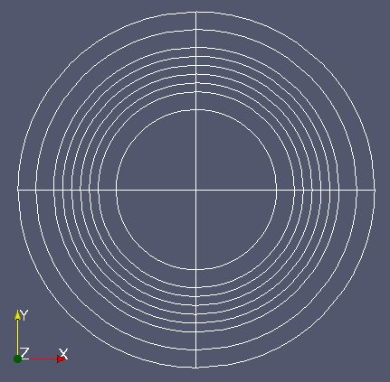
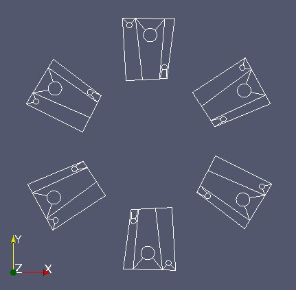
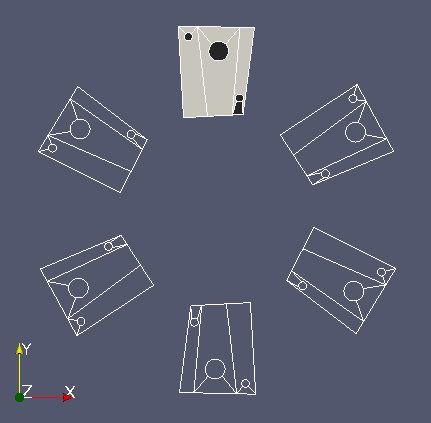
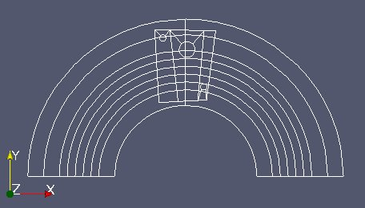
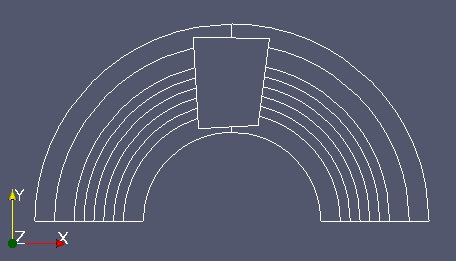
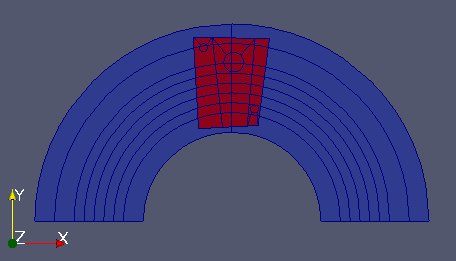
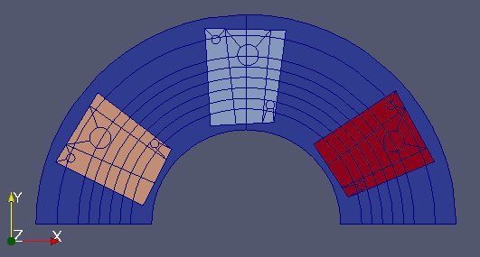

Full example 2 - RJH
--------------------

Two MED files are used in this case, which are (very freely) inspired by the RJH experimental reactor. 

The first file "Fixe.med" represents the 2D geometry of the static RJH without the installations.

The 2nd file "Mobile.med" represent the mobile part.

Objective
~~~~~~~~~

The aim of this exercise is to use MEDCoupling to intersect those two meshes, assign a field to it and thus localize the zones.

Implementation start
~~~~~~~~~~~~~~~~~~~~

Import the whole Python module MEDLoader (which includes MEDCoupling). ::

	from MEDLoader import *

Read and repare the static mesh "Fixe.med"
~~~~~~~~~~~~~~~~~~~~~~~~~~~~~~~~~~~~~~~~~~

With the advanced API read the whole file "Fixe.med" and call "fixm" the MEDCouplingUMEsh instance 
representing the static mesh. ::

	fixe=MEDFileMesh.New("Fixe.med")
	fixm=fixe.getMeshAtLevel(0)

In what follows, it is required that any two cells touching each other share the same edges.
As we are in nodal connectivity mode it means that common nodes have to merged. This is not the case here.
Merge the nodes closer than 1e-10 and assess the impact on the node count of "fixm". ::

	print "nb of nodes in file : %i"%(fixm.getNumberOfNodes())
	fixm.mergeNodes(1e-10)
	print "nb of non duplicated nodes : %i"%(fixm.getNumberOfNodes())

Same thing for "Mobile.med" (called "mobm"). Repair it by deleting duplicated nodes. ::

	mobile=MEDFileMesh.New("Mobile.med")
	mobm=mobile.getMeshAtLevel(0)
	mobm.mergeNodes(1e-10)

Repair the "mobm" mesh converting from POLYGON to QPOLYG (temporary solution)
~~~~~~~~~~~~~~~~~~~~~~~~~~~~~~~~~~~~~~~~~~~~~~~~~~~~~~~~~~~~~~~~~~~~~~~~~~~~~

This section will disappear in the future. 
The RJH mesh being more generic than TRI6 and QUAD8 we need to store cells with an intermediate type QPOLYG 
(Quadratic Polygon) which is the polygonal extension to the 2D cells with a dynamic edge count.
For now this geometrical type QPOLYG is in MEDCoupling but there is no equivalent yet in MED file (work in progress
at EDF).
The trick for now is to store QPOLYG in standard linear polygons and to convert them after reading.
Only "mobm" is concerned. Convert all polygonal cells in "mobm" into QPOLYG. ::

	ids=mobm.giveCellsWithType(NORM_POLYGON)
	mobm.getNodalConnectivity()[mobm.getNodalConnectivityIndex()[ids]]=NORM_QPOLYG
	mobm.computeTypes()

Visualize "fixm" and "mobm" using ParaView. Tesselation is needed: OpenGL doesn't handle properly circle arcs 
and those have to be split into smaller linear segments to be able to represent them. The method MEDCouplingUMesh.tessellate2D() achieves this but modifies the mesh (non const method in C++).
It only take a cut fineness parameter (0.1 will suffice (angle expressed in rd)). Remember not to modify 
neither "fixm" nor "mobm"! ::

        fixm2=fixm.deepCopy()        # tessellate2D is non const  - a mesh copy is required
        fixm2.tessellate2D(0.1)
        fixm2.writeVTK("fixm2.vtu")
        mobm2=mobm.deepCopy()
        mobm2.tessellate2D(0.1)
        mobm2.writeVTK("mobm2.vtu")

Define a small method displayVTK() which we will use later on. ::

	def displayVTK(m,fname):
		tmp=m.deepCopy()
		tmp.tessellate2D(0.1)
		tmp.writeVTK(fname)
		return

Perform reductions and identifying zones
~~~~~~~~~~~~~~~~~~~~~~~~~~~~~~~~~~~~~~~~

"mobm" is made of 6 distinct parts (see image above). We only want the first part. 
Use MEDCouplingUMesh.partitionBySpreadZone() to partition "mobm" in zones and only 
extract the first zone.
Name this new instance "zone1Mobm", remove all orphan nodes and display. ::

	zonesInMobm=mobm.partitionBySpreadZone()
	print "number of zones in mobm : %i"%(len(zonesInMobm))
	zone1Mobm=mobm[zonesInMobm[0]]
	zone1Mobm.zipCoords()
	displayVTK(zone1Mobm,"zone1Mobm.vtu")

From now on we work on "zone1Mobm". We will reduce the working area of "fixm" around "zone1Mobm".
To achive this: reduce "fixm" taking only "fixm" cells located in the bounding box of "zone1Mobm" (MEDCouplingUMesh.getBoundingBox() and MEDCouplingUMesh.getCellsInBoundingBox()).
Name this object "partFixm", remove its orphan nodes and display it. ::

	ids2=fixm.getCellsInBoundingBox(zone1Mobm.getBoundingBox(),1e-10)
	partFixm=fixm[ids2]
	partFixm.zipCoords()
	displayVTK(partFixm,"partFixm.vtu")

Geometrical intersection of the two meshes
~~~~~~~~~~~~~~~~~~~~~~~~~~~~~~~~~~~~~~~~~~

This is the core of the exercise. 

We intersect geometrically "partFixm" and "zone1Mobm". 
This boils down to partition in a minimal fashion "partFixm" into cells belonging either fully to 
"partFixm", or to "partFixm" and "zone1Mobm". Invoke the static method 
MEDCouplingUMesh.Intersect2DMeshes(), with "partFixm" and "zone1Mobm", and use a precision
of 1e-10 (merge detection threshold). 
This method returns 3 parameters (see API documentation) which will be called partFixMob, iPart and iMob.

In partFixMob merge common nodes with a threshold of 1e-10. ::

	partFixMob,iPart,iMob=MEDCouplingUMesh.Intersect2DMeshes(partFixm,zone1Mobm,1e-10)
	partFixMob.mergeNodes(1e-10)

Get and display partFixm part which is not in zone1Mobm. Call this mesh partFixmWithoutZone1Mobm. ::

	ids3=iMob.findIdsEqual(-1)
	partFixmWithoutZone1Mobm=partFixMob[ids3]
	displayVTK(partFixmWithoutZone1Mobm,"partFixmWithoutZone1Mobm.vtu")

Let's now check the result quality given by MEDCouplingUMesh.Intersect2DMeshes. 
Three tests will be passed:

 * (check#0) the cell area sum in partFixm equals the one in partFixMob
 * (check#1) the cell area sum in zone1Mobm equals the same sum on the cells in partFixMob whose cell ID different of -1
 * (check#2) for each cell in partFixm, its area equals the cell area sum in partFixMob

Area is a algebraic value. The check can be performed only if all cells are correctly oriented or at least
all oriented consistently.
To check this let's inspect the areas of the 38 cells of partFixm (variable name "areaPartFixm"). ::

	areaPartFixm=partFixm.getMeasureField(ON_CELLS).getArray()
	print areaPartFixm.getValues()

All values are negative: this MED file doesn't respect the MED file convention.
"partFixm" being mis-oriented and the method MEDCouplingUMesh.Intersect2DMeshes() conserving the orientation, "partFixMob" is also mis-oriented.
To cut long story short, we perform comparison on absolute arrays. 
Check then that the first test check#0 is successful

	areaPartFixm=partFixm.getMeasureField(ON_CELLS).getArray()
	areaPartFixm.abs()
	areaPartFixMob=partFixMob.getMeasureField(ON_CELLS).getArray()
	areaPartFixMob.abs()
	val1=areaPartFixm.accumulate()[0]
	val2=areaPartFixMob.accumulate()[0]
	print "Check #0 %lf == %lf a 1e-8 ? %s"%(val1,val2,str(abs(val1-val2)<1e-8))

Now check#1. Same spirit as in check#0. ::

	areaZone1Mobm=zone1Mobm.getMeasureField(ON_CELLS).getArray()
	areaZone1Mobm.abs()
	val3=areaZone1Mobm.accumulate()[0]
	ids4=iMob.findIdsNotEqual(-1)
	areaPartFixMob2=areaPartFixMob[ids4]
	val4=areaPartFixMob2.accumulate()[0]
	print "Check #1 %lf == %lf a 1e-8 ? %s"%(val3,val4,str(abs(val3-val4)<1e-8))

Finally check#2. ::

	isCheck2OK=True
	for icell in xrange(partFixm.getNumberOfCells()):
	    ids5=iPart.findIdsEqual(icell)
	    areaOfCells=areaPartFixMob[ids5]
	    areaOfCells.abs()
	    if abs(areaOfCells.accumulate()[0]-areaPartFixm[icell])>1e-9:
	        isCheck2OK=False
	        pass
	    pass
	print "Check #2? %s"%(str(isCheck2OK))

Use intersection information to create fields
~~~~~~~~~~~~~~~~~~~~~~~~~~~~~~~~~~~~~~~~~~~~~

We are done with partFixMob. 
Now create a cell field on partFixMob by setting it to 0 on the part covering only partFixm and 1 on the overlapped
part. Visualize it in a VTK file. ::

	f=MEDCouplingFieldDouble(ON_CELLS,ONE_TIME)
	m=partFixMob.deepCopy() ; m.tessellate2D(0.1)
	f.setMesh(m)
	arr=DataArrayDouble(partFixMob.getNumberOfCells(),1)
	arr[iMob.findIdsEqual(-1)]=0.
	arr[iMob.findIdsNotEqual(-1)]=1.
	f.setArray(arr)
	f.checkConsistencyLight()
	f.setName("Zone")
	MEDCouplingFieldDouble.WriteVTK("Zone.vtu",[f])

More generally take zones 0, 1 and 5. 
Create a cell field whose value is 0 in the zone being exclusively part of fixm,
1 in the zone #0, 2 in the zone #1 and 3 in the zone #5. ::

	zonesMobm=MEDCouplingUMesh.MergeUMeshesOnSameCoords([mobm[zonesInMobm[0]], mobm[zonesInMobm[1]], mobm[zonesInMobm[5]]])
	zonesMobm.zipCoords()
	partFixMob2,iPart2,iMob2=MEDCouplingUMesh.Intersect2DMeshes(partFixm,zonesMobm,1e-10)
	partFixMob2.mergeNodes(1e-10)
	f2=MEDCouplingFieldDouble(ON_CELLS,ONE_TIME)
	m2=partFixMob2.deepCopy() ; m2.tessellate2D(0.1)
	f2.setMesh(m2)
	arr=DataArrayDouble(partFixMob2.getNumberOfCells(),1)
	arr[iMob2.findIdsEqual(-1)]=0.
	st=0 ; end=st+len(zonesInMobm[0])
	arr[iMob2.findIdsInRange(st,end)]=1.
	st+=len(zonesInMobm[0]) ; end=st+len(zonesInMobm[1])
	arr[iMob2.findIdsInRange(st,end)]=2.
	st+=len(zonesInMobm[1]) ; end=st+len(zonesInMobm[2])
	arr[iMob2.findIdsInRange(st,end)]=3.
	f2.setArray(arr)
	f2.checkConsistencyLight()
	f2.setName("Zone2")
	MEDCouplingFieldDouble.WriteVTK("Zone2.vtu",[f2])

Solution
~~~~~~~~

:ref:`python_testmedcouplingloaderex2_solution`
