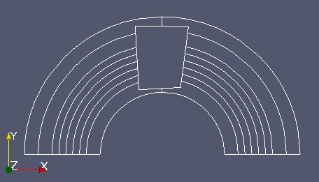
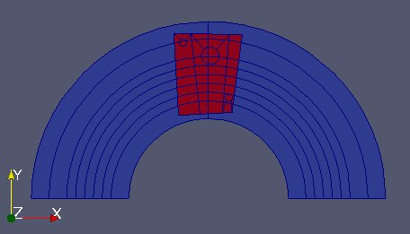
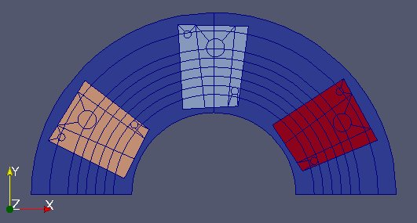

MEDCoupling / MEDLoader - Exemple complet 2 - RJH
-------------------------------------------------

Ici nous partons de deux fichiers MED très librement inspirés du réacteur expérimental
RJH (Réacteur Jules Horowitz).

Le premier, :download:`Fixe.med <data/Fixe.med>`, représente la partie statique du réacteur
sans dispositif expérimental.  

.. image:: images/fixm.jpg
	:scale: 70

Le deuxième, :download:`Mobile.med <data/Mobile.med>`, représente la partie mobile.

.. image:: images/mobm.jpg
	:scale: 70

Objectif
~~~~~~~~

Le but ici est d'utiliser MEDCoupling pour:

* intersecter ces deux maillages,
* y mettre un champ,
* et ainsi localiser les zones de recouvrement

Début de l'implémentation
~~~~~~~~~~~~~~~~~~~~~~~~~

Pour commencer l'exercice importer tout le module python MEDLoader (qui inclus MEDCoupling). ::

	import MEDLoader as ml

Lire et réparer le maillage statique "Fixe.med"
~~~~~~~~~~~~~~~~~~~~~~~~~~~~~~~~~~~~~~~~~~~~~~~

Avec l'API avancée lire tout le fichier "Fixe.med" et appeler ``fixm``
l'objet de type ``MEDCouplingUMesh`` représentant le maillage statique. ::

	fixe = ml.MEDFileMesh.New("Fixe.med")
	fixm = fixe.getMeshAtLevel(0)

Pour ce qui suit il faut absolument que deux cellules se touchant partagent les mêmes edges. Pour ce faire, comme on est
en connectivité nodale, il faut absolument que les noeuds soient les mêmes. Il s'avère que cela n'est pas le cas ici.
Fusionner le noeuds distants de moins de 1e-10 et regarder l'impact sur le nombre de noeuds de ``fixm``. ::

	print "Nb of nodes in the file : %i " % (fixm.getNumberOfNodes())
	fixm.mergeNodes(1e-10)
	print "Nb of non duplicated nodes : %i" % (fixm.getNumberOfNodes())

Même traitement pour ``Mobile.med``, le lire avec l'API avancée de MEDLoader (appeler ``mobm`` l'instance du maillage) 
et le réparer en supprimant les noeuds dupliqués. ::

	mobile = ml.MEDFileMesh.New("Mobile.med")
	mobm = mobile.getMeshAtLevel(0)
	mobm.mergeNodes(1e-10)

Le maillage du RJH étant plus général que des ``TRI6`` et des ``QUAD8``, on a besoin
de stocker ces cellules avec un type géométrique à ``QPOLYG`` (Quadratic Polygon) qui représente un polygone *quadratique* 
(le terme n'est pas très heureux, encore des raisons historiques, ...), c'est-à-dire un polygone avec un nombre arbitraire
de côtés, et potentiellement des côtés en forme d'arcs de cercles plutôt que de segments de droites.
Ce type géométrique ``NORM_QPOLYG`` est dans MEDCoupling/MEDLoader et aussi dans MED fichier.

Nous voudrions visualiser ces deux maillages dans PARAVIS/ParaView, mais nous rencontrons ici deux soucis:

* les polygones non-convexes sont, par défaut, mal représentés par VTK en mode *Surface*.
  Il faut sélectionner l'option avancée "Triangulate" dans le panneau Display de PARAVIS/ParaView pour avoir un rendu correct.
* les arcs de cercles ne sont pas correctement supportés par ParaView. Il faut les *tesséliser*, c'est-à-dire les transformer
  en plusieurs petits segments de droite. La méthode ``MEDCouplingUMesh.tessellate2D()`` fait ce travail, mais modifie
  le maillage. Nous faisons donc une copie préalable. Nous passons en paramètre la finesse de découpage (0.1 est suffisant 
  -- angle en radian). Attention donc à ne pas modifer ni ``fixm`` ni ``mobm`` ! ::

	fixm2 = fixm.deepCopy()        # tessellate2D() modifies the current mesh
	fixm2.tessellate2D(0.1)
	fixm2.writeVTK("fixm2.vtu")
	mobm2 = mobm.deepCopy()
	mobm2.tessellate2D(0.1)
	mobm2.writeVTK("mobm2.vtu")

Faire une petite méthode ``displayVTK()``, faisant le travail qui nous servira souvent après. ::

	def displayVTK(m,fname):
		tmp = m.deepCopy()
		tmp.tessellate2D(0.1)
		tmp.writeVTK(fname)
		return

Faire des réductions et des repérages de zones
~~~~~~~~~~~~~~~~~~~~~~~~~~~~~~~~~~~~~~~~~~~~~~

Le maillage ``mobm`` est en 6 parties distinctes (voir l'image au dessus). On ne veut récupérer que la première partie.
Utiliser ``MEDCouplingUMesh.partitionBySpreadZone()`` pour partitionner en zones ``mobm`` et ne prendre que la première zone.
Appeler cette nouvelle instance ``zone1Mobm`` et lui retirer tous les noeuds orphelins (``MEDCouplingUMesh.zipCoords()``) 
Enfin l'afficher : ::

	zonesInMobm = mobm.partitionBySpreadZone()
	print "Nb of zones in mobm : %i" % (len(zonesInMobm))
	zone1Mobm = mobm[zonesInMobm[0]]
	zone1Mobm.zipCoords()
	displayVTK(zone1Mobm, "zone1Mobm.vtu")

.. image:: images/zone1Mobm.jpg
	:scale: 70

Nous allons désormais travailler autour de ``zone1Mobm``. Nous allons réduire la zone de travail de ``fixm`` autour de ``zone1Mobm``.
Pour ce faire, réduire ``fixm`` en ne prenant que les cellules dans la boîte englobante 
de ``zone1Mobm`` (``MEDCouplingUMesh.getBoundingBox()`` et ``MEDCouplingUMesh.getCellsInBoundingBox()``).
Appeler ce nouvel objet ``partFixm``, lui retirer ses noeuds orphelins et l'afficher. ::

	ids2 = fixm.getCellsInBoundingBox(zone1Mobm.getBoundingBox(),1e-10)
	partFixm = fixm[ids2]
	partFixm.zipCoords()
	displayVTK(partFixm,"partFixm.vtu")

.. image:: images/partFixmAndzone1Mobm.jpg

Intersecter géométriquement deux maillages
~~~~~~~~~~~~~~~~~~~~~~~~~~~~~~~~~~~~~~~~~~

C'est le coeur de l'exercice. Nous allons intersecter géométriquement ``partFixm`` et ``zone1Mobm``. Cela revient à 
partitionner à minima ``partFixm`` en cellules appartenant
soit complètement à ``partFixm`` soit à ``partFixm`` et ``zone1Mobm``. Invoquer la méthode statique 
``MEDCouplingUMesh.Intersect2DMeshes()``, avec ``partFixm`` et ``zone1Mobm`` et mettre une précision
de 1e-10 (seuil de détection de fusion). Cette méthode retourne 3 paramètres (voir API dans la doc) que l'on appellera 
ici ``partFixMob``, ``iPart`` et ``iMob`` dans cet ordre.

Sur ``partFixMob`` merger les noeuds à 1e-10 près. ::

	partFixMob, iPart, iMob = ml.MEDCouplingUMesh.Intersect2DMeshes(partFixm,zone1Mobm,1e-10)
	partFixMob.mergeNodes(1e-10)

Récupérer et afficher la partie de ``partFixm`` qui n'est pas dans ``zone1Mobm``. Appeler ce maillage ``partFixmWithoutZone1Mobm``. ::

	ids3 = iMob.findIdsEqual(-1)
	partFixmWithoutZone1Mobm = partFixMob[ids3]
	displayVTK(partFixmWithoutZone1Mobm,"partFixmWithoutZone1Mobm.vtu")

Maintenant, on va vérifier la qualité du résultat retourné par ``MEDCouplingUMesh.Intersect2DMeshes()``. 
Pour ce faire on va passer 3 tests:

 * **Check #0** la somme des aires des cellules de ``partFixm`` et égale à celle de ``partFixMob``
 * **Check #1** la somme des aires des cellules de ``zone1Mobm`` et égale à la somme des cells de ``partFixMob`` 
   dont l'id dans ``iMob`` est different de -1
 * **Check #2** pour chaque cellule de ``partFixm``, son aire est égale à la somme des aires des cellules de ``partFixMob``

L'aire est une valeur algébrique. Donc attention cette verification ne peut se faire que si les cellules 
sont toutes bien orientées ou à minima toutes orientées de la même manière.
Pour ce faire, regardons les aires des 38 cellules de ``partFixm`` (nom de variable : ``areaPartFixm``). ::

	areaPartFixm = partFixm.getMeasureField(ml.ON_CELLS).getArray()
	print areaPartFixm.getValues()

On voit que toutes les valeurs sont négatives. *Bilan*: ce fichier MED ne respecte pas la convention MED fichier !
``partFixm`` étant mal orienté, et ``MEDCouplingUMesh.Intersect2DMeshes()`` conservant l'orientation, 
``partFixMob`` est lui aussi mal orienté.
Bref, on va faire les comparaisons sur des tableaux de valeurs absolues. Vérifier alors **Check #0**. ::

	areaPartFixm = partFixm.getMeasureField(ml.ON_CELLS).getArray()
	areaPartFixm.abs()
	areaPartFixMob = partFixMob.getMeasureField(ml.ON_CELLS).getArray()
	areaPartFixMob.abs()
	val1=areaPartFixm.accumulate()[0]
	val2=areaPartFixMob.accumulate()[0]
	print "Check #0 %lf == %lf with precision 1e-8? %s" % (val1,val2,str(abs(val1-val2)<1e-8))

On peut passer au **Check #1**. L'esprit est le même que le **Check #0**. ::

	areaZone1Mobm = zone1Mobm.getMeasureField(ml.ON_CELLS).getArray()
	areaZone1Mobm.abs()
	val3 = areaZone1Mobm.accumulate()[0]
	ids4 = iMob.findIdsNotEqual(-1)
	areaPartFixMob2 = areaPartFixMob[ids4]
	val4 = areaPartFixMob2.accumulate()[0]
	print "Check #1 %lf == %lf with precision 1e-8 ? %s" % (val3,val4,str(abs(val3-val4)<1e-8))

Puis le **Check #2**. ::

	isCheck2OK = True
	for icell in xrange(partFixm.getNumberOfCells()):
	    ids5 = iPart.findIdsEqual(icell)
	    areaOfCells = areaPartFixMob[ids5]
	    areaOfCells.abs()
	    if abs(areaOfCells.accumulate()[0] - areaPartFixm[icell]) > 1e-9:
	        isCheck2OK = False
	        pass
	    pass
	print "Check #2? %s" % (str(isCheck2OK))

Utiliser les informations de l'intersection pour en faire des champs
~~~~~~~~~~~~~~~~~~~~~~~~~~~~~~~~~~~~~~~~~~~~~~~~~~~~~~~~~~~~~~~~~~~~

OK pour ``partFixMob``. Nous souhaitons maintenant créer un champ représentant une fonction indicatrice de la zone 

Maintenant créer un champ aux cellules sur ``partFixMob`` en mettant 0 sur la partie 
exclusive ``partFixm`` et 1 sur la partie couverte. Nous créons donc un champ représentant une fonction indicatrice. 
Le visualiser en utilisant un fichier VTK (ne pas oublier l'option *Triangulate* de ParaView). ::

	f = ml.MEDCouplingFieldDouble(ml.ON_CELLS,ml.ONE_TIME)
	m = partFixMob.deepCopy()
	m.tessellate2D(0.1)
	f.setMesh(m)
	arr = ml.DataArrayDouble(partFixMob.getNumberOfCells(),1)
	arr[iMob.findIdsEqual(-1)] = 0.
	arr[iMob.findIdsNotEqual(-1)] = 1.
	f.setArray(arr)
	f.checkConsistencyLight()
	f.setName("Zone")
	ml.MEDCouplingFieldDouble.WriteVTK("Zone.vtu",[f])

Plus généralement prendre les zones 0, 1 et 5. Faire un champ aux cellules qui vaut 0 dans la zone exclusivement de ``fixm``,
1 dans zone #0, 2 dans la zone #1 et finalement 3 dans la zone #5. ::

	zonesMobm = ml.MEDCouplingUMesh.MergeUMeshesOnSameCoords([mobm[zonesInMobm[0]], mobm[zonesInMobm[1]], mobm[zonesInMobm[5]]])
	zonesMobm.zipCoords()
	partFixMob2,iPart2,iMob2 = ml.MEDCouplingUMesh.Intersect2DMeshes(partFixm,zonesMobm,1e-10)
	partFixMob2.mergeNodes(1e-10)
	f2 = ml.MEDCouplingFieldDouble(ml.ON_CELLS, ml.ONE_TIME)
	m2 = partFixMob2.deepCopy()
	m2.tessellate2D(0.1)
	f2.setMesh(m2)
	arr = ml.DataArrayDouble(partFixMob2.getNumberOfCells(),1)
	arr[iMob2.findIdsEqual(-1)]=0.
	st = 0
	end = st + len(zonesInMobm[0])
	arr[iMob2.findIdsInRange(st,end)] = 1.
	st += len(zonesInMobm[0]) ; 
	end = st + len(zonesInMobm[1])
	arr[iMob2.findIdsInRange(st,end)] = 2.
	st += len(zonesInMobm[1])
	end = st + len(zonesInMobm[2])
	arr[iMob2.findIdsInRange(st,end)] = 3.
	f2.setArray(arr)
	f2.checkConsistencyLight()
	f2.setName("Zone2")
	ml.MEDCouplingFieldDouble.WriteVTK("Zone2.vtu",[f2])

Ne pas oublier l'option *Triangulate* de ParaView dans le panneau Display pour bien voir les champs:

Solution
~~~~~~~~

:ref:`python_testmedcouplingloaderex2_solution`
