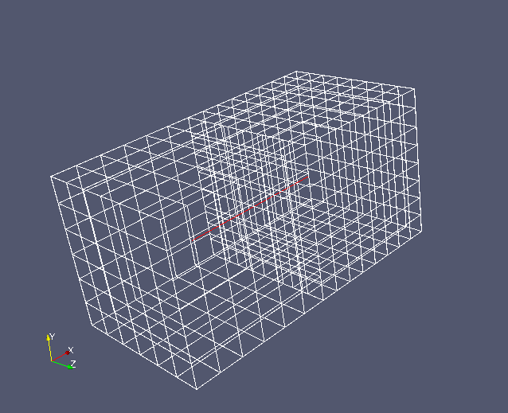
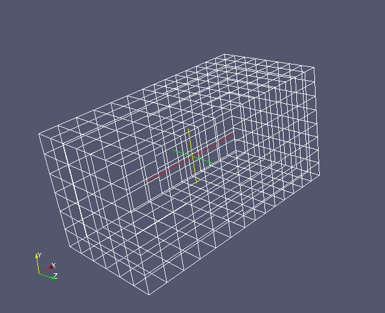

.. _medcouplingnumpyptr:

MEDCoupling,  NumPy et SciPy
----------------------------

NumPy est un package additionnel de python qui permet de manipuler des tableaux de manière optimisée. 
Il s'agit d'un prérequis optionnel de MEDCoupling.

NumPy est une passerelle vers le HPC Python (multiprocessing, pyCUDA, SciPy...) et offre de puissantes 
fonctions de calcul vectoriel. C'est pourquoi MEDCoupling offre des liens avec NumPy. 
Un bon point de départ pour la découverte de NumPy est le `Tutorial NumPy <http://wiki.scipy.org/Tentative_NumPy_Tutorial>`_

SciPy est aussi un package de python nécessitant NumPy. Il s'agit également d'un prérequis optionnel de MEDCoupling.
SciPy offre des services d'algèbre linéaire, Fast Fourrier Transform, etc ...

Nous allons ici faire quelques petites manipulations pour voir ce lien entre MEDCoupling et NumPy / SciPy.

Début de l'implémentation
~~~~~~~~~~~~~~~~~~~~~~~~~

Pour commencer l'exercice importer le module Python ``MEDCoupling``: ::

	import MEDCoupling as mc

NumPy est un prérequis optionnel, vérifions que nous en bénéficions bien : ::

	assert(mc.MEDCouplingHasNumPyBindings())

Nous pouvons alors importer NumPy sans problème: ::

	import numpy as np

Convertir un DataArray en tableau NumPy et vice versa
~~~~~~~~~~~~~~~~~~~~~~~~~~~~~~~~~~~~~~~~~~~~~~~~~~~~~

Créer une instance de ``DataArrayDouble`` ayant une composante et 12 tuples.
Et assigner 4. à tous les tuples. ::

	arr = mc.DataArrayDouble(12)
	arr[:] = 4.

Créons maintenant un tableau NumPy reposant sur les mêmes données que ``arr``. ::

	nparr = arr.toNumPyArray()

Et afficher ``nparr``. ::

	print nparr.__repr__()
	print nparr.tolist()

Mais est ce qu'on ne nous a pas mystifié ? ``arr`` et ``nparr`` partagent-ils le même bloc mémoire ?
Pour le vérifier assignons 7.0 un tuple sur 2 avec ``nparr`` et vérifions que ``arr`` et ``nparr`` sont simultanément modifiés. ::

	nparr[::2] = 7.
	print nparr.__repr__()
	print arr.__repr__()

C'est rigolo ! Mais si je détruis ``arr`` (le premier à avoir alloué la mémoire) est-ce que ``nparr`` est tué aussi ? 
Ne risque-t-on pas le SIGSEGV ?
Testons : ::

	del arr
	import gc; gc.collect()     # Make sure the object has been deleted
	print nparr.__repr__()

OK super. Mais inversement puis je faire une instance de ``DataArrayDouble`` avec ``nparr`` ? Oui, en utilisant le constructeur
qui prend un ``nparray`` en entrée.
Et afficher le contenu.::

	arr2 = mc.DataArrayDouble(nparr)
	print arr2.__repr__()

Modifions ``nparr`` en assignant 5.0 pour tous les tuples et vérifier que les 2 représentations ont bien été modifiées simultanément.::

	nparr[:] = 5.
	print nparr.__repr__()
	print arr2.__repr__()

Nous en profitons pour montrer un petit service pratique avec NumPy, à savoir, l'écriture optimisée. 
Ecrivons le contenu binaire de ``nparr`` dans un fichier. ::

	f = open("toto.data","w+b")
	a = np.memmap(f, dtype='float64', mode='w+', offset=0, shape=nparr.shape)
	a[:] = nparr[:]
	f.flush()

Relisons "toto.data". ::

	f2 = open("toto.data","r+b")
	b = np.memmap(f2,dtype='float64',mode='r',offset=0,shape=(12,))

Pour rigoler, assignons 3.14 à ``a``, flushons et relisons. ::

	a[:] = 3.14
	f.flush()
	b = np.memmap(f2,dtype='float64',mode='r',offset=0,shape=(12,))
	print b.__repr__()

On voit donc que le passage de MEDCoupling à NumPy se fait directement et de manière optimisée. Donc ca peut valoir le coup !
Tout ce qui vient d'être montré marche aussi avec des ``DataArrayInt``.
Regardons la suite.

Jouons avec SciPy
~~~~~~~~~~~~~~~~~

Nous allons créer un maillage non conforme. Le but sera de trouver la peau de ce maillage *sans* les surfaces non conformes.

Nous allons faire cela en jouant avec les matrices creuses de SciPy (*sparse matrix*). Nous interpolons ce maillage non conforme
sur lui même, ce qui devrait donner une matrice diagonale si le maillage était conforme.

Avant nous vérifions que l'on peut jouer avec SciPy ! ::

	assert(mc.MEDCouplingHasSciPyBindings())

Pour le moment créons un maillage non conforme. Nous collons simplement deux maillages structurés avec des 
discrétisations spatiales différentes.::

	c1 = mc.MEDCouplingCMesh()
	arr1 = mc.DataArrayDouble(7) 
	arr1.iota() 
	c1.setCoords(arr1,arr1,arr1)
	c2 = mc.MEDCouplingCMesh()
	arr2 = mc.DataArrayDouble(9)
	arr2.iota() 
	arr2 *= 6./8.
	c2.setCoords(arr2,arr2,arr2)

Dégénérons ``c1`` et ``c2`` en non-structuré, une translation de ``[6.,0.,0.]`` de ``c2``,  et en faisant 
l'agrégation des deux, c'est dans la poche. ::

	c1 = c1.buildUnstructured()
	c2 = c2.buildUnstructured()
	c2.translate([6.,0.,0.])
	c = mc.MEDCouplingUMesh.MergeUMeshes([c1,c2])

Attention des noeuds sont dupliqués, il faut invoquer ``mergeNodes()``. ::

	c.mergeNodes(1e-12)

Récupérons la peau et les faces non conformes. Ca nous savons faire, car nous avons fait les exercices avant :-) ::

	skinAndNCFaces = c.computeSkin()

Retirons les noeuds non utilisés. Cette étape n'est pas obligatoire. ::

	skinAndNCFaces.zipCoords()

Voici à quoi cela ressemble:

OK maintenant on va séparer les cellules de bord des cellules non conformes grâce au ``MEDCouplingRemapper``.
Interpolons ``skinAndNCFaces`` sur lui-même. On acceptera un écart entre face de 1e-12 et un warping max de 0.01. ::

	from MEDCouplingRemapper import MEDCouplingRemapper
	rem = MEDCouplingRemapper()
	rem.setMaxDistance3DSurfIntersect(1e-12)
	rem.setMinDotBtwPlane3DSurfIntersect(0.99)
	rem.prepare(skinAndNCFaces,skinAndNCFaces,"P0P0")

Récupérer la matrice creuse au format CSR du remapper. ::

	mat = rem.getCrudeCSRMatrix()
	
.. note:: Le format CSR est un format de stockage efficace des matrices 
	creuses : `Sparse matrix CSR <http://en.wikipedia.org/wiki/Sparse_matrix>`_

Comme nous avons bien suivi les exos sur NumPy, grâce au NumPy array ``mat.indptr`` on peut récupérer 
l'ensemble des lignes de la matrice ``mat`` ayant exactement un élément non nul. ::

	indptr = mc.DataArrayInt(mat.indptr)
	indptr2 = indptr.deltaShiftIndex()
	cellIdsOfSkin = indptr2.findIdsEqual(1)

C'est presque fini. Créer le sous maillage contenant uniquement la peau et l'écrire dans 
un fichier VTK ou MED pour le visualiser avec ParaView. ::

	skin = skinAndNCFaces[cellIdsOfSkin]
	skin.writeVTK("skin.vtu")

.. note:: ``skin`` contient des noeuds orphelins, on peut les retirer avec ``skin.zipCoords()``.

Et voilà ce que cela donne :

Script complet
~~~~~~~~~~~~~~

:ref:`python_testMEDCouplingNumPy_solution`

