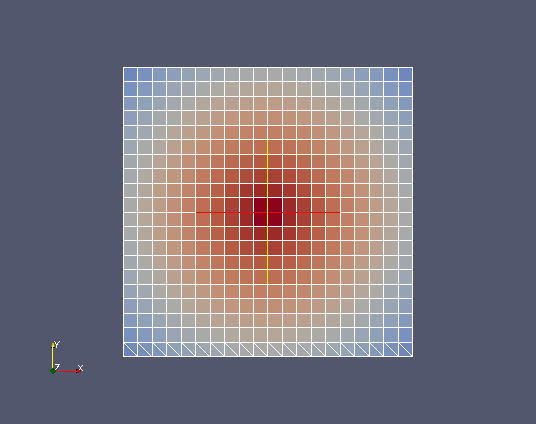

Interpolate with MEDCouplingRemapper
------------------------------------

The purpose of this exercise is to interpolate between two meshes "srcMesh" and "trgMesh". 
To make the reader aware of some subtleties about interpolation, a special case
is considered: "srcMesh" is a refinement of "trgMesh".

Implementation start
~~~~~~~~~~~~~~~~~~~~

To start the exercise import the whole Python module  MEDCouplingRemapper. ::

	from MEDCouplingRemapper import *

Create a MEDCouplingUMesh 2D instance, built from a Cartesian mesh
~~~~~~~~~~~~~~~~~~~~~~~~~~~~~~~~~~~~~~~~~~~~~~~~~~~~~~~~~~~~~~~~~~

Build the unstructured mesh "trgMesh" from a 2D Cartesian mesh with 10x10 cells, 
starting at point [0.,0.] and having a step of 1.0 along the X and Y directions.
::

	arr=DataArrayDouble(11) ; arr.iota(0)
	trgMesh=MEDCouplingCMesh() ; trgMesh.setCoords(arr,arr) ; trgMesh=trgMesh.buildUnstructured()	

Create the source mesh "srcMesh"
~~~~~~~~~~~~~~~~~~~~~~~~~~~~~~~~

Create a mesh "srcMesh" from a 2D Cartesian mesh having 20x20 cells and starting
at point [0.,0.] with a step of 0.5 along the X and Y directions.
::

	arr=DataArrayDouble(21) ; arr.iota(0) ; arr*=0.5
	srcMesh=MEDCouplingCMesh() ; srcMesh.setCoords(arr,arr) ; srcMesh=srcMesh.buildUnstructured()	
	
Triangulate the 20 first cells of source mesh (using MEDCouplingUMesh.simplexize()).
Store the result in "srcMesh".
::

	tmp=srcMesh[:20] ; tmp.simplexize(0)
	srcMesh=MEDCouplingUMesh.MergeUMeshes([tmp,srcMesh[20:]])

Interpolate using MEDCouplingRemapper
~~~~~~~~~~~~~~~~~~~~~~~~~~~~~~~~~~~~~

Compute the first part of the interpolation matrix with the following considerations: 
"srcMesh" is regarded as a discretization at cell points, and so is "trgMesh".
To this end invoke prepare() on an instance of the MEDCouplingRemapper class ("remap").
::

	remap=MEDCouplingRemapper()
	remap.prepare(srcMesh,trgMesh,"P0P0")

Check that the computed matrix is correct in this trivial case: get the internal
interpolation matrix by calling MEDCouplingRemapper.getCrudeMatrix() and save it in 
"myMatrix". This matrix gives for each cell in "trgMesh" the cell IDs of "srcMesh" 
which are intersecting the target and the area of intersection. Check that for each 
cell in "trgMesh" the sum of the areas is always equal to 1.0.
::

	myMatrix=remap.getCrudeMatrix()
	print myMatrix # to see what it looks like
	sumByRows=DataArrayDouble(len(myMatrix))
	for i,wIt in enumerate(sumByRows):
	  su=0.
	  for it in myMatrix[i]:
	    su+=myMatrix[i][it]
	  wIt[0]=su
	print "Does interpolation look OK? %s"%(str(sumByRows.isUniform(1.,1e-12)))

.. note:: Some triangles were added into "srcMesh" to make "myMatrix" less boring. "myMatrix".

Create a field at cell points "srcField" built from the following analytical formula: 
"7-sqrt((x-5.)*(x-5.)+(y-5.)*(y-5.))" where x and y represent the usual space coordinates.
::

	srcField=MEDCouplingFieldDouble(ON_CELLS,ONE_TIME) ; srcField.setMesh(srcMesh)
	srcField.fillFromAnalytic(1,"7-sqrt((x-5.)*(x-5.)+(y-5.)*(y-5.))") ; srcField.getArray().setInfoOnComponent(0,"powercell [W]")

Apply the interpolation using MEDCouplingRemapper.transferField(): ::

	remap.transferField(srcField,1e300)

.. note:: 1e300 is a default value. It will be systematically assigned to all cells
	in "trgField" which do not intersect any cell in "srcMesh". The common usage is to assign
	a huge value to identify what is often considered as a bug. But some other use cases
	indicate using 0 here, e.g. when considering a parallel interpolation merged ultimately
	with an addition.

.. note:: An exception is raised since "srcField" hasn't got an explicitly defined nature.
	In what follows the impact of this attribute on the final result will be explained.

Set the nature of "srcField" to IntensiveMaximum (intensive field, e.g. a temperature). ::

	srcField.setNature(IntensiveMaximum)
	trgFieldCV=remap.transferField(srcField,1e300)

Check that with this nature the field integral is conserved. On the other side 
the sum on cells (accumulation) is NOT conserved. ::

	print "IntensiveMaximum %lf == %lf"%(srcField.integral(True)[0],trgFieldCV.integral(True)[0])
	print "IntensiveMaximum %lf != %lf"%(srcField.getArray().accumulate()[0],trgFieldCV.getArray().accumulate()[0])

Set the nature of "srcField" to ExtensiveConservation (extensive field, e.g. a power). ::

	srcField.setNature(ExtensiveConservation)
	trgFieldI=remap.transferField(srcField,1e300)

Check that given this nature the field integral is NOT conserved. On the other side the 
cumulative sum on cells is conserved. ::
::

	print "ExtensiveConservation %lf != %lf"%(srcField.integral(True)[0],trgFieldI.integral(True)[0])
	print "ExtensiveConservation %lf == %lf"%(srcField.getArray().accumulate()[0],trgFieldI.getArray().accumulate()[0])

Visualize the fields using ParaViS.

Solution
~~~~~~~~

:ref:`python_testMEDCouplingremapper1_solution`
