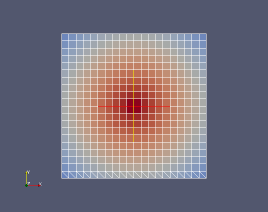

MEDCouplingRemapper : interpolation de champs
---------------------------------------------

Nous allons ici effectuer une interpolation entre deux maillages ``srcMesh`` et ``trgMesh``.
Pour mettre l'accent sur certaines petites subtilités de l'interpolation, nous prenons un cas particulier où ``srcMesh`` est 
un maillage raffiné de ``trgMesh`` (avec certaines cellules découpées plus finement).

Début de l'implémentation
~~~~~~~~~~~~~~~~~~~~~~~~~

Pour commencer l'exercice importer le module Python ``MEDCoupling`` et la 
classe ``MEDCouplingRemapper`` du module ``MEDCouplingRemapper``. ::

	import MEDCoupling as mc
	from MEDCouplingRemapper import MEDCouplingRemapper 

Créer le maillage target
~~~~~~~~~~~~~~~~~~~~~~~~

Construire le maillage non structuré ``trgMesh`` issu d'un maillage cartésien 2D 10x10 commençant au 
point ``[0.,0.]`` et ayant un pas de 1. selon X et selon Y : ::

	arr = mc.DataArrayDouble(11)
	arr.iota(0)
	trgMesh = mc.MEDCouplingCMesh()
	trgMesh.setCoords(arr,arr)
	trgMesh = trgMesh.buildUnstructured()	

Créer le maillage source
~~~~~~~~~~~~~~~~~~~~~~~~

Créer un maillage ``srcMesh`` issu d'un maillage cartésien 2D 20x20 cellules commençant 
aussi au point ``[0.,0.]`` et ayant un pas de 0.5 selon X et selon Y : ::

	arr = mc.DataArrayDouble(21)
	arr.iota(0)
	arr *= 0.5
	srcMesh = mc.MEDCouplingCMesh()
	srcMesh.setCoords(arr,arr)
	srcMesh = srcMesh.buildUnstructured()	

Afin de rendre l'exercise plus intéressant, triangulariser à l'aide de ``MEDCouplingUMesh.simplexize()`` 
les 20 premières cellules de ``srcMesh``
(les simplexes 2D sont les triangles). Mettre le résultat dans ``srcMesh``. ::

	tmp = srcMesh[:20]    # Extract a sub-part of srcMesh
	tmp.simplexize(0)
	srcMesh = mc.MEDCouplingUMesh.MergeUMeshes([tmp,srcMesh[20:]])

Interpoler avec MEDCouplingRemapper
~~~~~~~~~~~~~~~~~~~~~~~~~~~~~~~~~~~

Nous rappelons que pour projeter un champ d'un maillage vers un autre, il faut d'abord préparer la matrice d'interpolation
qui contient les ratios de projection.

Calculer la première partie de la matrice d'interpolation de ``srcMesh`` (discrétisée aux cellules - *P0*) 
vers ``trgMesh`` (discrétisée aux cellules également).
Pour ce faire, invoquer ``MEDCouplingRemapper.prepare()`` sur une instance (``remap``) de ``MEDCouplingRemapper``. ::

	remap = MEDCouplingRemapper()
	remap.prepare(srcMesh,trgMesh,"P0P0")

Vérifier que la matrice calculée par la méthode est correcte dans notre cas trivial.
Pour ce faire, récupérer dans ``myMatrix`` la matrice interne retournée par ``MEDCouplingRemapper.getCrudeMatrix()``.
Celle-ci donne pour chaque cellule de ``trgMesh`` les identifiants de cellules de ``srcMesh`` avec
lesquelles elle s'intersecte, et l'aire d'intersection correspondante. 

Vérifier notamment que pour chaque cellule de ``trgMesh`` la somme des aires fait toujours 1. ::

	myMatrix = remap.getCrudeMatrix()
	print myMatrix
	sumByRows = mc.DataArrayDouble(len(myMatrix))
	for i,wIt in enumerate(sumByRows):
	  su = 0.
	  for it in myMatrix[i]:
	    su += myMatrix[i][it]
	  wIt[0] = su
	print "Is interpolation well prepared?", sumByRows.isUniform(1.,1e-12)

.. note:: Les triangles dans ``srcMesh`` ont été rajoutés pour casser la monotonie de la matrice ``myMatrix``.

.. note:: Comme on le voit, la préparation ne nécessite que les deux maillages, et rien d'autre.

Construire un champ aux cellules "srcField" construit à partir de la formule analytique 
suivante ``7-sqrt((x-5.)*(x-5.)+(y-5.)*(y-5.))`` : ::

	srcField = mc.MEDCouplingFieldDouble(mc.ON_CELLS, mc.ONE_TIME)
	srcField.setMesh(srcMesh)
	srcField.fillFromAnalytic(1,"7-sqrt((x-5.)*(x-5.)+(y-5.)*(y-5.))")
	srcField.getArray().setInfoOnComponent(0, "powercell [W]")

Voici à quoi ressemble ce champ :

Appliquer l'interpolation avec ``MEDCouplingRemapper.transferField()`` : ::

	remap.transferField(srcField, 1e300)

.. note:: 1e300 est une valeur par défaut. Cette valeur sera systématiquement assignée à toute cellule
	de ``trgField`` n'interceptant aucune cellule de ``srcMesh``. En général, les utilisateurs mettent une 
	valeur énorme pour repérer ce qui est souvent un bug. Mais d'autres utilisateurs, dans la perspective 
	d'une interpolation parallèle par exemple, mettent 0.

.. note:: Une exception est envoyée car ``srcField`` n'a pas de *nature* définie. 
	Nous allons voir dans la suite l'impact de cet attribut sur le résultat final.

Mettre la nature de ``srcField`` à ``IntensiveMaximum``. Cela signifie que le champ doit être interprété commé étant
intensif (une température par exemple). ::

	srcField.setNature(mc.IntensiveMaximum)
	trgFieldCV = remap.transferField(srcField,1e300)

Vérifier qu'avec la nature ``IntensiveMaximum``, l'intégrale du champ est conservée. Par contre, 
la somme sur les cellules (accumulation) n'est **pas** conservée ! ::

	integSource = srcField.integral(True)[0]
	integTarget =  trgFieldCV.integral(True)[0]
	print "IntensiveMaximum -- integrals: %lf == %lf" % (integSource, integTarget)
	
	accSource = srcField.getArray().accumulate()[0]
	accTarget = trgFieldCV.getArray().accumulate()[0]
	print "IntensiveMaximum -- sums: %lf != %lf" % (accSource, accTarget)

Maintenant mettre la nature de ``srcField`` à ``ExtensiveConservation``. Le champ doit être interprété commé étant
extensif (par exemple une puissance ou un volume). ::

	srcField.setNature(mc.ExtensiveConservation)
	trgFieldI = remap.transferField(srcField,1e300)

Vérifier qu'avec la nature ``ExtensiveConservation``, l'intégrale du champ n'est **pas** conservée. 
Par contre, la somme sur les cellules est conservée. ::

	integSource = srcField.integral(True)[0]
	integTarget =  trgFieldI.integral(True)[0]
	print "ExtensiveConservation -- integrals: %lf != %lf" % (integSource, integTarget)
	
	accSource = srcField.getArray().accumulate()[0]
	accTarget = trgFieldI.getArray().accumulate()[0]
	print "ExtensiveConservation -- sums: %lf == %lf" % (accSource, accTarget)

Visualiser les champs avec ParaViS, ou en les écrivant dans un fichier.

Solution
~~~~~~~~

:ref:`python_testMEDCouplingremapper1_solution`
