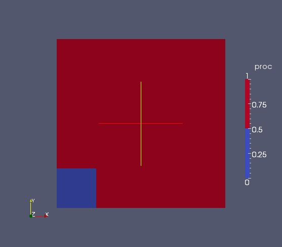

Splitting and merging a MED file using MEDLoader's advanced API
---------------------------------------------------------------

Objective
~~~~~~~~~

The aim of this exercise is to create a mesh with mixed geometrical type from scratch, and to associate two fields to it:

* a field on cells "CellField"
* a field on nodes "NodeField"
 

Implementation start
~~~~~~~~~~~~~~~~~~~~

Create an unstructured mesh "m0" built from a 30x30 structured mesh (meshDim=2, spaceDim=2).
Each of the even cell of "m0" is "simplexized" (cut in triangles - method MEDCouplingUMesh.simplexize(0)) ::

	from MEDLoader import *
	m0=MEDCouplingCMesh()
	arr=DataArrayDouble(31,1) ; arr.iota(0.)
	m0.setCoords(arr,arr)
	m0=m0.buildUnstructured()
	m00=m0[::2]                # Extract even cells 
	m00.simplexize(0)
	m01=m0[1::2]
	m0=MEDCouplingUMesh.MergeUMeshes([m00,m01])
	m0.getCoords()[:]*=1/15.   # Illustrate how to quickly rescale a mesh
	m0.setName("mesh")

.. note:: The call to setName() on "m0" is mandatory. Don't forget that the correct naming of the meshes is paramount in the MED file context.

Create the fields "CellField" and "NodeField" at the time-stamp (5,6) corresponding to 5.6s.
::

	CellField=MEDCouplingFieldDouble(ON_CELLS,ONE_TIME) ; CellField.setTime(5.6,5,6) ; CellField.setMesh(m0)
	CellField.setName("CellField")
	CellField.fillFromAnalytic(1,"exp(-((x-1)*(x-1)+(y-1)*(y-1)))") ; CellField.getArray().setInfoOnComponent(0,"powercell [W]")
	NodeField=MEDCouplingFieldDouble(ON_NODES,ONE_TIME) ; NodeField.setTime(5.6,5,6) ; NodeField.setMesh(m0)
	NodeField.setName("NodeField")
	NodeField.fillFromAnalytic(1,"exp(-((x-1)*(x-1)+(y-1)*(y-1)))") ; NodeField.getArray().setInfoOnComponent(0,"powernode [W]")

"CellField" looks like this:

.. image:: images/SplitAndMergeCell1.jpg	

Mesh partitionning
~~~~~~~~~~~~~~~~~~

Cut "m0" into two distinct parts called "proc0" and "proc1". "proc0" will be contained in the bounding box [(0.,0.4),(0.,0.4)] (with a precision of 1e-10). Use the method MEDCouplingUMesh.getCellsInBoundingBox(). "proc1" is simply the complementary part of "proc0" (method DataArrayInt.buildComplement()). ::

     proc0=m0.getCellsInBoundingBox([(0.,0.4),(0.,0.4)],1e-10)
     proc1=proc0.buildComplement(m0.getNumberOfCells())

Writing into two different MED files
~~~~~~~~~~~~~~~~~~~~~~~~~~~~~~~~~~~~

Starting with the partition above ("proc0" and "proc1") create two MED files called "proc0.med" et "proc1.med". ::

     NodeField0=NodeField[proc0] ; CellField0=CellField[proc0] ; CellField0.setMesh(NodeField0.getMesh())
     NodeField1=NodeField[proc1] ; CellField1=CellField[proc1] ; CellField1.setMesh(NodeField1.getMesh())
     
     proc0_fname="proc0.med"
     MEDLoader.WriteField(proc0_fname,NodeField0,True)
     MEDLoader.WriteFieldUsingAlreadyWrittenMesh(proc0_fname,CellField0)
     
     proc1_fname="proc1.med"
     MEDLoader.WriteField(proc1_fname,NodeField1,True)
     MEDLoader.WriteFieldUsingAlreadyWrittenMesh(proc1_fname,CellField1)

Reading and merging 2 MED files - Easy (but non optimal) version
~~~~~~~~~~~~~~~~~~~~~~~~~~~~~~~~~~~~~~~~~~~~~~~~~~~~~~~~~~~~~~~~

In the two files "proc0.med" and "proc1.med" read the respective "CellField" with the basic API. Aggregate the two and store the result in "CellField_read". ::

     CellField0_read=MEDLoader.ReadFieldCell("proc0.med","mesh",0,"CellField",5,6)
     CellField1_read=MEDLoader.ReadFieldCell("proc1.med","mesh",0,"CellField",5,6)
     CellField_read=MEDCouplingFieldDouble.MergeFields([CellField0_read,CellField1_read])

.. note:: It might seem to the reader that the cell type information is repeated uselessly, but don't forget that the MED file norm doesn't forbid a field to be defined simultaneously on nodes and on Gauss points for example ...

Compare "CellField_read" and "CellField0". Problem: because of the constraint on the MED file numbering, the initial numbering has been lost. Or more exactly there is no standard way to retrieve it. This means that a call to MEDCouplingFieldDouble.isEqual() won't succeed. Let's use the method MEDCouplingFieldDouble.substractInPlaceDM() which operates a renumbering based on a given policy (see HTML doc).
To this end, create a deep copy of "CellField" into "CellFieldCpy" and invoke substractInPlaceDM() on it (DM stands for "Different Meshes", contrarily to substract() which only succeeds if the fields share the same mesh). ::

     CellFieldCpy=CellField.deepCopy()
     CellFieldCpy.substractInPlaceDM(CellField_read,10,1e-12)
     CellFieldCpy.getArray().abs()
     print CellFieldCpy.getArray().isUniform(0.,1e-12)

Let's do the same on "NodeField". The main difference here is that redundant information is created at the boundary. ::

     NodeField0_read=MEDLoader.ReadFieldNode("proc0.med","mesh",0,"NodeField",5,6)
     NodeField1_read=MEDLoader.ReadFieldNode("proc1.med","mesh",0,"NodeField",5,6)
     NodeField_read=MEDCouplingFieldDouble.MergeFields([NodeField0_read,NodeField1_read])

.. note:: The mesh is read a second time here, which can be damaging in terms of performance.

Invoke MEDCouplingUMesh.mergeNodes() on "NodeField_read" to remove duplicate nodes.
Make a deep copy called  "NodeFieldCpy" from "NodeField" and call  MEDCouplingUMesh.mergeNodes(). ::

     NodeField_read.mergeNodes(1e-10)
     NodeFieldCpy=NodeField.deepCopy()
     NodeFieldCpy.mergeNodes(1e-10)

.. note:: mergeNodes() takes two epsilons: the first classical one on the absolute distance between nodes, and the second expressing a tolerance on the values. If the field value of two nodes to be merged is bigger than this an exception is raised.

Compare "NodeFieldCpy" and "NodeField_read" still using MEDCouplingFieldDouble.substractInPlaceDM(). ::

     NodeFieldCpy.substractInPlaceDM(NodeField_read,10,1e-12)
     print NodeFieldCpy.getArray().isUniform(0.,1e-12)

Read/write of two separated MED files - More complex but more efficient version
~~~~~~~~~~~~~~~~~~~~~~~~~~~~~~~~~~~~~~~~~~~~~~~~~~~~~~~~~~~~~~~~~~~~~~~~~~~~~~~

We show a more systematic and more general method to merge files. 
This is the preferred route when dealing with big files .
This method adds performance but also allows to add extra information.

Using the advanced API read the meshes of two files "proc0.med" and "proc1.med" and aggregate the result in an MEDFileUMesh instance "mergeMLMesh".
Handle all the levels (even if there is only one in the present case) using the method
MEDFileUMesh.getNonEmptyLevels() on the instance coming from "proc0.med". ::

     fileNames=["proc0.med","proc1.med"]
     msML=[MEDFileMesh.New(fname) for fname in fileNames]
     fsML=[MEDFileFields.New(fname) for fname in fileNames]
     mergeMLMesh=MEDFileUMesh()
     mergeMLFields=MEDFileFields()
     for lev in msML[0].getNonEmptyLevels():
         o2nML=len(msML[0].getNonEmptyLevels())*[None]
         cs=[mML.getCoords() for mML in msML]
         mergeMLMesh.setCoords(DataArrayDouble.Aggregate(cs))
         ms=[mML.getMeshAtLevel(lev) for mML in msML]
         m=MEDCouplingUMesh.MergeUMeshes(ms) ; m.setCoords(mergeMLMesh.getCoords())
         o2nML[lev]=m.sortCellsInMEDFileFrmt()
         mergeMLMesh.setMeshAtLevel(lev,m)
         pass

     for fieldName in fsML[0].getFieldsNames():
         fmts=[fML[fieldName] for fML in fsML]
         mergeField=MEDFileFieldMultiTS()
         for dt,it,tim in fmts[0].getTimeSteps():
             fts=[fmt[dt,it] for fmt in fmts]
             arrs=len(fts)*[None]
             for typp in fts[0].getTypesOfFieldAvailable():
                 arr1s=[]
                 if typp==ON_CELLS:
                     for ft in fts:
                         for geoTyp,smth in ft.getFieldSplitedByType():
                             if geoTyp!=NORM_ERROR:
                                 smth1=filter(lambda x:x[0]==ON_CELLS,smth)
                                 arr2s=[ft.getUndergroundDataArray()[elt[1][0]:elt[1][1]] for elt in smth1]
                                 arr1s.append(DataArrayDouble.Aggregate(arr2s))
                                 pass
                             pass
                         pass
                     pass
                 else:
                     for ft in fts:
                         smth=filter(lambda x:x[0]==NORM_ERROR,ft.getFieldSplitedByType())
                         arr2=DataArrayDouble.Aggregate([ft.getUndergroundDataArray()[elt[1][0][1][0]:elt[1][0][1][1]] for elt in smth])
                         arr1s.append(arr2)
                         pass
                     pass
                 arr=DataArrayDouble.Aggregate(arr1s)
                 if typp==ON_CELLS:
                     arr.renumberInPlace(o2nML[lev])
                 mcf=MEDCouplingFieldDouble(typp,ONE_TIME) ; mcf.setName(fieldName) ; mcf.setTime(tim,dt,it) ; mcf.setArray(arr)
                 mcf.setMesh(mergeMLMesh.getMeshAtLevel(lev)) ; mcf.checkConsistencyLight()
                 mergeField.appendFieldNoProfileSBT(mcf)
                 pass
             pass
         mergeMLFields.pushField(mergeField)
         pass
     mergeMLMesh.write("merge.med",2)
     mergeMLFields.write("merge.med",0)

Solution
~~~~~~~~

:ref:`python_testMEDLoaderSplitAndMerge1_solution`
