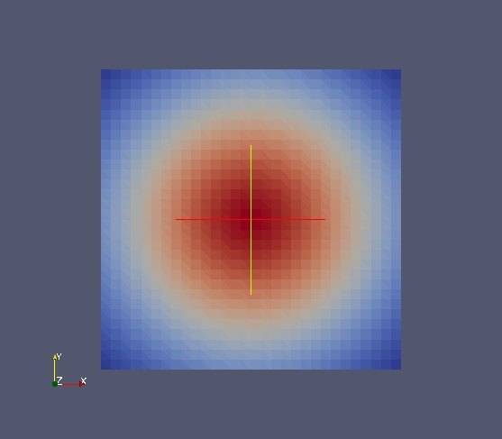
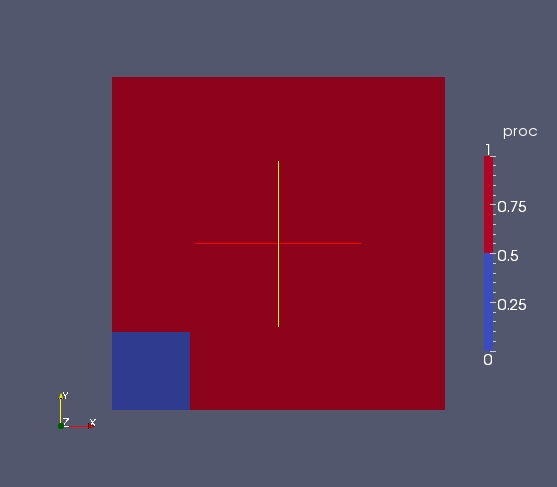

Spliter et fusionner un fichier MED grâce à l'API avancée de MEDLoader
----------------------------------------------------------------------

Objectif
~~~~~~~~

Cet exercise présente un cas complet et avancé d'utilisation de l'API avancée de MEDLoader.
Le but est de créer un maillage multi-type à partir de rien avec 2 champs :

* un champ aux cellules "CellField"
* un champ aux noeuds "NodeField"
 
Nous allons ensuite couper ces champs en deux parties (dans le but d'un traitement en parallèle par un code par exemple)
et aussi montrer comment re-fusionner deux champs à partir de morceaux disjoints. 

Début de l'implémentation
~~~~~~~~~~~~~~~~~~~~~~~~~

Créer un unstructured mesh ``m0`` issu d'un maillage structuré (meshDim=2, spaceDim=2) de 30*30.
Chacune des cellules paires du maillage sera *simplexisée* (i.e. coupée en triangle - méthode ``MEDCouplingUMesh.simplexize(0)``) ::

	import MEDLoader as ml
	
	m0 = ml.MEDCouplingCMesh()
	arr = ml.DataArrayDouble(31,1) ; arr.iota(0.)
	m0.setCoords(arr,arr)
	m0 = m0.buildUnstructured()
	m00 = m0[::2]                # Extract even cells
	m00.simplexize(0) 
	m01 = m0[1::2]
	m0 = ml.MEDCouplingUMesh.MergeUMeshes([m00,m01])
	m0.getCoords()[:] *= 1/15.   # Illustrate how to quickly rescale a mesh
	m0.setName("mesh")

.. note:: Le ``setName()`` sur "m0" est obligatoire. Ne pas oublier que dans le contexte MED fichier 
	le nommage correct des maillages est fondamental.

Créer les champs ``cellField`` et ``nodeField`` au pas de temps identifié à (5,6) et au pas de temps 5.6 s. ::

	# Cell field
	cellField = ml.MEDCouplingFieldDouble(ml.ON_CELLS, ml.ONE_TIME) 
	cellField.setTime(5.6,5,6)
	cellField.setMesh(m0)
	cellField.setName("CellField")
	cellField.fillFromAnalytic(1,"exp(-((x-1)*(x-1)+(y-1)*(y-1)))")
	cellField.getArray().setInfoOnComponent(0,"powercell [W]")
	# Node field
	nodeField = ml.MEDCouplingFieldDouble(ml.ON_NODES,ml.ONE_TIME) 
	nodeField.setTime(5.6,5,6)
	nodeField.setMesh(m0)
	nodeField.setName("NodeField")
	nodeField.fillFromAnalytic(1,"exp(-((x-1)*(x-1)+(y-1)*(y-1)))")
	nodeField.getArray().setInfoOnComponent(0,"powernode [W]")

On obtient par exemple pour "CellField" ceci :

Partitionnement de maillage
~~~~~~~~~~~~~~~~~~~~~~~~~~~

Couper ``m0`` en deux parties distinctes. Les deux parties seront nommées ``proc0`` et ``proc1``. 
``proc0`` sera la partie dans la boîte englobante (``MEDCouplingUMesh.getCellsInBoundingBox()``) ``[(0.,0.4),(0.,0.4)]``
à 1e-10 près. ``proc1`` sera le complémentaire (``DataArrayInt.buildComplement()``). ::

	proc0 = m0.getCellsInBoundingBox([(0.,0.4),(0.,0.4)],1e-10)
	proc1 = proc0.buildComplement(m0.getNumberOfCells())

Ecriture dans 2 fichiers MED séparés
~~~~~~~~~~~~~~~~~~~~~~~~~~~~~~~~~~~~

En partant du partitionnement ``proc0`` et ``proc1`` créer 2 fichiers MED appelés "proc0.med" et "proc1.med" : ::

	nodeField0 = nodeField[proc0] ; cellField0 = cellField[proc0] ; cellField0.setMesh(nodeField0.getMesh())
	nodeField1 = nodeField[proc1] ; cellField1 = cellField[proc1] ; cellField1.setMesh(nodeField1.getMesh())
	
	proc0_fname = "proc0.med"
	ml.WriteField(proc0_fname, nodeField0, True)
	ml.WriteFieldUsingAlreadyWrittenMesh(proc0_fname, cellField0)
	
	proc1_fname = "proc1.med"
	ml.WriteField(proc1_fname,nodeField1,True)
	ml.WriteFieldUsingAlreadyWrittenMesh(proc1_fname,cellField1)

Lecture et fusion des 2 fichiers MED séparés (non optimal)
~~~~~~~~~~~~~~~~~~~~~~~~~~~~~~~~~~~~~~~~~~~~~~~~~~~~~~~~~~

Partant de "proc0.med" et de "proc1.med" lire leur "CellField" respectif avec l'API basique, 
agréger les deux et mettre le résultat dans ``cellField_read`` : ::

	cellField0_read = ml.ReadFieldCell("proc0.med","mesh",0,"CellField",5,6)
	cellField1_read = ml.ReadFieldCell("proc1.med","mesh",0,"CellField",5,6)
	cellField_read = ml.MEDCouplingFieldDouble.MergeFields([cellField0_read,cellField1_read])

.. note:: On peut avoir l'impression que l'information Cell (méthode ``ReadFieldCell``) est répétée de manière abusive
	(effectivement le champ "CellField" a été créé aux cellules), 
	mais ne pas oublier que dans la norme MED fichier rien n'interdit qu'un champ repose sur des cellules mais 
	aussi simultanément sur des noeuds, ou des points de Gauss ...

Comparer ``cellField_read`` et ``cellField0``. Problème, à cause de la contrainte sur la numérotation MED fichier, 
on a perdu la numérotation initiale. Ou plus exactement il n'y a pas
de moyen standard de retrouver la numérotation originale. Donc un ``MEDCouplingFieldDouble.isEqual()`` 
n'est pas suffisant. Utilisons un ``MEDCouplingFieldDouble.substractInPlaceDM()``
qui opère pour nous une renumérotation suivant une politique particulière (*policy*, voir doc html). 
Pour ce faire une copie profonde (*deep copy*) de ``cellField`` vers ``cellFieldCpy`` et opérer sur cette copie
un ``substractInPlaceDM`` (DM pour "Different Meshes", contrairement à ``substract`` qui ne marche que 
s'ils partagent le même maillage): ::

	cellFieldCpy = cellField.deepCopy()
	cellFieldCpy.substractInPlaceDM(cellField_read,10,1e-12)
	cellFieldCpy.getArray().abs()
	print cellFieldCpy.getArray().isUniform(0.,1e-12)

Opérons le même travail sur "NodeField" que celui réalisé plus haut sur "CellField".
La différence ici c'est qu'il va y avoir duplication de l'information à la frontière, car les noeuds limites sont partagés
des deux côtés : ::

	nodeField0_read = ml.ReadFieldNode("proc0.med","mesh",0,"NodeField",5,6)
	nodeField1_read = ml.ReadFieldNode("proc1.med","mesh",0,"NodeField",5,6)
	nodeField_read = ml.MEDCouplingFieldDouble.MergeFields([nodeField0_read, nodeField1_read])

.. note:: Dans cette partie, on a donc relu le maillage une deuxième fois ce qui peut être pénalisant ...

Invoquer ``MEDCouplingUMesh.mergeNodes()`` sur ``nodeField_read`` pour lui retirer les noeuds dupliqués. 
Faire une deep copy appelée ``nodeFieldCpy`` de ``nodeField``
et supprimer encore les doublons : ::

	nodeField_read.mergeNodes(1e-10)
	nodeFieldCpy = nodeField.deepCopy()
	nodeFieldCpy.mergeNodes(1e-10)

.. note:: A noter que ``mergeNodes()`` possède deux paramètres de précisions (*epsilons*), le premier, 
	classique, sur la distance absolue entre les noeuds, et l'autre sur la tolérance acceptée sur les valeurs du champ. 
	Si la valeur du champ de deux noeuds à fusionner dépasse ce deuxième epsilon, une exception est levée.

Comparer ``nodeFieldCpy`` et ``nodeField_read`` toujours en utilisant ``MEDCouplingFieldDouble.substractInPlaceDM()`` : ::

	nodeFieldCpy.substractInPlaceDM(nodeField_read,10,1e-12)
	print nodeFieldCpy.getArray().isUniform(0.,1e-12)

Lecture et merge des 2 fichiers MED séparés (moins facile, mais plus optimal)
~~~~~~~~~~~~~~~~~~~~~~~~~~~~~~~~~~~~~~~~~~~~~~~~~~~~~~~~~~~~~~~~~~~~~~~~~~~~~

Il s'agit ici de faire une méthode plus systématique et potentiellement plus générale de fusion de fichiers.
Pour de gros fichiers cette approche est à préférer.
Outre la performance, cette approche a l'avantage de pouvoir rajouter des infos.

Avec l'API avancée lire les maillages des deux fichiers "proc0.med" et "proc1.med" et agréger le résultat 
dans une instance ``mergeMLMesh`` de ``MEDFileUMesh``.
Traiter tous les niveaux de dimension (même si ici il n'y en a qu'un seul) en utilisant la méthode ``MEDFileUMesh.getNonEmptyLevels()`` 
sur l'instance venant de "proc0.med".

La solution donnée ci-dessous est la plus générique possible, car elle traite aussi les différents pas de temps et les
différents types géométriques : ::

	fileNames = ["proc0.med","proc1.med"]
	msML = [ml.MEDFileMesh.New(fname) for fname in fileNames]
	fsML = [ml.MEDFileFields.New(fname) for fname in fileNames]
	mergeMLMesh = ml.MEDFileUMesh()
	mergeMLFields = ml.MEDFileFields()
	for lev in msML[0].getNonEmptyLevels():
		o2nML = len(msML[0].getNonEmptyLevels())*[None]
		cs = [mML.getCoords() for mML in msML]
		mergeMLMesh.setCoords(ml.DataArrayDouble.Aggregate(cs))
		ms = [mML.getMeshAtLevel(lev) for mML in msML]
		m = ml.MEDCouplingUMesh.MergeUMeshes(ms) ; m.setCoords(mergeMLMesh.getCoords())
		o2nML[lev] = m.sortCellsInMEDFileFrmt()
		mergeMLMesh.setMeshAtLevel(lev,m)
		pass
	
	for fieldName in fsML[0].getFieldsNames():
		fmts = [fML[fieldName] for fML in fsML]
		mergeField = ml.MEDFileFieldMultiTS()
		for dt,it,tim in fmts[0].getTimeSteps():
			fts = [fmt[dt,it] for fmt in fmts]
			arrs = len(fts)*[None]
			for typp in fts[0].getTypesOfFieldAvailable():
				arr1s = []
				if typp == ml.ON_CELLS:
					for ft in fts:
						for geoTyp,smth in ft.getFieldSplitedByType():
							if geoTyp != ml.NORM_ERROR:
								smth1 = filter(lambda x:x[0] == ml.ON_CELLS,smth)
								arr2s = [ft.getUndergroundDataArray()[elt[1][0]:elt[1][1]] for elt in smth1]
								arr1s.append(ml.DataArrayDouble.Aggregate(arr2s))
								pass
							pass
						pass
					pass
				else:
					for ft in fts:
						smth = filter(lambda x:x[0] == ml.NORM_ERROR,ft.getFieldSplitedByType())
						arr2 = ml.DataArrayDouble.Aggregate([ft.getUndergroundDataArray()[elt[1][0][1][0]:elt[1][0][1][1]] for elt in smth])
						arr1s.append(arr2)
						pass
					pass
				arr = ml.DataArrayDouble.Aggregate(arr1s)
				if typp == ml.ON_CELLS:
				     arr.renumberInPlace(o2nML[lev])
				mcf = ml.MEDCouplingFieldDouble(typp,ml.ONE_TIME) ; mcf.setName(fieldName) ; mcf.setTime(tim,dt,it) ; mcf.setArray(arr)
				mcf.setMesh(mergeMLMesh.getMeshAtLevel(lev)) ; mcf.checkConsistencyLight()
				mergeField.appendFieldNoProfileSBT(mcf)
				pass
			pass
		mergeMLFields.pushField(mergeField)
		pass
	mergeMLMesh.write("merge.med",2)
	mergeMLFields.write("merge.med",0)

Solution
~~~~~~~~

:ref:`python_testMEDLoaderSplitAndMerge1_solution`
