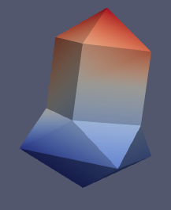

Basic concepts
==============

Your're invited to start here.

This section explains in a concise way fundamental concepts
(incarnated by classes) for a better understanding of examples in FAQ_.

.. _FAQ: ../../developer/faq.html

The objects presented in this section are objects dedicated to data manipulation.

Later in advanced section, other objects will be presented to more complex data, as composite of objects presented here.

medcoupling Fields
------------------
The most fundamental object is field. Fields are incarnated by MEDCouplingFieldDouble_.

.. _MEDCouplingFieldDouble: ../../developer/classMEDCoupling_1_1MEDCouplingFieldDouble.html

A field is an object able to give a value on every points geometrically covered by its support. The field support is a :ref:`mesh <medcoupling_Meshes>`.

Depending on the physics relative to the field, medcoupling fields proposes different spatial discretizations : cells, nodes, Gauss points.

The spatial discretization defines an algorithm giving the value of field on point given the position of a point inside the domain covered by the :ref:`mesh <medcoupling_Meshes>` and an :ref:`array <medcoupling_Arrays>` of float, integers located on specific location of mesh.

.. A tiny image of field

.. _medcoupling_Meshes:

medcoupling Meshes
------------------

Meshes are incarnated by MEDCouplingMesh_ (and their subclasses).
A mesh contains cells and nodes (indifferently called points). A
cell has a geometric type (TRI3, QUAD4, TETRA4).

.. _MEDCouplingMesh: ../../developer/classMEDCoupling_1_1MEDCouplingUMesh.html

All cells contained in a medcoupling mesh must have the same
dimension. This dimension is called meshdimension.

The set of points of a medcoupling mesh are stored into coordinates
:ref:`array <medcoupling_Arrays>`. The number of components of coordinates of coordinates
array is called the space dimension.

The space dimension is always greater or equal to mesh dimension.

.. _medcoupling_Arrays:

medcoupling Arrays
------------------

One of the challenges faced by medcoupling is the reduction of memory
footprints. In medcoupling, memory expensive attributes are arrays
or composite of arrays.

To do so, medcoupling arrays represent contiguous arrays in the most
compact way to guaranty at most locality.

The type of elements contained in arrays is fix. Today int32,
float32 and float64 arrays are available. Elements in arrays are
grouped into fixed size packets called tuple.

This size of every tuple is called number of components.

Consequently number of elements in an array is equal to number of
tuples times number of components.

A typical usage of medcoupling array is for coordinates of points
storage. Number of components will be equal to space dimension and
number of tuples will be equal to number of points.

A medcoupling array has a name. And each component of array has also
a name. The component name use the following convention to put an
optional unity ("X cote [mm]").

If you are already a fan of `numpy <http://docs.scipy.org/doc/>`_ (you're right
it's an amazing/wonderful standard package), medcoupling arrays
behaves just like numpy arrays and anyway there are zero copy
gateways between medcoupling arrays and numpy.

medcoupling arrays implement different algorithms like reordering,
cloud comparisons, arithmetic, geometry helpers in addition to algorithms
proposed by numpy.

