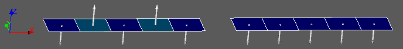

Data analysis
=============

Object size in memory
---------------------

medcoupling provides information on memory occupied by every object: mesh, field, array etc.:

.. literalinclude:: ../../../src/MEDCoupling_Swig/UsersGuideExamplesTest.py
   :start-after: UG_MEDCouplingFieldDouble_4
   :end-before:  UG_MEDCouplingFieldDouble_4

Extract data
------------

.. _extract_for_meshes:

Extract for meshes
~~~~~~~~~~~~~~~~~~

If *m* is a mesh (MEDCouplingUMesh) and *Ids* a list of cell ids, you can extract the mesh ids by simply doing :

.. literalinclude:: ../../../src/MEDCoupling_Swig/UsersGuideExamplesTest.py
   :start-after: UG_ExtractForMeshes_0
   :end-before:  UG_ExtractForMeshes_0

   
   *m* (to the left) and *part* extracted by calling m[1,2,4,5,7,8] (to the right)

.. note:: in medcoupling ids count from zero unlike SMESH where they count from one.

*part* is also a MEDCouplingUMesh with same coordinates than *m*. Reason is that medcoupling tries to reduce memory effort.
                 
But it's highly likely that some nodes in part will be not fetched by part.

It can be interesting to locate the fetched nodes.

.. literalinclude:: ../../../src/MEDCoupling_Swig/UsersGuideExamplesTest.py
   :start-after: UG_ExtractForMeshes_1
   :end-before:  UG_ExtractForMeshes_1

   
   part.computeFetchedNodeIds() returns [1, 2, 3, 4, 5, 6, 7, 8, 9, 10, 11, 12, 13, 14, 15, 16]. Ids 0 and 17 are not fetched

To extract coordinates, simply invoke

.. literalinclude:: ../../../src/MEDCoupling_Swig/UsersGuideExamplesTest.py
   :start-after: UG_ExtractForMeshes_2
   :end-before:  UG_ExtractForMeshes_2

It can be interesting to reduce set of points *part* is lying on. Simply by doing.

.. literalinclude:: ../../../src/MEDCoupling_Swig/UsersGuideExamplesTest.py
   :start-after: UG_ExtractForMeshes_3
   :end-before:  UG_ExtractForMeshes_3

Or it can be interesting for further data handling to have both reduction and array.

.. literalinclude:: ../../../src/MEDCoupling_Swig/UsersGuideExamplesTest.py
   :start-after: UG_ExtractForMeshes_4
   :end-before:  UG_ExtractForMeshes_4

To have more information about *o2n* read renumbering_ section.

.. _renumbering: ../../developer/numbering.html                 

Extraction in meshes often leads to locate cells/nodes regarding their neighborhood.

Let's consider *m2* 3D mesh. To locate nodes on boundaries simply invoke :

.. literalinclude:: ../../../src/MEDCoupling_Swig/UsersGuideExamplesTest.py
   :start-after: UG_ExtractForMeshes_5
   :end-before:  UG_ExtractForMeshes_5

And now to extract cells lying on boundary nodes simply call :

.. literalinclude:: ../../../src/MEDCoupling_Swig/UsersGuideExamplesTest.py
   :start-after: UG_ExtractForMeshes_6
   :end-before:  UG_ExtractForMeshes_6

False means if a cell has at least one node in *bn*, take it. True means if all nodes of cell are in *bn*, take it.

If a mesh consists of several contiguous zones of cells, it is possible to retrieve cell ids of each zone:

   A mesh with two zones
   
.. literalinclude:: ../../../src/MEDCoupling_Swig/UsersGuideExamplesTest.py
   :start-after: UG_ExtractForMeshes_20
   :end-before:  UG_ExtractForMeshes_20

Zones returned by partitionBySpreadZone are::

   [[0, 1], [2, 3]]

Extract for arrays
~~~~~~~~~~~~~~~~~~

Arrays are the common entry point to selection. If *arr* is a 2 component DataArrayDouble you can locate tuple ids by finding those whose first component is in [a,b):

.. literalinclude:: ../../../src/MEDCoupling_Swig/UsersGuideExamplesTest.py
   :start-after: UG_ExtractForArrays_0
   :end-before:  UG_ExtractForArrays_0

Or you can find tuples whose magnitude is in [c,d):

.. literalinclude:: ../../../src/MEDCoupling_Swig/UsersGuideExamplesTest.py
   :start-after: UG_ExtractForArrays_1
   :end-before:  UG_ExtractForArrays_1

To find which of *tupleIds* are missing from *tupleIds1*, call

.. literalinclude:: ../../../src/MEDCoupling_Swig/UsersGuideExamplesTest.py
   :start-after: UG_ExtractForArrays_2
   :end-before:  UG_ExtractForArrays_2

Extract for fields
~~~~~~~~~~~~~~~~~~

If *field4* is a MEDCouplingFieldDouble, you can extract a sub-part of *field4* on a specified cell ids *ids4* by doing

.. literalinclude:: ../../../src/MEDCoupling_Swig/UsersGuideExamplesTest.py
   :start-after: UG_ExtractForFields_0
   :end-before:  UG_ExtractForFields_0

.. note:: It works whatever the spatial discretization of *field4*

   
   A field on nodes (to the left) and its sub-field on a half of nodes (to the right)

You can extract a field on plane by cutting *field5* like this:

.. literalinclude:: ../../../src/MEDCoupling_Swig/UsersGuideExamplesTest.py
   :start-after: UG_ExtractForFields_1
   :end-before:  UG_ExtractForFields_1

The plane is defined by its *origin* and its normal vector *normvec*. The last argument is a half-thickness of the plane.

.. note:: It works for fields on cells only

   
   A field on cells (to the left) and a sub-field on a plane (to the right)

Geometric handling of unstructured meshes
-----------------------------------------

Consider *m2* as a 3D MEDCouplingUMesh instance. You can translate it by simply

.. literalinclude:: ../../../src/MEDCoupling_Swig/UsersGuideExamplesTest.py
   :start-after: UG_ExtractForMeshes_7
   :end-before:  UG_ExtractForMeshes_7

Which is equivalent to

.. literalinclude:: ../../../src/MEDCoupling_Swig/UsersGuideExamplesTest.py
   :start-after: UG_ExtractForMeshes_8
   :end-before:  UG_ExtractForMeshes_8

Samely you can simply rotate it around the point [1,2,1] along Y axis with an angle of pi/3 by doing

.. literalinclude:: ../../../src/MEDCoupling_Swig/UsersGuideExamplesTest.py
   :start-after: UG_ExtractForMeshes_9
   :end-before:  UG_ExtractForMeshes_9

Which is equivalent to

.. literalinclude:: ../../../src/MEDCoupling_Swig/UsersGuideExamplesTest.py
   :start-after: UG_ExtractForMeshes_10
   :end-before:  UG_ExtractForMeshes_10

To scale *m2* relative to point [1,2,4] by a factor of 6, call

.. literalinclude:: ../../../src/MEDCoupling_Swig/UsersGuideExamplesTest.py
   :start-after: UG_ExtractForMeshes_17
   :end-before:  UG_ExtractForMeshes_17

It can also interesting to retrieve volume of cells in m2 (resp area, length in 2D, 1D):

.. literalinclude:: ../../../src/MEDCoupling_Swig/UsersGuideExamplesTest.py
   :start-after: UG_ExtractForMeshes_11
   :end-before:  UG_ExtractForMeshes_11

*volPerCell* is a field on cell (MEDCouplingFieldDouble). *True* means I don't care of cell orientation. *False* tells I care of cell orientation using signed values.

   Area field of a cartesian mesh

You can compute total volume covered by mesh by doing

.. literalinclude:: ../../../src/MEDCoupling_Swig/UsersGuideExamplesTest.py
   :start-after: UG_ExtractForMeshes_12
   :end-before:  UG_ExtractForMeshes_12

You also can locate cells (using *cellIds*) having volume greater than a threshold *t1*:

.. literalinclude:: ../../../src/MEDCoupling_Swig/UsersGuideExamplesTest.py
   :start-after: UG_ExtractForMeshes_13
   :end-before:  UG_ExtractForMeshes_13

In this case it is easy to :ref:`build a sub-mesh<extract_for_meshes>` containing cells having a volume higher than *t1*:

.. literalinclude:: ../../../src/MEDCoupling_Swig/UsersGuideExamplesTest.py
   :start-after: UG_ExtractForMeshes_14
   :end-before:  UG_ExtractForMeshes_14

There are other common geometric methods on meshes:

.. literalinclude:: ../../../src/MEDCoupling_Swig/UsersGuideExamplesTest.py
   :start-after: UG_ExtractForMeshes_15
   :end-before:  UG_ExtractForMeshes_15

*centers* will be a DataArrayDouble giving for each cell of *m2* its center of mass.

It's possible to compute a DataArrayDouble giving the center of mass of *m2* simply by doing

.. literalinclude:: ../../../src/MEDCoupling_Swig/UsersGuideExamplesTest.py
   :start-after: UG_ExtractForMeshes_16
   :end-before:  UG_ExtractForMeshes_16

Iso barycenter of nodes constituting each cell can be computed by calling

.. literalinclude:: ../../../src/MEDCoupling_Swig/UsersGuideExamplesTest.py
   :start-after: UG_ExtractForMeshes_19
   :end-before:  UG_ExtractForMeshes_19

*ibc* will be a DataArrayDouble.

You can retrieve a field (MEDCouplingFieldDouble) of unitary vectors normal to cells:

.. literalinclude:: ../../../src/MEDCoupling_Swig/UsersGuideExamplesTest.py
   :start-after: UG_ExtractForMeshes_18
   :end-before:  UG_ExtractForMeshes_18

.. figure:: ../images/ortho_field.png
   :align: center

   A skin mesh with a normal field on it computed by buildOrthogonalField method

You also have a set of methods to caracterize mesh quality: getEdgeRatioField, getAspectRatioField, getWarpField, getSkewField, computeDiameterField.

medcoupling provides methods to intersect 2D meshes in 2D space. MEDCouplingUMesh.Intersect2DMeshWith1DLine partitions a 2D and a 1D mesh:

.. literalinclude:: ../../../src/MEDCoupling_Swig/UsersGuideExamplesTest.py
   :start-after: UG_ExtractForMeshes_21
   :end-before:  UG_ExtractForMeshes_21

The last argument is a precision used to perform intersections and localization operations.

   2D and 1D meshes before and after intersection

Intersect2DMeshWith1DLine returns new 2D and 1D meshes and two arrays. *a2d* gives for each cell in *m2d* the id in *mesh2d* it comes from. *a1d* is an array of pair that gives for each cell id i in *m1d* the cell in *md2* on the left for the 1st component and the cell in *m2d* on the right for the 2nd component. -1 means no cell.

For the example in the picture above *a2d* is::

  [0, 4, 1, 1, 2, 2, 3, 3]

and *a1d* is::

  [-1, -1, -1, -1, 2, 3, 4, 5, 4, 5, 6, 7, 6, 7, -1, -1, -1, -1]

There also a method to partition a 2D mesh by another 2D mesh:

.. literalinclude:: ../../../src/MEDCoupling_Swig/UsersGuideExamplesTest.py
   :start-after: UG_ExtractForMeshes_22
   :end-before:  UG_ExtractForMeshes_22

   Two 2D meshes before partitioning (to the left) and a result mesh after partitioning (to the right)

Intersect2DMeshes returns a new 2D mesh and two arrays. *a1* gives for each result cell an id of the cell of *mesh1* it comes from. *a2* for each result cell gives an id of the cell of *mesh2* it comes from.

You can compute distance from a set of points to cells of a mesh by calling

.. literalinclude:: ../../../src/MEDCoupling_Swig/UsersGuideExamplesTest.py
   :start-after: UG_ExtractForMeshes_23
   :end-before:  UG_ExtractForMeshes_23

This method returns distance and a closest cell id for each of given *points*. *points* is a DataArrayDouble with 3 components. Returned *dist* is a DataArrayDouble and *cells* is a DataArrayInt.

Mesh comparison
---------------

It is a common question. You have two meshes *m1* and *m2* coming from 2 different sources (2 files) and expected to be more or less equivalent.

medcoupling proposes some methods to help to caracterize equivalence of these 2 meshes.

The first, the strongest, is informatical equality:

.. literalinclude:: ../../../src/MEDCoupling_Swig/UsersGuideExamplesTest.py
   :start-after: UG_MeshComparison_0
   :end-before:  UG_MeshComparison_0

*eps* is the tolerance in coordinates.

If true is returned, you are lucky.

Sometimes only names (and or component names or units) are not the same:

.. literalinclude:: ../../../src/MEDCoupling_Swig/UsersGuideExamplesTest.py
   :start-after: UG_MeshComparison_1
   :end-before:  UG_MeshComparison_1

But sometime the last call also returns False. It may mean that there is a permutation of nodes and or cells.

If you know by construction that *m1* and *m2* share the same coords object:

.. literalinclude:: ../../../src/MEDCoupling_Swig/UsersGuideExamplesTest.py
   :start-after: UG_MeshComparison_2
   :end-before:  UG_MeshComparison_2

checkGeoEquivalWith returns 2 elements. The first one is relative to cells and the second one is relative to nodes.

If the mapping between *m1* and *m2* is impossible regarding the specified code an exception is thrown.
Code meaning:

  - 20=2*10+0. 2 tells I know that coords are the same. 0 tells two cells are equal if and only if their connectivity is exactly the same.
  - 21=2*10+1. 2 tells I know that coords are the same. 1 tells two cells are equal if and only if their connectivity is equal within a circular permutation.
  - 22=2*10+2 . 2 tells I know that coords are the same. 2 tells two cells are equal if and only if nodes set is the same independently from :ref:`order <renumber_for_MED>`.

If you expect that two meshes are geometrically the same without knowing if there is any cell/node permutation use code 12:

.. literalinclude:: ../../../src/MEDCoupling_Swig/UsersGuideExamplesTest.py
   :start-after: UG_MeshComparison_3
   :end-before:  UG_MeshComparison_3

Code meaning: 12=1*10+2. 1 tells coords can be different. 2 tells two cells are equal if and only if nodes set is the same independently from order.

.. admonition:: Remark

   *a* and/or *b* may be *None*. It's not a bug it only means that renumbering is equal to identity, meaning that no associated permutation is needed.

Common handling mesh
--------------------

*field1* is a node field containing non simplex cells. simplexize on field1.getMesh() can help to
overpass this limitation.

.. literalinclude:: ../../../src/MEDCoupling_Swig/UsersGuideExamplesTest.py
   :start-after: UG_CommonHandlingMesh_0
   :end-before:  UG_CommonHandlingMesh_0

   Initial mesh (to the left) and its simplexization (to the right)

.. admonition:: Remark

   The mesh has been modified by simplexize. This method of simplexization is fast but leads to non conform mesh that can be a problem in some context

tetrahedrize method is dedicated to simplexization of 3D meshes only. It can create a conform mesh. Unlike simplexize method, tetrahedrize method can add new points to the result mesh.

.. literalinclude:: ../../../src/MEDCoupling_Swig/UsersGuideExamplesTest.py
   :start-after: UG_CommonHandlingMesh_15
   :end-before:  UG_CommonHandlingMesh_15

The argument specifies how to split hexahedral cells. it must be in (PLANAR_FACE_5, PLANAR_FACE_6, GENERAL_24, GENERAL_48). 
*n2ocells* is a DataArrayInt holding, for each new cell, an id of old cell producing it. 
*np* is a number of new points.

Using medcoupling you can create a 3D extruded mesh. To do that you need a 2D mesh and a 1D mesh, which defines the vector of extrusion and the number of steps. The both meshes must be in 3D space. To extrude a 2D mesh *m2* along a 1D mesh *m1*, call

.. literalinclude:: ../../../src/MEDCoupling_Swig/UsersGuideExamplesTest.py
   :start-after: UG_CommonHandlingMesh_1
   :end-before:  UG_CommonHandlingMesh_1

The last argument is a policy defining the type of extrusion:

* 0 means "translation only": the cells of the 1D mesh represent the vectors along which the 2D mesh will be repeated to build each level. 
* 1 means "translation and rotation": the translation is done as above. For each level, an arc of circle is fitted on the 3 preceding points of the 1D mesh. The center of the arc is the center of rotation for each level, the rotation is done along an axis normal to the plane containing the arc, and finally the angle of rotation is defined by the first two points on the arc.

   A 2D mesh and an 1D mesh (to the left), an extrusion mesh built with policy=0 (in the middle) and with policy=1 (to the right)

In order to aggregate several meshes of the same dimension into one mesh, call

.. literalinclude:: ../../../src/MEDCoupling_Swig/UsersGuideExamplesTest.py
   :start-after: UG_CommonHandlingMesh_2
   :end-before:  UG_CommonHandlingMesh_2

To transform a linear mesh into a quadratic one, call

.. literalinclude:: ../../../src/MEDCoupling_Swig/UsersGuideExamplesTest.py
   :start-after: UG_CommonHandlingMesh_3
   :end-before:  UG_CommonHandlingMesh_3

A parameter of convertLinearCellsToQuadratic provides type of conversion:

* 0 creates cells of simple quadratic types, e.g. NORM_TRI6 and NORM_QUAD8
* 1 creates cells of complex quadratic types, e.g. NORM_TRI7 and NORM_QUAD9

   Result quadratic 2D meshes converted with typeOfConversion=0 (to the left) and typeOfConversion=1 (to the right)

It's common to deduce skin of a mesh *m1*:

.. literalinclude:: ../../../src/MEDCoupling_Swig/UsersGuideExamplesTest.py
   :start-after: UG_CommonHandlingMesh_4
   :end-before:  UG_CommonHandlingMesh_4

*skin* and *m1* share the same coordinate array.

   A 2D mesh (to the left) and its skin (to the right)

.. _explodeIntoEdges:

In order to get a 1D mesh from a given 2D or 3D mesh, call

.. literalinclude:: ../../../src/MEDCoupling_Swig/UsersGuideExamplesTest.py
   :start-after: UG_CommonHandlingMesh_6
   :end-before:  UG_CommonHandlingMesh_6

In addition to *mesh1d*, explodeIntoEdges method returns four arrays describing descending connectivity and reverse descending connectivity in indirect-indexing_ format. *d* and *di* describe the descending connectivity, i.e. enumerate cells of *mesh1d* bounding each cell of *mesh3d*. *r* and *ri* describe the reverse descending connectivity, i.e. enumerate cells of *mesh3d* bounded by each cell of *mesh1d*.

.. _indirect-indexing: ../../developer/numbering.html#numbering-indirect

   A 2D mesh (to the left) and a 1D mesh returned by explodeIntoEdges (to the right)

There is also a method similar to explodeIntoEdges_ which returns a mesh of one less dimensions than a given mesh, i.e. 3D->2D or 2D->1D:

.. literalinclude:: ../../../src/MEDCoupling_Swig/UsersGuideExamplesTest.py
   :start-after: UG_CommonHandlingMesh_7
   :end-before:  UG_CommonHandlingMesh_7

If a mesh is non-conformal, medcoupling can make it conformal. conformize2D method is to conformize a 2D mesh in 2D space, conformize3D is to conformize a 3D mesh in 3D space:

.. literalinclude:: ../../../src/MEDCoupling_Swig/UsersGuideExamplesTest.py
   :start-after: UG_CommonHandlingMesh_8
   :end-before:  UG_CommonHandlingMesh_8

*changedCells* is an array of ids of changed cells. The changed cells become polygons in 2D and polyhedrons in 3D. *eps* is the relative error to detect merged edges.

You can duplicate some nodes in a mesh by calling

.. literalinclude:: ../../../src/MEDCoupling_Swig/UsersGuideExamplesTest.py
   :start-after: UG_CommonHandlingMesh_9
   :end-before:  UG_CommonHandlingMesh_9

This will create new nodes at locations of nodes #3 and #4, the new nodes will replace nodes #3 and #4 within cells so that the nodes #3 and #4 will become orphan.

Inversly it is possible to merges nodes equal within a given precision:

.. literalinclude:: ../../../src/MEDCoupling_Swig/UsersGuideExamplesTest.py
   :start-after: UG_CommonHandlingMesh_16
   :end-before:  UG_CommonHandlingMesh_16

If your 2D mesh in 3D space includes incorrectly oriented cells, you can fix their orientation by calling:

.. literalinclude:: ../../../src/MEDCoupling_Swig/UsersGuideExamplesTest.py
   :start-after: UG_CommonHandlingMesh_11
   :end-before:  UG_CommonHandlingMesh_11

The last argument if True, only polygons are checked, else, all cells are checked. 

   A mesh before applying orientCorrectly2DCells (to the left) and after (to the right)

If your mesh includes incorrectly oriented polyhedra, the following method can help to fix your mesh:

.. literalinclude:: ../../../src/MEDCoupling_Swig/UsersGuideExamplesTest.py
   :start-after: UG_CommonHandlingMesh_12
   :end-before:  UG_CommonHandlingMesh_12

If *m1d* is a 1D line mesh, you can ensure consecutive order of its segments by calling

.. literalinclude:: ../../../src/MEDCoupling_Swig/UsersGuideExamplesTest.py
   :start-after: UG_CommonHandlingMesh_10
   :end-before:  UG_CommonHandlingMesh_10

   1D mesh before and after renumbering

orderConsecutiveCells1D method returns a permutation map in new-to-old_ mode but renumberCells method requires the map in old-to-new_ mode, hence we use invertArrayN2O2O2N method to fit to that requirement.

.. _new-to-old: ../../developer/numbering.html#MEDCouplingArrayRenumberingN2O

.. _old-to-new: ../../developer/numbering.html#MEDCouplingArrayRenumberingO2N

.. _renumber_for_MED:

To arrange cells to comply with MED format requirement you can call either of the following methods:

.. literalinclude:: ../../../src/MEDCoupling_Swig/UsersGuideExamplesTest.py
   :start-after: UG_CommonHandlingMesh_13
   :end-before:  UG_CommonHandlingMesh_13

It is also possible to rearrange, and even remove, nodes by calling renumberNodes:

.. literalinclude:: ../../../src/MEDCoupling_Swig/UsersGuideExamplesTest.py
   :start-after: UG_CommonHandlingMesh_14
   :end-before:  UG_CommonHandlingMesh_14

The code above rearranges a mesh  with 4 nodes so that old node #0 becomes #2, old node #1 remains #1, old node #2 becomes #0, old node #3 is removed. The last argument 3 means that number of nodes becomes 3. 

   The mesh before renumberNodes (to the left) and after (to the right). Shown Ids are a unit more than Ids in medcoupling

Operations on fields
--------------------

Integral of a *field* can be computed by calling

.. literalinclude:: ../../../src/MEDCoupling_Swig/UsersGuideExamplesTest.py
   :start-after: UG_MEDCouplingFieldDouble_9
   :end-before:  UG_MEDCouplingFieldDouble_9

The first call returns a list of integrals of all components. The second, returns integral of 0-th component. True means that abs is applied to support size used for computing the integral.

deviator method returns the stress deviator tensor field of a stress tensor *field* (with 6 components):

.. literalinclude:: ../../../src/MEDCoupling_Swig/UsersGuideExamplesTest.py
   :start-after: UG_MEDCouplingFieldDouble_10
   :end-before:  UG_MEDCouplingFieldDouble_10

To get value of a *field* at certain *points* call

.. literalinclude:: ../../../src/MEDCoupling_Swig/UsersGuideExamplesTest.py
   :start-after: UG_MEDCouplingFieldDouble_8
   :end-before:  UG_MEDCouplingFieldDouble_8

