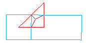

Data conversion
===============

medcoupling includes MEDCouplingRemapper object that allows given a
source field and a target mesh to produce a field lying on target
mesh.

MEDCouplingRemapper goal is to compute a projection by minimizing
diffusive effects and conserve at most the magnitude of key
variables.

The MEDCouplingRemapper object computes a remap function that allows
to transform source field into target field.

The function is represented using sparse matrix given:

  - a source mesh
  - a target mesh
  - a source spatial discretization ("P0" means ON_CELLS and "P1" means ON_NODES)
  - a target spatial discretization

Apply a projection is then equivalent to apply matrix vector
multiply.

As projection requires mathematically to compute for every cell in
target mesh, the contribution relative to each of cell in source
mesh. So projection is computation-intensive task.

To optimize time spent by MEDCouplingRemapper, it implements a fast
algorithm that select coarsely the pairs of cells that have a chance
to be in interaction each other.
It allows to drop from O(n^2) to O(n) the complexity of algorithm.
The algorithm is based on rectilinear bounding boxes of cells along
axis. 2 cells in interaction have their respective bounding boxes in
interaction.

Unfortunately it works well mathematically but in the real life
projections especially when spacedim and meshdim are not the same it
can be harder to set.

.. _projection_P0P0:

Projection cells/cells with meshes having same mesh dimension/space dimension
-----------------------------------------------------------------------------

Let us create meshes for sample projection: a source mesh consisting of two quadrangles and a target mesh consisting of a triangle:

   Two source quadrangles in blue and a target triangle in red

.. literalinclude:: ../../../src/MEDCoupling_Swig/UsersGuideExamplesTest.py
   :start-after: UG_Projection_0
   :end-before:  UG_Projection_0

Now perform projection:

.. literalinclude:: ../../../src/MEDCoupling_Swig/UsersGuideExamplesTest.py
   :start-after: UG_Projection_1
   :end-before:  UG_Projection_1

Here "P0P0" specifies spatial discretization of both source and target field. "P0" is for cell discretization (ON_CELLS). "P1" is for node discretization (ON_NODES). For example, "P0P1" means from a source cell field (lying on a source mesh) to a target node field (lying on a target mesh).

Remapper *rem* has just performed intersection of *src* and *tgt* meshes. Result of intersection is stored in a matrix which is returned by getCrudeMatrix method. Each element of the matrix is size of intersection of two cells i and j of the source and target meshes correspondingly. 

Generally the matrix is sparse. To reduce memory usage, the space matrix is represented by an array whose i-th element is a map storing indices and intersection sizes of source cells intersecting i-th target cell.

Here is a sample sparse matrix:

.. math::

   \begin{bmatrix}
       11 & 0  & 0  & 0  \\
       0  & 0  & 32 & 0  \\
       0  & 0  & 33 & 43 \\
       14 & 24 & 0  & 0  \\
       0  & 25 & 0  & 45
   \end{bmatrix}

and a corresponding array, which stores only non-zero matrix elements:

::

  [{0: 11, 3: 14}, {3: 24, 4: 25}, {1: 32, 2: 33}, {2: 43, 4: 45}]

Now we create a field on all cells of *src* mesh and call rem.transferField() to transfer the field to the cells of *tgt* mesh

.. literalinclude:: ../../../src/MEDCoupling_Swig/UsersGuideExamplesTest.py
   :start-after: UG_Projection_2
   :end-before:  UG_Projection_2

The last argument -1 is a default value that will be assigned in *trgF* to each entity of *tgt* mesh that is not intercepted by any entity of *src* mesh.

It is crucial to setNature() of the field by which an adequate interpolation formula is chosen. The field nature is expressed by one of the following values:  ExtensiveMaximum, IntensiveMaximum, ExtensiveConservation, IntensiveConservation.

The field is represented by a vector with a discrete value on each cell. This value can represent either

* an average value of the field in the cell (average density, velocity or temperature in the cell) in which case the representation is said to be **intensive**,
* an integrated value over the cell (total mass, power of the cell) in which case the representation is said to be **extensive**.

In the case where the source and target meshes are not fully overlapping, it is important to make a correct choice between Maximum and Conservation. 

* **Conservation** means that the interpolation algorithm preserves the integral of the field over a domain.
* **Maximum** means that the field values resulting from the interpolation remain between the upper and lower bounds of the original field.

Projection cells/nodes nodes/cells nodes/nodes with meshes having same mesh dimension/space dimension
-----------------------------------------------------------------------------------------------------

Suppose we have the same source and target meshes as in the :ref:`previous chapter <projection_P0P0>`. I.e. the source mesh consists of two quadrangles and the target mesh consists of a triangle. 

   Two source quadrangles in blue and a target triangle in red

The source field is also on cells but the target field is on **nodes** of target mesh. In such a case we do the following:

.. literalinclude:: ../../../src/MEDCoupling_Swig/UsersGuideExamplesTest.py
   :start-after: UG_Projection_3
   :end-before:  UG_Projection_3

Here "P0P1" specifies support of the source (P0=ON_CELLS) and the target (P1=ON_NODES) fields. The computed martix is::

  [{0: 0.125, 1: 0.04166666666666663}, {1:0.16666666666666669}, {1: 0.041666666666666685}]

The result matrix contains values for each of the three nodes of the target mesh. In order to be able to compute these values by means of intersection of cells, an algorithm constructs an auxiliary target mesh. This auxiliary mesh is a dual mesh of the actual target mesh, hence it includes cells corresponding to each actual target node.

   The target mesh used for projection is a dual one of the actual target mesh

If the case is reverse, i.e. the source field is on nodes and the target one should be on cells, we change "P0P1" to "P1P0":

.. literalinclude:: ../../../src/MEDCoupling_Swig/UsersGuideExamplesTest.py
   :start-after: UG_Projection_4
   :end-before:  UG_Projection_4

The computed martix is::

  [{1: 0.07291666666666663, 4: 0.375}]

In the same way as in "P0P1" case, an auxiliary dual mesh is internally constructed for a mesh supporting a field on nodes (the source field in our case). But since the source cells are not simplexes, simplexization of quadrangles is perfrormed on the fly to be able to construct the dual mesh. Cell #0 (0,3,4,1) is split into (0,3,4) and (0,4,1)

   The source mesh used for projection is a dual one of simplexized actual source mesh

.. |br| raw:: html
 
   

.. note:: in present implementation of Remapper, the projection of fields on nodes lying on quadratic meshes is not available. If you are in this case you have 2 choices :|br|
   1) you accept to lose precision by converting your mesh (MEDCouplingUMesh.convertLinearCellsToQuadratic) |br|
   2) you subdivide your mesh.

Projection cell/cell when meshdim != spacedim
---------------------------------------------

When meshdim is not equal to spacedim some additional important parameters should be considered.

Consider a simple case with spacedim=3 and meshdim=2 where :

 - source mesh contains one triangle cell [0.,0.,0.], [1,0,0], [0,1,0]
 - target mesh also contains one triange cell [0.,0.,0.], [1,0,0], [0,1,0], which coincides with the source triangle.

Only "P0P0" projection (ON_CELLS->ON_CELLS) will be considered here but all elements presented here are applicable for other spatial discretizations projections.

.. literalinclude:: ../../../src/MEDCoupling_Swig/UsersGuideExamplesTest.py
   :start-after: UG_Projection_5
   :end-before:  UG_Projection_5

A remapper returns the following correct matrix::

  [{0: 0.5}]

where 0.5 is equal to area of the source (or target) triangle.

Let us see what the remapper will return if the meshes are not overlapping. To this end we translate  the source mesh along its normal by a small distance (1e-3):

.. literalinclude:: ../../../src/MEDCoupling_Swig/UsersGuideExamplesTest.py
   :start-after: UG_Projection_6
   :end-before:  UG_Projection_6

The remapper returns the following matrix, which means that it have not found any intersection of the meshes::

  [{}]

This happens because bounding boxes of cells used to detect possibly intersecting cells do not intersect. In order to get a correct result of intersection we can increase those bounding boxes. The remapper provides two ways to do that:

- rem.setBoundingBoxAdjustmentAbs( *thickness* ) expands a bounding box by *thickness*.
- rem.setBoundingBoxAdjustment( *factor* ) expands a bounding box by thickness computed by multiplying a maximal bounding box size by *factor*.

   If source and target meshes do not overlap we can increase their bounding boxes to help remapper to detect intersecting cells

.. literalinclude:: ../../../src/MEDCoupling_Swig/UsersGuideExamplesTest.py
   :start-after: UG_Projection_7
   :end-before:  UG_Projection_7

With bounding box tuning we obtain the correct result matrix::

  [{0: 0.5}]

The bounding box tuning has a disadvantage in the case where a cell has large angle with either of planes OXY, OYZ or OXZ. In such a case cells that are rather far one from another can be detected as possibly intersecting since their bounding boxes are too large. setMaxDistance3DSurfIntersect method helps avoiding excess intersections. If a distance between fast barycenter of target cell and medium source plane is more than the value specified via setMaxDistance3DSurfIntersect then cell intersection is not performed.

   If the tuned bounding box is too large we can use setMaxDistance3DSurfIntersect to exclude unnecessary intersections

Let us rotate the source mesh by pi/4 angle around Y axis. The result matrix is

.. literalinclude:: ../../../src/MEDCoupling_Swig/UsersGuideExamplesTest.py
   :start-after: UG_Projection_8
   :end-before:  UG_Projection_8

::

  [{0: 0.46155716207961217}]

If we use setMaxDistance3DSurfIntersect, the result matrix shows that no intersection found:

.. literalinclude:: ../../../src/MEDCoupling_Swig/UsersGuideExamplesTest.py
   :start-after: UG_Projection_9
   :end-before:  UG_Projection_9

::

  [{}]

Another function useful to avoid unnecessary intersection is setMinDotBtwPlane3DSurfIntersect. It tells the remapper not to intersect cells whose normals are too much different. setMinDotBtwPlane3DSurfIntersect specifies minimal dot product of unitary normal vectors of a source and target cells.

Let us switch off setMaxDistance3DSurfIntersect by passing a negative value. And use setMinDotBtwPlane3DSurfIntersect to avoid intersecting cells that has 45 degrees angle between their normals in our case.

.. literalinclude:: ../../../src/MEDCoupling_Swig/UsersGuideExamplesTest.py
   :start-after: UG_Projection_10
   :end-before:  UG_Projection_10

Result matrix is::

  [{}]
