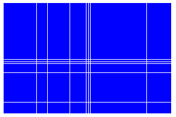
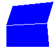

Data movement (mesh/field construction)
=======================================

Read Mesh from file
-------------------

To read a mesh from a MED file simply invoke

.. literalinclude:: ../../../src/MEDLoader/Swig/UsersGuideExamplesTest.py
   :start-after: UG_ReadMeshFromFile_1
   :end-before:  UG_ReadMeshFromFile_1

If the file contains more than one mesh, the previous call will
return the first one.

You can access to a precise mesh by doing

.. literalinclude:: ../../../src/MEDLoader/Swig/UsersGuideExamplesTest.py
   :start-after: UG_ReadMeshFromFile_2
   :end-before:  UG_ReadMeshFromFile_2

Read field from file
--------------------

.. literalinclude:: ../../../src/MEDLoader/Swig/UsersGuideExamplesTest.py
   :start-after: UG_ReadField_1
   :end-before:  UG_ReadField_1

This command will succeed if there is exactly one field in
"file.med" and only one time step attached to it.

If there are more than one field in "file.med" you are expected to
specify the field name.

To know all fields in "file.med" either you read exception thrown or you can invoke

.. literalinclude:: ../../../src/MEDLoader/Swig/UsersGuideExamplesTest.py
   :start-after: UG_ReadField_2
   :end-before:  UG_ReadField_2

When you have the fieldName you can safely invoke.

.. literalinclude:: ../../../src/MEDLoader/Swig/UsersGuideExamplesTest.py
   :start-after: UG_ReadField_3
   :end-before:  UG_ReadField_3

This command will succeed if there are exactly one time step
attached on it. If no you are expected to specify the time step
attached on it.

A time step is identified by two piece of information :

- pair of integers specifying without ambiguity a key for access
- floating point (physical time step)

To retrieve list of time step of a field invoke

.. literalinclude:: ../../../src/MEDLoader/Swig/UsersGuideExamplesTest.py
   :start-after: UG_ReadField_4
   :end-before:  UG_ReadField_4

This method returns a list of triplet. The first 2 elements of
triplets is pair of integers of time step and the last element in
the triplet is the physical time step.

To read a field "Field1" at time step defined by pair "(ts0,ts1)"
you can invoke

.. literalinclude:: ../../../src/MEDLoader/Swig/UsersGuideExamplesTest.py
   :start-after: UG_ReadField_5
   :end-before:  UG_ReadField_5

If you do not succeed reading field in "file.med" using this method
it means that your MED file is complex and requires more information
to be extracted. :ref:`Go to advanced reading<medcoupling_AdvancedReading>`.

.. admonition:: Remark

   the method is concise but by calling this method several
   times it leads to a several mesh loads.

.. _medcoupling_Write_mesh:
   
Write mesh into file
--------------------

MED file format expects a mesh sorted by geometric type. You are
responsible to reorder, if needed, cells to match MED file format
requirements.

This responsability is let to the end user to avoid misrenumbering effect.

You can check this by invoking:

.. literalinclude:: ../../../src/MEDLoader/Swig/UsersGuideExamplesTest.py
   :start-after: UG_ReadMeshFromFile_3
   :end-before:  UG_ReadMeshFromFile_3

To reorder cells you are encouraged to read :ref:`this <renumber_for_MED>`.

If *m* is well numbered, you can dump it into a file by doing :

.. literalinclude:: ../../../src/MEDLoader/Swig/UsersGuideExamplesTest.py
   :start-after: UG_ReadMeshFromFile_0
   :end-before:  UG_ReadMeshFromFile_0

The last element specifies the behavior in case if "file2.med" would
already exist. True means, scratch it and write it from scratch.
False means do not scratch try to append it.

Write field into file
---------------------

You are expected to have a field *f* with a mesh :ref:`correctly numbered.<medcoupling_Write_mesh>`

If *f* is a valid MEDCouplingFieldDouble you can dump it into a MED file by simply :

.. literalinclude:: ../../../src/MEDLoader/Swig/UsersGuideExamplesTest.py
   :start-after: UG_ReadField_0
   :end-before:  UG_ReadField_0

The last element specifies the behavior in case if "file.med" would
already exist. The same meaning than for :ref:`writing mesh.<medcoupling_Write_mesh>`

The typical usecase is to store a multi time step field.

To do that, let's consider that *fs* store a list of
MEDCouplingFieldDouble with at least one element in it.

.. WARNING:: All meshes of elements in *fs* are expected to be the same

.. literalinclude:: ../../../src/MEDLoader/Swig/UsersGuideExamplesTest.py
   :start-after: UG_ReadField_6
   :end-before:  UG_ReadField_6

.. admonition:: Remark

   f.getTime()[1:3] returns the pair of integer that specifies the time step.

f.getTime()[1:3] should be different each other. If two
elements in *fs* have the same pair of integer time step key, the
second one will take the place of the first !

Create an array from scratch
----------------------------

There are several simple ways to create a medcoupling array from a Python list.

The following call creates an array of double values consisting of 3 tuples with 2 components:

.. literalinclude:: ../../../src/MEDCoupling_Swig/UsersGuideExamplesTest.py
   :start-after: UG_DataArrayDouble_0
   :end-before:  UG_DataArrayDouble_0

The next call creates an array equivalent to one create above:
                 
.. literalinclude:: ../../../src/MEDCoupling_Swig/UsersGuideExamplesTest.py
   :start-after: UG_DataArrayDouble_1
   :end-before:  UG_DataArrayDouble_1

The call below creates an array holding the same but differently arranged values: 2 tuples with 3 components:

.. literalinclude:: ../../../src/MEDCoupling_Swig/UsersGuideExamplesTest.py
   :start-after: UG_DataArrayDouble_2
   :end-before:  UG_DataArrayDouble_2

You can change number of components in *d* so that it holds 3 tuples with 2 components again:
                 
.. literalinclude:: ../../../src/MEDCoupling_Swig/UsersGuideExamplesTest.py
   :start-after: UG_DataArrayDouble_3
   :end-before:  UG_DataArrayDouble_3

Arrays of different types (DataArrayInt, DataArrayFloat) can be created in the same way as DataArrayDouble:
                 
.. literalinclude:: ../../../src/MEDCoupling_Swig/UsersGuideExamplesTest.py
   :start-after: UG_DataArrayDouble_4
   :end-before:  UG_DataArrayDouble_4

A medcoupling array can be created from a numpy array and can be transformed to a numpy array:

.. literalinclude:: ../../../src/MEDCoupling_Swig/UsersGuideExamplesTest_numpy.py
   :start-after: UG_DataArrayNumpy_0
   :end-before:  UG_DataArrayNumpy_0

Create an unstructured mesh from scratch
----------------------------------------

MEDCouplingUMesh
^^^^^^^^^^^^^^^^

MEDCouplingUMesh class represents a general case unstructured mesh. Data of MEDCouplingUMesh is defined in several steps.

Firstly define basic mesh data in full interlace mode for coordinates and nodal connectivity cell per cell.

.. literalinclude:: ../../../src/MEDCoupling_Swig/UsersGuideExamplesTest.py
   :start-after: PySnippetUMeshStdBuild1_1
   :end-before:  PySnippetUMeshStdBuild1_1

Then create MEDCouplingUMesh instance giving its mesh dimension (2 here) and a name.

.. literalinclude:: ../../../src/MEDCoupling_Swig/UsersGuideExamplesTest.py
   :start-after: PySnippetUMeshStdBuild1_2
   :end-before:  PySnippetUMeshStdBuild1_2

Then add cells to the mesh. This step includes 

- giving an upper bound of the number of cells to be inserted into the unstructured mesh.
- entering nodal connectivity of all cells, cell per cell using MEDCouplingUMesh.insertNextCell method.
- compacting connectivity arrays by calling MEDCouplingUMesh.finishInsertingCells method.

.. literalinclude:: ../../../src/MEDCoupling_Swig/UsersGuideExamplesTest.py
   :start-after: PySnippetUMeshStdBuild1_3
   :end-before:  PySnippetUMeshStdBuild1_3

As the connectivity of the mesh has been defined, let's set the coordinates using array *coords* defined above.

.. literalinclude:: ../../../src/MEDCoupling_Swig/UsersGuideExamplesTest.py
   :start-after: PySnippetUMeshStdBuild1_4
   :end-before:  PySnippetUMeshStdBuild1_4

Now the mesh is usable. To assure this, call

.. literalinclude:: ../../../src/MEDCoupling_Swig/UsersGuideExamplesTest.py
   :start-after: PySnippetUMeshStdBuild1_5
   :end-before:  PySnippetUMeshStdBuild1_5

MEDCoupling1SGTUMesh
^^^^^^^^^^^^^^^^^^^^

MEDCoupling1SGTUMesh class represents an unstructured mesh composed of cells of same geometric type. It is more optimal due to this simplicity.

Basically a MEDCoupling1SGTUMesh is defined in the same way as MEDCouplingUMesh. A difference is that the geometric type of cells is specified at construction, and not specified later e.g. in insertNextCell method:

.. literalinclude:: ../../../src/MEDCoupling_Swig/UsersGuideExamplesTest.py
   :start-after: GU_MEDCoupling1SGTUMesh_0
   :end-before:  GU_MEDCoupling1SGTUMesh_0

MEDCoupling1DGTUMesh
^^^^^^^^^^^^^^^^^^^^

MEDCoupling1DGTUMesh also represents an unstructured mesh composed of cells of same geometric type but it is specialized for cell of "dynamic" geometric type only: NORM_POLYHED and NORM_POLYG.

.. literalinclude:: ../../../src/MEDCoupling_Swig/UsersGuideExamplesTest.py
   :start-after: GU_MEDCoupling1SGTUMesh_1
   :end-before:  GU_MEDCoupling1SGTUMesh_1

When connectivity of a polyhedron is defined, facets are separated one from another by -1.

Create a cartesian mesh from scratch
------------------------------------

We are going to build a 2D cartesian mesh, constituted from 9 nodes along X axis, and 7 nodes along Y axis.

Firstly define for each direction the discretization and build a DataArrayDouble on the corresponding direction.

.. literalinclude:: ../../../src/MEDCoupling_Swig/UsersGuideExamplesTest.py
   :start-after: PySnippetCMeshStdBuild1_1
   :end-before:  PySnippetCMeshStdBuild1_1

Then create MEDCoupling.MEDCouplingCMesh instance giving the 2 instances of DataArrayDouble defined above.

.. literalinclude:: ../../../src/MEDCoupling_Swig/UsersGuideExamplesTest.py
   :start-after: PySnippetCMeshStdBuild1_2
   :end-before:  PySnippetCMeshStdBuild1_2

The mesh is now usable.

   A cartesian mesh created by the code above

Create a curvelinear mesh from scratch
--------------------------------------

First we create a curvelinear mesh and define its structure, for instance a 2-dimensional mesh with 2 nodes in one direction and 3 nodes in the other direction:

.. literalinclude:: ../../../src/MEDCoupling_Swig/UsersGuideExamplesTest.py
   :start-after: UG_MEDCouplingCurveLinearMesh_0
   :end-before:  UG_MEDCouplingCurveLinearMesh_0

Then define coordinates of 6 nodes in 2D space:

.. literalinclude:: ../../../src/MEDCoupling_Swig/UsersGuideExamplesTest.py
   :start-after: UG_MEDCouplingCurveLinearMesh_1
   :end-before:  UG_MEDCouplingCurveLinearMesh_1

The mesh is now usable. It's a good habit to assure this:

.. literalinclude:: ../../../src/MEDCoupling_Swig/UsersGuideExamplesTest.py
   :start-after: UG_MEDCouplingCurveLinearMesh_2
   :end-before:  UG_MEDCouplingCurveLinearMesh_2

   A curvelinear mesh created by the code above

.. _MEDCouplingFieldDoubleOnCells:

Create a field on cell from scratch
-----------------------------------

Assume we already have a mesh. We create a field on all cells of the mesh.

.. literalinclude:: ../../../src/MEDCoupling_Swig/UsersGuideExamplesTest.py
   :start-after: UG_MEDCouplingFieldDouble_0
   :end-before:  UG_MEDCouplingFieldDouble_0

ONE_TIME indicates that the field data relates to a single time step. Now define this time moment.

.. literalinclude:: ../../../src/MEDCoupling_Swig/UsersGuideExamplesTest.py
   :start-after: UG_MEDCouplingFieldDouble_1
   :end-before:  UG_MEDCouplingFieldDouble_1

Then define field values:

.. literalinclude:: ../../../src/MEDCoupling_Swig/UsersGuideExamplesTest.py
   :start-after: UG_MEDCouplingFieldDouble_2
   :end-before:  UG_MEDCouplingFieldDouble_2

Create a field on node from scratch
-----------------------------------

Assume we already have a mesh. We create a field on all nodes of the mesh. The procedure is same as for a :ref:`field on cells <MEDCouplingFieldDoubleOnCells>` except two points:

- Spatial discretization in the field constructor is ON_NODES
- Number of tuples in an array of values is equal to mesh.getNumberOfNodes()

.. literalinclude:: ../../../src/MEDCoupling_Swig/UsersGuideExamplesTest.py
   :start-after: UG_MEDCouplingFieldDouble_3
   :end-before:  UG_MEDCouplingFieldDouble_3

Create a field on Gauss points from scratch
-------------------------------------------

Assume we already have a 2D mesh consisting of triangle and quadrangle cells. We create a field on Gauss points. First, a field is constructed with use of ON_GAUSS_PT and its basic attributes are set:

.. literalinclude:: ../../../src/MEDCoupling_Swig/UsersGuideExamplesTest.py
   :start-after: UG_MEDCouplingGaussPointField_0
   :end-before:  UG_MEDCouplingGaussPointField_0

Now define localization of Gauss points on cells. In this example, we define two Gauss points on triangle cells and four Gauss points on quadrangle cells. Localization of Gauss points is defined by three lists of float values:

#. Coordinates of nodes of the reference cell.
#. Coordinates of Gauss points on the reference cell.
#. Weights of Gauss points.

.. literalinclude:: ../../../src/MEDCoupling_Swig/UsersGuideExamplesTest.py
   :start-after: UG_MEDCouplingGaussPointField_1
   :end-before:  UG_MEDCouplingGaussPointField_1

Finally set field values:

.. literalinclude:: ../../../src/MEDCoupling_Swig/UsersGuideExamplesTest.py
   :start-after: UG_MEDCouplingGaussPointField_2
   :end-before:  UG_MEDCouplingGaussPointField_2

Modify field values
-------------------

applyFunc method modifies all tuples of a field at once. It changes both values and number of components, only number of tuples remains the same. 

To set value *val* to all tuples of the field *f* and to make it have *nbComp* components, call:

.. literalinclude:: ../../../src/MEDCoupling_Swig/UsersGuideExamplesTest.py
   :start-after: UG_MEDCouplingFieldDouble_5
   :end-before:  UG_MEDCouplingFieldDouble_5

It is also possible to compute new values basing on current values. To do so you can specify a function by which a new value will be computed. For more info on supported expressions that can be used in the function, see `expressions supported`_.

.. _`expressions supported`: ../../developer/arrays.html#MEDCouplingArrayApplyFuncExpr

You can use some letters, for example "x", "y", "z" etc., to refer to current component values. For example, to transform a 3D vector field to its magnitude, call:

.. literalinclude:: ../../../src/MEDCoupling_Swig/UsersGuideExamplesTest.py
   :start-after: UG_MEDCouplingFieldDouble_6
   :end-before:  UG_MEDCouplingFieldDouble_6

This way a value resulting from the function evaluation is assigned to all components.

But you can have its own expression for each component within one function. For this purpose, there are predefined variable names (IVec, JVec, KVec, LVec etc) each dedicated to a certain component (IVec, to the component #0 etc). A factor of such a variable is added to the corresponding component only.

Using this feature, you can set a magnitude of a 3D vector as the fourth component and swap X and Y components by calling:

.. literalinclude:: ../../../src/MEDCoupling_Swig/UsersGuideExamplesTest.py
   :start-after: UG_MEDCouplingFieldDouble_7
   :end-before:  UG_MEDCouplingFieldDouble_7

Define groups and write mesh using advanced API
-----------------------------------------------

To get access to full power of MED file, for example to define groups of cells, it is 
necessary to use the advanced medcoupling API, namely class MEDFileUMesh_.

.. _MEDFileUMesh: ../../developer/classMEDCoupling_1_1MEDFileUMesh.html

First of all we populate a MEDFileUMesh with meshes (MEDCouplingUMesh) of different dimensions, if present:

.. literalinclude:: ../../../src/MEDLoader/Swig/UsersGuideExamplesTest.py
   :start-after: UG_ReadMeshFromFile_4
   :end-before:  UG_ReadMeshFromFile_4

Level must be 0 for a mesh of highest dimension, -1 for a mesh of dimension a unit less than highest dimension etc.

If cells are not yet sorted by geometric type, we can pass True as the third argument of setMeshAtLevel to make them sorted:

.. literalinclude:: ../../../src/MEDLoader/Swig/UsersGuideExamplesTest.py
   :start-after: UG_ReadMeshFromFile_9
   :end-before:  UG_ReadMeshFromFile_9

.. WARNING:: meshes of different dimension must share the same point coordinate array and have the same name

We can change point coordinates as soon as all meshes are added:

.. literalinclude:: ../../../src/MEDLoader/Swig/UsersGuideExamplesTest.py
   :start-after: UG_ReadMeshFromFile_5
   :end-before:  UG_ReadMeshFromFile_5

To define groups we call, for example:

.. literalinclude:: ../../../src/MEDLoader/Swig/UsersGuideExamplesTest.py
   :start-after: UG_ReadMeshFromFile_6
   :end-before:  UG_ReadMeshFromFile_6

The first argument of addGroup defines a type of group. 1 stands for nodes. 0,-1,-2 and -3 have the same meaning as the level in setMeshAtLevel method. Note that a name of DataArrayInt defines a group name.

It is possible to change name of a group or a family by calling:

.. literalinclude:: ../../../src/MEDLoader/Swig/UsersGuideExamplesTest.py
   :start-after: UG_ReadMeshFromFile_7
   :end-before:  UG_ReadMeshFromFile_7

Finally we write all data added to *mm* to a file:

.. literalinclude:: ../../../src/MEDLoader/Swig/UsersGuideExamplesTest.py
   :start-after: UG_ReadMeshFromFile_8
   :end-before:  UG_ReadMeshFromFile_8

The last argument defines behavior if a file exists. 2 means remove. 1 means append; if data with same ID present, an exception is thrown. 0 means overwrite data with same ID; that can lead to a file corruption.

.. _medcoupling_AdvancedReading:

Read/write fields using advanced API
------------------------------------

Having *field* on *mesh* we can write it using MEDFileField1TS_ class, which is a part of advanced medcoupling API, as following:

.. _MEDFileField1TS: ../../developer/classMEDCoupling_1_1MEDFileField1TS.html

.. literalinclude:: ../../../src/MEDLoader/Swig/UsersGuideExamplesTest.py
   :start-after: UG_RWFieldAdv_0
   :end-before:  UG_RWFieldAdv_0

The last argument of write method defines behavior if a file exists. 2 means remove. 1 means append; if data with same ID present, an exception is thrown. 0 means overwrite data with same ID; that can lead to a file corruption.

If there is a need to write a field lying only on a part of a mesh, the following code gives an example of this:

.. literalinclude:: ../../../src/MEDLoader/Swig/UsersGuideExamplesTest.py
   :start-after: UG_RWFieldAdv_1
   :end-before:  UG_RWFieldAdv_1

*profile* defines entities on which *fieldPartial* lies. *level* defines entities the field lies on: 1 stands for nodes, 0 is for entities of dimension equal to the mesh dimension, -1 is for entities of dimension a unit less than the mesh dimension etc.

MEDFileField1TS also can be used to read a field:

.. literalinclude:: ../../../src/MEDLoader/Swig/UsersGuideExamplesTest.py
   :start-after: UG_RWFieldAdv_2
   :end-before:  UG_RWFieldAdv_2

* field method can be used if field support is simple: one spatial discretization and one *level*.
* getFieldAtLevel method allows to choose spatial discretization and *level*.
* getFieldOnMeshAtLevel method allows to specify spatial discretization, *level* and mesh.

*level* of a field, if unknown, can be defined by calling:

.. literalinclude:: ../../../src/MEDLoader/Swig/UsersGuideExamplesTest.py
   :start-after: UG_RWFieldAdv_3
   :end-before:  UG_RWFieldAdv_3

*maxDim* is the maximal absolute dimension of entities the field lies on. *maxRelDims* is a sequence returning the dimensions relative to the maximal absolute one.

To read/write fields including several time steps medcoupling provides MEDFileFieldMultiTS_ class. To write all time steps it is necessary just to append them to MEDFileFieldMultiTS:

.. _MEDFileFieldMultiTS: ../../developer/classMEDCoupling_1_1MEDFileFieldMultiTS.html

.. literalinclude:: ../../../src/MEDLoader/Swig/UsersGuideExamplesTest.py
   :start-after: UG_RWFieldAdv_4
   :end-before:  UG_RWFieldAdv_4

To read a time step with a known *iteration* and *order* MEDFileField1TS can be used as shown above. To iterate through all time steps, use MEDFileFieldMultiTS as following:

.. literalinclude:: ../../../src/MEDLoader/Swig/UsersGuideExamplesTest.py
   :start-after: UG_RWFieldAdv_5
   :end-before:  UG_RWFieldAdv_5

