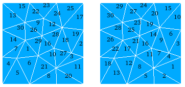

Data optimization for numerical codes
=====================================

.. _renumbering:

Renumbering to improve locality
-------------------------------

A mesher (like SMESH) often generates a scattered cell distribution in output unstructured mesh.
So a common task for simulation codes is the reordering for a better locality.

medcoupling can do that simply by doing

.. literalinclude:: ../../../src/MEDCoupling_Swig/UsersGuideExamplesTest.py
   :start-after: UG_Optimization_0
   :end-before:  UG_Optimization_0

   Numbering by MEFISTO mesher (to the left) and the same mesh after renumbering (to the right)

RenumberingFactory method creates a renumbering algorithm of a specified type: either "Boost" or "Metis".

Partitionning for multi procs
-----------------------------

For simulation codes following the SPMD paradigm, the partitionning is a key step.
medcoupling can perform this partition. Here is an example of partitioning mesh *m* into 4 parts and retrieving the first part:

.. literalinclude:: ../../../src/MEDCoupling_Swig/UsersGuideExamplesTest.py
   :start-after: UG_Optimization_1
   :end-before:  UG_Optimization_1

   A whole mesh *m* (to the left) and one fourth of it *part0* (to the right) got using the above code

It's then possible to add a layer or more of cells.

.. literalinclude:: ../../../src/MEDCoupling_Swig/UsersGuideExamplesTest.py
   :start-after: UG_Optimization_2
   :end-before:  UG_Optimization_2

   *part0* (to the left) and *part0_with_layer* (to the right)
