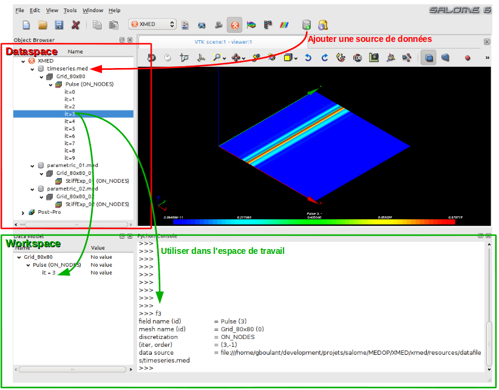

.. meta::
   :keywords: maillage, champ, manipulation, guide utilisateur
   :author: Guillaume Boulant

.. include:: medcalc-definitions.rst

%%%%%%%%%%%%%%%%%%%%%%%%%%%%%%%%%%%%%%%%%%%%%%%%%%%%%%%%
Module MED: Guide d'utilisation de l'interface graphique
%%%%%%%%%%%%%%%%%%%%%%%%%%%%%%%%%%%%%%%%%%%%%%%%%%%%%%%%

Ce document est un guide rapide pour l'utilisation de l'interface
graphique du module MED. Il montre comment utiliser le module sur la
base de quelques exemples de référence, inspirés des cas d'utilisation
identifiés lors de l'analyse des besoins en matière de manipulation de
champs.

.. warning:: Le document est autonome, mais il est vivement conseillé
   de parcourir au préalable (ou en parallèle) :doc:`le document de
   spécifications<medcalc-specifications>`, au moins pour fixer les
   concepts et la terminologie.

.. contents:: Sommaire
   :local:
   :backlinks: none

Présentation générale du module MED
===================================

L'ergonomie générale d'utilisation du module de manipulation de champs
est inspirée des logiciels comme octave ou scilab. Elle associe une
interface graphique, pour sélectionner et préparer les données, avec
une interface texte (la console python) pour le travail effectif sur
les données.

Pour cela, le module propose deux espaces utilisateurs qui sont
symbolisés par les rectangles rouges et vert sur la capture d'écran
ci-dessous:

* **l'espace des données** (*dataspace*), dans lequel l'utilisateur
  définit les sources de données med (*datasource*), c'est-à-dire les
  fichiers med dans lesquels sont lus les champs et maillages. Cet
  espace permet l'exploration des maillages et des champs fournis par
  les différentes sources de données.
* **l'espace de travail** (*workspace*), dans lequel l'utilisateur
  peut déposer des champs sélectionnées dans l'espace source, pour
  ensuite les travailler par exemple pour produire des nouveaux champs
  au moyen des fonctions de manipulation fournies par l'interface
  textuelle (console python TUI).

L'utilisation type des fonctions de manipulation de champs suit un
processus de la forme suivante:

1. Chargement d'un fichier med dans l'espace de données (dataspace) et
   exploration du contenu, composé de maillages et de champs définis
   sur ces maillages et pouvant contenir un ou plusieurs pas de temps.
2. Sélection (graphique) des champs à manipuler dans l'espace de
   travail (workspace), avec la possibilité de préciser des
   restrictions d'utilisation (pas de temps, composantes, groupe de
   maille).
3. Création de nouveaux champs par l'exécution d'opérations
   algébriques (+,-,*,/) entre champs, l'application de fonctions
   mathématiques standard (pow, sqrt, abs), ou encore l'initialisation
   "from scratch" sur un maillage support.
4. Contrôle visuel rapide des champs produits (avec les modules VISU
   et/ou PARAVIS de SALOME, pilotés automatiquement depuis l'interface
   utilisateur)
5. Enregistrement d'une partie des champs produits dans un fichier med

Tour rapide des fonctions du module MED
=======================================

Cette section présente des exemples d'utilisation du module XMED sous
la forme de "storyboard", et illustre au passage les fonctions mises à
disposition par le module.

.. warning:: Cette section est en travaux. Tant que cet avis n'aura
   pas disparu, veuillez en considérer le plan et le contenu encore
   incomplets, temporaires et sujets à caution.

Exemple 1: Explorer des sources de données
------------------------------------------

.. note:: Cet exemple présente les fonctions:

   * ajouter une source de données
   * fonctions "Extends field series", "Visualize"

.. |ICO_DATASOURCE_ADD| image:: images/ico_datasource_add.png
                        :height: 16px

.. |ICO_XMED| image:: images/ico_xmed.png
              :height: 16px

.. |ICO_DATASOURCE_EXPAND| image:: images/ico_datasource_expandfield.png
                           :height: 16px

.. |ICO_DATASOURCE_VIEW| image:: images/ico_datasource_view.png
                         :height: 16px

Au démarrage, le module de manipulation de champs, identifié par
l'icône |ICO_XMED|, présente une interface vierge:

.. image:: images/xmed-gui-start.png
   :align: center
   :width: 800px

La première étape consiste à ajouter une ou plusieurs source de
données med dans le "dataspace". Pour cela, on clique sur l'icône "Add
datasource" |ICO_DATASOURCE_ADD| qui propose de sélectionner un
fichier med:

.. image:: images/xmed-gui-datasource-selectfile.png
   :align: center
   :width: 800px

L'opération ajoute une nouvelle entrée (datasource) dans l'espace de
données (dataspace). Le contenu peut être exploré en parcourant
l'arborescence. La figure ci-dessous (image de gauche) montre le
résultat du chargement du fichier ``timeseries.med`` contenant un
maillage de nom ``Grid_80x80`` sur lequel est défini un champ au noeud
de nom ``Pulse``. Par défaut, la composition du champs (en terme de
pas de temps et de composantes) n'est pas affichée pour éviter
l'encombrement visuel de l'arbre. On doit faire la demande explicite
au moyen de la commande "Expand field timeseries"
|ICO_DATASOURCE_EXPAND| disponible dans le menu contextuel associé aux
champs. Le résultat est affiché sur l'image centrale. La liste des
itérations du champ ``Pulse`` peut être consultée.

.. |IMG_DATASOURCE_EXPLORE| image:: images/xmed-gui-datasource-explore-zoom.png
                            :height: 340px
.. |IMG_DATASOURCE_MENUCON| image:: images/xmed-gui-datasource-menucontextuel-zoom.png
                            :height: 340px
.. |IMG_DATASOURCE_EXPANDF| image:: images/xmed-gui-datasource-expand-zoom.png
                            :height: 340px

+--------------------------+--------------------------+--------------------------+
| |IMG_DATASOURCE_EXPLORE| | |IMG_DATASOURCE_MENUCON| | |IMG_DATASOURCE_EXPANDF| |
+--------------------------+--------------------------+--------------------------+

.. note:: En toute rigueur, le concept de *champ* dans le modèle MED
   désigne une itération donnée. Un ensemble d'itérations est désigné
   par le terme *série temporelle de champs*. Par abus de langage, et
   s'il n'y a pas ambiguité, on utilisera le nom du champ pour
   désigner à la fois le champs proprement dit ou la série temporelle
   à laquelle il appartient.

Enfin, il est possible au niveau du dataspace de visualiser la forme
générale du champ au moyen d'une carte scalaire affichée dans le
viewer de SALOME. Pour cela, on sélectionne le pas de temps à
visualiser et on utilise la commande "Visualize" |ICO_DATASOURCE_VIEW|
disponible dans le menu contextuel associé:

.. image:: images/xmed-gui-datasource-visualize-zoom.png
   :align: center
   :width: 800px

.. note:: Cette représentation graphique a pour objectif le contrôle
   visuel rapide. Aussi, les fonctions du module VISU sont employées
   par défaut, mais il est possible de faire l'affichage des cartes
   scalaires au moyen du module PARAVIS (choix de préférence non
   implémenté pour le moment, mais techniquement réalisable).

Exemple 2: Rassembler des champs issus de différentes sources
-------------------------------------------------------------

.. note:: Cet exemple présente les fonctions:

   * fonction "Use in workspace"
   * fonction "Save"

.. |ICO_DATASOURCE_USE| image:: images/ico_datasource_use.png
                        :height: 16px
.. |ICO_WORKSPACE_SAVE| image:: images/ico_workspace_save.png
                        :height: 16px

L'objectif est de récupérer des données issues de différents fichiers
med, puis de les rassembler dans un même fichier en sortie.

On commence par ajouter les sources de données med dans l'espace de
données (dataspace). Dans l'exemple ci-dessous, l'espace de données
contient deux sources de nom ``parametric_01.med`` et
``smallmesh_varfiled.med``. La première source contient le maillage
``Grid_80x80_01`` sur lequel est défini le champ ``StiffExp_01``. La
deuxième source contient le maillage ``My2DMesh`` sur lequel sont
définis deux champs de noms respectifs ``testfield1`` et
``testfield2``:

.. image:: images/xmed-userguide-example2-datasource.png
   :align: center
   :width: 800px

Pour l'exemple, on souhaite rassembler les champs ``StiffExp_01`` et
``testfield2`` dans un fichier de nom ``result.med``. La procédure
consiste à importer les deux champs dans l'espace de travail
(workspace), puis à sauvegarder l'espace de travail. Pour cela, on
sélectionne les champs et on utilise la commande "Use in workspace"
|ICO_DATASOURCE_USE| disponible dans le menu contextuel. Les deux
champs sélectionnés apparaissent dans l'arborescence de l'espace de
travail:

.. image:: images/xmed-userguide-example2-workspace.png
   :align: center
   :width: 800px

La sauvegarde de l'espace de travail est faite au moyen de la commande
"Save workspace" |ICO_WORKSPACE_SAVE| disponible dans la barre
d'outils du module. Une fenêtre de dialogue invite l'utilisateur à
spécifier le nom du fichier de sauvegarde:

.. image:: images/xmed-userguide-example2-workspace-save.png
   :align: center
   :width: 800px

Ce fichier ``result.med`` peut ensuite être rechargé dans le module
XMED (ou les modules VISU ou PARAVIS) pour vérifier la présence des
champs sauvegardés.

.. BUG: plantage à l'utilsation dans XMED d'un fichier rechargé
.. (invalid mesh on field)

.. _xmed.userguide.exemple3:

Exemple 3: Appliquer une opération mathématique sur des champs
--------------------------------------------------------------

.. note:: Cet exemple présente les fonctions:

   * exécution d'opérations mathématiques dans la console TUI
   * fonction "put" pour référencer un champ de travail dans la liste
     des champs persistant.
   * fonction "Visualize" depuis le TUI.

L'usage le plus courant du module de manipulation de champs est
d'exécuter des opérations mathématiques dont les opérandes sont des
champs ou des composantes de ces champs.

On se place dans une situation où les sources de données sont définies
dans le "dataspace" (dans l'exemple ci-après, une série temporelle de
nom ``Pulse``, contenant 10 pas de temps, définis sur un maillage de
nom ``Grid_80x80``, le tout issu du datasource ``timeseries.med``).

Comme vu précedemment, pour manoeuvrer un champ dans l'espace de
travail, on sélectionne ce champ, puis on exécute la commande "Use in
workspace" |ICO_DATASOURCE_USE| du menu contextuel. Dans le cas
présent, un seul champ est sélectionné (contre deux dans l'exemple
précédent) et la commande ouvre alors une fenêtre de dialogue qui
permet de préciser les données sur lesquelles on souhaite
effectivement travailler et comment on veut les manoeuvrer:

.. image:: images/xmed-gui-datasource-useinworkspace-alias.png
   :align: center
   :width: 800px

.. note:: En l'état actuel du développement, l'interface propose
   uniquement de définir le nom de la variable sous laquelle doit être
   manoeuvré le champ dans la console de travail (TUI). Dans une
   version ultérieure, il est prévue de pouvoir préciser la ou les
   composante du champs à utiliser et un groupe de maille pour définir
   une restriction géométrique. Inversement, il sera également
   possible de choisir une série temporelle complète pour faire des
   opérations globales sur l'ensemble des pas de temps.

Aprés validation, le champ est placé dans l'arborescence du
"workspace" et une variable de nom ``<alias>`` est créée
automatiquement dans la console de travail pour désigner le
champ. Dans cet exemple, ``<alias>`` vaut ``f3``, positionné ainsi par
l'utilisateur pour rappeler que la variable correspond au pas de temps
n°3:

.. image:: images/xmed-gui-workspace.png
   :align: center
   :width: 800px

La manipulation peut commencer. Dans l'exemple ci-dessous, on crée le
champ ``r`` comme le résultat d'une transformation afine du champ
``f3`` (multiplication du champ par le facteur 2.7 auquel on ajoute
l'offset 5.2)::

 >>> r=2.7*f3+5.2

On peut poursuivre la manipulation du champs avec une variété
d'opérations qui sont détaillées dans les spécifications du module
(cf. :ref:`Spécification des opérations<xmed-specifications>`):

 >>> r=f3/1000     # les valeurs de r sont celles du champ f3 réduites d'un facteur 1000
 >>> r=1/f3        # les valeurs de r sont les inverses des valeurs de f3
 >>> r=f3*f3       # les valeurs de r sont celles du champ f3 élevées au carré
 >>> r=pow(f3,2)   # même résultat
 >>> r=abs(f3)     # valeur absolue du champ f3
 >>> ...

Les opérations peuvent utiliser plusieurs opérandes de type champs. Si
``f4`` désigne le pas de temps n°4 du champ ``Pulse``, alors on peut
calculer toute combinaison algébrique des deux champs::

 >>> r=f3+f4
 >>> r=f3-f4
 >>> r=f3/f4
 >>> r=f3*f4

Avec au besoin l'utilisation de variables scalaires::

 >>> r=4*f3-f4/1000
 >>> ...

Dans ces exemples, la variable ``r`` désigne un champ de travail qui
contient le résultat de l'opération. Par défaut, ce champ de travail
n'est pas référencé dans l'arborescence du workspace. Si on souhaite
tout de même le référencer, par exemple pour qu'il soit pris en compte
dans la sauvegarde, alors on tape la commande::

 >>> put(r)

La fonction ``put`` a pour but de marquer le champ en argument comme
persistent, puis de le ranger dans l'arborescence du "workspace" afin
qu'il soit visible et sélectionnable. En effet, parmi tous les champs
qui pourront être créés dans la console pendant la session de travail,
tous n'ont pas besoin d'être sauvegardés. Certains sont même des
variables temporaires qui servent à la construction des champs
résultats finaux. C'est pourquoi, seuls les champs rangés dans
l'arborescence du workspace sont enregistrés lors de la demande de
sauvegarde du workspace.

Les variables définies dans la console ont d'autres utilités. Tout
d'abord, elles permettent d'imprimer les informations concernant le
champ manoeuvré. Pour cela, on tape simplement le nom de la variable
puis retour::

 >>> f3
 field name (id)         = Pulse (3)
 mesh name (id)          = Grid_80x80 (0)
 discretization          = ON_NODES
 (iter, order)           = (3,-1)
 data source             = file:///home/gboulant/development/projets/salome/MEDOP/XMED/xmed/resources/datafiles/timeseries.med

Elle peut également être utilisée comme argument des commandes de
gestion disponibles dans l'interface textuelle (dont la liste
détaillée est décrite à la section :ref:`Documentation de l'interface
textuelle<xmed.userguide.tui>`). Par exemple, la fonction ``view``
permet d'afficher la carte scalaire du champ dans le viewer::

 >>> view(f3)

Donne:

.. image:: images/xmed-gui-workspace-view.png
   :align: center
   :width: 800px

.. note:: On remarquera ici qu'il est facile de comparer deux pas de
   temps d'un champ, par exemple en calculant la différence ``f3-f4``,
   puis en affichant un aperçu de la carte scalaire résultat au moyen
   de la fonction ``view``::

    >>> view(f3-f4)

On peut enfin tout simplement afficher les données du champs par la
commande ``print``::

 >>> print f3
 Data content :
 Tuple #0 : -0.6
 Tuple #1 : -0.1
 Tuple #2 : 0.4
 Tuple #3 : -0.1
 Tuple #4 : 0.4
 ...
 Tuple #6556 : 3.5
 Tuple #6557 : 3.3
 Tuple #6558 : 1.5
 Tuple #6559 : 0.3
 Tuple #6560 : 0.2

Il est important de noter que les opérations entre champs ne peuvent
être faites qu'entre champs définis sur le même maillage. Il s'agit là
d'une spécification du modèle MED qui interdit d'envisager les
opérations entre champs définis sur des maillages géométriquement
différents. Techniquement, cela se traduit par l'obligation pour les
objets informatique *champs* de partager le même objet informatique
*maillage*.

Dans l'hypothèse où on souhaite utiliser des champs définis sur des
maillages différents, par exemple pour manoeuvrer les valeurs des
champs à l'interface de deux maillages partageant une zone géométrique
2D, il faut d'abord ramener tous les champs sur le même maillage de
surface par une opération de projection.

.. note:: Même si ceci est techniquement possible avec la bibliothèque
   MEDCoupling, cet type d'opération de projection n'est pas encore
   disponible dans le module de manipulation de champs (prévu en
   2012).

Un autre besoin plus classique est l'utilisation de champs définis sur
des maillages géométriquement identiques, mais techniquement
différents, par exemple lorsqu'ils sont chargés de fichiers med
différents. Pour traiter ce cas de figure, la bibliothèque MEDCoupling
prévoit une fonction de "Changement du maillage support", dont
l'utilisation au niveau du module de manipulation de champs est
illustrée dans :ref:`l'exemple 4<xmed.userguide.exemple4>` ci-après.

.. _xmed.userguide.exemple4:

Exemple 4: Comparer des champs issues de différentes sources
------------------------------------------------------------

.. note:: Cet exemple présente les fonctions:

   * Changement du maillage support "change underlying mesh"

On se place ici dans le cas de figure où des champs ont été produits
sur le même maillage, au sens géométrique, mais enregistrés dans des
fichiers med différents. C'est le cas par exemple d'une étude
paramétrique où plusieurs calculs sont effectués avec des variantes
sur certains paramètres du modèle simulé, chaque calcul produisant un
fichier med.

Soit ``parametric_01.med`` et ``parametric_02.med`` deux fichiers med
contenant les champs que l'on souhaite comparer, par exemple en
calculant la différence des valeurs et en visualisant le résultat.

Aprés le chargement des sources de données dans le module XMED,
l'utilisateur se trouve en présence de deux maillages, au sens
technique du terme cette fois-ci, c'est-à-dire que les champs sont
associées à des objets informatiques maillage différents, bien que
géométriquement identiques.

Or, les fonctions de manipulation de champs ne permettent pas les
opérations sur des champs dont les maillages supports sont différents
(voir la remarque à la fin de :ref:`l'exemple
3<xmed.userguide.exemple3>`).

Pour résoudre ce cas de figure, le module de manipulation de champs
met à disposition la fonction "Change underlying mesh" qui permet de
remplacer le maillage support d'un champ par un autre à partir du
moment où les deux maillages sont géométriquement identiques,
c'est-à-dire que les noeuds ont les mêmes coordonnées spatiales.

.. |ICO_DATASOURCE_CHG| image:: images/ico_datasource_changeUnderlyingMesh.png
                        :height: 16px

Dans l'exemple proposé, l'utilisateur sélectionne le premier pas de
temps du champ ``StiffExp_01`` du "datasource" ``parametric_01.med``,
puis l'importe dans l'espace de travail au moyen de la commande "Use
in workspace" |ICO_DATASOURCE_USE|. Il sélectionne ensuite le premier
pas de temps du champs ``StiffExp_02`` du "datasource"
``parametric_02.med``, mais l'importe dans l'espace de travail au
moyen de la commande "Change underlying mesh" |ICO_DATASOURCE_CHG|. La
fenêtre de dialogue ci-dessous s'affiche et invite l'utilisateur à
choisir le nouveau maillage support par sélection dans l'arborescence
du "dataspace":

.. image:: images/xmed-gui-datasource-changeUnderlyingMesh.png
   :align: center

Dans cet exemple, on sélectionne le maillage ``Grid_80x80_01`` support
du champ ``StiffExp_01``, avec lequel on souhaite faire la
comparaison. Après validation, l'arborescence du workspace contient le
champ ``StiffExp_02`` défini sur le maillage ``Grid_80x80_01``:

.. image:: images/xmed-gui-datasource-changeUnderlyingMesh_wsview.png
   :align: center

.. note:: La fonction "Change underlying mesh" ne modifie pas le champ
  sélectionné dans le "dataspace" (principe de base de fonctionnement
  du dataspace), mais crée une copie du champ dans l'espace de travail
  pour ensuite remplacer le maillage support. D'où le nom par défaut
  pour le champ ``dup(<nom du champ sélectionné>)`` (dup pour
  "duplicate").

Il reste à associer une variable à ce champ pour le manipuler dans la
console. Ceci peut être fait au moyen de la commande "Use in console",
disponible dans le menu contextuel du workspace.

En définitif, si ``f1`` désigne le champ issu du datasource
``parametric_01.med`` et ``f2`` le champ issu du datasource
``parametric_02.med`` par la procédure décrite ci-dessus, alors la
comparaison des deux grandeurs peut être faite comme pour le cas de
:ref:`l'exemple 3<xmed.userguide.exemple3>`::

 >>> r=f1-f2
 >>> view(r)

.. note:: En remarque générale sur cet exemple, il convient de noter
   les points suivants:

   * l'égalité géométrique de deux maillages est établie à une marge
     d'erreur prés qu'il est possible de définir techniquement, mais
     qui n'est pas ajustable au niveau de l'interface du module de
     manipulation de champs. Elle est fixée à une valeur standard qui
     permet de traiter la plupart des cas utilisateur. On verra à
     l'usage s'il est nécessaire de remonter ce paramètre au niveau de
     l'interface.
   * L'utilisateur doit faire la démande explicite de changer le
     maillage support d'un champ, en prévision de la comparaison de
     champs issus de datasource différentes. Il s'agit là d'un choix
     fonctionnel délibéré pour que l'utilisateur garde trace des
     modifications faites sur les données (pas de modification
     automatiques à l'insu de l'utilisateur, même sous prétexte
     d'amélioration de l'ergonomie).

Exemple 5: Créer un champ sur un domaine spatial
------------------------------------------------

.. note:: Cet exemple présente les fonctions:

   * initialisation par une fonction de la position spatiale
   * initialisation sur un groupe de maille

Le domaine géométrique de définition du champs à créer est spécifié
ici par la donnée d'un groupe de mailles. Ce cas d'usage est
typiquement prévu pour produire les conditions de chargement initial
d'une structure, par exemple en définissant un champ sur une surface
de la géométrie, identifiée par un nom de groupe de mailles.

.. warning:: DEVELOPPEMENT EN COURS

Exemple 6: Extraire une partie d'un champ
-----------------------------------------

.. note:: Cet exemple présente les fonctions:

   * extraire une composante (ou un sous-ensemble des composantes)
   * extraire un domaine géométrique (valeurs sur un groupe de maille)
   * extraire un ou plusieurs pas de temps.

.. warning:: DEVELOPPEMENT EN COURS

   On doit illustrer ici les fonctions de restriction, qui
   permettraient de récupérer certaines composantes uniquement. Le
   principe est qu'on crée un nouveau champ qui est une restriction du
   champ argument à une liste de composantes à spécifier (utiliser la
   fonction __call__ des fieldproxy).

Pour l'extraction des pas de temps, on peut se ramener au cas de
l'exemple 2 avec une seule source de donnée.

Exemple 7: Créer un champ à partir d'une image to[mp]ographique
---------------------------------------------------------------

.. note:: Cet exemple présente les fonctions:

   * Création d'un champ sans datasource (ni maillage, ni champs), à
     partir d'un fichier image

En tomographie ou en topographie, les appareils de mesure produisent
des images qui représentent une grandeur physique en niveaux de gris
sur un plan de coupe donné. L'image ci-dessous représente par exemple
une vue interne du corps humain faite par IRM:

.. image:: images/xmed-irm.png
   :align: center
   :width: 600px

Cette image est un ensemble de pixels organisés sur une grille
cartesienne. Elle peut donc être modélisée sous la forme d'un champ
scalaire dont les valeurs sont définies aux cellules d'un maillage
réglés de même taille que l'image (en nombre de pixels):

.. image:: images/xmed-irm-field.png
   :align: center
   :width: 600px

Le module de manipulation de champ fournit un utilitaire appelé
``image2med.py`` qui permet d'appliquer ce principe à la conversion
d'un fichier image en fichier med contenant la représentation de
l'image sous forme d'un champ scalaire (seul le niveau de gris est
conservé)::

  $ <xmed_root_dir>/bin/salome/xmed/image2med.py -i myimage.png -m myfield.med

.. |ICO_IMAGESOURCE| image:: images/ico_imagesource.png
                        :height: 16px

Cette opération de conversion peut être faite automatiquement dans
l'interface graphique du module au moyen de la commande "Add Image
Source" |ICO_IMAGESOURCE| disponible dans la barre d'outils. Cette
commande ouvre la fenêtre suivante pour inviter l'utilisateur à
choisir un fichier image:

.. image:: images/medop_image2med_dialog.png
   :align: center

Le nom du fichier med résultat est proposé par défaut (changement de
l'extention en ``*.med``) mais il peut être modifié. Enfin, on peut
demander le chargement automatique du fichier med produit pour ajout
dans l'espace de donnée. Les champs peuvent alors être manipulés comme
dans les cas d'utilisation standard.

Par exemple, l'image ci-dessous affiche le résultat de la différence
entre deux images, ajoutée à l'image de référence: si i1 et i2
désignent les champs créés à partir des deux images, on représente ``r
= i1 + 5*(i2-i1)`` où le facteur 5 est arbitraire et sert à amplifier
la zone d'intérêt (en haut de l'oeil gauche):

.. image:: images/xmed-irm-diff.png
   :align: center
   :width: 600px

L'exemple ci-dessous est le résultat du chargement d'une image
tomographique issue du projet MAP (Charles Toulemonde,
EDF/R&D/MMC). L'image tomographique:

.. image:: images/champ_altitude_MAP.png
   :align: center
   :width: 600px

Le résultat du chargement:

.. image:: images/medop_image2med_tomographie.png
   :align: center
   :width: 800px

Exemple 8: Continuer l'analyse dans PARAVIS
-------------------------------------------

.. note:: Cet exemple présente les fonctions:

   * Export de champs vers le module PARAVIS.

Les possibilités de représentation graphique des champs fournies par
le module MED ont pour seul objectif le contrôle visuel rapide. Par
défaut, le viewer de VISU est employé.

Pour une analyse plus détaillées des champs, il est nécessaire de
poursuivre le travail dans PARAVIS. Le module de manipulation de
champs offre une fonction qui simplifie ce passage, en faisant le
chargement automatique dans PARAVIS et en proposant une visualisation
par défaut (carte de champs scalaire).

Pour cela, il faut sélectionner dans l'espace de travail les champs à
exporter, puis déclencher la fonction d'export depuis le menu
contextuel associé:

.. image:: images/medop_exportparavis.png
   :align: center

Les champs sélectionnés sont regroupés dans une entrée MED du
navigateur PARAVIS, et le premier champ est affiché sous forme de
carte de champ:

.. image:: images/medop_exportparavis_result.png
   :align: center
   :width: 800px

.. note:: La fonction d'export est une fonction de confort. La même
   opération peut être faite manuellement en procédant d'abord à
   l'enregistrement des champs sous forme de fichier MED, puis en
   chargeant le fichier généré dans le module PARAVIS pour
   visualisation.

.. _xmed.userguide.tui:

Utilisation de l'interface textuelle du module MED (TUI)
========================================================

Toutes les opérations menées au moyen de l'interface graphique peuvent
être réalisées (avec plus ou moins de facilité) avec l'interface
textuelle. Le module de manipulation de champs peut même être utilisé
exclusivement en mode texte.
..
 Pour cela, on lance la commande::

 $ <path/to/appli>/medop.sh
..
 Cette commande ouvre une console de commandes ``medop>``. Un fichier
 med peut être chargé et travaillé, par exemple pour créer des champs à
 partir des données du fichier.

Que l'on soit en mode texte pur ou en mode graphique, un séquence de
travail type dans la console peut ressembler au jeu d'instructions
suivantes::

 >>> medcalc.LoadDataSource("/path/to/mydata.med")
 >>> la
 id=0    name    = testfield1
 id=1    name    = testfield2
 >>> f1=accessField(0)
 >>> f2=accessField(1)
 >>>    ls
 f1      (id=0, name=testfield1)
 f2      (id=1, name=testfield2)
 >>> r=f1+f2
 >>> ls
 f1      (id=0, name=testfield1)
 f2      (id=1, name=testfield2)
 r       (id=2, name=testfield1+testfield2)
 >>> r.update(name="toto")
 >>> ls
 f1      (id=0, name=testfield1)
 f2      (id=1, name=testfield2)
 r       (id=2, name=toto)
 >>> putInWorkspace(r)
 >>> saveWorkspace("result.med")

Les commandes principales sont:

* ``LoadDataSource``: charge un fichier med dans la base de données (utile
  uniquement en mode texte pur)::

  >>> LoadDataSource("/path/to/datafile.med")

* ``LoadImageAsDataSource``: load an image as a med file

* ``la``: affiche la liste de tous les champs chargés en base de données ("list all")
* ``accessField``: définit un champ dans l'espace de travail à partir de son
  identifiant (utile plutôt en mode texte pur car l'interface
  graphique permet de faire cette opération par sélection d'un champ
  dans le dataspace)::

  >>> f=accessField(fieldId)

* ``ls``: affiche la liste des champs présent dans l'espace de travail ("list")
* ``putInWorkspace``: met un champ en référence dans l'*espace de gestion*::

  >>> putInWorkspace(f)

* ``saveWorkspace``: sauvegarde tous les champs référencés dans l'espace de
  gestion dans un fichier med::

  >>> saveWorkspace("/path/to/resultfile.med")

.. note:: On peut faire à ce stade plusieurs remarques:

   * la commande ``LoadDataSource`` charge uniquement les méta-informations
     décrivant les maillage et les champs (noms, type de
     discrétisation, liste des pas de temps). Les maillages et les
     valeurs physiques des champs sont chargées ultérieurement (et
     automatiquement) dés lors qu'elles sont requises par une
     opération. Dans tous les cas, les données med (méta-informations
     et valeurs) sont physiquement stockées au niveau de l'espace
     *base de données*.
   * la commande ``accessField`` définit en réalité un *manipulateur de champ*
     dans l'espace de travail, c'est-à-dire une variable qui fait la
     liaison avec le champ physique hébergé dans la base de
     données. Les données physiques ne circulent jamais entre les
     espaces, mais restent centralisées au niveau de la base de
     données.

Les commandes TUI suivantes nécessitent de travailler dans
l'environnement graphique:

* ``medcalc.MakeDeflectionShape``
* ``medcalc.MakeIsoSurface``
* ``medcalc.MakePointSprite``
* ``medcalc.MakeScalarMap``
* ``medcalc.MakeSlices``
* ``medcalc.MakeVectorField``
