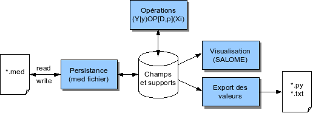
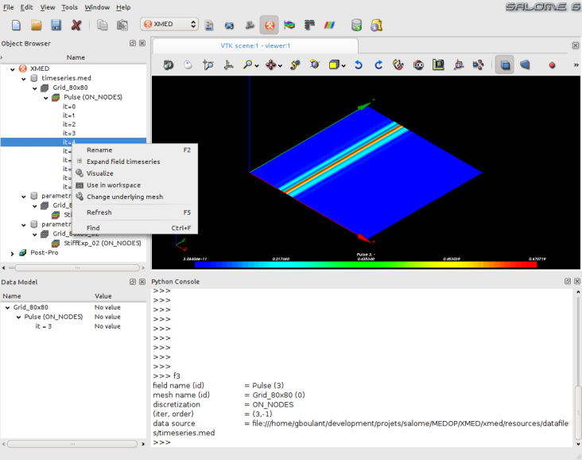
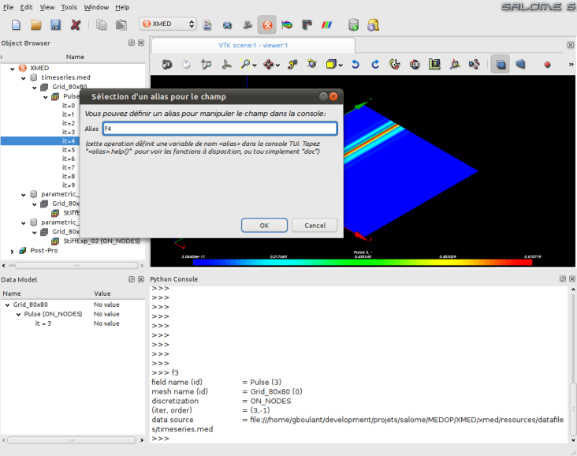
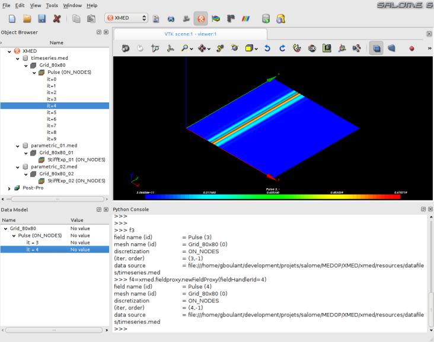
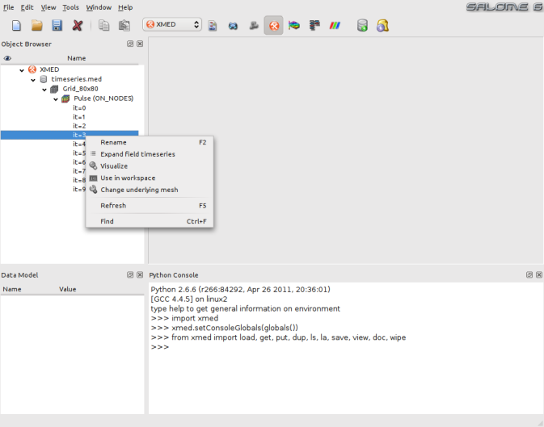
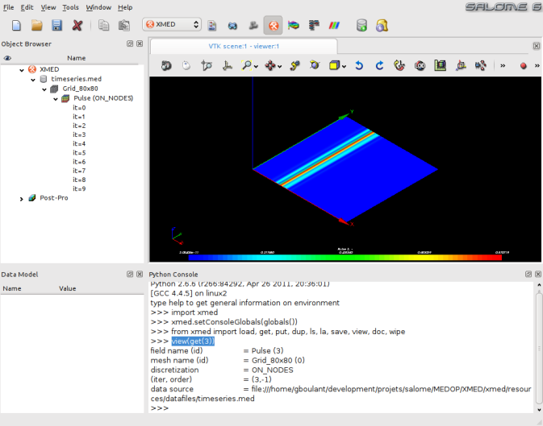
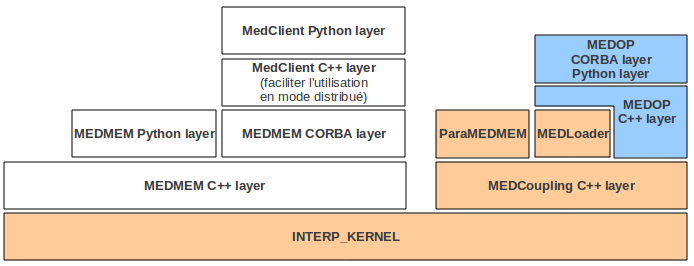

.. meta::
   :keywords: maillage, champ, manipulation, med
   :author: Guillaume Boulant

.. include:: medcalc-definitions.rst

%%%%%%%%%%%%%%%%%%%%%%%%%%%%%%%%%%%%%%%%%%%%%%%%%%%%%%%
Module MED: Spécifications fonctionnelles et techniques
%%%%%%%%%%%%%%%%%%%%%%%%%%%%%%%%%%%%%%%%%%%%%%%%%%%%%%%

Ce texte présente les spécifications informatiques pour le
développement d'un module de manipulation de champs qui répond à
l'expression de besoins formulée dans le cahier des charges
|REF_EDF_VCA_H-I2C-2009-03595-FR|_.

.. contents:: Sommaire
   :local:
   :backlinks: none

Description des cas d'application de référence
==============================================

Plusieurs cas d'applications métier sont identifiés pour piloter le
développement du module de manipulation de champs:

* **Analyser et post-traiter le résultat d'un calcul**. C'est l'usage
  principal qui consiste typiquement à créer des champs comme le
  résultat d'*opérations mathématiques* dont les opérandes sont des
  champs et des scalaires. On compte également dans cette catégorie
  les *opérations de restriction* qui permettent d'extraire puis
  utiliser une partie d'un champs, c'est-à-dire de créer un champ
  comme la restriction d'un autre champ à une partie de son domaine de
  définition (certaines composantes, certains pas de temps, limitation
  à un groupe de mailles).
* **Comparer des champs issus d'un calcul paramétrique**. Il s'agit
  d'une variante du cas précédent qui consiste à mesurer et visualiser
  les variations entre des champs issues de sources de données
  différentes (différents fichiers med).
* **Préparer les conditions aux limites d'une calcul**. Il s'agit de
  pouvoir initialiser un champ sur un maillage ou un groupe de
  mailles, c'est-à-dire créer un champ de toute pièce sur un
  support spatial donné, par exemple par la donnée d'une fonction
  mathématique qui donne les valeurs des composantes en fonction des
  coordonnées spatiales.
* **Gérer des données de calcul**. Il s'agit typiquement de pouvoir
  rassembler au sein d'un même fichier med des champs et des maillages
  issues de différentes sources de données, et/ou créés au travers des
  cas d'application présentés ci-dessus.

Modèle conceptuel des données
=============================

On rappelle ici les concepts utilisés dans le module et les modalités
d'utilisation de ces concepts. Le point de vue est celui de
l'utilisateur du module de manipulation de champs. Il s'agit
essentiellement pour le moment d'éclaircir l'ergonomie d'usage sur le
plan conceptuel, avant d'aborder la déclinaison en spécifications
techniques pour lesquelles les particularités du modèle MED devront
être intégrées à la réflexion.

Concept de champ
----------------

Le concept central est celui de *champ*, c'est-à-dire une grandeur
physique exprimée sur un domaine spatial D. La grandeur peut être de
type scalaire (une température), de type vectorielle (une vitesse) ou
de type tensorielle (les contraintes). En un point de l'espace, elle
se définie donc par la donnée d'une ou plusieurs valeurs numériques
appelées les *composantes* (1 pour un champ scalaire, 3 pour un champ
vectoriel 3D, 6 pour un champ tensoriel symétrique 3D).

.. note:: Une pratique courante au niveau des codes est de stocker
   plusieurs grandeurs physiques différentes dans un même champs med
   (au sens informatique du terme). Par exemple, le champ
   électromagnétique à 6 composantes, plus le champ de température
   scalaire peuvent techniquement être stockés dans un même champs med
   à 7 composantes. C'est pourquoi, le module de manipulation de
   champs doit fournir des fonctions de restrictions qui permettent
   d'extraire certaines composantes pour former la grandeur physique à
   étudier. Dans la suite du document, on part du principe que l'on
   peut se ramener dans tous les cas au cas d'un champ homogène tel
   que défini plus haut.

Dans le cadre d'un modèle numérique discret, les valeurs du champ sont
exprimées pour un nombre fini de positions, qui correspondent à des
lieux particuliers du maillage. Suivant la nature des modèles de
calcul, les valeurs peuvent être données par cellule, par face, par
noeud, aux points de gauss, ...

Ainsi, un champ discret est un objet dont les valeurs peuvent être
lues selon les dimensions suivantes:

* *La position p dans l'espace*, caractérisée par le type de l'élément
  de maillage support et son numéro identifiant
* *La composante c*, caractérisée par son indice (jusqu'à 6
  composantes dans les modèles physiques envisagés)

L'évolution d'un champ dans le temps peut être exprimée sous la forme
d'une série temporelle, c'est-à-dire une séquence de champs donnés
pour des instants discrets. Aussi, si l'on manipule un champ qui varie
dans le temps, l'accès aux valeurs introduit une dimension
supplémentaire:

* *Le temps t*, caractérisé par un numéro de pas de temps
  (correspondant en général à une étape du calcul qui a produit le champ).

.. note:: Il s'agit là d'une représentation conceptuelle standard dont
   le |LINK_EDF_MEDDOC|_ fait une expression détaillée. En
   particulier, la position p est déterminée par la donnée du type
   d'élément support (valeurs aux noeuds, aux mailles, aux noeuds par
   éléments, aux points de gauss) et de l'indice de cet élément. En
   général, le type d'éléments support est résolu à l'initialisation
   et l'indice peut suffire au repérage dans les algorithmes. Le temps
   t est déterminé par un numéro d'itération, qui peut éventuellement
   être complété par un numéro d'ordre. Le cas des points de gauss
   ajoute un cran de complexité dans la mesure où il faut repérer
   l'entité géométrique (maille, face, arrête) puis le point de gauss
   de cette entité. A noter que dans le modèle MED, le concept de
   série temporelle de champ n'est pas explicitement définie et
   l'accès à des valeurs à différents instants t1 et t2 nécessite le
   chargement des champs ``F1=F(t1)`` et ``F2=F(t2)``.

Par convention, on utilisera par la suite les notations:

* **U(t,p,c)** pour désigner la valeur de la composante c d'un champ U
  à la position p et prise à l'instant t;
* **U(t,p,:)** pour signifier que l'on manipule l'ensemble de toutes
  les composantes;
* **U(t,:,c)** pour signifier que l'on manipule le domaine de
  définition spatial complet.

Dans une grande majorité des cas d'usage on travaille à temps t fixé
et sur un domaine spatiale prédéfini. Aussi on utilisera également la
notation à deux arguments ``U(:,:)`` ou tout simplement ``U`` (dès
lors qu'il n'y a pas ambiguïté) pour désigner un champ complet et Uc
pour désigner la composante c du champ avec c=1..6.

Concept d'opération
-------------------
Le deuxième concept à préciser est la notion d'*opération*. Une
opération dans le présent contexte est l'application d'un opérateur
sur un ou plusieurs champs pour produire une grandeur de type champ ou
de type valeur numérique.

Par exemple, la formule ``W=OP(U,V)`` indique que le champ W est formé
à partir des champs U et V en arguments d'une fonction OP. Dans le cas
d'une opération algébrique comme l'addition (cf. :ref:`Spécification
des opérations<xmed-specifications>`, le résultat attendu par défaut
est que pour chaque instant t, chaque position p et chaque composante
c, on a ``W(t,p,c)=U(t,p,c)+V(t,p,c)`` (que l'on peut noter également
``W(:,:,:)=U(:,:,:)+V(:,:,:)`` compte-tenu de la convention présentée
plus haut). Ce n'est cependant pas une règle et l'utilisateur peut
très bien manoeuvrer les champs en détaillant et mixant les
composantes (par exemple ``W(:,:,3)=5+U(:,:,1)*V(:,:,2)``), ou encore
ne travailler que sur un domaine spatial et/ou temporel particulier
(cf. |REF_EDF_VCA_H-I2C-2009-03595-FR|_ §5.4.1).

On formalise donc le concept d'opération par les propriétés suivantes:

* L'opérateur peut produire un champ (par exemple la somme de deux
  champs W=sum(U,V)=U+V), une valeur numérique (par exemple la moyenne
  spatiale d'un champ m=smoy(U)) ou une valeur logique (par exemple le
  test d'égalité de deux champs b=isequal(U,V));
* L'opérateur peut être paramétré par la donnée de valeurs numériques
  (par exemple, le changement d'unité peut être défini comme une
  multiplication par un scalaire V=multiply(U,1000)=1000*U);
* L'opérateur est caractérisé par un domaine d'application qui
  spécifie la portée de l'opération. Ce domaine comporte plusieurs
  dimensions:

  - Un domaine temporel T qui spécifie les pas de temps sur lesquels
    l'opération est appliquée;
  - Un domaine spatial D qui spécifie la limite de portée de
    l'opérateur et donc le domaine de définition du champ produit (qui
    correspond dans ce cas à une restriction du domaine de définition
    des champs en argument);
  - Un domaine de composantes C qui spécifie les composantes sur
    lesquelles l'opération est appliquée;

.. note::
   Sur le plan informatique, l'opérateur aura également un paramètre
   appelé *option* qui pourra indiquer par exemple dans une
   opération unaire V=F(U) si le résultat V est une nouvelle instance
   de champ ou la valeur modifiée du champ de départ U. Il pourra
   également être amené à manoeuvrer des paramètres de type chaîne de
   caractères, par exemple pour les opérations de changement de nom
   des champs.

De manière générale, on utilisera la notation
**(W|y)=OP[D,C,T](P,U,V,...)** pour désigner une opération OP:

* **(V|y)**: V ou y désignent respectivement un résultat de type
  champ ou de type valeur numérique ou logique;
* **[T,D,C]**: le domaine d'application de l'opérateur avec T le
  domaine temporel, D le domaine spatial et C le domaine des
  composantes;
* **P,U,V,...**: les paramètres numériques P (liste de valeurs
  numériques) et les champs U,V,... en arguments de l'opérateur;

On note également les particularités suivantes pour certaines
opérations:

* Le domaine de définition du champ produit par une opération peut
  être différent du domaine de définition des champs en argument. Par
  exemple, dans le cas d'une opération de projection de champ, le
  domaine spatial résultat peut être modifié par rapport au domaine de
  définition initial, soit par la modification de la zone géométrique,
  soit par modification des entités de maillage support.
* En dehors des opérations de type dérivée et intégrale, les valeurs
  résultats sont déterminées de manière locale en chaque point du
  domaine d'application. Par exemple, l'addition W=U+V consiste à
  produire un champ W dont les valeurs en chaque point p sont la somme
  des valeurs des composantes de U et V en ce point p: ``W=U+V <=>
  W(:,p,:)=U(:,p,:)+V(:,p,:)`` pour tout point p du domaine
  d'application D.

Concept de domaine d'application
--------------------------------

Un domaine d'application est associé à une opération (et non pas à un
champ). Il a pour objectif de restreindre la portée de l'opération en
terme spatial, temporel, jeu des composantes.

Pour ce qui concerne le domaine spatial D, plusieurs modalités de
définition sont envisagées:

* la donnée d'un maillage ou d'un groupe d'éléments du maillage;
* un système de filtres qui peut combiner:

  - une zone géométrique définie indépendamment du maillage (boîte
    limite par exemple),
  - des critères conditionnant le calcul (par exemple U(t,p,c)=1 si
    V(t,p,c)<seuil).

.. warning:: Version 2010: D pourra correspondre au maillage complet
   et dans la mesure du possible à un groupe d'éléments du maillage

Ce domaine d'application peut être différent du domaine de définition
des champs mais il doit être compatible (recouvrement spatial partiel
au moins et même support d'entité de maillage). Ainsi, sans précision
particulière, une opération s'applique à l'ensemble du domaine de
définition des champs en argument (qui dans la pratique MED est
spécifié par le support et correspond en général au maillage
complet).

Limites d'utilisation
---------------------

Plusieurs situations doivent être examinées pour poser les limites
d'utilisation:

* Les champs en argument n'ont pas tous le même domaine de définition,
  par exemple parcequ'il ne sont pas définis sur les mêmes zones
  géométriques ou parcequ'ils ne sont pas donnés sur le même type
  d'entité de maillage. On peut imaginer dans ce cas produire le
  résultat sur les zones de recouvrement uniquement.
* Le domaine de définition des champs et le domaine d'application de
  l'opérateur ne sont pas compatibles, par exemple parcequ'on demande
  une restriction sur une zone géométrique qui ne fait pas partie de
  la zone de définition du champ d'entrée. A priori, ce type
  d'opération est déclaré en échec.
* Les champs en argument ne sont pas définis sur les mêmes pas de
  temps. Si l'opération est tolérée (techniquement MEDCoupling permet
  de le faire), le pas de temps résultat est indéfini.

.. warning:: **A faire**: spécifier les modalités de prise en compte de
   ces différentes situations (au moins sur le plan conceptuel).

Au delà de ces limites conceptuelles, il faut avoir en tête les
limites techniques liées à l'usage de MED mémoire (paquet
MEDCoupling). Par exemple, MEDCoupling impose que les champs opérandes
soient définis sur le même maillage support (on parle ici de l'objet
informatique correspondant au maillage). Deux champs construits sur le
même maillage (du point de vue conceptuel) mais issus de deux fichiers
med différents sont considérés comme des champs définis sur des
maillages support différents, c'est-à-dire que les objects
informatiques correspondant aux maillages sont différents (chargés de
deux fichiers différents). En l'état, il est donc impossible par
exemple de faire la comparaison de champs résultats d'une étude
paramétriques. MEDCoupling fournit une solution qu'il faudra mettre en
oeuvre de manière ergonomique au niveau du module MED. Il est possible
de changer le maillage support M1 d'un champs par un maillage M2 à
partir du moment où les maillages M1 et M2 sont identiques
géométriquement à une erreur près qu'il est possible de spécifier.

.. note::
   D'autres situations limites peuvent être évoquées sous l'angle
   informatique. Ce sont des situations qui a priori n'ont pas de
   raison d'exister sur le plan conceptuel mais qui peuvent très bien
   survenir au niveau du module informatique compte-tenu des
   particularités du modèle MED. Par exemple:

   * Le nombre et la nature des composantes ne sont pas identiques
     pour tous les champs d'entrée. Par exemple, U défini ses
     composantes comme U(:,:,1)=Ux, U(:,:,2)=Uy, U(:,:,3)=Uz et V les
     défini comme U(:,:,1)=Uz, U(:,:,2)=Ux, U(:,:,3)=Uy. Cette
     situation peut être gérée techniquement par exemple au moyen
     d'une carte de correspondance qui accompagnerai chacun des champs
     pour exprimer le sens physique de chaque composants (histoire de
     ne pas ajouter des choux et des carottes).

Spécifications générales
========================

Le diagramme ci-dessous représente un découpage fonctionnel qui rend
compte de l'expression des besoins:

On peut identifier les fonctionnalités suivantes:

* **Opérations**: fonctions de manipulation de champs proprement
  dites;
* **Persistance**: fonctions d'enregistrement persistant et de
  chargement des données (au format med fichier)
* **Visualisation**: fonctions de contrôle visuel des champs
  manipulés
* **Export des données**: fonction de transposition des données de
  champs dans un format textuel directement exploitable et de manière
  autoportante dans une autre application, par exemple en python au
  moyen des structures de données Numpy.

Ces fonctions s'articulent autour d'un conteneur qui héberge les
champs manipulés et les supports de ces champs (représenté par le
cylindre central).

Un scénario d'utilisation type est:

* Préparation des champs à manipuler, par deux moyens complémentaires:

  - Utilisation des fonctions de persistance: chargement depuis un
    fichier med d'un ensemble de champs qui partagent le même espace
    de définition;
  - Utilisation des opérations de champs: chargement d'un maillage
    depuis un fichier med, puis création ab initio de champs au moyen
    des opérations de champs;

* Manipulation des champs par application des opérations à
  disposition, puis contrôle visuel des résultats produits au moyen
  des fonctions de visualisation mises à disposition par SALOME;
* Restitution des résultats produits, par deux moyens complémentaires:

  - Restitution des champs produits et/ou modifiés sous une forme
    persistante (fichier med);
  - Restitution d'une partie seulement des résultats sous forme de
    tableaux de valeurs sauvegardés dans un fichier texte ou exporté
    sous forme de tableau numpy

.. _xmed-specifications:

Spécification des opérations
============================

Le cahier des charges définit trois catégories d'opérations
mathématiques:

* **Les opérations arithmétiques**, dans lesquelles le résultat à la
  position p et à l'instant t ne dépend que des données à la position
  p et à l'instant t;
* **Les opérations d'interpolations**, dans lesquelles le résultat
  est exprimé sur des entités de maillages différentes ou est projeté
  sur une zone géométrique différente du domaine de définition
  initial;
* **Les opérations globales**, dans lesquelles le résultat peut
  demander l'agrégation des valeurs sur plusieurs position p ou
  plusieurs pas de temps t (calcul d'extremum, d'intégrale);

Auxquelles, on peut ajouter à des fins de gestion des données:

* **Les opérations de génération**, qui permettent de créer un champ
  sur un maillage vierge ou d'étendre le domaine spatial de définition
  d'un champ;
* **Les opérations d'ordre sémantique**, qui permettent de modifier
  les méta-données associées aux champs (nom, unité, ...)
* **Les opérations de diagnostic**, qui permettent d'effectuer une
  analyse particulière d'un champ et/ou des éléments de maillage
  associés et de fournir un compte-rendu, sous la forme d'une
  structure de données ou d'un texte formaté affichable dans
  l'interface utilisateur.

La suite de la section décrit les spécifications prévues pour chaque
type d'opération unitaire. Un dernier paragraphe concerne les
modalités de combinaison des opérations et spécifie la définition d'un
domaine d'application sur une opération, qui permet de restreindre la
portée de l'opération en terme spatial, temporelle ou nature des
composantes impliquées.

Les opérations arithmétiques
----------------------------

Les opérations arithmétiques regroupent:

* les **opérations algébriques** (+, -, x, /);
* les **opérations vectorielles** (produit scalaire, produit
  vectoriel, produit tensoriel);
* l'**application d'une fonction mathématique** à variable scalaire
  (exponentielle, logarithme, fonctions trigonométriques, valeur
  absolue, partie entière) ou à variable de type champ (les fonctions
  de norme par exemple).

Pour les besoins des spécifications informatiques, il est plus commode
de classer ces opérations en deux catégories:

* les **opérations unaires**, qui prennent un opérande unique en
  argument. C'est le cas de la plupart des fonctions mathématiques
  envisagées;
* les **opérations binaires**, qui prennent deux opérandes en
  argument. C'est le cas des opérations algébriques et des opérations
  vectorielles.

A partir de cette classification, il convient de distinguer trois
formes d'usage selon la nature des opérandes:

* les opérandes sont exclusivement des scalaires (typiquement des
  valeurs de composantes des champs et des paramètres numériques). Par
  exemple::

    W(:,:4) = 1+2xU(:,:,2)+V(:,:,3)

* les opérandes sont exclusivement des champs. Par exemple::

    W = U + V       (addition)
    W = U ^ V       (produit vectoriel)

* les opérandes sont des champs et des paramètres numériques. Par exemple::

    W = 3xU - 2xV
    W = U + 2

Le premier cas de figure (opérandes scalaires) est trivial car les
règles mathématiques conventionnelles s'appliquent et sont
implémentées dans tous les langages (Python et C++ en
particulier). Les cas 2 et 3 par contre doivent être précisés car (i)
les règles de comportement ne peuvent pas être simplement déduites des
règles mathématiques (quel est le résultat de ``W = U + 2`` ?) et
(ii) certaines écritures ne peuvent avoir aucun sens (par exemple
``W = 2 / U``). Il convient donc de  préciser les conventions et
les limites sur ces deux cas de figure.

Dans le cas des opérations unaires où l'opérande est un champ, on doit
distinguer deux cas d'usage:

* l'application d'une fonction mathématique à valeur de type champ. Ce
  cas est trivial également et on applique la règle d'usage de la
  fonction. C'est typiquement le cas des fonctions de calcul de
  norme.
* l'application d'une fonction mathématique à valeur scalaire. Dans ce
  cas, on convient d'appliquer la fonction de manière unitaire sur
  chacune des composantes c du champ: ``W(:,:,c) = OP( U(:,:,c)
  )``

Dans le cas des opérations binaires, on recense les combinaisons
d'opérandes suivantes (les lettres capitales représentent des champs,
et les lettres minuscules une valeur scalaire qui peut être un
paramètre numérique ou la composante d'un champ):

* U+V ajoute les composantes en regard: W(:,:,c)=U(:,:,c)+V(:,:,c)
* U-V soustrait les composantes en regard: W(:,:,c)=U(:,:,c)-V(:,:,c)
* U*V multiplie les composantes en regard: W(:,:,c)=U(:,:,c)*V(:,:,c)
* U/V divise les composantes en regard: W(:,:,c)=U(:,:,c)/V(:,:,c)
* U+x ajoute x à toute les composantes: W(:,:,c)=U(:,:,c)+x
* U*x multiplie toutes les composantes par x: W(:,:,c)=U(:,:,c)*x
* U.V produit scalaire des champs U et V: W(:,:c)=U(:,:,c)*V(:,:,c)
* U^V produit vectoriel des champs U et V: W(:,:1)=U(:,:,2)*V(:,:,3)-U(:,:,3)*V(:,:,2), ...

.. note::
   Pour ce qui concerne les opérations vectorielles, un convention
   implicite est appliquée par laquelle on suppose que les composantes
   sont rangées dans l'ordre des dimensions spatiales U1=Ux, U2=Uy,
   U3=Uz. Sur le plan informatique au niveau du modèle MEDMEM, ceci
   n'est pas garanti et aucun élément du modèle ne permet de
   contraindre l'application de cette convention. Il convient donc de
   prévoir des fonctions techniques qui permettront de mettre en
   correspondance les indices de composantes et les dimensions
   spatiales (par exemple par la données d'une carte de correspondance
   applicable à un ensemble de champs).

.. warning::
   A développer:

   * Analyse dimensionnelle du champ résultats pour adapter
     l'unité. Par exemple, si on fait UxV où U et V sont exprimés en
     [m] alors le résultat est en [m2].

Les opérations d'interpolation
------------------------------
.. warning:: Non prévues au programme 2010.

Les opérations mathématiques globales
-------------------------------------
.. warning:: Non prévues au programme 2010.

Les opérations de génération
----------------------------
.. warning:: EN TRAVAUX

Les opérations de génération sont des fonctions qui permettent de
créer un champ sur un domaine du maillage où il n'est pas défini
initialement. Deux cas de figure peuvent se présenter:

* Le champ n'existe pas et il doit être créé sur un domaine à définir;
* Le champ existe mais les valeurs ne sont pas définies sur l'ensemble
  du maillage.

On peut envisager plusieurs modalités de mise en oeuvre:

* le prolongement par une valeur constante (ou plus généralement par
  une fonction de l'espace?);
* les valeurs du champs sont données par une fonction f(p,t) qui prend
  la position p et le pas de temps t en argument;
* on peut prédéfinir le champ position **r** qui porte les
  coordonnées spatiales de l'élément de maillage support, puis faire
  une opération arithmétique standard.

Les opérations d'ordre sémantique
---------------------------------
.. warning:: EN TRAVAUX

Concerne:

* le changement de nom du champ
* le changement d'unité du champ (il s'agit ici de conserver la
  cohérence entre la valeur numérique et l'attribut "unité" d'un
  champ.

Les opérations de diagnostic
----------------------------
.. warning:: EN TRAVAUX. A faire en fonction des besoins des cas d'application

On peut identifier plusieurs types d'opérations:

* les opérations à diagnostic booléen, par exemple
  b=isequal(U,V)=[U=V] (où [.] signifie évaluation de la condition
  entre crochers)
* les opérations à diagnostic textuel, par exemple afficher les
  méta-données associées à un champs (unité, nom, maillage support,
  type d'entité, pas de temps, ...)
* les opérations à diagnostic structuré, qui donneraient une structure
  de données exploitable au niveau d'un code logiciel.

Combinaison des opérations
--------------------------
.. warning:: EN TRAVAUX. Indiquer les règles de combinaison (associativité, commutativité, ...)

Définition d'un domaine d'application
-------------------------------------
Pour rappel, un domaine d'application peut être associé à une
opération pour restreindre la portée de l'opération en terme spatial,
temporelle ou nature des composantes impliquées.

.. warning:: Todo: spécifier comment on le définit et les modalités d'applications.

Spécification de l'ergonomie
============================

L'ergonomie générale d'utilisation du module de manipulation de champs
est inspirée des logiciels comme octave ou scilab. Elle associe une
interface graphique, pour sélectionner et préparer les données, avec
une interface texte (la console python) pour le travail effectif sur
les données:

* L'**interface graphique** a pour fonction essentielle de sélectionner et
  préparer les champs à manipuler dans l'interface texte, puis
  fournit des fonctions pour la gestion générale des données
  (chargement, sauvegarde, contrôle visuel, export).
* L'**interface texte** offre un jeu de commandes pour manipuler les
  champs (afficher les données, effectuer des opérations), piloter les
  fonctions d'affichage (contrôle visuel au moyen des modules VISU
  et/ou PARAVIS) et communiquer avec l'interface graphique (ajouter
  des nouveaux champs dans l'espace de gestion, mettre à jour les
  méta-données d'un champ).

Sur le plan de l'ergonomie, cela se traduit par un processus de
travail dans lequel on peut distinguer différentes phases:

* Une phase de préparation des champs à manoeuvrer sous la forme de
  variables nommées et simples à manipuler dans l'interface
  textuelle. Lors de cette phase, l'utilisateur spécifie de manière
  graphique tout ce qui peut être définis à l'avance et pour toute la
  durée du processus de travail. Par exemple, en spécifiant le nom des
  fichiers med source des données et les noms des champs à utiliser
  dans ces fichiers, le pas de temps de travail, le jeu des
  composantes à considérer, le domaine d'application des opérations;
* Une phase de manipulation des champs proprement dite, qui a lieu
  principalement dans l'interface textuelle, et qui peut s'accompagner
  de contrôle visuel des résultats et/ou d'export à destination
  d'outils complémentaires indépendants (gnuplot, python, ...);
* Une phase de restitution des champs produits pour assurer la
  persistance des données de travail. Tout les champs créés par les
  manipulations au niveau de l'interface textuelle ne sont pas à
  sauvegarder, et on on propose donc à l'utilisateur les moyens de
  choisir les champs à conserver. Cette phase peut amener
  l'utilisateur à préciser les informations manquantes, comme les noms
  de fichiers, les noms de champs produits, les unités, ...

Dans ce cadre, l'utilisation type des fonctions de manipulation de
champs est un processus de la forme suivante:

1. Chargement d'un fichier med dans SALOME et exploration du contenu,
   composé de maillages, sur lesquels sont définis des champs, pouvant
   contenir un ou plusieurs pas de temps.
2. Sélection (graphique) des champs à manipuler, avec la possibilité
   de préciser des restrictions d'utilisation (pas de temps,
   composantes, groupe de maille).
3. Création de nouveaux champs par l'exécution d'opérations
   algébriques (+,-,*,/) entre champs, l'application de fonctions
   mathématiques standard (pow, sqrt, abs), ou encore l'initialisation
   "from scratch" à partir d'un maillage support.
4. Contrôle visuel rapide des champs produits (avec les modules VISU
   et/ou PARAVIS de SALOME, pilotés automatiquement depuis l'interface
   utilisateur)
5. Enregistrement d'une partie des champs produits dans un fichier med

Les espaces de données utilisateur
----------------------------------

Sur le plan conceptuel, on est amené à définir deux espaces de données
utilisateur:

* **l'espace des données source** (*dataspace*), dans lequel
  l'utilisateur définit les sources de données med (*datasource*),
  c'est-à-dire les fichiers med dans lesquels sont lus les champs
  et maillages. Cet espace est en lecture seule et permet
  l'exploration des sources de données (aperçu des maillages et des
  champs).
* **l'espace des données de travail** (*workspace*), dans lequel
  l'utilisateur dépose les champs et maillages à utiliser, puis range
  les champs produits au travers des fonctions de manipulation de
  champs.

La figure ci-dessous en donne une représentation imagée avec le
support de l'interface graphique du module (interface non définitive
affichée ici pour illustration des spécifications):

.. image:: images/xmed-gui-withframe.png
   :align: center

.. note:: Techniquement, les données sources sont rangées dans l'étude
   SALOME et peuvent être explorées au moyen de l'object browser. Les
   données de travail sont rangées dans un arbre complémentaire et
   manipulable dans la console python.

Le principe général est que **les données sources ne sont jamais
modifiées**. Le dataspace est un espace de chargement qui permet
d'explorer puis de sélectionner les données à manipuler. L'utilisateur
travaille à partir de maillages et de champs chargés préalablement
dans cet espace, mais ne peut en aucun cas les modifier
directement. Pour cela, il doit d'abord les sélectionner pour
utilisation dans l'espace de travail. Ce choix garantie l'intégrité
des sources de données et permet de rejouer la séquence de travail à
partir de zéro en cas de besoin (on efface le tableau noir et on
recommence). Par ailleurs, il permet d'assister graphiquement la
définition du champs à manipuler effectivement, en particulier pour
affecter un nom de variable de manipulation.

Les captures d'écrans suivantes montrent le principe d'utilisation sur
le cas de la sélection d'un pas de temps à utiliser dans l'espace de
travail. Les données à manoeuvrer (maillage et/ou champs) sont
sélectionnées pour utilisation dans l'espace de travail, où elles
peuvent être modifiées et/ou utilisées dans les opérations de
champs. Ici, le champ est désigné par la varibale ``f4`` dans
l'interface textuelle:

* Sur cette première capture, on sélectionne le pas de temps n°4 du
  champs ``Pulse`` définit sur le maillage ``Grid_80x80`` de la source
  de données ``timeseries.med`` (concrètement le fichier
  ``timeseries.med``) pour faire apparaître ensuite le menu contextuel
  et choisir l'option "Use in workspace":

* Cette capture montre une fenêtre de dialogue qui invite
  l'utilisateur à spécifier un alias pour la variable python qui
  va permettre la manipulation du champ dans l'interface textuelle de
  l'espace de travail (par défaut, le nom complet du champ est
  proposé). Ici, l'utilisateur spécifie ``f4``:

* La validation de la fenêtre provoque l'ajout du champs dans l'espace
  de travail (le champ est désormais disponible à la manipulation) et
  définit une variable python de nom ``f4`` qui permet la manipulation
  du champ:

Modalités d'utilisation
-----------------------

.. warning:: cette section est à nettoyer car elle contient des
   informations redondantes avec d'autres sections précédentes ou pire
   qui contredisent des sections précédentes.

Dans le cadre défini ci-dessus, une session d'utilisation type est:

* Sélectionner les sources de données puis définir le domaine
  d'application (espace, temps, composantes), avec éventuellement
  l'assistance d'une interface graphique;
* Charger les champs en conséquence dans l'espace de travail. Cette
  opération propose de définir une variable python pour manipulation
  dans l'interface textuelle.
* Effectuer les opérations dans l'espace de travail, c'est-à-dire en
  ligne de commandes python (ce qui demandera sans doute un travail
  conséquent de simplification et d'assistance en ligne). Par exemple,
  si ``fa`` et ``fb`` désignent deux champs définis dans l'espace de
  travail, alors on peut en faire la somme par la commande::

  >>> r=fa+fb

* Effectuer les contrôles visuel et les diagnostics en ligne de
  commandes python (cf. :ref:`Spécification des fonctions de
  visualisation<specification_visualisation>`)::

  >>> view(r)

* Enregistrer les champs produits dans l'espace de travail sous forme
  de fichier med.

Sur cette base, on peut envisager une grande variété de cas d'utilisation:

* La structure MED (champs, maillage et groupes de mailles) est
  chargée dans le dataspace (l'étude SALOME techniquement) et peut
  être explorée au niveau de l'arbre d'étude. L'arbre peut faire
  apparaître:

  - les maillages et les groupes (qui peuvent être utilisés
    éventuellement pour restreindre le domaine d'application)
  - les champs dont on peut explorer les composantes et les itérations

* On sélectionne plusieurs champs, éventuellement en sélectionnant les
  pas de temps, les composantes et les domaines d'application spatiaux
* Menu contextuel --> Modifier un champ, Créer un champ, Prolonger un
  champ, ....
* On choisi pour la suite "Créer un champ", une fenêtre de dialogue
  s'affiche avec les saisies préremplies avec les données
  sélectionnées. Il est possible de rajouter des éléments ou préciser
  le domaine d'application
* Une partie de la boîte de dialogue est réservée à la saisie de la
  ligne de commande python qui permet la création du nouveau champ. Le
  nom dans l'étude pour le nouveau champ, ainsi que son nom python,
  sont spécifié par l'utilisateur ({{H|un peu à la mode du module
  system}}).
* L'opération est exécutée dans l'espace utilisateur (l'interface
  python), de sorte que les variables soient projetées dans cet espace
  et manipulables après l'opération au besoin. Par ailleurs,
  l'utilisateur peut visualiser les ligne de commandes nécessaires à
  taper pour exécuter sa requête.

.. _specification_visualisation:

Spécification des fonctions de visualisation
============================================

Dans le cadre du module MED, on appelle *fonction de visualisation*
une fonction qui permet d'avoir un aperçu graphique d'un champ, par
exemple au moyen d'une carte de champ construite sur une de ses
composante. Il s'agit là de vue de contrôle pour avoir une idée rapide
de la forme du champs. Pour créer des représentations spécifiques, on
préférera passer par les fonctions d'export vers le module PARAVIS.

Les modules VISU et PARAVIS offre des interface de programmation C++
et python qui permettent le pilotage depuis un module tiers comme le
module MED. On peut donc envisager une fonction de visualisation
intégrée au module de manipulation de champs, c'est-à-dire que l'on
déclenche sans sortir du module MED, et qui exploite les fonctions de
visualisation des modules VISU et/ou PARAVIS.

Les captures d'écran ci-dessous illustrent la mise en oeuvre de la
fonction de visualisation:

* Sélection d'un champ pour faire apparaitre le menu contextuel et
  choisir l'option "Visualize":

* Cette option déclenche l'affichage d'une carte de champ sur le cadre
  d'affichage des viewers SALOME:

Cette fonction est également disponible en ligne de commandes de
l'interface textuelle. Par exemple si ``f4`` désigne un champ de
l'espace de travail (importé des données source ou construit par les
opérations de champs), alors, on obtient une carte de champ par la
commande::

 >>> view(f4)

On peut remarquer d'ailleurs sur la capture d'écran de droite
ci-dessus que la demande de visualisation déclenche l'exécution de la
commande ``view`` dans la console de travail sur un champ identifié
par son numéro (3 dans l'exemple).

.. note:: Tous les champs, qu'ils soient des champs chargés d'une
   source de données ou construits par des opérations de champs sont
   identifiés par un numéro unique et invariant tout au long de la
   session de travail.

Spécification des fonctions de persistance
==========================================

On adopte le principe de fonctionnement suivant:

* Le module n’assure pas la persistence au sens SALOME du terme,
  c’est-à-dire qu’il ne permet pas la sauvegarde du travail dans une
  étude au format hdf, ni le dump sous la forme de script python
  SALOME. Le besoin n'est pas avéré et on peut même dire que ça n'a
  pas de sens compte-tenu de l'usage envisagé pour le module MED.
* Par contre, le module fournit des fonctions de sauvegarde du travail
  sous forme de fichiers med, l’export vers les modules VISU et
  PARAVIZ, ou même la sauvegarde de l’historique de l’interface de
  commandes.

Ainsi donc, l'utilisateur aura une fonction (probablement graphique)
pour définir la sélection des champs de l'espace de travail à
sauvegarder.

Spécification des fonctions d'export
====================================

.. warning:: EN TRAVAUX.

Plusieurs export peuvent être proposés:

* Export des champs vers le module PARAVIZ, dans l'objectif par
  exemple d'en faire une analyse visuelle plus poussée qu'avec les
  cartes de champs disponibles par défaut dans le module MED
* Export des données sous forme de tableau numpy, par exemple pour
  permettre un travail algorithmique sur les valeurs des champs.

Spécifications techniques
=========================

Il s'agit d'exprimer ici les contraintes techniques applicables à la
conception et au développement du nouveau module MED.

Implantation technique du module
--------------------------------

Il est convenu que le module MED existant dans la plate-forme SALOME
incarne le module de manipulation de champ. Dans la pratique, il
s'agit d'identifier clairement les parties à conserver, d'une part,
puis les parties à re-écrire, d'autre part. On peut partir sur les
hypothèses techniques suivantes:

* Le noyau du module en charge des opérations de manipulation de
  champs proprement dites est construit sur la base des paquets
  logiciels MEDCoupling (lui-même basé sur le INTERP_KERNEL) et
  MEDLoader.
* L'interface graphique du module MED est complétement re-écrite et
  remplacée par une interface adaptée spécialement à la manipulation
  des champs et la gestion des données associées
* Le contrôle visuel pourra être déclenché dans les visualisateurs
  SALOME (servis par les modules VISU et/ou PARAVIZ);
* Le module n'assure pas la persistence au sens SALOME du terme,
  c'est-à-dire qu'il ne permet pas la sauvegarde du travail dans une
  étude au format hdf, ni le dump sous la forme de script python
  SALOME.
* Par contre, il fournit des fonctions de sauvegarde du travail sous
  forme de fichiers med, l'export vers les modules VISU et PARAVIZ, ou
  même la sauvegarde de l'historique de l'interface de commandes.

L'implantation technique des développements est représentée sur la
figure ci-dessous:

Le schéma représente les packages logiciels qui composent le module
MED (cf. |REF_CEA_VBE_MEDMEM|_):

* La partie MEDMEM, représentées en blanc. Cette partie est conservée
  pour compatibilité ascendante au niveau des applications métier qui
  ont fait le choix historique de s'appuyer sur MEDMEM. Cette partie
  du module MED aura tendance à disparaitre dans le futur au bénéfice
  de MEDCoupling et MEDLoader.
* La partie MEDCoupling, représentée en orange et qui founrnit le
  modèle MED mémoire de référence (composé de maillage et de champs)
  et l'interface de programmation pour manipuler le modèle. Le paquet
  MEDLoader est une extention dédiée à la persistence au format med
  fichier (lecture et écriture de champs et de maillage dans des
  fichiers med).
* La partie à développer pour la manipulation de champ, représentée en
  bleu.

.. note:: MEDCoupling peut être vu comme une structure de donnée
   particulièrement adaptée à la manipulation des gros volumes de
   données, en particulier par l'exploitation des possibilités de
   parallélisation et la réduction de la tailles des structures de
   données. En contrepartie, elle peut présenter un périmètre
   fonctionnel moins large que MEDMEM. Pour cette raison, MEDMEM avait
   été choisi comme socle de développement du prototype en 2010:

   * MEDCoupling ne permet pas de gérer des maillages composés de
     plusieurs type de mailles et il est exclus de le faire évoluer
     dans ce sens (c'est un choix fait pour les objectifs de
     performances évoqués plus haut);
   * MEDCoupling ne permet pas de gérer les supports qui expriment les
     champs aux noeuds par élément ni aux points de gauss. Cette
     seconde limitation a disparu en 2011.

   Aujourd'hui, on fait clairement le choix de MEDCoupling pour sa
   qualité et sa robustesse, dans l'objectif d'une meilleure
   maintenance à long terme. Par ailleurs, les différences
   fonctionnelles avec MEDMEM, si elles existaient encore en 2012 pour
   les besoins de la manipulation de champs, pourront être résorbées
   dans un futur proche.

