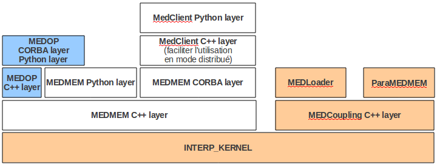
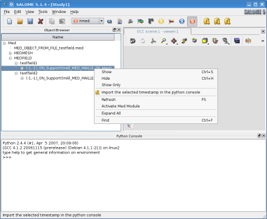
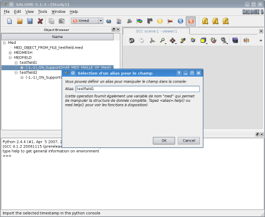
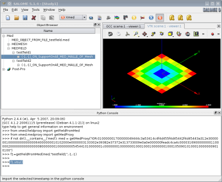
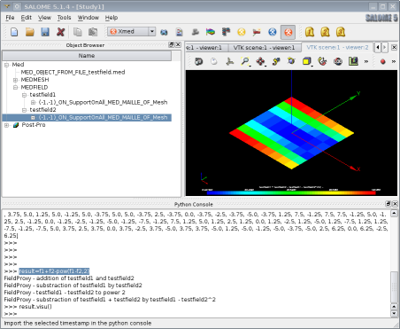

.. meta::
   :keywords: maillage, champ, manipulation, XMED
   :author: Guillaume Boulant

%%%%%%%%%%%%%%%%%%%%%%%%%%%%%%%%%%%%%%%%%%%
Démonstrateur XMED, documentation technique
%%%%%%%%%%%%%%%%%%%%%%%%%%%%%%%%%%%%%%%%%%%

Cette note fait la synthèse des développements effectués pour le
maquettage des fonctions de manipulation de champs dans SALOME. Elle
présente les principes retenus en matière de conception, c'est-à-dire
concernant les mécanismes techniques sous-jacents, et en matière
d'ergonomie, c'est-à-dire concernant les modalités d'utilisation dans
l'environnement SALOME.

Ces principes sont illustrés par des développements implantés dans le
module XMED, développé pour les besoins de l'analyse, et dans le
module MED distribué avec la plateforme SALOME.

.. note:: la lecture de ce chapitre demande une connaissance de la
   structure de classes du module MED, en particulier la distinction
   entre les classes ``MEDMEM::*`` et les servants CORBA associés
   (classe ``SALOME_MED::*``).

.. contents:: Sommaire
   :local:
   :backlinks: none

Principes directeurs
====================

Objectif et motivation
----------------------

L'objectif de maquettage est de trouver une architecture technique qui
permet d'exécuter le cas d'utilisation suivant:

* Chargement d'un fichier med dans SALOME (a priori dans le module MED)
* Sélection graphique des champs de l'étude à mettre à disposition
  dans la console utilisateur ("calculette" en mode texte qui
  concraitement correspond à l'interface python de SALOME).
* Dans la calculette, exécution d'opérations algébriques (+,-,*,/)
  entre champs avec possibilité d'utiliser des scalaires dans des
  opérations de type transformation linéaire (y=ax+b ou y et x sont
  des champs et a et b des scalaires). Opérations pow, sqrt.
* Possibilité de visualiser les champs produits avec VISU pour
  contrôle des résultats.
* Possibilité d'exporter des champs produits dans un fichier med.

Eléments de contexte
--------------------

Les opérations de manipulation de champs sont en grande partie
implémentées dans la bibliothèque MEDMEM. Pour illustration, le
fragment de code ci-dessous montre comment une addition de champ peut
être opérée en python:

.. code-block:: python

    from libMEDMEM_Swig import MedDataManager
    from xmed.helper import readMed, writeMed

    # Load the medmem data structure from a med file
    med = readMed("/tmp/input.med")
    # Then create a med data manager to deal with the fields data
    dm  = MedDataManager(med)
    # Get the timestamps (dt,it)=(-1,-1) of the fields "testfield1" and "testfield2"
    f1 = dm.getFieldDouble("testfield1",-1,-1)
    f2 = dm.getFieldDouble("testfield2",-1,-1)

    # Create a new field as the sum of f1 and f2
    r  = f1 + f2
    # And add this new field to the med data structure
    med.addField(r)

    # Finally, write the whole data in an output med file
    writeMed(med,"/tmp/output.med")

Ceci montre que les champs peuvent être manipulés avec une interface
relativement ergonomique (une addition de deux champs f1 et f2 s'écrit
f1+f2) tant que l'on manoeuvre des objets MEDMEM purs (classes C++ du
package MEDMEM et wrapping python du package MEDMEM_SWIG).

Par ailleurs, le fonctionnement actuel des modules SALOME qui
manoeuvrent des données MED est d'instancier les structures de données
MEDMEM au niveau de la partie serveur, c'est-à-dire au niveau des
servants CORBA hébergés dans le processus ``SALOME_Container``, et de
donner accés à ces données depuis l'étude SALOME au travers de
pointeurs CORBA. Ce choix d'architecture présente l'avantage de
centraliser au niveau serveur la gestion du cycle de vie des données
informatiques et de pouvoir distribuer des "poignées" pour manipuler
ces données depuis chaque point de l'application qui sait accéder au
bus CORBA, l'interface graphique en particulier.

Hypothèse de travail
--------------------

Compte-tenu de l'objectif de maquettage et des éléments de contexte
existant, on cherche une solution dans le cadre des hypothèses
de travail suivantes:

* La manipulation des champs se fait dans l'environement graphique de
  SALOME.
* Dans cet environnement, on souhaite pouvoir sélectionner
  graphiquement les champs à considérer, puis manipuler ces champs
  dans l'interface texte au moyen de variables python avec une syntaxe
  aussi simple que celle définie dans le wrapping python de MEDMEM,
  c'est-à-dire que pour faire l'addition de 2 champs f1 et f2, on veut
  pouvoir écrire f1+f2.
* Les données MED sont physiquement dans la partie serveur de SALOME
  et accessibles via des pointeurs CORBA (interface spécifiée dans
  MED.idl). On exclu la recopie de données au niveau du client
  graphique.

Dans le cadre de ces hypothèses, la difficulté technique réside dans
la mise au point d'une interface de communication entre des variables
manipulées par l'utilisateur dans l'interface graphique (c'est-à-dire
dans le processus ``SALOME_SessionServer``) et des objets MEDMEM
instanciés dans le containeur des servants CORBA (c'est-à-dire dans le
processus ``SALOME_Container``).

Eléments de conception
======================

Implantation technique
----------------------

Le diagramme ci-dessous représente l'organisation des principaux
paquets logiciels du module MED:

Les cadres bleus représentent le lieu d'implantation des
développements effectués dans le module MED pour les besoins du
maquettage. On notera en particulier les interventions aux niveaux
suivants:

* interfaces idl: ajout de l'interface MEDOP.idl
* package MEDMEM_I: ajout du servant SALOME_MED::MEDOP qui implémente
  l'interface MEDOP.idl

Architecture technique
----------------------

Les schéma ci-dessous représente les objets informatiques qui sont à
l'oeuvre pour la réalisation des opérations sur les champs:

.. image:: /images/xmed-architecture.png
   :align: center
   :alt: Objets mis en oeuvre dans l'interface de manipulation de champs

On distingue les objets suivants:

* Une instance de ``MEDMEM::MED``, correspondant à la structure de donnée
  MED chargée en mémoire.
* Des instances de ``MEDMEM::FIELD`` qui représentent les champs med
  chargés en mémoire.
* Une instances de ``SALOME_MED::MED`` et des instances de
  ``SALOME_MED::FIELD`` qui sont les servants CORBA respectivement de la
  structure med et des champs qui lui sont associés et chargés en
  mémoire.
* Une instance de ``SALOME_MED::MEDOP`` qui est le servant CORBA qui
  centralise la mise en oeuvre des opérations de champs sur le serveur
  ``SALOME_Container``. Le servant MEDOP détient en attribut une référence
  sur la structure ``MEDMEM::MED``, ce qui lui permet d'accéder
  directement aux champs ``MEDMEM::FIELD`` à partir de leur nom et du pas
  de temps.
* Des instances de ``FieldProxy`` qui correspondent aux variables
  manipulées au niveau de l'interface graphique et qui représentent
  les champs. Une instance de FieldProxy possède détient les
  références des servants ``SALOME_MED::MEDOP`` et
  ``SALOME_MED::FIELD`` sous la forme de pointeurs CORBA de noms
  ``medop_ptr`` et ``field_ptr`` respectivement.
* Il existe également une instance de ``MedProxy`` non représentée
  dans ce diagramme. Cette instance correspond à une variable qui
  permet de manipuler la structure med.

.. note:: Les éléments apportés par la maquette sont les classes
   ``SALOME_MED::MEDOP``, ``MedProxy`` et ``FieldProxy``. Les autres
   éléments ont pu être modifiés légèrement pour les besoins de
   l'intégration ou pour la correction de quelques bugs.

Le cycle de vie de ces objets est le suivant.

Pour ce qui concerne les instances de la structure ``MEDMEM::MED`` et
des champs ``MEDMEM::FIELD``, la création est faite au moment du
chargement du fichier med dans SALOME au moyen du module MED. A cette
occasion, les servants CORBA associés ``SALOME_MED::MED`` et
``SALOME_MED::FIELD`` sont créés et des références vers ces servants
sont publiés dans l'étude. Ils peuvent donc être sélectionnés par
l'utilisateur dans l'interface graphique. L'ensemble de ces données
préexiste à la manipulation de champs.

Les objets ``SALOME_MED::MEDOP`` sont instanciés au sein du servant
``SALOME_MED::MED`` auquel ils sont associées. Le servant
``SALOME_MED::MED`` possède une référence sur la structure
``MEDMEM::MED`` et il la transmet à l'instance du servant
``SALOME_MED::MEDOP`` qu'il construit. L'opérateur MEDOP est donc
autonome par la suite pour manipuler les données MED, et les champs en
particulier. Le code python ci-dessous montre comment un opérateur med
``SALOME_MED::MEDOP`` peut être créé puis utilisé pour réaliser
l'addition de deux champs:

.. code-block:: python

   import salome
   salome.salome_init()
   import SALOME_MED

   medComp = salome.lcc.FindOrLoadComponent("FactoryServer", "MED")
   medObj  = medComp.readStructFile("myfile.med",salome.myStudyName)
   medOp   = medObj.createMedOperator()

   f1 = medObj.getField("testfield1",-1,-1)
   f2 = medObj.getField("testfield2",-1,-1)

   somme = medOp.add(f1,f2)

Il est à noter qu'une instance de ``SALOME_MED::MEDOP`` est associé à
une instance unique de ``SALOME_MED::MED`` (et donc indirectement de
``MEDMED::MED``) pour toute la durée de son cycle de vie. Par contre,
un servant ``SALOME_MED::MED`` peut être associé à plusieurs servants
``SALOME_MED::MEDOP`` différents. Un servant ``SALOME_MED::MEDOP`` a
une référence directe sur la structure ``MEDMEM::MED`` et peut la
manoeuvrer pour demander des champs, faire des opérations avec ces
champs, ajouter le champs résultat à la structure et enfin retourner
un servant ``SALOME_MED::FIELD`` qui encapsule le champ résultat.

Enfin, quelques éléments concernant la classe ``FieldProxy``. Une
instance de ``FieldProxy`` est un objet python qui peut être
manoeuvrée dans l'interpréteur SALOME et qui référence un champ MED
localisé sur le serveur ``SALOME_Container`` (par le mécanisme décrit
ci-dessus). C'est à ce niveau qu'on règle les détails d'ergonomie
d'usage (cf. paragraphe ci-après). La création d'un objet
``FieldProxy`` déclenche la création d'un opérateur med (instance de
``SALOME_MED::MEDOP``) qui lui est associé et dont il conserve la
référence CORBA en attribut (noté ``medop_ptr`` sur le diagramme). Cet
opérateur ``medop_ptr`` peut être requêter pour exécuter toutes les
opérations possibles sur ce champ, comme illustrer sur l'exemple
ci-dessus.

Rôle des objets proxy
---------------------

Dans le modèle d'architecture présenté ci-dessus, on introduit deux
types d'objets proxy:

* Les objets de classe ``FieldProxy`` qui représentent des poignées de
  manipulation des champs ``MEDMEM::FIELD`` physiquement instanciés
  dans le container SALOME.
* Les objets de classe ``MedProxy`` qui représentent des poignées de
  manipulation des structures ``MEDMEM::MED`` physiquement instanciées
  dans le container SALOME.

Elles sont instanciées dans l'interpréteur python SALOME pour
manipulation dans l'interface textuelle à partir de la donnée du
pointeur vers le servant ``SALOME_MED::MED`` et de l'identifiant du
champ (le nom du champ et le pas de temps défini par le numéro d'ordre
et le numéro d'iteration:

.. code-block:: python

   import salome
   salome.salome_init()
   import SALOME_MED

   medComp = salome.lcc.FindOrLoadComponent("FactoryServer", "MED")
   medObj  = medComp.readStructFile("myfile.med",salome.myStudyName)

   from xmed import fieldproxy
   from xmed import medproxy

   f1 = fieldproxy.getFieldFromMed(medObj, "testfield1", -1, -1)
   f2 = fieldproxy.getFieldFromMed(medObj, "testfield2", -1, -1)

   field_somme  = f1 + f2
   field_offset = f1 + 5.3

Dans cet exemple, les variables ``f1``, ``f2``, ``field_somme`` et
``field_offset`` sont des objets de classe ``FieldProxy``. Ils
correspondent aux variables physiquement manipulées par
l'utilisateur pour désigner les champs dans les opérations.

Ces classes proxy sont conçues pour être le lieu d'implémentation de
l'interprétation des commandes utilisateur et donc de l'ergonomie
de manipulation des champs au niveau l'interface textuelle. Ce point
est développé :ref:`plus bas <develguide_execFieldOperation>`.

Programmation de l'interface textuelle
--------------------------------------

Dans le cadre de la maquette, l'interface de manipulation des champs
est l'interface textuelle python intégrée à SALOME. Dans la pratique,
l'utilisateur manipule des variables python qui correspondent à des
objets de classe ``FieldProxy`` équipées des fonctions requises et de
l'ergonomie nécessaire à la mise en oeuvre des opérations (voir
ci-dessus).

Or, l'hypothèse de travail est que les données MED sont chargées dans
SALOME et publiées dans l'étude pour point d'accés depuis l'interface
graphique. L'utilisateur choisi un champs directement dans l'arbre
d'étude (ou dans une interface graphique dédiée) puis demande qu'il
soit mis à disposition dans l'interface python sous un nom de variable
à choisir. Les captures d'écran ci-dessous montre la séquence
graphique en images:

+---------------+---------------+
| |IMG_SELECT|  | |IMG_ALIAS|   |
+---------------+---------------+

L'image de gauche montre la sélection du pas de temps, l'image de
droite la boîte de dialogue qui permet la saisie de l'alias avec
lequel le champs sera manipulé dans l'interface textuelle. La
validation de cette fenêtre doit mettre automatiquement le champ à
disposition dans l'interface python SALOME et sous le nom de variable
spécifié par l'alias saisi.

Pour cela, il y a un couplage technique à programmer entre l'interface
graphique et l'interface textuelle python, avec en particulier la
transmission des pointeurs vers les servants CORBA mis en jeu dans la
sélection.

Ce couplage est implanté au niveau de la classe MEDGUI.cxx du module
MED (où de la classe XMEDGUI.cxx du module XMED pour la maquette) qui
implémente l'interface graphique du module. Pour rappel, l'interface
graphique d'un module SALOME se présente sous la forme d'une classe
centrale de nom ``<MODULE_NAME>GUI`` et qui spécialise la classe
``SalomeApp_Module``. Cette classe possède une méthode ``getApp()``
par laquelle on peut récupérer une instance de la console python
embarquée (this->getApp()->pythonConsole()).

Le code suivant illustre l'envoie d'une commande python par ce
mécanisme. Dans cet example, on cherche à reconstituer dans le
contexte de la console python un pointer vers un objet med instancié
dans le contexte C++ de l'application graphique. Pour cela, on
communique la référence de l'objet sous la forme sérialisé (IOR pour
un objet CORBA):

.. code-block:: cpp

   #include <PyConsole_Console.h>
   #include <QString>
   #include <QStringList>
   #include <SalomeApp_Application.h>

   // We suppose here that we have a CORBA object reference (object of
   // type *_ptr or *_var), for example a SALOME_MED::MED object.
   SALOME_MED::MED_ptr medObj = ... // anything to get this object

   // Get the IOR of this object
   QString medIOR = SalomeApp_Application::orb()->object_to_string(medObj);

   PyConsole_Console * pyConsole = getApp()->pythonConsole();

   QStringList commands;
   commands+="import salome";
   commands+=QString("med=salome.orb.string_to_object(\"%1\")").arg(medIOR);

   QStringListIterator it(commands);
   while (it.hasNext()) {
       pyConsole->exec(it.next());
   }

Le code réel de la maquette est basé sur ce principe et transmet à la
console python des lignes de commandes qui permettent de reconstruire:

* un pointeur CORBA vers le servant ``SALOME_MED::MED`` associé au
  champ sélectionné;
* une instance de ``FieldProxy`` qui correspond au champ sélectionné
  et avec pour nom de variable la valeur de l'alias saisi dans
  l'interface graphique.

Au niveau du code C++ de la classe ``XMEDGUI.cxx``, cela se traduit
par la fabrication de la liste de commandes suivante pour envoie à la
console python par le mécanisme illustré plus haut:

.. code-block:: cpp

   QStringList commands;
   commands+="from xmed.fieldproxy import getFieldFromMed";
   commands+="from xmed.medproxy import getMedProxy";
   commands+=QString("if not dir().__contains__('med'): med = getMedProxy(\"%1\")").arg(medIOR);
   commands+=QString("%1=getFieldFromMed(med,\"%3\",%4,%5)").arg(*alias).arg(fieldName).arg(orderIndex).arg(iterationIndex);

Les variables ``medIOR``, ``fieldName``, ``orderIndex`` et
``iterationIndex`` sont construites à partir du champ sélectionné par
des techniques de programmation standard dans SALOME qu'on peut
examiner en détail dans la classe ``XMEDGUI`` (voir méthode
``XMEDGUI::LoadIntoPythonConsole()``). La variable ``alias`` est la
chaîne saisie par l'utilisateur dans la fenêtre de dialogue.

Le point important à noter ici est que les données à transmettre
doivent être fournies sous forme de chaînes de caractères ou de types
simples. C'est pourquoi la référence au servant CORBA
``SALOME_MED::MED`` est transmise ici sous la forme de son IOR,
c'est-à-dire une chaîne de caractères qui permet l'identification de
l'objet au niveau du bus CORBA.

Au niveau de la console python cela correspond à l'exécution des
commandes suivantes:

.. code-block:: python

   from xmed.fieldproxy import getFieldFromMed
   from xmed.medproxy import getMedProxy

   med = getMedProxy("IOR:010000001700000049444c3a53414c4f4d455f4d45442f4d45443a312e300000010000000000000064000000010102000e0000003133302e39382e37372e313733009e0a0e000000feadc4ca4c00003169000000001100000200000000000000080000000100000000545441010000001c00000001000000010001000100000001000105090101000100000009010100")

   f1=getFieldFromMed(med,"testfield1",-1,-1)

Ce jeu d'instructions reconstitue un pointeur vers le servant CORBA
``SALOME_MED::MED`` à partir de son identifiant IOR (voir la fonction
``getMedProxy(...)``, puis crée une instance de ``FieldProxy``
associée à ce servant (en fait associée au servant
``SALOME_MED::MEDOP`` créé sur demande par le servant
``SALOME_MED::MED``, voir la fonction ``getFieldFromMed(...)``).

.. _develguide_execFieldOperation:

Exécution des opérations sur le champs
--------------------------------------

Les variables définies dans l'interface textuelle pour désigner les
champs à manipuler sont des objets de classe ``FieldProxy``.

Cette classe a une propriété remarquable, elle est construite sur un
design pattern de type "Proxy" qui pointe vers un servant
``SALOME_MED::FIELD``. Cela signifie que l'on ne peut pas accéder
directement au servant vers lequel il pointe, mais que l'on passe
systématiquement par une procédure de l'objet proxy qui fait "boîte
aux lettres":

.. code-block:: python

   class FieldProxy:

     def __getattr__( self, name ):
        """
        This method realizes the proxy pattern toward the servant
        SALOME_MED::FIELD.
        """
        return getattr( self.__field_ptr, name )

Ce pattern permet l'implémentation de pré-traitement et/ou de
post-traitement suivant le type d'accés que l'on cherche à faire.

Il permet aussi et surtout de fournir un objet python qui présente
l'interface de ``SALOME_MED::FIELD`` dotée d'extentions adhoc pour les
operations de champs. Ici, python est ton ami, car il s'agit pour cela
d'équiper la classe ``FieldProxy`` des automatismes prévus nativement
par python pour les operations entre objets. En particulier, la
re-définition des fonctions internes ``__add__`` (opérateur addition),
``__sub__`` (opérateur soustraction), ``__mul__`` (opérateur
multiplication) et ``__div__`` (opérateur division) au sein de la
classe ``FieldProxy``, permet de prendre la main sur le comportement
des opérations algébriques et de définir une ergonomie sur mesure. Par
exemple, la méthode ``__add__`` peut gérer les variantes "f1+f2"
(ajout de deux variables de type FieldProxy) et "f1+5.3" (ajout d'un
réel à une variable de type FieldProxy):

.. code-block:: python

   class FieldProxy:

     def __add__(self, operande):
        """
        This can process the addition of two fields or the addition of
        a scalar to a field. It depends weither the operande is a
        FieldProxy or a simple scalar numerical value.
        """
        if isinstance(operande, FieldProxy):
            # The operande is an other field
            otherField_ptr = operande.__field_ptr
            rfield_ptr = self.__medOp_ptr.add(self.__field_ptr, otherField_ptr)
        else:
            # The operande is a scalar numerical value that must be
            # considered as an offset in a linear transformation
            factor = 1
            offset = operande
            rfield_ptr = self.__medOp_ptr.lin(self.__field_ptr, factor, offset)
        return FieldProxy(self.__med_ptr, rfield_ptr)

Il est à noter que dans les deux cas de figure (opérande=champ ou
opérande=scalaire), la fonction délègue la réalisation concrète de
l'opération au servant ``SALOME_MED::MEDOP`` (identifié ici par
l'attribut ``self.__medOp_ptr`` et que l'on appelera l'*opérateur
MEDOP* dans la suite pour simplifier), mais n'appelle pas le même
service de calcul (l'addition entre champs dans le premier cas,
l'application d'une transformation linéaire de type y=factor*x+offset
dans le deuxième cas).

Pour couvrir le cas des opérations algébriques, l'opérateur MEDOP
présentre l'interface suivante (cf. fichier ``MEDOP.idl`` qui définie
l'interface du servant ``SALOME_MED_MEDOP``):

.. code-block:: cpp

    /*! Addition of the fields f1 and f2 ( f1+f2) */
    FIELD add(in FIELD f1, in FIELD f2) raises (SALOME::SALOME_Exception);
    /*! Substraction of the fields f1 and f2 (f1-f2) */
    FIELD sub(in FIELD f1, in FIELD f2) raises (SALOME::SALOME_Exception);
    /*! Multiplication of the fields f1 by f2 (f1*f2) */
    FIELD mul(in FIELD f1, in FIELD f2) raises (SALOME::SALOME_Exception);
    /*! Division of the fields f1 by f2 (f1/f2) */
    FIELD div(in FIELD f1, in FIELD f2) raises (SALOME::SALOME_Exception);
    /*! Power of the field f (f^power) */
    FIELD pow(in FIELD f, in long power) raises (SALOME::SALOME_Exception);
    /*! Linear transformation of the field f (factor*f+offset) */
    FIELD lin(in FIELD f, in double factor, in double offset) raises (SALOME::SALOME_Exception);
    /*! Dublication of the field f */
    FIELD dup(in FIELD f) raises (SALOME::SALOME_Exception);

Cette interface est implémentée dans la classe C++ ``MEDOP_i`` du
module MED (voir fichier ``MEDMEM_MedOp_i.hxx`` du package
``MEDMEM_I``). C'est au sein des instances de cette classe que sont
réalisées les opérations et que sont produites physiquement les
données. Typiquement, les opérations présentées ici produisent un
champ ``MEDMEM::FIELD`` sur la base duquel elle fabrique un servant
``SALOME_MED::FIELD`` pour finalement retourner un pointeur CORBA sur
ce servant.

Ce mécanisme global peut être étendu sans limitation à tout les types
d'opération qui sont envisagés dans les spécifications de manipulation
des champs dans SALOME.

Contrôle visuel des champs
--------------------------

Les illustrations ci-dessous montrent qu'une fonction de visalisation
est implémentée dans la maquette pour permettre le contrôle visuel
d'un champ au moyen d'une représentation 3D (une carte spatiale du
module du champ dans l'exemple implémenté par défaut):

+---------------+---------------+
| |IMG_VISU|    | |IMG_RESULT|  |
+---------------+---------------+

Cette fonction répond au besoin de contrôle interactif des résultats
produits par les opérations de manipulation de champs.

Il s'agit là d'un usage classique de SALOME, dans lequel on demande au
module VISU de faire une représentation 3D d'un champ spécifié par la
donnée du servant ``SALOME_MED::FIELD`` qui lui est associé
(représenté par la variable ``field_ptr`` dans l'exemple ci-dessous):

.. code-block:: python

   import salome
   import VISU

   visuComp = salome.lcc.FindOrLoadComponent("FactoryServer", "VISU")
   visuComp.SetCurrentStudy(salome.myStudy)

   # Then we can import the specified field in the VISU module. This
   # creates an study entry in the VISU folder.
   result = visuComp.ImportMedField(field_ptr)

   meshName   = field_ptr.getSupport().getMesh().getName()
   fieldName  = field_ptr.getName()
   iterNumber = field_ptr.getIterationNumber()
   scalarmap = visuComp.ScalarMapOnField(result,
                                         meshName,
                                         visuEntityType,
                                         fieldName,
                                         iterNumber)

Dans ce jeu d'instructions donné pour exemple (non fonctionnel, en
particulier à cause de la non définition de la variable
``visuEntityType``, voir remarque plus bas), le composant VISU
désigné ici par la variable ``visuComp`` va chercher les données du
champ en interrogeant le servant ``SALOME_MED::FIELD`` transmis en
argument de la fonction ``ImportMedField``, puis produit une
représentation de type "scalarmap".

.. note:: Compte-tenu des propriétés de la classe FieldProxy décrites
   plus haut conférées par le pattern "Proxy", on peut transmettre ici
   aussi bien le servant CORBA que l'instance du proxy (la fonction
   ``ImportMedField`` n'y verra que du feu).

Le code complet et fonctionnel de la fonction d'affichage est dans le
corps du module python ``fieldproxy.py`` sous la forme d'une fonction
de nom ``visuField``. Il convient de noter que cette fonction doit
établir une correspondance entre le type des entités tel que défini
dans MED et dans VISU:

.. code-block:: python

    medEntityType = field_ptr.getSupport().getEntity()
    if (medEntityType == SALOME_MED.MED_CELL):
        visuEntityType = VISU.CELL
    elif (medEntityType == SALOME_MED.MED_NODE):
        visuEntityType = VISU.NODE

Export des résultats de calcul
------------------------------

Tous les champs produits à l'occasion des opérations entre objets
``FieldProxy`` sont automatiquement ajoutés à la structure med à
laquelle is sont associés. Une convention d'attribution des noms est
implémentée de sorte que par défaut aucune précision n'est demandée à
l'utilisateur.

La structure med peut être manipulée au moyen de la variable ``med``
créée dans l'interface textuelle comme une instance de la classe
``MedProxy``. La classe ``MedProxy`` fournit un objet qui présente
l'interface du servant ``SALOME_MED::MED`` étendue de quelques
fonctions utilitaires pour la gestion et le contrôle des données.

En particulier, la sauvegarde de la structure dans un fichier est
automatisée par la méthode ``save(medfilename)``:

.. code-block:: python

   med = medproxy.MedProxy(medObj)
   med.save("/tmp/output.med")

Cette méthode s'occupe de définir un driver d'écriture et de procéder
à l'enregistrement des données de la structure med (les maillages, les
champs présents au départ et tous les champs produits depuis la
lecture initiale).

Limitations
===========

L'implémentation de la maquette limite l'usage des opérations aux cas
de figure suivants:

* Seules les operations entre champs qui partagent le même support med
  sont possibles. Ceci est une contrainte imposé par la conception
  actuelle de MEDMEM.
* Le résultat d'une opérations est calculé sur toutes les composantes
  et tout le domaine de définition des champs en opérande. Cette
  deuxième contrainte est juste parce que les usages plus fin,
  notemment avec la notion de domaine de définition, n'a pas encore
  été exéminée à ce jour.
* Le nom d'un champ produit par une opération ne correspond pas au nom
  de la variable python par laquelle on le réceptionne et on le
  manipule. Le nom est attribué par une convention (ceci n'est pas
  vraiment une limitation mais une caractéristique à connaître).

On note également les restriction techniques suivantes:

* Les données MEDMEM sont supposées être chargées par le composant MED
  puis référencées dans l'étude SALOME (comme c'est fait aujourd'hui
  par le module MED).
* Dans certain cas, python n'est pas ton ami. Pour que les opérateur
  de la classe ``FieldProxy`` soient pris en considération dans les
  opérations sur les champs, il est indispensable que le premier
  opérande d'une opération unitaire soit un champ (objet de classe
  ``FieldProxy``). Par exemple: "field_offset = field + 5.3"
  fonctionne alors que "field_offset = 5.3 + field" ne fonctionne pas
  car python tente de traiter la situation au moyen de la fonction
  ``__add__`` de la classe ``float`` (qui n'est pas modifiable).

Notice informatique
===================

Gestion de configuration
------------------------

Les développements décrits dans ce chapitre sont répartis entre les
modules MED et XMED (développé pour l'occasion). Cette séparation est
faite par soucis de clarté et d'efficacité de développement, mais les
éléménts du module XMED ont vocation à intégrer le module MED dans la
mesure où les propositions techniques sont retenues pour le
développement à venir.

Le code source du module XMED peut être récupérés par la commande
suivante::

 $ svn co svn://nepal.der.edf.fr/FIELD/XMED_SRC/trunk XMED_SRC

Le pré-requis est la plate-forme SALOME version 5.1.4 (ou plus)
équipée au minimum des modules KERNEL, GUI, MED (branche BR_medop) et
VISU. Pour récupérer la branche BR_medop du module MED, taper la
commande::

 $ cvs -d :pserver:anonymous@cvs.opencascade.com:2401/home/server/cvs/MED co -r BR_medop MED_SRC

La configuration de référence est:

* XMED: révision svn 41
* MED: tag cvs BR_medop_20101025

Moyens de tests
---------------

Plusieurs types de tests unitaires sont définis (reste à les
automatiser proprement):

* Test des servants et utilitaires de manipulation python:

  - Dans XMED, package xmed/tests, utiliser le script
    ``test_medoperation.py`` dans un interpréteur python lancé dans
    une session shell SALOME. Ce script prépare des variables de test
    et fournit des fonctions de test unitaire (à exécuter ou pour s'en
    inspirer). Après avoir lancé SALOME via une application virtuelle,
    on peut taper::

      $ <APPLI_ROOT>/runSession
      [NS=venus:2810] $ python -i test_medoperation.py
      >>>

  - Ceci permet de tester en particulier l'interface ``MedOp`` et son
    utilisation dans le module python ``fieldproxy.py``.

* Test des classes MEDMEM:

  - Test de MEDMEM::MedDataManager dans ``MEDMEM_MedDataManager_test.cxx``

Un fichier de test basique (mais néanmoins suffisant) de nom
``tesfield.med`` est fourni avec les sources dans le répertoire
``<XMED_SRC>/resources/datafiles`` et dans l'installation au niveau du
répertoire ``<INSTALLDIR>/share/salome/resources/xmed/datadir``. Il
contient deux champs ``testfield1`` et ``testfield2`` définis sur un
pas de temps unique (dt,it=-1,-1). Ces champs définissent des valeurs
par éléments (MED_CELL).
