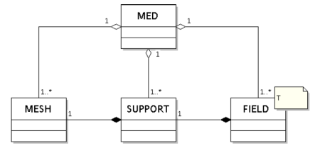
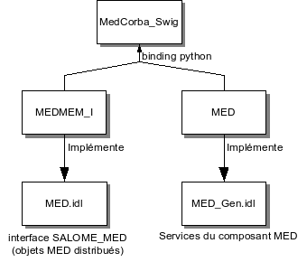

.. meta::
   :keywords: maillage, champ, MED, MEDMEM
   :author: Guillaume Boulant

.. include:: medcalc-definitions.rst

%%%%%%%%%%%%%%%%%%%%%%%%%%%%%%%%%%%%%%%%%%%%%%%%%%
Note de travail concernant l'utilisation de MEDMEM
%%%%%%%%%%%%%%%%%%%%%%%%%%%%%%%%%%%%%%%%%%%%%%%%%%

Le module MED de SALOME comporte plusieurs composants d'intérêt pour
la manipulation de champs:

* la bibliothèque MEDMEM qui fournit une interface de programmation
  pour manoeuvrer une structure MED
* le module CORBA SALOME_MED qui matérialise le composant SALOME
  (serveur corba) du module MED
* l'interopérabilité avec le module VISU qui permet la visualisation
  des champs manipulés dans MED

Les sections ci-après donnent quelques éclairages techniques sur ces
différents aspects. Les sources de démonstration peuvent être
récupérés depuis le dépôt svn::

 $ svn export svn://nepal.der.edf.fr/OM/manifield/trunk manifield
 $ svn export svn://nepal.der.edf.fr/FIELD/demofield/trunk demofield

.. contents:: Sommaire
   :local:
   :backlinks: none

Présentation synthétique de MED
===============================

MED désigne un modèle conceptuel pour décrire des données de type
éléments finis (éléments finis, volumes finis et éléments
discrets). Dans l'usage courant, il permet la description et l'échange
des données de calcul de type maillages et champs. La documentation
complète peut être trouvée à l'URL suivantes:

* |LINK_EDF_MEDDOC|_ (version 2.3).

On distingue deux implémentations informatiques de ce modèle:

* MED fichier: qui permet la lecture et l'écriture de données depuis
  un fichier au format med. Les opérations de lecture/écriture sont
  atomiques (pas de chargement de la structure de données globale).
* MED mémoire (noté MEDMEM): qui permet le chargement en mémoire d'une
  image de la structure de données MED contenue dans un fichier au
  format med. Les opérations peuvent être atomiques ou
  globales.

On notera simplement ici que MEDMEM utilise MED fichier pour les
opérations de lecture/écriture et que MED fichier est indépendant de
MED mémoire. La documentation complète de MED fichier peut être
trouvée à l'URL suivante:

* |LINK_EDF_MEDFICHIERDOC|_

La bibliothèque MEDMEM
======================

Le modèle de classes MEDMEM est structuré autour des notions de MESH
(les maillages), de SUPPORT (le profil des entités) et de FIELD (les
champs). Ces notions reprennent en partie des concepts du modèle
MED. Le diagramme ci-dessous présente les classes principales:

Le conteneur de plus haut niveau dans MEDMEM est la classe MED. La
figure ci-dessous indique qu'une instance MED peut être associée à
plusieurs maillage et plusieurs champs. Par contre un champ donné ne
peut être associé qu'à un seul maillage (par l'intermédiaire du
support). Plusieurs champs peuvent être associés au même maillage. La
forme la plus courante est d'ailleurs une instance composé d'un
maillage unique sur lequel sont définis plusieurs champs.

On peut avoir également des configurations plus complexes, comme par
exemple un maillage unique, plusieurs champs définis sur ce maillage
mais avec des supports différents, par exemple parce que les valeurs
sont définies sur des entités de maillage différentes (les éléments
pour un champ, les noeuds pour un autre, ...)::

  field1->support1->mesh
  field2->support2->mesh
  field3->support3->mesh

On observe:

* 2 champs U et V doivent avoir le même support (au sens informatique
  du terme) pour pouvoir être en argument d'une opération (sinon
  exception). Il faudrait accepter qu'il soit informatiquement
  différent et vérifier la conformité conceptuelle.
* Cette contrainte peut se comprendre car physiquement les données
  sont stockées dans un vecteur qui couvre toutes les mailles. Le
  support est le seul masque de lecture pour établir la correspondance
  avec les positions dans le maillage et il est donc important qu'une
  cohérence soit assurée.

Les objets champs (FIELD) et maillage (MESH)
--------------------------------------------

Un objet MED permet d'accéder aux différentes informations concernant
les objets MESH, SUPPORT et FIELD, mais il ne permet pas d'accéder aux
données physiques associées à ces objets (les valeurs des composantes
pour les champs, les mailles et leur connectivité pour les
maillages). L'accès aux données physiques est du ressort des objets
spécifiques MESH, SUPPORT et FIELD.

Un objet MED peut être créé intégralement en mémoire. L'usage plus
fréquent est de l'initialiser à partir de la donnée d'un fichier
med. Pour cela, l'objet MED doit être associé à un driver
d'entrée/sortie branché sur le fichier (``testfilename`` dans
l'exemple):

.. code-block:: cpp

   MED *myMed = new MED;
   MED_MED_RDONLY_DRIVER *driverIn = new MED_MED_RDONLY_DRIVER(testfilename, myMed);
   driverIn->open();
   driverIn->readFileStruct();
   driverIn->close();

A l'occasion de la fonction readFileStruct, la structure interne de
l'objet MED est enrichie des informations concernant les objets MESH,
SUPPORT et FIELD contenu dans le fichier. En particulier un
dictionnaire des champs (variable map interne) est initialisé est
contient l'ensemble des objets ``FIELD_`` préchargés (i.e. avec les
méta-données uniquement). Chaque objet ``FIELD_`` ainsi préchargé est
autonome pour être chargé sur demande. On peut alors requêter l'objet
MED pour obtenir un champ particulier (spécifié par son nom
``fieldname`` dans l'exemple):

.. code-block:: cpp

   FIELD<double> *field = (FIELD<double> *)myMed->getField(fieldname, dt, it);

Puis le champ qui lui est associé doit être physiquement chargé pour
permettre la mise à jour du support:

.. code-block:: cpp

   MESH * mesh = myMed->getMesh(field);
   mesh->read();
   myMed->updateSupport();

Pour enfin charger les valeurs des composantes du champ:

.. code-block:: cpp

   field->read();

La numérotation des éléments de maillage
----------------------------------------

Les éléments qui composent un maillage sont caractérisés par:

* Le type d'entité de l'élément, à choisir dans la liste
  ``MED_EN::medEntityMesh``, qui contient en particulier ``MED_NODE``,
  ``MED_FACE``, ``MED_CELL``.
* Le type de géométrie de l'élément, à choisir dans la liste
  ``MED_EN::medGeometryElement``, qui contient en particulier
  ``MED_NONE``, ``MED_TRIA3``, ..., ``MED_ALL_ELEMENTS``.

Les éléments sont numérotés par un indice relatif à la catégorie
géométrique à laquelle ils appartiennent. Ainsi, si le modèle est
composé de Na arrêtes et Nf faces de type géométrique MED_QUAD4, alors
ces faces sont numérotées de 1 à Nf dans le modèle MED (et de manière
persistente dans le fichier med). De même, les arrêtes sont numérotées
de 1 à Na. Une numérotion globale implicite existe sur les éléments,
elle consiste à parcourir l'ensemble des types géométriques dans
l'ordre de définition du modèle de données. Ainsi, si le modèle
contient uniquement les Na arrêtes et les Nf faces, alors l'indice
global de la première face est Na+1.

.. note:: Des exemples de code sont disponibles dans le package ``demofield``, fichier ``python/pybasicfields/MEDMEM_tester.py``.

Binding python de MEDMEM
------------------------

Les classes du package ``MEDMEM`` (package du module ``MED`` qui
implémentent les structures de données C++ de MED mémoire) produisent
la bibliothèque ``libmedmem.so``. Cette ensemble de classes est en
partie mis à disposition de l'interface python grace à une couche de
liaison (binding Python-C++) générée par le logiciel SWIG à partir
d'un fichier de description d'interface ``libMEDMEM_Swig.i`` (dans le
package source ``MEDMEM_SWIG``).

Ce fichier d'interface doit être mis à jour dés lors qu'une évolution
des interfaces publiques des classes C++ MEDMEM est faite ou qu'une
nouvelle classe est créée (du moins si l'on souhaite profiter de ces
évolutions dans l'interface python).

Cette mise à jour nécessite de prendre soin au transfert des
structures de données entre les espaces python et C++. En particulier,
l'utilisation des template de classe pour décrire les champs typés en
C++ appelle une précaution de codage particulière de l'interface
SWIG.

Pour exemple, le fragment de code ci-dessous, extrait du fichier
``libMEDMEM_Swig.i``, montre comment déclarer la nouvelle classe
``MedDataManager`` dans l'interface:

.. code-block:: cpp

   #include "MEDMEM_MedDataManager.hxx"

   class MedDataManager
   {
     public:
      ~MedDataManager();
      void printFieldDouble(FIELD<double,FullInterlace> * field);

      %extend {
        MedDataManager(char * fileName)
        {
          return new MedDataManager(string(fileName));
        }
        MedDataManager(MED * med)
        {
          return new MedDataManager(med);
        }

        %newobject getFieldDouble(const char * fieldName, const int dt, const int it);
        FIELD<double, FullInterlace> * getFieldDouble(const char * fieldName, const int dt, const int it)
        {
          return (FIELD<double, FullInterlace> *) self->getFieldDouble(string(fieldName), dt, it);
        }
      }

   };

Utilisation de MEDMEM pour la manipulation de champs
----------------------------------------------------

Des opérations de manipulation de champs sont disponibles dans la
bibliothèque MEDMEM standard est peuvent être utilisées dans
l'interface python. Les quelques lignes suivantes illustrent l'usage
qu'on peut en faire pour exécuter l'addition de deux champs sur tout
leur espace de définition et pour un pas de temps donné:

.. code-block:: python

    from libMEDMEM_Swig import MedDataManager
    from xmed.helper import readMed, writeMed

    # Load the medmem data structure from a med file
    med = readMed("/tmp/input.med")
    # Then create a med data manager to deal with the fields data
    dm  = MedDataManager(med)
    # Get the timestamps (dt,it)=(-1,-1) of the fields "testfield1" and "testfield2"
    f1 = dm.getFieldDouble("testfield1",-1,-1)
    f2 = dm.getFieldDouble("testfield2",-1,-1)

    # Create a new field as the sum of f1 and f2
    r  = f1 + f2
    # And add this new field to the med data structure
    med.addField(r)

    # Finally, write the whole data in an output med file
    writeMed(med,"/tmp/output.med")

.. note:: Cet exemple de code requiert les évolutions de MEDMEM
   opérées dans la branche BR_medop (pour disposer de la classe
   MedDataManager en particulier) et le package python ``xmed`` qui
   fournit quelques fonctions utilitaires pour manoeuvrer les données
   med (ce package est dans le module XMED et sera probablement à
   terme intégré au module MED).

Des limitations existent aujourd'hui pour ce type de manipulations:

* les champs doivent partager le même support MED, c'est-à-dire être
  décrit sur le même maillage et sur les mêmes entités de ce
  maillage.
* ...

Remarque sur l'implémentation C++
---------------------------------

A noter l'usage de plusieurs formes d'arguments pour les fonctions:

* passage des arguments par valeur ``myfunction(A a);``
* passage des arguments par référence ``myfunction(A& a);``
* passage des arguments par pointeur ``myfunction(A* a);``

Le passage des arguments par référence est une facilité d'écriture
pour éviter de passer un pointeur tout en évitant la récopie des
données de la variable.

.. _xmed-medmem_corbainterface:

L'interface CORBA SALOME_MED
============================

Implémentation du composant MED et des servants SALOME_MED::\*
--------------------------------------------------------------

Le composant MED est un servant CORBA qui permet la manipulation de
données MEDMEM dans l'environnement SALOME. Le composant peut fournir
des pointeurs vers des instances de l'interface SALOME_MED (objets
SALOMEMED::MED, SALOME_MED_FIELD, ...). Ces instances sont des
servants CORBA qui résident dans le container et qui encapsulent les
données MEDMEM.

Le schéma ci-dessous représente les éléments informatiques qui
composent l'architecture CORBA du module MED:

Les structures MEDMEM (données physiques) et SALOME_MED (wrapping
CORBA) fonctionnent différement en ce qui concerne le chargement des
données:

* Dans MEDMEM, les données sont chargées à la demande (fonctions read
  des objets) et aucune gestion n'est assurée. En particulier l'appel
  à read alors que la donnée est déjà chargée conduit à une levée
  d'exception. C'est à l'utilisateur de MEDMEM de prendre en charge ce
  type de gestion.
* Dans SALOME_MED, les données sont chargées à la création de
  l'instance SALOME_MED::MED. Les maillages ainsi que les champs et
  leurs données sont chargés à ce moment là et gérés dans une table de
  type HashMap au niveau de la structure SALOME_MED::MED. Cette
  structure remplie dés lors des fonction de gestion. L'appel à
  SALOME_MED::MED.getField(...) ne charge pas les données mais renvoie
  un pointeur SALOME_MED::FIELD_ptr sur les données chargées à
  l'initialisation (ATTENTION, cette fonction est bugguée dans la
  branche principale -> Fix dans la branche BR_medop).

Une gestion intermédiaire peut être envisagée: le chargement à la
demande géré dans une ou plusieurs tables de champs (une pour chaque
type de valeur numérique). Une implémentation de ce type de gestion
est illustré dans la classe ``MedDataManager`` du package MEDMEM qui prend
en charge ce comportement pour les structures de données MED (en
particulier les champs).

Utilisation du composant MED
----------------------------
Le module SALOME MED fournit un module CORBA appelé SALOME_MED. Les
interfaces de ce module CORBA sont spécifiées par les fichiers idl
suivants:

* le fichier
  [http://nepal.der.edf.fr/pub/SALOME_userguide/MED5/doc/salome/tui/MED/MED_8idl.html
  ``MED.idl``] qui décrit les interfaces des objets manipulés par le
  module SALOME_MED. On trouve en particulier les objets MESH, SUPPORT
  et FIELD.
* le fichier
  [http://nepal.der.edf.fr/pub/SALOME_userguide/MED5/doc/salome/tui/MED/MED__Gen_8idl.html
  ``MED_Gen.idl``] qui décrit les interfaces du composant SALOME
  (c'est-à-dire le composant chargé par la commande
  ``FindOrLoadComponent("FactoryServer", "MED")`` du
  lyfeCycleCorba). On trouve:

  - l'interface ``MED_Gen_Driver`` qui hérite de SALOMEDS::Driver
    pour l'implémentation des services généraux des composants SALOME
    (persistance hdf, dump)
  - l'interface ``MED_Gen`` qui hérite des interfaces
    ``Engines::Component`` et ``MED_Gen_Driver`` pour
    l'implémentation des services spécifiques du composant MED.

L'implémentation de ces interfaces est faites au niveau de différents
packages des sources du module MED:

* Le package ``MEDMEM_I`` qui fournit l'implémentation C++ des
  interfaces décrites par le fichier ``MED.idl``;
* Le package ``MED`` qui fournit l'implémentation C++ des interfaces
  décrites par le fichier ``MED_Gen.idl``, et qui correspond à la
  partie composant classique d'un module SALOME.
* Le package ``MedCorba_Swig`` qui fournit une interface swig
  générée à partir de l'implémentation C++ de ``MEDMEM_I`` et
  ``MED``

L'utilisation peut être illustrée au moyen d'exemples python (i.e. qui
utilise l'interface swig fournie par MedCorba_Swig). Après l'import
d'amorce systématique:

.. code-block:: python

   import salome
   salome.salome_init()

   import SALOME_MED
   from libSALOME_Swig import *

On peut charger le composant SALOME MED:

.. code-block:: python

   medComp=salome.lcc.FindOrLoadComponent("FactoryServer", "MED")

grâce auquel les services de chargement de la structure MED peuvent
être invoqués. Par exemple, les commandes suivantes chargent toute la
structure MED dans l'étude salome passée en argument:

.. code-block:: python

   filePathName = "myfile.med"
   medComp.readStructFileWithFieldType(filePathName,salome.myStudyName)

Ce deuxième exemple charge la structure MED mais ne place pas le résultat dans l'étude:

.. code-block:: python

   filePathName = "myfile.med"
   medObj = medComp.readStructFile(filePathName,salome.myStudyName)

On récupère à la place un objet de classe |LINK_EDF_SALOME_MED__MED|_
qui permet une utilisation assez semblable (mais différente on le
verra plus bas) à MEDMEM:

.. code-block:: python

   fieldIdx     = 1 # WRN maybe there is no field of idx=1
   iterationIdx = 0
   fieldName = medObj.getFieldNames()[fieldIdx]
   dtitfield = medObj.getFieldIteration(fieldName,iterationIdx)
   it = dtitfield[0]
   dt = dtitfield[1]
   fieldObj = medObj.getField(fieldName,it,dt)
   nbOfFields = medObj.getNumberOfFields()
   fieldNames = medObj.getFieldNames()

   mesh = fieldObj.getSupport().getMesh()

.. note::
   Observations en vrac:

   * Un FIELD_i possède un champ de type ``MEDMEM::FIELD_`` qui représente
     le champ informatique réel (objet MEDMEM).
   * FIELD_i::fieldMap variable static de type map qui semble gérer
     les différentes instances de FIELD_i (~pattern factory). Cette
     map peut être requétée au moyen d'un indice de type long  appelé
     corbaIndex.
   * Quand on crée un FIELD_i par le constructeur d'argument
     ``MEDMEM::FIELD_``, le ``MEDMEM::FIELD_`` est ajouté dans la map avec
     incrément du corbaIndex
   * La fonction FIELD_i::read(i) redirige vers la fonction read(i) du
     ``MEDMEM::FIELD_`` associé
   * A CONFIRMER: Il semble que les fonctions de chargement
     ``readStructFile*()`` charge toutes les données du fichier med,
     alors qu'en MEDMEM seules les meta-données sont chargées.
   * A CONFIRMER: il semble que le chargement d'une structure MED
     CORBA peut se faire sans passer par le composant (cf. l'interface
     de MED)

Interface avec le module VISU
=============================

Des interactions sont possibles entre MED et VISU à partir du moment
où les données med sont gérées dans l'étude, c'est-à-dire sous la
forme d'objets SALOME_MED (voir ci-dessus) publiés dans l'étude. Les
deux conditions sont aujourd'hui nécessaires (objet corba + publié
dans l'étude) mais il semble que ce ne soit lié qu'à un choix
d'interface VISU (la fonction ``ImportMed`` en particulier) qui peut
a priori être modifié. A CONFIRMER.

L'exemple de code ci-dessous (en python, mais il peut être transposé à
une implémentation C++) montre par exemple comment envoyer au module
VISU  une requête de visualisation d'un champs hébergé par le module
MED (en fait, les données sont gérées au travers d'un objet corba
SALOME_MED "délocalisé" et qui a été référencé dans l'étude dans la
catégorie du composant MED). Les importations standard (salome,
SALOME_MED, ...) sont supposées avoir été faites au préalable (voir
les exemples précédents):

.. code-block:: python

   # Load the med structure using MED
   medComp=salome.lcc.FindOrLoadComponent("FactoryServer", "MED")
   filePathName = "myfile.med"
   medComp.readStructFileWithFieldType(filePathName,salome.myStudyName)

   # Get the VISU component
   import VISU
   visuComp = salome.lcc.FindOrLoadComponent("FactoryServer", "VISU")
   visuComp.SetCurrentStudy(salome.myStudy)

   # Get the sobject associated to the med object named "Med"
   aSObject = salome.myStudy.FindObject("Med")
   isPresent, medSObj = aSObject.FindSubObject(1)

   # Finally, import the med sobject in VISU
   result = visuComp.ImportMed(medSObj)

Il est possible de d'aller plus loin et par exemple de déclencher
l'affichage d'une scalarmap d'un champ spécifique pour une itération
particulière (voir la fonction
``TEST_SALOMEMED_requestToVisu_scalarmap`` du fichier
``SALOMEMED_tester.py`` fourni dans les sources d'exemple).

Liens complémentaires:

* http://nepal.der.edf.fr/pub/SALOME_userguide/VISU_V5_1_3/doc/salome/gui/VISU La documentation utilisateur en ligne du module VISU

Notes en vrac
=============

Questions:

* Comment obtenir le nom du fichier med à partir d'une structure med?
* Peut-on imaginer un moyen de fournir l'objet MEDMEM::MED à partir de
  la donnée de l'objet CORBA SALOME_MED::MED?

Remarques:

* A part, les opérations arithmétiques (+,-,*,/), aucune opération
  n'est définie.
