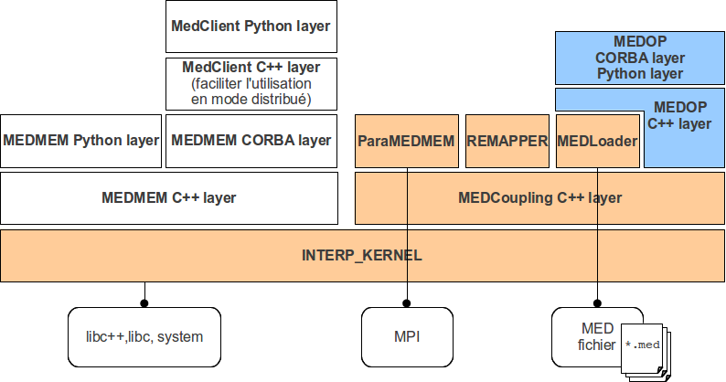

.. meta::
   :keywords: maillage, champ, manipulation, med, développement
   :author: Guillaume Boulant

.. include:: xmed-definitions.rst

%%%%%%%%%%%%%%%%%%%%%%%%%%%%%%%%%%%
Module XMED: Guide de développement
%%%%%%%%%%%%%%%%%%%%%%%%%%%%%%%%%%%

(|XMED_DEVELGUIDE_PDF|_)

Ce document est la documentation technique du module XMED. Il fournit
les instructions à suivre pour installer le module en vue d'un travail
de développement, puis décrit les éléments de conception qui
structurent le module.

.. contents:: Sommaire
   :local:
   :backlinks: none

.. warning:: Ce document est en travaux. Tant que cet avis n'aura pas
   disparu, veuillez en considérer le plan et le contenu encore
   incomplets, temporaires et sujets à caution.

Mise en place d'un espace de développement
==========================================

Gestion de configuration du module XMED
---------------------------------------

Les sources du module (répertoire ``xmed``) sont archivés en dépôt de
configuration dans une base git du projet NEPAL. Ils peuvent être
récupérés au moyen de la commande::

 $ git clone git@cli70rw.der.edf.fr:xom/xmed.git

Cette commande installe un répertoire ``xmed`` contenant l'ensemble
des sources du module XMED.

Le module XMED a pour pré-requis logiciel la plateforme SALOME:

* SALOME version 6.1.3 (au moins) à télécharger à l'URL
  http://pal.der.edf.fr/pal/projets/pal/releases/V6_1_3
* On peut également utiliser une version dérivée comme SALOME-MECA 2010.1
* Installer la plate-forme choisie selon les instructions fournies.

Le module XMED utilise également une bibliothèque interne au projet
NEPAL, appelée XSALOME, et qui fournit une extension aux fonctions de
SALOME pour un usage de développement (XSALOME signifie eXtension
SALOME). Les sources de cette bibliothèque doivent être récupérés au
moyen de la commande::

 $ git clone git@cli70rw.der.edf.fr:xom/xsalome.git

Cette commande installe un répertoire ``xsalome`` contenant l'ensemble
des sources de la bibliothèque XSALOME.
 
.. note:: La bibliothèque XSALOME n'est pas un module SALOME mais une
   simple bibliothèque de fonctions qui complète ou rend plus facile
   d'utilisation les fonctions de SALOME. Elle NE DOIT EN AUCUN CAS
   être intégrée à d'autres projets que les projets internes NEPAL ou
   MAILLAGE. Il s'agit en effet d'une bibliothèque de transition qui
   héberge des développements destinés à être reversés dans la
   plate-forme SALOME. Le contenu et les interfaces de XSALOME ne peut
   donc être garanti sur le long terme.

Installation et lancement de l'application
------------------------------------------

L'installation suppose qu'une version 6.1.3 de SALOME (ou plus) est
disponible et que le shell de travail est étendu avec l'environnement
de SALOME. En général, par des commandes de la forme::

 $ . /where/is/salome/prerequis.sh
 $ . /where/is/salome/envSalome.sh

La compilation des modules xsalome et xmed suit le standard SALOME. La
bibliothèque xsalome est un prérequis à la compilation de xmed. Pour
cela, la variable d'environnement XSALOME_DIR doit être spécifiée pour
la configuration de la procédure de reconstruction de xmed::

 $ export XSALOME_DIR=<xsalome_installdir>

Aprés l'installation de xmed, il est possible de générer
automatiquement une application SALOME prête à l'emploi pour la
manipulation de champs::

 $ <xmed_installdir>/bin/salome/xmed/appligen/appligen.sh

Cette commande génére un répertoire ``appli`` à l'emplacement où elle
est exécutée. Il reste à lancer l'application SALOME au moyen de la
commande::
 
 $ ./appli/runAppli -k

Exécution des tests unitaires
-----------------------------

Les tests unitaires peuvent être exécutés au moyen de scripts python
lancés depuis une session shell SALOME. Dans un nouveau shell, taper::

 $ ./appli/runSession
 [NS=mars:2810]$ python appli/lib/python2.6/site-packages/salome/xmed/test_medoperation.py

L'exécution imprime un rapport détaillant le résultat pour chaque
fonction de test::

 test_addition (__main__.MyTestSuite) ... ok
 test_arithmetics (__main__.MyTestSuite) ... ok
 test_composition (__main__.MyTestSuite) ... FAIL
 test_litteral_equation (__main__.MyTestSuite) ... ok
 test_modification_of_attributes (__main__.MyTestSuite) ... ok
 test_unary_operations (__main__.MyTestSuite) ... ok
 test_update_metadata (__main__.MyTestSuite) ... ok

Les scripts de test sont:

* ``test_medoperation.py``: tests des operations de champs telles
  qu'elles sont mises en oeuvre depuis l'interface textuelle.
* ``test_xmed.py``: tests des composants CORBA mis en oeuvre
  (``MEDDataManager`` et ``MEDCalculator``)

Architecture du module XMED
===========================

Le module MED pour la manipulation de champs est composé de:

* une bibliothèque de fonctions pour le traitement de données sur des
  maillages et des champs conformes au modèle MED (package
  MEDCoupling, MEDLoader et REMAPPER);
* une interface graphique pour la mise en oeuvre des cas standard de
  manipulation de champs;
* une ensemble d'outils pour intervenir sur des fichiers au format
  MED.

Une bibliothèque de fonctions pour le traitement de données
-----------------------------------------------------------

La figure ci-dessous montre la structure des paquets logiciels qui
constituent la bibliothèque:

Elle comprend en particulier les paquets suivants:

* MEDCoupling: qui décrit les structures de données pour porter les
  maillages et les champs
* MEDLoader: qui fournit les fonctions de persistence sous forme de
  fichiers au format MED (lecture et écriture).
* REMAPPER:

Il est important de noter que MEDCoupling n'a aucune dépendance
logicielle autre que la bibliothèque C++ standard. Ceci permet
d'envisager son implantation dans un code de calcul ou un outil de
traitement sans tirer l'ensemble pré-requis de SALOME.

Une interface graphique pour l'exécution des cas standard
---------------------------------------------------------

Un ensemble d'outils pour le traitement de fichiers
---------------------------------------------------

Description des composants
==========================

MEDDataManager - Le gestionnaire des données de session
-------------------------------------------------------

Le composant MEDDataManager s'occupe de fournir les données MED sur
demande des interfaces clientes, en particulier pour module de
pilotage fieldproxy.py. Ces données peuvent avoir plusieurs sources,
en général elle proviennent d'un fichier au format med contenant des
champs définis sur des maillages. Les données sont identifiées à la
lecture des métadonnées de description dans le fichiers med, puis les
valeurs des champs et les maillages support sont chargés au besoin.

Le chargement des métadonnées de description se fait par la méthode::

  addDatasource(const char \*filepath)

Eléments d'implémentation
=========================

Ecrire un service CORBA qui retourne une sequence de FieldHandler:

.. code-block:: cpp

  MEDOP::FieldHandlerList * MyFunction(...) {
    vector<MEDOP::FieldHandler*> fieldHandlerList;
    ...
  
    fieldHandlerList.push_back(fieldHandler);
  
    // Map the resulting list to a CORBA sequence for return:
    MEDOP::FieldHandlerList_var fieldHandlerSeq = new MEDOP::FieldHandlerList();
    int nbFieldHandler = fieldHandlerList.size();
    fieldHandlerSeq->length(nbFieldHandler);
    for (int i=0; i<nbFieldHandler; i++) {
      fieldHandlerSeq[i] = *fieldHandlerList[i];
    } 
    return fieldHandlerSeq._retn();
  }

Ecrire un service CORBA qui retourne une structure CORBA:

.. code-block:: cpp

    MEDOP::FieldHandler * fieldHandler = new ...
    _fieldHandlerMap[fieldHandler->id] = fieldHandler;

    // >>> WARNING: CORBA struct specification indicates that the
    // assignement acts as a desctructor for the structure that is
    // pointed to. The values of the fields are copy first in the new
    // structure that receives the assignement and finally the initial
    // structure is destroyed. In the present case, WE WANT to keep
    // the initial fieldHandler in the map. We must then make a deep
    // copy of the structure found in the map and return the copy. The
    // CORBA struct specification indicates that a deep copy can be
    // done using the copy constructor.  <<<
    return new MEDOP::FieldHandler(*fieldHandler);

ANNEXE: Bug en cours
====================

TO FIX:

* la composition d'opérations n'est pas possible (ex: 2*f1+f2) car
  2*f1 est indiqué comme non compatible (il semble qu'il n'ai pas la
  reference correcte vers le maillage).
* le script de test test_medoperation.py plante si le module xmed n'a
  pas été chargé avec des données chargées.
